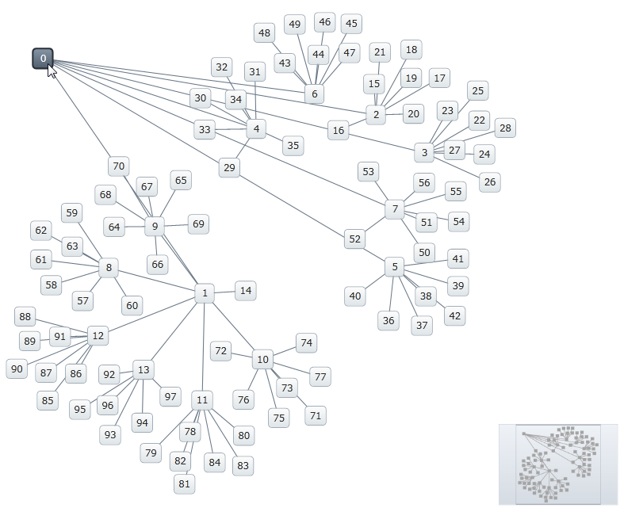

////

|metadata|
{
    "name": "xamnetworknode-node-relocation",
    "controlName": ["xamNetworkNode"],
    "tags": ["Editing","How Do I"],
    "guid": "cfdf698f-3d8e-4a45-9fb0-52c93d69d9f0",  
    "buildFlags": [],
    "createdOn": "2016-05-25T18:21:57.4412517Z"
}
|metadata|
////

= Node Relocation

This topic describes how to configure the link:{ApiPlatform}controls.maps.xamnetworknode.v{ProductVersion}~infragistics.controls.maps.xamnetworknode.html[xamNetworkNode]™ control to allow dynamic node repositioning. At the end of the topic, a complete code sample is provided.

The topic is organized as follows:

* <<Introduction,Introduction>> 
* <<Preview,Preview>>
* <<Requirements,Requirements>>
* <<Overview,Overview>>
* <<Steps,Steps>>
* <<Complete,Complete Code Sample>>
** <<View,View>>
** <<CodeBehind,Code Behind>>
** <<NodeModel,NodeModel.cs>>
** <<ConnectionModel,ConnectionModel.cs>>
** <<SimpleGraphData,SimpleGraphData.cs>>
* <<RelatedTopics,Related Topics>>

[[Introduction]]
== Introduction

Each NetworkNode link:{ApiPlatform}controls.maps.xamnetworknode.v{ProductVersion}~infragistics.controls.maps.networknodenodecontrol~node.html[Node] object has a link:{ApiPlatform}controls.maps.xamnetworknode.v{ProductVersion}~infragistics.controls.maps.networknodenode~location.html[Location] property that permits dynamic layout changes. This topic describes how to make node elements move when dragged by the mouse cursor.

[[Preview]]
== Preview

Following is a preview of the final result:

Figure 1: Node relocation in the xamNetworkNode control as rendered by the sample code

[[Requirements]]
== Requirements

This article assumes you have already read the topic on link:xamnetworknode-getting-started-with-xamnetworknode.html[Getting Started with xamNetworkNode], and uses the code from that walkthrough as a starting point.

[[Overview]]
=== Overview

Conceptual overview of the procedure:

1. Defining variables
2. Registering the Event Handlers
3. Saving your project
4. (Optional) Verifying the result

[[Steps]]
== Steps

[start=1]
1. **Define variables.**

These variables will keep track of whether or not the movement effect is active, as well as information about the node that we are moving.

**In C#:**

[source,csharp]
----
private bool _isMoveInEffect; // is the movement in effect?
private NetworkNodeNodeControl _currentElement; // the element that we are moving
private Point _currentPosition; // the current position of that element
----

**In Visual Basic:**

[source,vb]
----
Private _isMoveInEffect As Boolean
' is the movement in effect?
Private _currentElement As NetworkNodeNodeControl
' the element that we are moving
Private _currentPosition As Point
' the current position of that element
----

[start=2]
2. **Implement the Event Handlers.**

Element_MouseLeftButtonDown initializes our variables and signals the beginning of the movement effect:

**In C#:**

[source,csharp]
----
private void Element_MouseLeftButtonDown(object sender, MouseButtonEventArgs e)
{
    var element = (NetworkNodeNodeControl)sender;
    _currentElement = element; // keep track of which node this is
    element.CaptureMouse();
    _isMoveInEffect = true; // initiate the movement effect
    _currentPosition = e.GetPosition(element.Parent as UIElement); // keep track of position
}
----

**In Visual Basic:**

[source,vb]
----
Private Sub Element_MouseLeftButtonDown(sender As Object, e As MouseButtonEventArgs)
    Dim element = DirectCast(sender, NetworkNodeNodeControl)
    _currentElement = element
    ' keep track of which node this is
    element.CaptureMouse()
    _isMoveInEffect = True
    ' initiate the movement effect
    _currentPosition = e.GetPosition(TryCast(element.Parent, UIElement))
    ' keep track of position
End Sub
----

CaptureMouse() is important, as it prevents the cursor from escaping from the dragged UI element.

Element_MouseMove checks to see if the movement effect is active. If so, it adjusts the position of the node element:

**In C#:**

[source,csharp]
----
private void Element_MouseMove(object sender, MouseEventArgs e)
{
    var element = (NetworkNodeNodeControl)sender;
    if (_currentElement == null || element != _currentElement)
    {
        // this might happen if a node is released outside of the view area.
        // terminate the movement effect.
        _isMoveInEffect = false; 
    }
    else if (_isMoveInEffect) // is the movement effect active?
    {
        if (e.GetPosition(xnn).X > xnn.ActualWidth || e.GetPosition(xnn).Y > xnn.ActualHeight || e.GetPosition(xnn).Y < 0.0)
        {
            // drag is outside of the allowable area, so release the element
            element.ReleaseMouseCapture(); 
            _isMoveInEffect = false;
        }
        else
        {
            // drag is within the allowable area, so update the element's position
            var currentPosition = e.GetPosition(element.Parent as UIElement);
 
            element.Node.Location = new Point(
                element.Node.Location.X + (currentPosition.X - this._currentPosition.X) / xnn.ZoomLevel,
                element.Node.Location.Y + (currentPosition.Y - this._currentPosition.Y) / xnn.ZoomLevel);
 
            _currentPosition = currentPosition;
        }
    }
}
----

**In Visual Basic:**

[source,vb]
----
Private Sub Element_MouseMove(sender As Object, e As MouseEventArgs)
    Dim element = DirectCast(sender, NetworkNodeNodeControl)
    If _currentElement Is Nothing OrElse element <> _currentElement Then
        ' this might happen if a node is released outside of the view area.
        ' terminate the movement effect.
        _isMoveInEffect = False
    ElseIf _isMoveInEffect Then
        ' is the movement effect active?
        If e.GetPosition(xnn).X > xnn.ActualWidth OrElse e.GetPosition(xnn).Y > xnn.ActualHeight OrElse e.GetPosition(xnn).Y < 0.0 Then
            ' drag is outside of the allowable area, so release the element
            element.ReleaseMouseCapture()
            _isMoveInEffect = False
        Else
            ' drag is within the allowable area, so update the element's position
            Dim currentPosition = e.GetPosition(TryCast(element.Parent, UIElement))

            element.Node.Location = New Point(element.Node.Location.X + (currentPosition.X - Me._currentPosition.X) / xnn.ZoomLevel, element.Node.Location.Y + (currentPosition.Y - Me._currentPosition.Y) / xnn.ZoomLevel)

            _currentPosition = currentPosition
        End If
    End If
End Sub
----

Element_MouseLeftButtonUp terminates the movement effect:

**In C#:**

[source,csharp]
----
private void Element_MouseLeftButtonUp(object sender, MouseButtonEventArgs e)
{
    var element = (NetworkNodeNodeControl)sender;
    element.ReleaseMouseCapture();
    _isMoveInEffect = false; // terminate the movement effect
}
----

**In Visual Basic:**

[source,vb]
----
Private Sub Element_MouseLeftButtonUp(sender As Object, e As MouseButtonEventArgs)
    Dim element = DirectCast(sender, NetworkNodeNodeControl)
    element.ReleaseMouseCapture()
    _isMoveInEffect = False
    ' terminate the movement effect
End Sub
----

[start=3]
3. **Register the Event Handlers.**

In the application constructor, arrange for the previously defined event handlers to be registered for each NetworkNode NodeControl upon attachment:

**In C#:**

[source,csharp]
----
public MainPage()
{
    InitializeComponent();
 
    xnn.NodeControlAttachedEvent += (sender, e) =>
    {
        e.NodeControl.MouseLeftButtonDown += Element_MouseLeftButtonDown;
        e.NodeControl.MouseMove += Element_MouseMove;
        e.NodeControl.MouseLeftButtonUp += Element_MouseLeftButtonUp;
    };
 
    xnn.NodeControlDetachedEvent += (sender, e) =>
    {
        e.NodeControl.MouseLeftButtonDown -= Element_MouseLeftButtonDown;
        e.NodeControl.MouseMove -= Element_MouseMove;
        e.NodeControl.MouseLeftButtonUp -= Element_MouseLeftButtonUp;
    };
}
----

**In Visual Basic:**

[source,vb]
----
Public Sub New()
    InitializeComponent()

    xnn.NodeControlAttachedEvent += Function(sender, e) 
    AddHandler e.NodeControl.MouseLeftButtonDown, AddressOf Element_MouseLeftButtonDown
    AddHandler e.NodeControl.MouseMove, AddressOf Element_MouseMove
    AddHandler e.NodeControl.MouseLeftButtonUp, AddressOf Element_MouseLeftButtonUp

    End Function

    xnn.NodeControlDetachedEvent += Function(sender, e) 
    RemoveHandler e.NodeControl.MouseLeftButtonDown, AddressOf Element_MouseLeftButtonDown
    RemoveHandler e.NodeControl.MouseMove, AddressOf Element_MouseMove
    RemoveHandler e.NodeControl.MouseLeftButtonUp, AddressOf Element_MouseLeftButtonUp

    End Function
End Sub
----

[start=4]
4. **Save your project.**

[start=5]
5. **(Optional) Verify the result.**

[start=6]
6. **Run the application.**

Nodes will move when you drag them with the mouse as shown in Figure 1.

[[Complete]]
== Complete Code Sample

Following is the code of the full example implemented in context.

[[View]]
== View

**In XAML:**

[source,xaml]
----
<UserControl x:Class="xamNetworkNode_NodeRelocation.MainPage"
    xmlns="http://schemas.microsoft.com/winfx/2006/xaml/presentation"
    xmlns:x="http://schemas.microsoft.com/winfx/2006/xaml"
    xmlns:d="http://schemas.microsoft.com/expression/blend/2008"
    xmlns:mc="http://schemas.openxmlformats.org/markup-compatibility/2006"
    xmlns:ig="http://schemas.infragistics.com/xaml"
    xmlns:data="clr-namespace:xamNetworkNode_NodeRelocation.Data"
    mc:Ignorable="d"
    d:DesignHeight="300" d:DesignWidth="400">
 
    <Grid x:Name="LayoutRoot" Background="White">
        <Grid.Resources>
            <data:SimpleGraphData x:Key="GraphData" />
        </Grid.Resources>
        <ig:XamNetworkNode x:Name="xnn"
                           ItemsSource="{Binding Nodes, Source={StaticResource GraphData}}">
            <ig:XamNetworkNode.GlobalNodeLayouts>
                <ig:NetworkNodeNodeLayout
                    TargetTypeName = "NodeModel"
                    DisplayMemberPath = "Label"
                    ConnectionsMemberPath = "Connections"
                    ConnectionTargetMemberPath = "Target"
                    />
            </ig:XamNetworkNode.GlobalNodeLayouts>
        </ig:XamNetworkNode>
    </Grid>
</UserControl>
----

[[CodeBehind]]
== Code Behind

**In C#:**

[source,csharp]
----
using System.Windows;
using System.Windows.Controls;
using System.Windows.Input;
using Infragistics.Controls.Maps;
 
namespace xamNetworkNode_NodeRelocation
{
    public partial class MainPage : UserControl
    {
        private bool _isMoveInEffect; // is the movement in effect?
        private NetworkNodeNodeControl _currentElement; // the element that we are moving
        private Point _currentPosition; // the current position of that element
 
        public MainPage()
        {
            InitializeComponent();
 
            xnn.NodeControlAttachedEvent += (sender, e) =>
            {
                e.NodeControl.MouseLeftButtonDown += Element_MouseLeftButtonDown;
                e.NodeControl.MouseMove += Element_MouseMove;
                e.NodeControl.MouseLeftButtonUp += Element_MouseLeftButtonUp;
            };
 
            xnn.NodeControlDetachedEvent += (sender, e) =>
            {
                e.NodeControl.MouseLeftButtonDown -= Element_MouseLeftButtonDown;
                e.NodeControl.MouseMove -= Element_MouseMove;
                e.NodeControl.MouseLeftButtonUp -= Element_MouseLeftButtonUp;
            };
        }
        
        private void Element_MouseLeftButtonDown(object sender, MouseButtonEventArgs e)
        {
            var element = (NetworkNodeNodeControl)sender;
            _currentElement = element; // keep track of which node this is
            element.CaptureMouse();
            _isMoveInEffect = true; // initiate the movement effect
            _currentPosition = e.GetPosition(element.Parent as UIElement); // keep track of position
        }
 
        private void Element_MouseMove(object sender, MouseEventArgs e)
        {
            var element = (NetworkNodeNodeControl)sender;
            if (_currentElement == null || element != _currentElement)
            {
                // this might happen if a node is released outside of the view area.
                // terminate the movement effect.
                _isMoveInEffect = false; 
            }
            else if (_isMoveInEffect) // is the movement effect active?
            {
                if (e.GetPosition(xnn).X > xnn.ActualWidth || e.GetPosition(xnn).Y > xnn.ActualHeight || e.GetPosition(xnn).Y < 0.0)
                {
                    // drag is outside of the allowable area, so release the element
                    element.ReleaseMouseCapture();
                    _isMoveInEffect = false;
                }
                else
                {
                    // drag is within the allowable area, so update the element's position
                    var currentPosition = e.GetPosition(element.Parent as UIElement);
 
                    element.Node.Location = new Point(
                        element.Node.Location.X + (currentPosition.X - this._currentPosition.X) / xnn.ZoomLevel,
                        element.Node.Location.Y + (currentPosition.Y - this._currentPosition.Y) / xnn.ZoomLevel);
 
                    _currentPosition = currentPosition;
                }
            }
        }
 
        private void Element_MouseLeftButtonUp(object sender, MouseButtonEventArgs e)
        {
            var element = (NetworkNodeNodeControl)sender;
            element.ReleaseMouseCapture();
            _isMoveInEffect = false; // terminate the movement effect
        }
    }
}
----

**In Visual Basic:**

[source,vb]
----
Imports System.Windows
Imports System.Windows.Controls
Imports System.Windows.Input
Imports Infragistics.Controls.Maps

Namespace xamNetworkNode_NodeRelocation
    Public Partial Class MainPage
        Inherits UserControl
        Private _isMoveInEffect As Boolean
        ' is the movement in effect?
        Private _currentElement As NetworkNodeNodeControl
        ' the element that we are moving
        Private _currentPosition As Point
        ' the current position of that element
        Public Sub New()
            InitializeComponent()

            xnn.NodeControlAttachedEvent += Function(sender, e) 
            AddHandler e.NodeControl.MouseLeftButtonDown, AddressOf Element_MouseLeftButtonDown
            AddHandler e.NodeControl.MouseMove, AddressOf Element_MouseMove
            AddHandler e.NodeControl.MouseLeftButtonUp, AddressOf Element_MouseLeftButtonUp

End Function

            xnn.NodeControlDetachedEvent += Function(sender, e) 
            RemoveHandler e.NodeControl.MouseLeftButtonDown, AddressOf Element_MouseLeftButtonDown
            RemoveHandler e.NodeControl.MouseMove, AddressOf Element_MouseMove
            RemoveHandler e.NodeControl.MouseLeftButtonUp, AddressOf Element_MouseLeftButtonUp

End Function
        End Sub

        Private Sub Element_MouseLeftButtonDown(sender As Object, e As MouseButtonEventArgs)
            Dim element = DirectCast(sender, NetworkNodeNodeControl)
            _currentElement = element
            ' keep track of which node this is
            element.CaptureMouse()
            _isMoveInEffect = True
            ' initiate the movement effect
            _currentPosition = e.GetPosition(TryCast(element.Parent, UIElement))
            ' keep track of position
        End Sub

        Private Sub Element_MouseMove(sender As Object, e As MouseEventArgs)
            Dim element = DirectCast(sender, NetworkNodeNodeControl)
            If _currentElement Is Nothing OrElse element <> _currentElement Then
                ' this might happen if a node is released outside of the view area.
                ' terminate the movement effect.
                _isMoveInEffect = False
            ElseIf _isMoveInEffect Then
                ' is the movement effect active?
                If e.GetPosition(xnn).X > xnn.ActualWidth OrElse e.GetPosition(xnn).Y > xnn.ActualHeight OrElse e.GetPosition(xnn).Y < 0.0 Then
                    ' drag is outside of the allowable area, so release the element
                    element.ReleaseMouseCapture()
                    _isMoveInEffect = False
                Else
                    ' drag is within the allowable area, so update the element's position
                    Dim currentPosition = e.GetPosition(TryCast(element.Parent, UIElement))

                    element.Node.Location = New Point(element.Node.Location.X + (currentPosition.X - Me._currentPosition.X) / xnn.ZoomLevel, element.Node.Location.Y + (currentPosition.Y - Me._currentPosition.Y) / xnn.ZoomLevel)

                    _currentPosition = currentPosition
                End If
            End If
        End Sub

        Private Sub Element_MouseLeftButtonUp(sender As Object, e As MouseButtonEventArgs)
            Dim element = DirectCast(sender, NetworkNodeNodeControl)
            element.ReleaseMouseCapture()
            _isMoveInEffect = False
            ' terminate the movement effect
        End Sub
    End Class
End Namespace
----

[[NodeModel]]
== NodeModel.cs

**In C#:**

[source,csharp]
----
using System.Collections.ObjectModel;
using System.ComponentModel;
 
namespace xamNetworkNode_NodeRelocation.Models
{
    public class NodeModel : INotifyPropertyChanged
    {
        private string _label;
        public string Label
        {
            get { return _label; }
            set
            {
                if (value != _label)
                {
                    _label = value;
                    NotifyPropertyUpdated("Label");
                }
            }
        }
 
        private string _toolTip;
        public string ToolTip
        {
            get { return _toolTip; }
            set
            {
                if (value != _toolTip)
                {
                    _toolTip = value;
                    NotifyPropertyUpdated("ToolTip");
                }
            }
        }
 
        private ObservableCollection<ConnectionModel> _connections;
        public ObservableCollection<ConnectionModel> Connections
        {
            get { return _connections; }
            set
            {
                if (value != _connections)
                {
                    _connections = value;
                    NotifyPropertyUpdated("Connections");
                }
            }
        }
 
        public event PropertyChangedEventHandler PropertyChanged;
 
        protected virtual void NotifyPropertyUpdated(string propertyName)
        {
            var handler = PropertyChanged;
 
            if (handler != null)
            {
                handler(this, new PropertyChangedEventArgs(propertyName));
            }
        }
    }
}
----

**In Visual Basic:**

[source,vb]
----
Imports System.Collections.ObjectModel
Imports System.ComponentModel

Namespace xamNetworkNode_NodeRelocation.Models
    Public Class NodeModel
        Implements INotifyPropertyChanged
        Private _label As String
        Public Property Label() As String
            Get
                Return _label
            End Get
            Set
                If value <> _label Then
                    _label = value
                    NotifyPropertyUpdated("Label")
                End If
            End Set
        End Property

        Private _toolTip As String
        Public Property ToolTip() As String
            Get
                Return _toolTip
            End Get
            Set
                If value <> _toolTip Then
                    _toolTip = value
                    NotifyPropertyUpdated("ToolTip")
                End If
            End Set
        End Property

        Private _connections As ObservableCollection(Of ConnectionModel)
        Public Property Connections() As ObservableCollection(Of ConnectionModel)
            Get
                Return _connections
            End Get
            Set
                If value <> _connections Then
                    _connections = value
                    NotifyPropertyUpdated("Connections")
                End If
            End Set
        End Property

        Public Event PropertyChanged As PropertyChangedEventHandler

        Protected Overridable Sub NotifyPropertyUpdated(propertyName As String)
            Dim handler = PropertyChanged

            RaiseEvent handler(Me, New PropertyChangedEventArgs(propertyName))
        End Sub
        
    End Class
End Namespace
----

[[ConnectionModel]]
== ConnectionModel.cs

**In C#:**

[source,csharp]
----
using System.ComponentModel;
 
namespace xamNetworkNode_NodeRelocation.Models
{
    public class ConnectionModel : INotifyPropertyChanged
    {
        private NodeModel _target;
        public NodeModel Target
        {
            get { return _target; }
            set
            {
                if (value != _target)
                {
                    _target = value;
                    NotifyPropertyUpdated("Target");
                }
            }
        }
 
        public event PropertyChangedEventHandler PropertyChanged;
 
        protected virtual void NotifyPropertyUpdated(string propertyName)
        {
            var handler = PropertyChanged;
 
            if (handler != null)
            {
                handler(this, new PropertyChangedEventArgs(propertyName));
            }
        }
    }
}
----

**In Visual Basic:**

[source,vb]
----
Imports System.ComponentModel

Namespace xamNetworkNode_NodeRelocation.Models
    Public Class ConnectionModel
        Implements INotifyPropertyChanged
        Private _target As NodeModel
        Public Property Target() As NodeModel
            Get
                Return _target
            End Get
            Set
                If value IsNot _target Then
                    _target = value
                    NotifyPropertyUpdated("Target")
                End If
            End Set
        End Property

        Public Event PropertyChanged As PropertyChangedEventHandler

        Protected Overridable Sub NotifyPropertyUpdated(propertyName As String)
            Dim handler = PropertyChanged

            RaiseEvent handler(Me, New PropertyChangedEventArgs(propertyName))
        End Sub
    End Class
End Namespace
----

[[SimpleGraphData]]
== SimpleGraphData.cs

**In C#:**

[source,csharp]
----
using System.Collections.ObjectModel;
using xamNetworkNode_Intro.Models;
 
namespace xamNetworkNode_NodeRelocation.Data
{
    public class SimpleGraphData
    {
        public ObservableCollection<NodeModel> Nodes { get; set; }
        private const int K = 7; // number of connections per node (maximum)
        private const int NUM_NODES = 98; // number of nodes in the graph
 
        public SimpleGraphData()
        {
            Nodes = new ObservableCollection<NodeModel>();
 
            // add NUM_NODES node objects to the collection
            for (int i = 0; i < NUM_NODES; i++)
            {
                NodeModel node = new NodeModel();
                node.Label = i.ToString();
                node.ToolTip = "ToolTip for " + node.Label;
                Nodes.Add(node);
            }
 
            // starting with node 0, set that node as the root.
            // add up to K connections to the root node.
            // then, increment the root node index and repeat until all nodes have been connected.
            int root = 0;
            int first = 1;
            int last = K;
            while (first < Nodes.Count)
            {
                Nodes[root].Connections = new ObservableCollection<ConnectionModel>();
                for (int i = first; i <= last; i++)
                {
                    if (i >= Nodes.Count)
                    {
                        break;
                    }
                    Nodes[root].Connections.Add(new ConnectionModel { Target = Nodes[i] });
                }
                root++;
                first = last + 1;
                last += K;
            }
        }
    }
}
----

**In Visual Basic:**

[source,vb]
----
Imports System.Collections.ObjectModel
Imports xamNetworkNode_Intro.Models

Namespace xamNetworkNode_NodeRelocation.Data
    Public Class SimpleGraphData
        Public Property Nodes() As ObservableCollection(Of NodeModel)
            Get
                Return m_Nodes
            End Get
            Set
                m_Nodes = Value
            End Set
        End Property
        Private m_Nodes As ObservableCollection(Of NodeModel)
        Private Const K As Integer = 7
        ' number of connections per node (maximum)
        Private Const NUM_NODES As Integer = 98
        ' number of nodes in the graph
        Public Sub New()
            Nodes = New ObservableCollection(Of NodeModel)()

            ' add NUM_NODES node objects to the collection
            For i As Integer = 0 To NUM_NODES - 1
                Dim node As New NodeModel()
                node.Label = i.ToString()
                node.ToolTip = "ToolTip for " & node.Label
                Nodes.Add(node)
            Next

            ' starting with node 0, set that node as the root.
            ' add up to K connections to the root node.
            ' then, increment the root node index and repeat until all nodes have been connected.
            Dim root As Integer = 0
            Dim first As Integer = 1
            Dim last As Integer = K
            While first < Nodes.Count
                Nodes(root).Connections = New ObservableCollection(Of ConnectionModel)()
                For i As Integer = first To last
                    If i >= Nodes.Count Then
                        Exit For
                    End If
                    Nodes(root).Connections.Add(New ConnectionModel() With { _
                        Key .Target = Nodes(i) _
                    })
                Next
                root += 1
                first = last + 1
                last += K
            End While
        End Sub
    End Class
End Namespace
----

[[RelatedTopics]]
== Related Topics

* link:xamnetworknode.html[xamNetworkNode]
* link:xamnetworknode-getting-started-with-xamnetworknode.html[Getting Started with xamNetworkNode]
