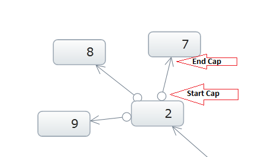
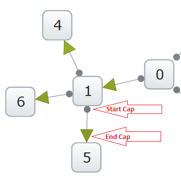
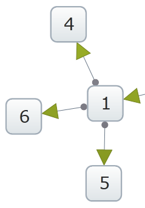

////

|metadata|
{
    "name": "xamnetworknode-relationship-between-nodes",
    "controlName": ["xamNetworkNode"],
    "tags": [],
    "guid": "ddca9fba-ecde-4dfa-9075-765ec9e3cd66",  
    "buildFlags": [],
    "createdOn": "2016-05-25T18:21:57.5242505Z"
}
|metadata|
////

= Relationship Between Nodes

== Topic Overview

== Purpose

The purpose of this document is to show how the relationship types can be set for the connected nodes with icons indicating the source and target of the connected nodes within the link:{ApiPlatform}controls.maps.xamnetworknode{ApiVersion}~infragistics.controls.maps.xamnetworknode.html[xamNetworkNode™].

== Required background

[options="header", cols="a,a"]
|====
|Background type|Content

|*Concepts*
|You need to be familiar with the following concept: 

* Binding the xamNetworkNode control to your data source with connecting nodes 

|*Topics*
|You need to first read the following topic: 

link:xamnetworknode-getting-started-with-xamnetworknode.html[Getting Started with xamNetworkNode]

|====

== Control Configuration Overview

== Control configuration chart

The table below maps the configurable visual representation of the source and target nodes relationship, the style and size of the corresponding icons.

[options="header", cols="a,a,a"]
|====
|Configurable screen elements and behaviors|Configuration details|Configuration properties

|*Icon to indicate the source and target nodes*
|Visual representation indicating the starting and end of the line segment connected from the source node to the target node.
| link:{ApiPlatform}controls.maps.xamnetworknode{ApiVersion}~infragistics.controls.maps.xamnetworknode~linestartcap.html[LineStartCap] 

link:{ApiPlatform}controls.maps.xamnetworknode{ApiVersion}~infragistics.controls.maps.xamnetworknode~lineendcap.html[LineEndCap]

|*Style for LineStartCap and LineEndCap icons*
|User defined style for the LineStartcap and LineEndCap icons.
| link:{ApiPlatform}controls.maps.xamnetworknode{ApiVersion}~infragistics.controls.maps.xamnetworknode~linestartcapstyle.html[LineStartCapStyle] 

link:{ApiPlatform}controls.maps.xamnetworknode{ApiVersion}~infragistics.controls.maps.xamnetworknode~lineendcapstyle.html[LineEndCapStyle]

|*Size for LineStartCap and LineEndCap icons*
|User defined size for the LineStartcap and LineEndCap icons.
| link:{ApiPlatform}controls.maps.xamnetworknode{ApiVersion}~infragistics.controls.maps.xamnetworknode~linestartcapsize.html[LineStartCapSize] 

link:{ApiPlatform}controls.maps.xamnetworknode{ApiVersion}~infragistics.controls.maps.xamnetworknode~lineendcapsize.html[LineEndCapSize]

|====

== LineStartCap/LineEndCap

The source indicates where the line initiates and the target indicates the line destination. The source is initiated from a parent node pointing to a child node as the target.

== LineStartCap/LineEndCap property settings

The table below maps the setting for visual representation of the source and target nodes relationship.

[options="header", cols="a,a,a"]
|====
|In order to…|Use this property:|And set it to…

|*Indicate the source and target nodes with icons*
|
* link:{ApiPlatform}controls.maps.xamnetworknode{ApiVersion}~infragistics.controls.maps.xamnetworknode~linestartcap.html[LineStartCap] 

* link:{ApiPlatform}controls.maps.xamnetworknode{ApiVersion}~infragistics.controls.maps.xamnetworknode~lineendcap.html[LineEndCap] 

|
* Arrow 

* Cross 

* Diamond 

* Ellipse 

* SolidArrow 

* Square 

* Tee 

* None 

|====

== LineStartCap/LineEndCap example

The image and code example below demonstrate the setting for LineStartCap/LineEndCap. Source node with the LineStartCap related to the target node with the LineEndCap:

== Code Example:

*In XAML:*

----
<ig:XamNetworkNode LineStartCap="Ellipse" LineEndCap="Arrow">
----

*In C#:*

----
xnn.LineEndCap = LineCap.Arrow;
xnn.LineStartCap = LineCap.Ellipse;
----

*In Visual Basic:*

----
xnn.LineEndCap = LineCap.Arrow
xnn.LineStartCap = LineCap.Ellipse
----

== LineStartCapStyle/LineEndCapStyle

== LineStartCapStyle/LineEndCapStyle property settings

The table below maps the setting of the style for corresponding icons for connecting nodes.

[options="header", cols="a,a,a"]
|====
|In order to…|Use this property:|And set it to…

|*Change the style for LineStartCap and LineEndCap icons*
|
* link:{ApiPlatform}controls.maps.xamnetworknode{ApiVersion}~infragistics.controls.maps.xamnetworknode~linestartcapstyle.html[LineStartCapStyle] 

* link:{ApiPlatform}controls.maps.xamnetworknode{ApiVersion}~infragistics.controls.maps.xamnetworknode~lineendcapstyle.html[LineEndCapStyle] 

|Based on the defined style in XAML

|====

== LineStartCapStyle/LineEndCapStyle example

The image and code example bellow demonstrate the setting for LineStartCapStyle/LineEndCapStyle:

== Code Example:

*In XAML:*

----

----

== LineStartCapSize/LineEndCapSize

== LineStartCapSize/LineEndCapSize property settings

The table below maps the setting of the size for corresponding icons for connecting nodes.

.Note:
[NOTE]
====
if the LineStartCapSize and LineEndCapSize have the same value, then the LineCapSize property can be used instead. The value will apply for both start and end caps.
====

[options="header", cols="a,a,a"]
|====
|In order to…|Use this property:|And set it to…

|*Change the size for LineStartCap and LineEndCap icons*
|
* link:{ApiPlatform}controls.maps.xamnetworknode{ApiVersion}~infragistics.controls.maps.xamnetworknode~linestartcapsize.html[LineStartCapSize] 

* link:{ApiPlatform}controls.maps.xamnetworknode{ApiVersion}~infragistics.controls.maps.xamnetworknode~lineendcapsize.html[LineEndCapSize] 

|Double value

|====

== LineStartCapSize/LineEndCapSize example

The image and code example bellow demonstrate the setting for LineStartCapSize/LineEndCapSize:

== Code Example:

*In XAML:*

----
<ig:XamNetworkNode LineEndCapSize="15" LineStartCapSize="5">
----

*In C#:*

----
xnn.LineEndCapSize = 15;
xnn.LineStartCapSize = 5;
----

*In Visual Basic:*

----
xnn.LineEndCapSize = 15
xnn.LineStartCapSize = 5
----

== Related Topics

* link:xamnetworknode-getting-started-with-xamnetworknode.html[Getting Started with xamNetworkNode]

* link:xamnetworknode-using-xamnetworknode.html[Using xamNetworkNode]