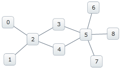
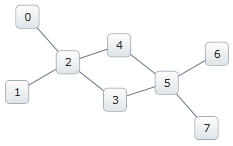
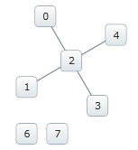

////
|metadata|
{
    "name": "xamnetworknode-removing-nodes-from-network",
    "controlName": ["xamNetworkNode"],
    "tags": ["Data Presentation","Editing","Getting Started","How Do I"],
    "guid": "4adbdd9b-258f-4b4b-a5d3-a9706f0df713",
    "buildFlags": [],
    "createdOn": "2016-05-25T18:21:57.5002499Z"
}
|metadata|
////

= Removing Nodes From Network

This topic demonstrates how to remove a node from the network layout, and explains how to remove the node from the data source.

The topic is organized as follows:

* <<Introduction,Introduction>>
* <<Requirements,Requirements>>
* <<Removing-Nodes,Removing Nodes>>
** <<Code-Examples-Removing-Nodes,Code Examples: Removing Nodes>>
** <<Code-Example-Removing-Node-from-NetworkNodeLayout,Code Example: Removing Node from NetworkNodeLayout>>
** <<Code-Example-Removing-Node-from-Data-Source,Code Example: Removing Node from Data Source>>
* <<Related-Topics,Related Topics>>

[[Introduction]]
== Introduction

The example in this topic demonstrates how to remove a node from NetworkNodeLayout and from the data source.

[[Requirements]]
== Requirements

To begin, please read the link:xamnetworknode-getting-started-with-xamnetworknode.html[Getting Started with xamNetworkNode] topic as this tutorial uses the code from the 'Getting Started' topic as a starting point.

The data source must implement the `INotifyPropertyChanged` interface in order to implement the functionality to remove a node. This is necessary so the changes are broadcast to the underlying data source and updates can execute.

[[Removing-Nodes]]
== Removing Nodes

[[Code-Examples-Removing-Nodes]]
== Code Examples: Removing Nodes

=== Examples Overview

[options="header", cols="a,a"]
|====
|Example|Description

|Removing Node from NetworkNodeLayout
|Remove a node from the network layout by setting the visibility property of NetworkNodeNode to Collapsed.

|Removing Node from data source
|Removing the nodes from the data source requires that you remove them from the underlying collection. The control is notified of any changes made in the nodes’ collection, and gets updated reflective of the changes from the data model. For the change notification, your data must implement link:http://msdn.microsoft.com/en-us/library/system.componentmodel.inotifypropertychanged.aspx[INotifyPropertyChanged] interface.

|====

[[Code-Example-Removing-Node-from-NetworkNodeLayout]]
== Code Example: Removing Node from NetworkNodeLayout

=== Example Description

Nodes can be removed by simply selecting a node, and in the SelectedNodeCollectionChanged event setting the node's Visibility property to "Collapsed". This does not remove the nodes from the data source. It hides the selected nodes from the view.

*In C#:*
[source,csharp]
----
foreach (var nd in xnn.SelectedNodes)
{
    nd.Visibility = System.Windows.Visibility.Collapsed;
}
----

*In Visual Basic:*
[source,vb]
----
For Each nd As var In xnn.SelectedNodes
    nd.Visibility = System.Windows.Visibility.Collapsed
Next
----

Removing a node can also be accomplished by implementing a KeyDown handler to respond to the pressing of the Delete key on the keyboard after the node is selected.

*In C#:*
[source,csharp]
----
private void xnn_KeyDown(object sender, KeyEventArgs e)
{
    if (e.Key == Key.Delete)
    {
        if (xnn.SelectedNodes.Count > 0)
        {
            xnn.SelectedNodes[0].Visibility = System.Windows.Visibility.Collapsed;
        }
    }
}
----

*In Visual Basic:*
[source,vb]
----
Private Sub xnn_KeyDown(sender As Object, e As KeyEventArgs)
    If e.Key = Key.Delete Then
        If xnn.SelectedNodes.Count > 0 Then
            xnn.SelectedNodes(0).Visibility = System.Windows.Visibility.Collapsed
        End If
    End If
End Sub
----

The following images demonstrate the outcome when nodes are removed from the network layout.

Initial layout:

Figure 1

Set node 8's Visibility to "Collapsed":

Figure 2

Set node 5's Visibility to "Collapsed". Notices that the nodes (6, and 7) connected to the node '5' appear, but detached because the node they are directly connected to is hidden.

Figure 3

[[Code-Example-Removing-Node-from-Data-Source]]
== Code Example: Removing Node from Data Source

=== Example Description

The xamNetworkNode listens for changes in the nodes collection to remove nodes from the data model by change notification. The control is notified of any changes made in the nodes' collection, and gets updated reflective of the changes from the data model. The data object must implement `INotifyPropertyChanged` interface for the data source to get updated.

.Note:
[NOTE]
====
When the node is removed from the data source it is permanently deleted. Also note that the node cannot be removed using `SelectionNodesCollectionChanged` or `PropertyChanged` events.
====

The following example demonstrates removing the first node from the data source.

*In C#:*
[source,csharp]
----
ObservableCollection<NodeModel> nMod =
    xnn.ItemsSource as ObservableCollection<NodeModel>;
nMod.RemoveAt(0);
----

*In Visual Basic:*
[source,vb]
----
Dim nMod As ObservableCollection(Of NodeModel) = _
    TryCast(xnn.ItemsSource, ObservableCollection(Of NodeModel))
nMod.RemoveAt(0)
----

[[Related-Topics]]
== Related Topics

* link:xamnetworknode-getting-started-with-xamnetworknode.html[Getting Started with xamNetworkNode]

* link:xamnetworknode-using-xamnetworknode.html[Using xamNetworkNode]