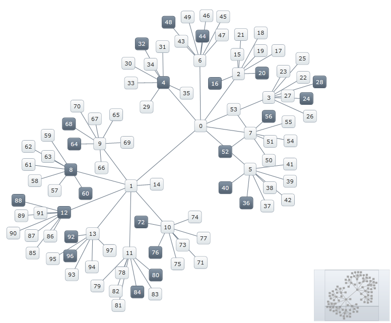

////
|metadata|
{
    "name": "xamnetworknode-selection",
    "controlName": ["xamNetworkNode"],
    "tags": ["Selection"],
    "guid": "af881919-4b90-4c19-ad06-ef1b515821e9",
    "buildFlags": [],
    "createdOn": "2016-05-25T18:21:57.4702474Z"
}
|metadata|
////

= Selection

This topic explains the node selection behaviors supported by the link:{ApiPlatform}controls.maps.xamnetworknode{ApiVersion}~infragistics.controls.maps.xamnetworknode.html[xamNetworkNode]™ control (including custom behaviors) and shows how to configure them in code. At the end, the complete code of the examples used in the topic is provided.

The topic is organized as follows:

* <<Introduction,Introduction>> 
* <<SelectionType,Selection Types>>
** <<ST-NONE,None>>
** <<ST-SINGLE,Single>>
** <<ST-MULTIPLE,Multiple>>
** <<ST-EXTENDED,Extended>>
* <<SettingSelectionType,Setting the Selection Type>>
* <<SelectingNodes,Selecting Nodes Using Procedural Code>>
* <<Configure,Configuring Custom Selection Behaviors>>
* <<CompleteCodeSample,Complete Code Sample>>
** <<View,View>>
** <<CodeBehind,Code Behind>>
** <<NodeModel,NodeModel.cs>>
** <<ConnectionModel,ConnectionModel.cs>>
** <<SimpleGraphData,SimpleGraphData.cs>>
* <<RelatedTopics,Related Topics>>

[[Introduction]]
== Introduction

The Network Node control supports a variety of pre-defined selection behaviors through its link:{ApiPlatform}controls.maps.xamnetworknode{ApiVersion}~infragistics.controls.maps.xamnetworknode~selectiontype.html[SelectionType] property. Selection types define when and how nodes become selected in response to click events, as well as how many nodes may be selected simultaneously. The available selection types are described in the following section, Selection Types.

Custom behaviors are also possible and are discussed in the section on Configuring Custom Selection Behaviors.

[[SelectionType]]
== Selection Types

[[ST-NONE]]
=== None

When this type is set, clicking a node does not select it.

This type is configured by setting the SelectionType property to link:{ApiPlatform}controls.maps.xamnetworknode{ApiVersion}~infragistics.controls.maps.networknodeselectiontype.html[None].

Figure 1: Node behavior when the SelectionType property is set to None

[[ST-SINGLE]]
=== Single

When this type is set, clicking a node selects it and any existing selection is cleared.

This type is configured by setting the SelectionType property to link:{ApiPlatform}controls.maps.xamnetworknode{ApiVersion}~infragistics.controls.maps.networknodeselectiontype.html[Single].

Figure 2: Node behavior when the SelectionType property is set to Single

[[ST-MULTIPLE]]
=== Multiple

When this type is set, clicking a node selects it. If the Shift key is held down, any previously selected nodes remain selected. If the Ctrl key is held down, clicking a node toggles the selection.

This type is configured by setting the SelectionType property to link:{ApiPlatform}controls.maps.xamnetworknode{ApiVersion}~infragistics.controls.maps.networknodeselectiontype.html[Multiple].

Figure 3: Node behavior when the SelectionType property is set to Multiple

[[ST-EXTENDED]]
=== Extended

When this type is set, clicking on a node selects that node together with all of its neighbors. If the Shift key is held down, any previously selected nodes remain selected. If the Ctrl key is held down, clicking a node toggles the selection.

This type is configured by setting the SelectionType property to link:{ApiPlatform}controls.maps.xamnetworknode{ApiVersion}~infragistics.controls.maps.networknodeselectiontype.html[Extended].

Figure 4: Node behavior when the SelectionType property is set to Extended

[[SettingSelectionType]]
== Setting the Selection Type

The selection mode is set with the SelectionType property:

**In XAML:**

[source,xaml]
----
<ig:XamNetworkNode x:Name="xnn"
                   ...
                   SelectionType="Multiple">
                   ...
</ig:XamNetworkNode>
----

**In C#:**

[source,csharp]
----
this.xnn.SelectionType = NetworkNodeSelectionType.Multiple;
----

**In Visual Basic:**

[source,vb]
----
Me.xnn.SelectionType = NetworkNodeSelectionType.Multiple
----

[[SelectingNodes]]
== Selecting Nodes Using Procedural Code

The collection of selected nodes can be accessed programmatically with the SelectedNodes property. For example, when the control is loaded, the following code will select all nodes with a numeric label divisible by 4:

**In XAML:**

[source,xaml]
----
<ig:XamNetworkNode x:Name="xnn"
                   ...
                   Loaded="xnn_Loaded">
                   ...
</ig:XamNetworkNode>
----

**In C#:**

[source,csharp]
----
private void xnn_Loaded(object sender, RoutedEventArgs e)
{
   foreach (var node in xnn.Search<NodeModel>(nm =>
          Convert.ToInt32(nm.Label) > 0 &&
          Convert.ToInt32(nm.Label) % 4 == 0))
   {
      xnn.SelectedNodes.Add(node);
   }
}
----

**In Visual Basic:**

[source,vb]
----
Private Sub xnn_Loaded(sender As Object, e As RoutedEventArgs)            
    For Each node As var In xnn.Search(Of NodeModel)_
        (Function(nm) Convert.ToInt32(nm.Label) > 0 AndAlso Convert.ToInt32(nm.Label) Mod 4 = 0) 
        xnn.SelectedNodes.Add(node)  
    Next  
End Sub
----

Using data from the walkthrough on Adding the Network Node Control, the graph will appear as shown in Figure 5:

Figure 5: A graph having all nodes with a numeric label divisible by 4 selected

[[Configure]]
== Configuring Custom Selection Behaviors

Adding or removing nodes to the link:{ApiPlatform}controls.maps.xamnetworknode{ApiVersion}~infragistics.controls.maps.xamnetworknode~selectednodes.html[SelectedNodes] collection will fire the link:{ApiPlatform}controls.maps.xamnetworknode{ApiVersion}~infragistics.controls.maps.xamnetworknode~selectednodescollectionchanged_ev.html[SelectedNodesCollectionChanged] event. Handling that event can enable custom behaviors. For example, when a node is selected, you can automatically select all nodes with values that are multiples of the originally selected node’s value:

**In XAML:**

[source,xaml]
----
<ig:XamNetworkNode x:Name="xnn"
                   ...
                   SelectedNodesCollectionChanged="xnn_SelectedNodesCollectionChanged">
                   ...
</ig:XamNetworkNode>
----

**In C#:**

[source,csharp]
----
private void xnn_SelectedNodesCollectionChanged(object sender, NetworkNodeSelectionEventArgs e)
{
    if (e.CurrentSelectedNodes.Count == 1)
    {
        NodeModel data = e.CurrentSelectedNodes[0].Data as NodeModel;
        int val = Convert.ToInt32(data.Label);
        if (val > 0)
        {
            foreach (var node in xnn.Search<NodeModel>(nm =>
                Convert.ToInt32(nm.Label) > 0 &&
                Convert.ToInt32(nm.Label) % val == 0))
            {
                xnn.SelectedNodes.Add(node);
            }
        }
    }
}
----

**In Visual Basic:**

[source,vb]
----
Private Sub xnn_SelectedNodesCollectionChanged(sender As Object, e As NetworkNodeSelectionEventArgs) 
    If e.CurrentSelectedNodes.Count = 1 Then 
        Dim data As NodeModel = TryCast(e.CurrentSelectedNodes(0).Data, NodeModel)            
        Dim val As Integer = Convert.ToInt32(data.Label)           
        If val > 0 Then
            For Each node As var In xnn.Search(Of NodeModel)_
                (Function(nm) Convert.ToInt32(nm.Label) > 0_
                 AndAlso Convert.ToInt32(nm.Label) Mod val = 0)        
                xnn.SelectedNodes.Add(node)     
            Next 
        End If
    End If 
End Sub
----

Now, for instance, selecting node 10 will also select each node with a value that is a multiple of 10:

Figure 6: Selecting node 10 also selects each node with a value that is a multiple of 10

[[Complete]]
== Complete Code Sample

The sample below lists full code of the examples implemented in context.

[[View]]
== View

**In XAML:**

[source,xaml]
----
<UserControl x:Class="xamNetworkNode_Selection.MainPage"
    xmlns="http://schemas.microsoft.com/winfx/2006/xaml/presentation"
    xmlns:x="http://schemas.microsoft.com/winfx/2006/xaml"
    xmlns:d="http://schemas.microsoft.com/expression/blend/2008"
    xmlns:mc="http://schemas.openxmlformats.org/markup-compatibility/2006"
    xmlns:ig="http://schemas.infragistics.com/xaml"
    xmlns:data="clr-namespace:xamNetworkNode_Selection.Data"
    mc:Ignorable="d"
    d:DesignHeight="300" d:DesignWidth="400">
 
    <Grid x:Name="LayoutRoot" Background="White">
        <Grid.Resources>
            <data:SimpleGraphData x:Key="GraphData" />
        </Grid.Resources>
        <ig:XamNetworkNode x:Name="xnn"
                           ItemsSource="{Binding Nodes, Source={StaticResource GraphData}}"
                           SelectionType="Multiple"
                           Loaded="xnn_Loaded"
                           SelectedNodesCollectionChanged="xnn_SelectedNodesCollectionChanged">
            <ig:XamNetworkNode.GlobalNodeLayouts>
                <ig:NetworkNodeNodeLayout
                    TargetTypeName = "NodeModel"
                    DisplayMemberPath = "Label"
                    ConnectionsMemberPath = "Connections"
                    ConnectionTargetMemberPath = "Target"
                    />
            </ig:XamNetworkNode.GlobalNodeLayouts>
        </ig:XamNetworkNode>
    </Grid>
</UserControl>
----

[[CodeBehind]]
== Code Behind

**In C#:**

[source,csharp]
----
using System.Windows.Controls;
 
namespace xamNetworkNode_Selection
{
    public partial class MainPage : UserControl
    {
        public MainPage()
        {
            InitializeComponent();
        }

        private void xnn_Loaded(object sender, RoutedEventArgs e)
        {
            foreach (var node in xnn.Search<NodeModel>(nm =>
                Convert.ToInt32(nm.Label) > 0 &&
                Convert.ToInt32(nm.Label) % 4 == 0))
            {
                xnn.SelectedNodes.Add(node);
            }
        }
 
        private void xnn_SelectedNodesCollectionChanged(object sender, NetworkNodeSelectionEventArgs e)
        {
            if (e.CurrentSelectedNodes.Count == 1)
            {
                NodeModel data = e.CurrentSelectedNodes[0].Data as NodeModel;
                int val = Convert.ToInt32(data.Label);
                if (val > 0)
                {
                    foreach (var node in xnn.Search<NodeModel>(nm =>
                        Convert.ToInt32(nm.Label) > 0 &&
                        Convert.ToInt32(nm.Label) % val == 0))
                    {
                        xnn.SelectedNodes.Add(node);
                    }
                }
            }
        }
    }
}
----

**In Visual Basic:**

[source,vb]
----
Imports System.Windows.ControlsNamespace xamNetworkNode_Selection 
Public Partial Class MainPage     
    Inherits UserControl    
    Public Sub New()   
        InitializeComponent() 
    End Sub   
    Private Sub xnn_Loaded(sender As Object, e As RoutedEventArgs) 
        For Each node As var In xnn.Search(Of NodeModel)_
            (Function(nm) Convert.ToInt32(nm.Label) > 0_
            AndAlso Convert.ToInt32(nm.Label) Mod 4 = 0)      
            xnn.SelectedNodes.Add(node)      
        Next    
    End Sub   
     
    Private Sub xnn_SelectedNodesCollectionChanged(sender As Object, e As NetworkNodeSelectionEventArgs)    
        If e.CurrentSelectedNodes.Count = 1 Then   
            Dim data As NodeModel = TryCast(e.CurrentSelectedNodes(0).Data, NodeModel)         
            Dim val As Integer = Convert.ToInt32(data.Label)        
            If val > 0 Then    
                For Each node As var In xnn.Search(Of NodeModel)_
                (Function(nm) Convert.ToInt32(nm.Label) > 0_
                AndAlso Convert.ToInt32(nm.Label) Mod val = 0)    
                xnn.SelectedNodes.Add(node)
                Next     
            End If
        End If       
    End Sub 
End Class 
----

[[NodeModel]]
== NodeModel.cs

**In C#:**

[source,csharp]
----
using System.Collections.ObjectModel;
using System.ComponentModel;
 
namespace xamNetworkNode_Selection.Models
{
    public class NodeModel : INotifyPropertyChanged
    {
        private string _label;
        public string Label
        {
            get { return _label; }
            set
            {
                if (value != _label)
                {
                    _label = value;
                    NotifyPropertyUpdated("Label");
                }
            }
        }
 
        private string _toolTip;
        public string ToolTip
        {
            get { return _toolTip; }
            set
            {
                if (value != _toolTip)
                {
                    _toolTip = value;
                    NotifyPropertyUpdated("ToolTip");
                }
            }
        }
 
        private ObservableCollection<ConnectionModel> _connections;
        public ObservableCollection<ConnectionModel> Connections
        {
            get { return _connections; }
            set
            {
                if (value != _connections)
                {
                    _connections = value;
                    NotifyPropertyUpdated("Connections");
                }
            }
        }
 
        #region Implementation of INotifyPropertyChanged
 
        public event PropertyChangedEventHandler PropertyChanged;
 
        protected virtual void NotifyPropertyUpdated(string propertyName)
        {
            var handler = PropertyChanged;
 
            if (handler != null)
            {
                handler(this, new PropertyChangedEventArgs(propertyName));
            }
        }
 
        #endregion
    }
}
----

**In Visual Basic:**

[source,vb]
----
Imports System.Collections.ObjectModel
Imports System.ComponentModel

Namespace xamNetworkNode_Selection.Models
    Public Class NodeModel
        Implements INotifyPropertyChanged
        Private _label As String
        Public Property Label() As String
            Get
                Return _label
            End Get
            Set
                If value <> _label Then
                    _label = value
                    NotifyPropertyUpdated("Label")
                End If
            End Set
        End Property

        Private _toolTip As String
        Public Property ToolTip() As String
            Get
                Return _toolTip
            End Get
            Set
                If value <> _toolTip Then
                    _toolTip = value
                    NotifyPropertyUpdated("ToolTip")
                End If
            End Set
        End Property

        Private _connections As ObservableCollection(Of ConnectionModel)
        Public Property Connections() As ObservableCollection(Of ConnectionModel)
            Get
                Return _connections
            End Get
            Set
                If value IsNot _connections Then
                    _connections = value
                    NotifyPropertyUpdated("Connections")
                End If
            End Set
        End Property

        #Region "Implementation of INotifyPropertyChanged"

        Public Event PropertyChanged As PropertyChangedEventHandler

        Protected Overridable Sub NotifyPropertyUpdated(propertyName As String)
            Dim handler = PropertyChanged

            RaiseEvent handler(Me, New PropertyChangedEventArgs(propertyName))
        End Sub

        #End Region
    End Class
End Namespace
----

[[ConnectionModel]]
== ConnectionModel.cs

**In C#:**

[source,csharp]
----
using System.ComponentModel;
 
namespace xamNetworkNode_Selection.Models
{
    public class ConnectionModel : INotifyPropertyChanged
    {
        private NodeModel _target;
        public NodeModel Target
        {
            get { return _target; }
            set
            {
                if (value != _target)
                {
                    _target = value;
                    NotifyPropertyUpdated("Target");
                }
            }
        }
 
        #region Implementation of INotifyPropertyChanged
 
        public event PropertyChangedEventHandler PropertyChanged;
 
        protected virtual void NotifyPropertyUpdated(string propertyName)
        {
            var handler = PropertyChanged;
 
            if (handler != null)
            {
                handler(this, new PropertyChangedEventArgs(propertyName));
            }
        }
        #endregion
    }
}
----

**In Visual Basic:**

[source,vb]
----
Imports System.ComponentModel
Namespace xamNetworkNode_Selection.Models
    Public Class ConnectionModel    
    Implements INotifyPropertyChanged 
       Private _target As NodeModel 
       Public Property Target() As NodeModel 
           Get  
              Return _target    
        End Get
            Set    
            If value IsNot _target Then      
              _target = value     
               NotifyPropertyUpdated("Target")      
          End If
            End Set 
       End Property
    
    Public Event PropertyChanged As PropertyChangedEventHandler  
      Protected Overridable Sub NotifyPropertyUpdated(propertyName As String)
            Dim handler = PropertyChanged  
          RaiseEvent handler(Me, New PropertyChangedEventArgs(propertyName)) 
       End Sub   
 End Class 
End Namespace
----

[[SimpleGraphData]]
== SimpleGraphData.cs

**In C#:**

[source,csharp]
----
using System.Collections.ObjectModel;
using xamNetworkNode_Selection.Models;
 
namespace xamNetworkNode_Selection.Data
{
    public class SimpleGraphData
    {
        public ObservableCollection<NodeModel> Nodes { get; set; }
        private const int K = 7; // number of connections per node (maximum)
        private const int NUM_NODES = 98; // number of nodes in the graph
 
        public SimpleGraphData()
        {
            Nodes = new ObservableCollection<NodeModel>();
 
            // add NUM_NODES node objects to the collection
            for (int i = 0; i < NUM_NODES; i++)
            {
                NodeModel node = new NodeModel();
                node.Label = i.ToString();
                node.ToolTip = "ToolTip for " + node.Label;
                Nodes.Add(node);
            }
 
            // starting with node 0, set that node as the root.
            // add up to K connections to the root node.
            // then, increment the root node index and repeat until all nodes have been connected.
            int root = 0;
            int first = 1;
            int last = K;
            while (first < Nodes.Count)
            {
                Nodes[root].Connections = new ObservableCollection<ConnectionModel>();
                for (int i = first; i <= last; i++)
                {
                    if (i >= Nodes.Count)
                    {
                        break;
                    }
                    Nodes[root].Connections.Add(new ConnectionModel { Target = Nodes[i] });
                }
                root++;
                first = last + 1;
                last += K;
            }
        }
    }
}
----

**In Visual Basic:**

[source,vb]
----
Imports System.Collections.ObjectModel
Imports xamNetworkNode_Selection.Models

Namespace xamNetworkNode_Selection.Data    
   Public Class SimpleGraphData
      Public Property Nodes() As ObservableCollection(Of NodeModel)   
         Get   
            Return m_Nodes    
         End Get
         Set  
            m_Nodes = Value     
         End Set  
      End Property     
      Private m_Nodes As ObservableCollection(Of NodeModel)    
      Private Const K As Integer = 7     
      ' number of connections per node (maximum)   
      Private Const NUM_NODES As Integer = 98        
      ' number of nodes in the graph 
      Public Sub New()            
         Nodes = New ObservableCollection(Of NodeModel)()          
         ' add NUM_NODES node objects to the collection   
         For i  As  Integer = 0 To NUM_NODES - 1             
            Dim node  As New NodeModel()
               node.Label = i.ToString()                
               node.ToolTip = "ToolTip for " & node.Label
               Nodes.Add(node)    
            Next
            ' starting with node 0, set that node as the root.
            ' add up to K connections to the root node.  
            ' then, increment the root node index and repeat until all nodes have been connected.   
            Dim root  As Integer = 0
            Dim  first As Integer = 1        
            Dim  last As Integer = K   
            While first < Nodes.Count
               Nodes(root).Connections = New ObservableCollection(Of ConnectionModel)()           
               For i As Integer = first To last
                  If i >= Nodes.Count Then 
                     Exit For  
                  End If 
                  Nodes(root).Connections.Add(New ConnectionModel() With { _      
                  Key .Target = Nodes(i) _                    
               })  
               Next
               root += 1     
               first = last + 1    
               last += K   
            End While
        End Sub
    End Class
End Namespace
----

[[RelatedTopics]]
== Related Topics

* link:xamnetworknode-getting-started-with-xamnetworknode.html[Getting Started with xamNetworkNode]
* link:xamnetworknode-conditional-formatting.html[Conditional Formatting]
* link:xamnetworknode-node-relocation.html[Node Relocation]