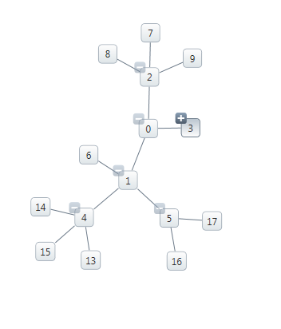
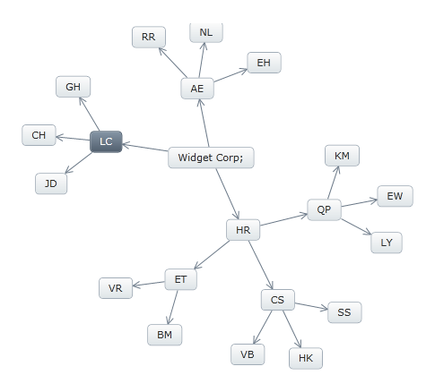
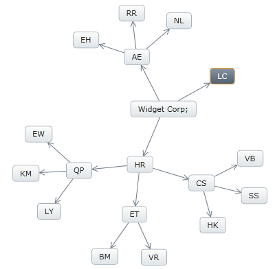

////
|metadata|
{
    "name": "xamnetworknode-show-hide-nodes",
    "controlName": ["xamNetworkNode"],
    "tags": ["Data Presentation","How Do I"],
    "guid": "fd3c86cd-6682-44f7-86ce-a60cd8c75fe2",
    "buildFlags": [],
    "createdOn": "2016-05-25T18:21:57.4942491Z"
}
|metadata|
////

= Show Hide Nodes

This topic demonstrates how to show and hide the children nodes on the link:{ApiPlatform}controls.maps.xamnetworknode{ApiVersion}~infragistics.controls.maps.xamnetworknode.html[xamNetworkNode]™ control.

* <<introduction,Introduction>>
* <<requirements,Requirements>>
* <<configure_Show_Hide,Configure the Show/Hide Node Settings>>

** <<show_Hide_with_Exp_Indicator,Show/Hide with Expansion indicators>>
** <<show_Hide_without_Exp_Indicator,Show/Hide without Expansion Indicators>>

* <<related_Topic,Related Topic>>

[[introduction]]
== Introduction

The xamNetworkNode control currently supports three ways to show and hide child nodes:

* Show/Hide using the Expansion indicator
* Show/Hide without Expansion indicator, using code behind
* Enter key on the keyboard (when expansion indicators are visible)

In addition to the default modes, any node can hide itself by setting the node’s Visibility property to “Collapsed”.

The operation of hiding and showing a child node is controlled by the connected parent node by:

. Using Expansion indicator

.. With Mouse click on expansion indicators
.. With Enter key on the keyboard while the expansion indicator is visible

. Using IsExpanded property in code behind, while expansion indicators are disabled
+
Setting the link:{ApiPlatform}controls.maps.xamnetworknode{ApiVersion}~infragistics.controls.maps.networknodenode~isexpanded.html[IsExpanded] property.
+
Options: [Visible | Collapsed | Hidden]

. Data Source
+
Any object that implements IEnumerable (e.g. List, Collection, etc.).

[[requirements]]
== Requirements

To begin, please read the link:xamnetworknode-getting-started-with-xamnetworknode.html[Getting Started with xamNetworkNode] topic as this tutorial uses the code from the "Getting Started" topic as a starting point.

In addition, a few properties must be set in order to achieve the desired functionality.

Properties to set on xamNetworkNode:

* link:{ApiPlatform}controls.maps.xamnetworknode{ApiVersion}~infragistics.controls.maps.networknodenode~expansionindicatorvisibility.html[ExpansionIndicatorVisibility] – [Visible | Collapsed]. The following priority will take place from highest to lowest when specified:
+
--
.. Node with expansion indicators (1st priority)
.. Node Layout (2nd priority)
.. XamNetworkNode globally (3rd priority)
--
+
.Note:
[NOTE]
====
link:{ApiPlatform}controls.maps.xamnetworknode{ApiVersion}~infragistics.controls.maps.xamnetworknode~expansionindicatorvisibility.html[ExpansionIndicatorVisibility] supports null value, and when it is set to null, the lower priority will apply, for example if the link:{ApiPlatform}controls.maps.xamnetworknode{ApiVersion}~infragistics.controls.maps.xamnetworknode~expansionindicatorvisibility.html[ExpansionIndicatorVisibility] property is set to null on the control, the lower priority (2nd) will apply, and if the 2nd priority is set to null then the 3rd priority will apply.
====

Properties to set on link:{ApiPlatform}controls.maps.xamnetworknode{ApiVersion}~infragistics.controls.maps.networknodenode.html[NetworkNodeNode]:

* link:{ApiPlatform}controls.maps.xamnetworknode{ApiVersion}~infragistics.controls.maps.networknodenode~isexpanded.html[IsExpanded] – [true | false]
+
.Note:
[NOTE]
====
While the Expansion indicators are visible, the Enter key on the keyboard can also be used to Show/Hide the child nodes.
====

[[configure_Show_Hide]]
== Configure the Show/Hide Node Settings

[[show_Hide_with_Exp_Indicator]]
== Show / Hide with Expansion Indicators

The following code example and the screenshot demonstrate enabling expansion indicator on the NetworkNode control for using the plus/minus symbol to show/hide children of the node. While the expansion indicator is enabled, the Enter key on the keyboard can also be used to Show/Hide the children of the selected node.

*In XAML:*
[source,xaml]
----
<ig:XamNetworkNode   
    ExpansionIndicatorVisibility="Visible">
</ig:XamNetworkNode>
----

*In Visual Basic:*
[source,vb]
----
node.ExpansionIndicatorVisibility = Visibility.Visible
----

*In C#:*
[source,csharp]
----
node.ExpansionIndicatorVisibility = Visibility.Visible;
----

The Figure 1 displays the link:{ApiPlatform}controls.maps.xamnetworknode{ApiVersion}~infragistics.controls.maps.xamnetworknode.html[xamNetworkNode] with expansion indicators enabled on the parent node. The parent nodes have connections to the child nodes that can be shown and hidden. The plus sign indicates that the child nodes are hidden.

.Note:
[NOTE]
====
There are restrictions that apply when child nodes are not hidden. For example, when a child node has two parent nodes and one of the parents is collapsed, the child node is not hidden because the other parent is not hidden. If both parents are collapsed, then the child node is hidden.
====

Figure 1: Hiding/Showing the nodes with expansion indicators.

[[show_Hide_without_Exp_Indicator]]
== Show / Hide without Expansion Indicators

Use the link:{ApiPlatform}controls.maps.xamnetworknode{ApiVersion}~infragistics.controls.maps.networknodenode~isexpanded.html[IsExpanded] property of the NetworkNode control (in code behind) to Show/Hide the children of a selected node. Note that since the XamNetworkNode does not expose the Node object in XAML, the node expansion needs to be implemented in code behind.

*In Visual Basic:*
[source,vb]
----
node.IsExpanded = true
----

*In C#:*
[source,csharp]
----
node.IsExpanded = True;
----

Figure 2 shows the selected node about to be hidden using code behind by setting link:{ApiPlatform}controls.maps.xamnetworknode{ApiVersion}~infragistics.controls.maps.networknodenode~isexpanded.html[IsExpanded] property. The selected node has three child nodes.

Figure 2: Hiding/Showing nodes in code behind without expansion indicators.

Figure 3 shows the parent node from above, hiding its three children. You may also notice that the location of the node is changed.

The reason for the control to rearrange the nodes is because xamNetworkNode recalculates the nodes after changes being made and displays with an optimum layout positioning in the view.

Figure 3: Nodes rearanged after Hiding/Showing operation.

[[related_Topic]]
== Related Topic

* link:xamnetworknode-getting-started-with-xamnetworknode.html[Getting Started with xamNetworkNode]
* link:xamnetworknode-using-xamnetworknode.html[Using xamNetworkNode]