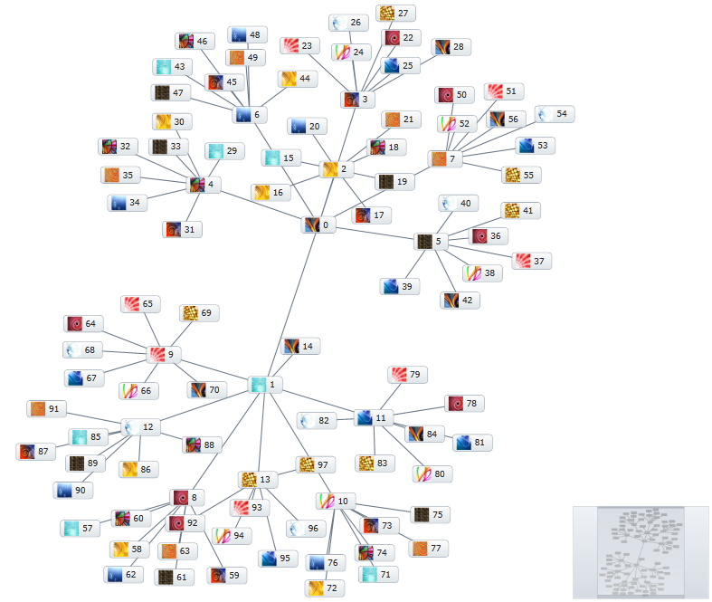

////

|metadata|
{
    "name": "xamnetworknode-templates",
    "controlName": ["xamNetworkNode"],
    "tags": ["How Do I","Templating"],
    "guid": "9d91eabb-bd1e-42b7-ae84-7ca1c0315808",  
    "buildFlags": [],
    "createdOn": "2016-05-25T18:21:57.4472551Z"
}
|metadata|
////

= Templates

This topic describes how to configure custom node templates for the link:{ApiPlatform}controls.maps.xamnetworknode{ApiVersion}~infragistics.controls.maps.xamnetworknode.html[xamNetworkNode]™ control. At the end of the topic, a complete code sample is provided.

The topic is organized as follows:

* <<Introduction,Introduction>> 
* <<Customizing,Customizing the Node Template>> 
** <<Preview,Preview>>
** <<Requirements,Requirements>>
** <<Overview,Overview>>
** <<Steps,Steps>>
* <<Complete,Complete Code Sample>>
** <<View,View>>
** <<CodeBehind,Code Behind>>
** <<NodeModel,NodeModel.cs>>
** <<ConnectionModel,ConnectionModel.cs>>
** <<SimpleGraphData,SimpleGraphData.cs>>
* <<RelatedTopics,Related Topics>>

[[Introduction]]
== Introduction

The xamNetworkNode control supports the use of custom node templates via the link:{ApiPlatform}controls.maps.xamnetworknode{ApiVersion}~infragistics.controls.maps.xamnetworknode~itemtemplate.html[ItemTemplate] property on link:{ApiPlatform}controls.maps.xamnetworknode{ApiVersion}~infragistics.controls.maps.networknodenodelayout.html[NetworkNodeNodeLayout].

[[Customizing]]
== Customizing the Node Template

The following procedure demonstrates how to configure a custom template that places an image inside each node.

[[Preview]]
== Preview

Following is a preview of the final result:

Figure 1: An implementation of the xamNetworkNode with images inside the nodes control as rendered by the sample code

[[Requirements]]
== Requirements

This article assumes you have already read the article on link:xamnetworknode-getting-started-with-xamnetworknode.html[Getting Started with xamNetworkNode], and uses the code from that walkthrough as a starting point.

[[Overview]]
== Overview

1. <<IncludingImages,Including the images>>
2. <<ModifyingDataModel,Modifying the data model>>
3. <<CreatingCustomNode,Creating a custom node template>> 
4. <<SavingYourProject,Saving your project>>
5. <<VerifyingResult,(Optional) Verifying the result>>

[[Steps]]
== Steps

[[IncludingImages]]
[start=1]
1. **Include the images.**

Include some images in your application project.

[[ModifyingDataModel]]
[start=2]
2. **Modify the data model.**

Define a property on the data model to maintain an image path for each node. Add the following code to the NodeModel class:

**In C#:**

[source,csharp]
----
private string _imagePath;
public string ImagePath
{
    get { return _imagePath; }
    set
    {
        if (value != _imagePath)
        {
            _imagePath = value;
            NotifyPropertyUpdated("ImagePath");
        }
    }
}
----

**In Visual Basic:**

[source,vb]
----
Private _imagePath As String
Public Property ImagePath() As String
    Get
        Return _imagePath
    End Get
    Set
        If value <> _imagePath Then
            _imagePath = value
            NotifyPropertyUpdated("ImagePath")
        End If
    End Set
End Property
----

Then, inside the constructor for SimpleGraphData, add a line of code that sets the ImagePath for each node:

**In C#:**

[source,csharp]
----
for (int i = 0; i < NUM_NODES; i++)
{
    NodeModel node = new NodeModel();
    node.Label = i.ToString();
    node.ToolTip = "ToolTip for " + node.Label;
    
    // set the image path
    node.ImagePath = "/Images/Texture" + ((i % 14) + 1).ToString("00") + ".jpg";
    
    Nodes.Add(node);
} 
----

**In Visual Basic:**

[source,vb]
----
For i As Integer = 0 To NUM_NODES - 1
    Dim node As New NodeModel()
    node.Label = i.ToString()
    node.ToolTip = "ToolTip for " & node.Label

    ' set the image path
    node.ImagePath = "/Images/Texture" & ((i Mod 14) + 1).ToString("00") & ".jpg"

    Nodes.Add(node)
Next
----

[[CreatingCustomNode]]
[start=3]
3. **Create a custom node template.**

Now, add the following DataTemplate to your application as a XAML resource. This template will display an image along with the numeric label:

**In XAML:**

[source,xaml]
----
<DataTemplate x:Key="NodeTemplate">
    <StackPanel Orientation="Horizontal">
        <Image Source="{Binding ImagePath}" Width="20" Height="20" />
        <TextBlock Text="{Binding Label}" Margin="5,0,5,0" VerticalAlignment="Center" />
    </StackPanel>
</DataTemplate>
----

Now, within the link:{ApiPlatform}controls.maps.xamnetworknode{ApiVersion}~infragistics.controls.maps.networknodenodelayout.html[NetworkNodeNodeLayout] object, bind the link:{ApiPlatform}controls.maps.xamnetworknode{ApiVersion}~infragistics.controls.maps.xamnetworknode~itemtemplate.html[ItemTemplate] property to this newly defined DataTemplate:

**In XAML:**

[source,xaml]
----
<ig:XamNetworkNode.GlobalNodeLayouts>
    <ig:NetworkNodeNodeLayout
        ItemTemplate="{StaticResource NodeTemplate}"
        ...
        />
</ig:XamNetworkNode.GlobalNodeLayouts>
----

[[SavingYourProject]]
[start=4]
4. **Save your project.**

[[VerifyingResult]]
[start=5]
5. **(Optional) Verify the result.**

Run the application. The Network Node control will now display an image inside each of the graph nodes as shown in Figure 1 above. You can modify the DataTemplate to display other visual information as needed.

[[Complete]]
== Complete Code Sample

The following code listings show you the full example implemented in context.

[[View]]
== View

**In XAML:**

[source,xaml]
----
<UserControl x:Class="xamNetworkNode_NodeTemplates.MainPage"
    xmlns="http://schemas.microsoft.com/winfx/2006/xaml/presentation"
    xmlns:x="http://schemas.microsoft.com/winfx/2006/xaml"
    xmlns:d="http://schemas.microsoft.com/expression/blend/2008"
    xmlns:mc="http://schemas.openxmlformats.org/markup-compatibility/2006"
    xmlns:ig="http://schemas.infragistics.com/xaml"
    xmlns:data="clr-namespace:xamNetworkNode_NodeTemplates.Data"
    mc:Ignorable="d"
    d:DesignHeight="300" d:DesignWidth="400">
 
    <Grid x:Name="LayoutRoot" Background="White">
        <Grid.Resources>
            <data:SimpleGraphData x:Key="GraphData" />
            <DataTemplate x:Key="NodeTemplate">
                <StackPanel Orientation="Horizontal">
                    <Image Source="{Binding ImagePath}" Width="20" Height="20" />
                    <TextBlock Text="{Binding Label}" Margin="5,0,5,0" VerticalAlignment="Center" />
                </StackPanel>
            </DataTemplate>
        </Grid.Resources>
        <ig:XamNetworkNode x:Name="xnn"
                           ItemsSource="{Binding Nodes, Source={StaticResource GraphData}}">
            <ig:XamNetworkNode.GlobalNodeLayouts>
                <ig:NetworkNodeNodeLayout
                    ItemTemplate="{StaticResource NodeTemplate}"
                    TargetTypeName = "NodeModel"
                    DisplayMemberPath = "Label"
                    ToolTipMemberPath = "ToolTip"
                    ConnectionsMemberPath = "Connections"
                    ConnectionTargetMemberPath = "Target"
                    />
            </ig:XamNetworkNode.GlobalNodeLayouts>
        </ig:XamNetworkNode>
    </Grid>
</UserControl>
----

[[CodeBehind]]
== Code Behind

**In C#:**

[source,csharp]
----
using System.Windows.Controls;
 
namespace xamNetworkNode_NodeTemplates
{
    public partial class MainPage : UserControl
    {
        public MainPage()
        {
            InitializeComponent();
        }
    }
}
----

**In Visual Basic:**

[source,vb]
----
Imports System.Windows.Controls

Namespace xamNetworkNode_NodeTemplates
    Public Partial Class MainPage
        Inherits UserControl
        Public Sub New()
            InitializeComponent()
        End Sub
    End Class
End Namespace
----

[[NodeModel]]
== NodeModel.cs

**In C#:**

[source,csharp]
----
using System.Collections.ObjectModel;
using System.ComponentModel;
 
namespace xamNetworkNode_NodeTemplates.Models
{
    public class NodeModel : INotifyPropertyChanged
    {
        private string _label;
        public string Label
        {
            get { return _label; }
            set
            {
                if (value != _label)
                {
                    _label = value;
                    NotifyPropertyUpdated("Label");
                }
            }
        }
 
        private string _toolTip;
        public string ToolTip
        {
            get { return _toolTip; }
            set
            {
                if (value != _toolTip)
                {
                    _toolTip = value;
                    NotifyPropertyUpdated("ToolTip");
                }
            }
        }

        private string _imagePath;
        public string ImagePath
        {
            get { return _imagePath; }
            set
            {
                if (value != _imagePath)
                {
                    _imagePath = value;
                    NotifyPropertyUpdated("ImagePath");
                }
            }
        }

 
        private ObservableCollection<ConnectionModel> _connections;
        public ObservableCollection<ConnectionModel> Connections
        {
            get { return _connections; }
            set
            {
                if (value != _connections)
                {
                    _connections = value;
                    NotifyPropertyUpdated("Connections");
                }
            }
        }
 
        public event PropertyChangedEventHandler PropertyChanged;
 
        protected virtual void NotifyPropertyUpdated(string propertyName)
        {
            var handler = PropertyChanged;
 
            if (handler != null)
            {
                handler(this, new PropertyChangedEventArgs(propertyName));
            }
        }
    }
}
----

**In Visual Basic:**

[source,vb]
----
Imports System.Collections.ObjectModel
Imports System.ComponentModel

Namespace xamNetworkNode_NodeTemplates.Models
    Public Class NodeModel
        Implements INotifyPropertyChanged
        Private _label As String
        Public Property Label() As String
            Get
                Return _label
            End Get
            Set
                If value <> _label Then
                    _label = value
                    NotifyPropertyUpdated("Label")
                End If
            End Set
        End Property

        Private _toolTip As String
        Public Property ToolTip() As String
            Get
                Return _toolTip
            End Get
            Set
                If value <> _toolTip Then
                    _toolTip = value
                    NotifyPropertyUpdated("ToolTip")
                End If
            End Set
        End Property

        Private _imagePath As String
        Public Property ImagePath() As String
            Get
                Return _imagePath
            End Get
            Set
                If value <> _imagePath Then
                    _imagePath = value
                    NotifyPropertyUpdated("ImagePath")
                End If
            End Set
        End Property

        Private _connections As ObservableCollection(Of ConnectionModel)
        Public Property Connections() As ObservableCollection(Of ConnectionModel)
            Get
                Return _connections
            End Get
            Set
                If value <> _connections Then
                    _connections = value
                    NotifyPropertyUpdated("Connections")
                End If
            End Set
        End Property

        Public Event PropertyChanged As PropertyChangedEventHandler

        Protected Overridable Sub NotifyPropertyUpdated(propertyName As String)
            Dim handler = PropertyChanged

            RaiseEvent handler(Me, New PropertyChangedEventArgs(propertyName))
        End Sub
        
    End Class
End Namespace
----

[[ConnectionModel]]
== ConnectionModel.cs

**In C#:**

[source,csharp]
----
using System.ComponentModel;
 
namespace xamNetworkNode_NodeTemplates.Models
{
    public class ConnectionModel : INotifyPropertyChanged
    {
        private NodeModel _target;
        public NodeModel Target
        {
            get { return _target; }
            set
            {
                if (value != _target)
                {
                    _target = value;
                    NotifyPropertyUpdated("Target");
                }
            }
        }
 
        public event PropertyChangedEventHandler PropertyChanged;
 
        protected virtual void NotifyPropertyUpdated(string propertyName)
        {
            var handler = PropertyChanged;
 
            if (handler != null)
            {
                handler(this, new PropertyChangedEventArgs(propertyName));
            }
        }
    }
}

----

**In Visual Basic:**

[source,vb]
----
Imports System.ComponentModel

Namespace xamNetworkNode_NodeTemplates.Models
    Public Class ConnectionModel
        Implements INotifyPropertyChanged
        Private _target As NodeModel
        Public Property Target() As NodeModel
            Get
                Return _target
            End Get
            Set
                If value IsNot _target Then
                    _target = value
                    NotifyPropertyUpdated("Target")
                End If
            End Set
        End Property

        Public Event PropertyChanged As PropertyChangedEventHandler

        Protected Overridable Sub NotifyPropertyUpdated(propertyName As String)
            Dim handler = PropertyChanged

            RaiseEvent handler(Me, New PropertyChangedEventArgs(propertyName))
        End Sub
    End Class
End Namespace
----

[[SimpleGraphData]]
== SimpleGraphData.cs

**In C#:**

[source,csharp]
----
using System.Collections.ObjectModel;
using xamNetworkNode_Intro.Models;
 
namespace xamNetworkNode_NodeTemplates.Data
{
    public class SimpleGraphData
    {
        public ObservableCollection<NodeModel> Nodes { get; set; }
        private const int K = 7; // number of connections per node (maximum)
        private const int NUM_NODES = 98; // number of nodes in the graph
 
        public SimpleGraphData()
        {
            Nodes = new ObservableCollection<NodeModel>();
 
            // add NUM_NODES node objects to the collection
            for (int i = 0; i < NUM_NODES; i++)
            {
                NodeModel node = new NodeModel();
                node.Label = i.ToString();
                node.ToolTip = "ToolTip for " + node.Label;
                
                // set the image path
                node.ImagePath = "/Images/Texture" + ((i % 14) + 1).ToString("00") + ".jpg";
                
                Nodes.Add(node);
            }
 
            // starting with node 0, set that node as the root.
            // add up to K connections to the root node.
            // then, increment the root node index and repeat until all nodes have been connected.
            int root = 0;
            int first = 1;
            int last = K;
            while (first < Nodes.Count)
            {
                Nodes[root].Connections = new ObservableCollection<ConnectionModel>();
                for (int i = first; i <= last; i++)
                {
                    if (i >= Nodes.Count)
                    {
                        break;
                    }
                    Nodes[root].Connections.Add(new ConnectionModel { Target = Nodes[i] });
                }
                root++;
                first = last + 1;
                last += K;
            }
        }
    }
}
----

**In Visual Basic:**

[source,vb]
----
Imports System.Collections.ObjectModel
Imports xamNetworkNode_Intro.Models

Namespace xamNetworkNode_NodeTemplates.Data
    Public Class SimpleGraphData
        Public Property Nodes() As ObservableCollection(Of NodeModel)
            Get
                Return m_Nodes
            End Get
            Set
                m_Nodes = Value
            End Set
        End Property
        Private m_Nodes As ObservableCollection(Of NodeModel)
        Private Const K As Integer = 7
        ' number of connections per node (maximum)
        Private Const NUM_NODES As Integer = 98
        ' number of nodes in the graph
        Public Sub New()
            Nodes = New ObservableCollection(Of NodeModel)()

            ' add NUM_NODES node objects to the collection
            For i As Integer = 0 To NUM_NODES - 1
                Dim node As New NodeModel()
                node.Label = i.ToString()
                node.ToolTip = "ToolTip for " & node.Label

                ' set the image path
                node.ImagePath = "/Images/Texture" & ((i Mod 14) + 1).ToString("00") & ".jpg"

                Nodes.Add(node)
            Next

            ' starting with node 0, set that node as the root.
            ' add up to K connections to the root node.
            ' then, increment the root node index and repeat until all nodes have been connected.
            Dim root As Integer = 0
            Dim first As Integer = 1
            Dim last As Integer = K
            While first < Nodes.Count
                Nodes(root).Connections = New ObservableCollection(Of ConnectionModel)()
                For i As Integer = first To last
                    If i >= Nodes.Count Then
                        Exit For
                    End If
                    Nodes(root).Connections.Add(New ConnectionModel() With { _
                        Key .Target = Nodes(i) _
                    })
                Next
                root += 1
                first = last + 1
                last += K
            End While
        End Sub
    End Class
End Namespace
----

[[RelatedTopics]]
== Related Topics

* link:xamnetworknode.html[xamNetworkNode]
* link:xamnetworknode-getting-started-with-xamnetworknode.html[Getting Started with xamNetworkNode]
