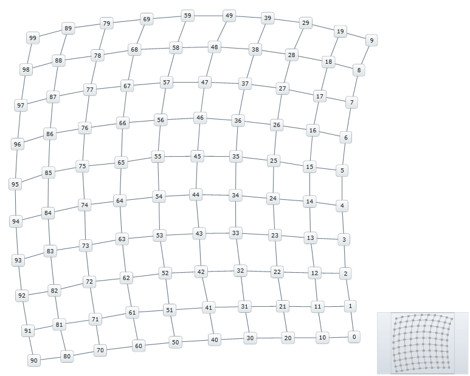

////
|metadata|
{
    "name": "xamnetworknode-using-different-data-sources",
    "controlName": ["xamNetworkNode"],
    "tags": [],
    "guid": "34b12900-bb39-478a-9eb5-0ccb957b0f70","buildFlags": [],
    "createdOn": "2016-05-25T18:21:57.4642566Z"
}
|metadata|
////

= Using Different Data Sources
This walkthrough shows how to load data from a file to the Network Node control. As an example, a Graph Modelling Language (GML) file is used. At the end of the topic, a complete code sample is provided. The topic is organized as follows:

* <<Introduction,Introduction>>
* <<Preview,Preview>>
* <<Requirements,Requirements>>
* <<Steps,Steps>>
* <<Complete,Complete Code Sample>>
* <<GmlParserCS,GmlParser.cs>>
* <<GmlParserVB,GmlParser.vb>>
* <<RelatedTopics,Related Topics>>

[[Introduction]]
== Introduction

The Network Node control supports data in the form of an IEnumerable, but that data can easily be read from a file. The walkthrough demonstrates how to load data to the Network Node control from a GML file.

[[Preview]]
== Preview

Following is a preview of the final result:

[[Requirements]]
== Requirements

This article assumes you have already read the article on Adding the Network Node Control, and uses the code from that walkthrough as a starting point. Overview Following is a conceptual overview of the implementation:

. Configuring the Node layout
. Loading the GML data
. Handling the DownloadStringCompleted event
. (Optional) Verifying the result

[[Steps]]
== Steps

. *Load the GML data* .
+
The GML Parser we provide uses a data model as follows:
+
*In XAML:*
+
[source,xaml]
----
<Grid x:Name="LayoutRoot" Background="White">
    <ig:XamNetworkNode x:Name="xnn">
        <ig:XamNetworkNode.GlobalNodeLayouts>
            <ig:NetworkNodeNodeLayout
                TargetTypeName = "GmlNode"
                DisplayMemberPath = "Id"
                ToolTipMemberPath = "Label"
                ConnectionsMemberPath = "Connections"
                ConnectionTargetMemberPath = "Target"
                />
        </ig:XamNetworkNode.GlobalNodeLayouts>
    </ig:XamNetworkNode>
</Grid>
----
+
In the application constructor, after calling InitializeComponent, use a WebClient instance to load the GML data as a string. For your convenience, use the provided GML file: Graph2.gml.
+
*In C#:*
+
[source,csharp]
----
public MainPage()
{
    InitializeComponent();
    var webClient = new WebClient();
    webClient.DownloadStringCompleted += GmlFileLoaded;
    webClient.DownloadStringAsync(new Uri("Graph2.gml", UriKind.RelativeOrAbsolute));
}
----
+
*In Visual Basic:*
+
[source,vb]
----
Public Sub New()
    InitializeComponent()
    Dim webClient = New WebClient()
    AddHandler webClient.DownloadStringCompleted, AddressOf GmlFileLoaded
    webClient.DownloadStringAsync(New Uri("Graph2.gml", UriKind.RelativeOrAbsolute))
End Sub
----

. *Handle the DownloadStringCompleted event* .
+
The handler is configured to parse the file data and set the Network Node control’s ItemsSource property:
+
*In C#:*
+
[source,csharp]
----
private void GmlFileLoaded(object sender, DownloadStringCompletedEventArgs e)
{
    var stream = new StringReader(e.Result);
    var nodes = new GmlParser().Parse(stream);
    xnn.ItemsSource = nodes;
}
----
+
*In Visual Basic:*
+
[source,vb]
----
Private Sub GmlFileLoaded(sender As Object, e As DownloadStringCompletedEventArgs)
    Dim stream = New StringReader(e.Result)
    Dim nodes = New GmlParser().Parse(stream)
    xnn.ItemsSource = nodes
End Sub
----
+
The Result property of the DownloadStringCompletedEventArgs holds the GML data formatted as a string, and GmlParser is a class that we have provided. GmlParser.Parse takes a TextReader object, parses the string, then returns an IEnumerable. GmlNode and other utility classes are defined in GmlParser below

. *(Optional) Verify the result* .
+
To verify your implementation, run the application. At this point, data from Graph2.gml will be displayed as shown in Figure 1 above.

[[Complete]]
== Complete Code Sample

The following code listings show you the full example implemented in context.

*In XAML:*
[source,xaml]
----
<UserControl x:Class="xamNetworkNode_LoadingGmlData.MainPage"
    xmlns="http://schemas.microsoft.com/winfx/2006/xaml/presentation"
    xmlns:x="http://schemas.microsoft.com/winfx/2006/xaml"
    xmlns:d="http://schemas.microsoft.com/expression/blend/2008"
    xmlns:mc="http://schemas.openxmlformats.org/markup-compatibility/2006"
    xmlns:ig="http://schemas.infragistics.com/xaml"
    mc:Ignorable="d"
    d:DesignHeight="300" d:DesignWidth="400">
    <Grid x:Name="LayoutRoot" Background="White">
        <ig:XamNetworkNode x:Name="xnn">
            <ig:XamNetworkNode.GlobalNodeLayouts>
                <ig:NetworkNodeNodeLayout
                    TargetTypeName = "GmlNode"
                    DisplayMemberPath = "Id"
                    ToolTipMemberPath = "Label"
                    ConnectionsMemberPath = "Connections"
                    ConnectionTargetMemberPath = "Target"
                    />
            </ig:XamNetworkNode.GlobalNodeLayouts>
        </ig:XamNetworkNode>
    </Grid>
</UserControl>
----

*In C#:*
[source,csharp]
----
using System;
using System.IO;
using System.Net;
using System.Windows.Controls;
using xamNetworkNode_LoadingGmlData.Resources;
namespace xamNetworkNode_LoadingGmlData
{
    public partial class MainPage : UserControl
    {
        public MainPage()
        {
            InitializeComponent();
            var webClient = new WebClient();
            webClient.DownloadStringCompleted += GmlFileLoaded;
            webClient.DownloadStringAsync(new Uri("Graph2.gml", UriKind.RelativeOrAbsolute));
        }
        private void GmlFileLoaded(object sender, DownloadStringCompletedEventArgs e)
        {
            var stream = new StringReader(e.Result);
            var nodes = new GmlParser().Parse(stream);
            xnn.ItemsSource = nodes;
        }
    }
}
----

*In Visual Basic:*
[source,vb]
----
Imports System
Imports System.IO
Imports System.Net
Imports System.Windows.Controls
Imports xamNetworkNode_LoadingGmlData.Resources
Namespace xamNetworkNode_LoadingGmlData
    Public Partial Class MainPage
        Inherits UserControl
        Public Sub New()
            InitializeComponent()
            Dim webClient = New WebClient()
            AddHandler webClient.DownloadStringCompleted, AddressOf GmlFileLoaded
            webClient.DownloadStringAsync(New Uri("Graph2.gml", UriKind.RelativeOrAbsolute))
        End Sub
        Private Sub GmlFileLoaded(sender As Object, e As DownloadStringCompletedEventArgs)
            Dim stream = New StringReader(e.Result)
            Dim nodes = New GmlParser().Parse(stream)
            xnn.ItemsSource = nodes
        End Sub
    End Class
End Namespace
----

link:resources-gnu-general-public-license-v3.html[GNU General Public License v3]

link:resources-gnu-lesser-general-public-license-v3.html[GNU Lesser General Public License v3]

[[GmlParserCS]]
== GmlParser.cs

*In C#:*
[source,csharp]
----
using System;
using System.Collections.Generic;
using System.IO;
using System.Linq;
using System.Text;
/*
 * This parser class is based on C code released by Universitat Passau under the Lesser General Public License.
 * http://www.fim.uni-passau.de/en/fim/faculty/chairs/theoretische-informatik/projects.html
 * 
 * This class is therefore distributed under the same license.
 */
namespace xamNetworkNode_LoadingGmlData.Resources
{
    public class GmlNode
    {
        public int Id { get; set; }
        public string Label { get; set; }
        public IList<GmlConnection> Connections { get; set; }
        public GmlNode()
        {
            Connections = new List<GmlConnection>();
        }
    }
    public class GmlConnection
    {
        public GmlNode Target { get; set; }
        public string Label { get; set; }
    }
    public class GmlParser
    {
        private List<GmlNode> _nodes;
        public IEnumerable<GmlNode> Parse(TextReader reader)
        {
            var scanner = new GmlScanner();
            string propertyKey = null;
            GmlConnection connection = null;
            var lastElement = 0;
            _nodes = new List<GmlNode>();
            foreach (var token in scanner.GetTokens(reader))
            {
                switch (token.Type)
                {
                    case GmlTokenType.Key:
                        switch (token.Data)
                        {
                            case "node":
                                _nodes.Add(new GmlNode());
                                lastElement = 1;
                                break;
                            case "edge":
                                connection = new GmlConnection();
                                lastElement = 2;
                                break;
                            case "id":
                            case "label":
                            case "source":
                            case "target":
                                if (lastElement > 0)
                                {
                                    propertyKey = token.Data;
                                }
                                else
                                {
                                    propertyKey = null;
                                }
                                break;
                            default:
                                lastElement = 0;
                                break;
                        }
                        break;
                    case GmlTokenType.Int:
                        if (propertyKey != null)
                        {
                            switch (propertyKey)
                            {
                                case "id":
                                    if (lastElement == 1)
                                    {
                                        _nodes[_nodes.Count - 1].Id = Convert.ToInt32(token.Data);
                                    }
                                    break;
                                case "source":
                                    var sourceId = Convert.ToInt32(token.Data);
                                    FindNodeById(sourceId).Connections.Add(connection);
                                    break;
                                case "target":
                                    var targetId = Convert.ToInt32(token.Data);
                                    connection.Target = FindNodeById(targetId);
                                    break;
                            }
                        }
                        break;
                    case GmlTokenType.String:
                        if (propertyKey == "label")
                        {
                            if (lastElement == 1)
                            {
                                _nodes[_nodes.Count - 1].Label = token.Data;
                            }
                            else if (lastElement == 2)
                            {
                                connection.Label = token.Data;
                            }
                        }
                        break;
                }
            }
            return _nodes;
        }
        private GmlNode FindNodeById(int id)
        {
            return _nodes.First(node => node.Id == id);
        }
    }
    public class GmlScanner
    {
        private static readonly string[] IsoTable = { "&nbsp;", "&iexcl;", "&cent;", "&pound;", "&curren;", "&yen;", "&brvbar;", "&sect;", "&uml;", "&copy;", "&ordf;", "&laquo;", "&not;", "&shy;", "&reg;", "&macr;", "&deg;", "&plusmn;", "&sup2;", "&sup3;", "&acute;", "&micro;", "&para;", "&middot;", "&cedil;", "&sup1;", "&ordm;", "&raquo;", "&frac14;", "&frac12;", "&frac34;", "&iquest;", "&Agrave;", "&Aacute;", "&Acirc;", "&Atilde;", "&Auml;", "&Aring;", "&AElig;", "&Ccedil;", "&Egrave;", "&Eacute;", "&Ecirc;", "&Euml;", "&Igrave;", "&Iacute;", "&Icirc;", "&Iuml;", "&ETH;", "&Ntilde;", "&Ograve;", "&Oacute;", "&Ocirc;", "&Otilde;", "&Ouml;", "&times;", "&Oslash;", "&Ugrave;", "&Uacute;", "&Ucirc;", "&Uuml;", "&Yacute;", "&THORN;", "&szlig;", "&agrave;", "&aacute;", "&acirc;", "&atilde;", "&auml;", "&aring;", "&aelig;", "&ccedil;", "&egrave;", "&eacute;", "&ecirc;", "&euml;", "&igrave;", "&iacute;", "&icirc;", "&iuml;", "&eth;", "&ntilde;", "&ograve;", "&oacute;", "&ocirc;", "&otilde;", "&ouml;", "&divide;", "&oslash;", "&ugrave;", "&uacute;", "&ucirc;", "&uuml;", "&yacute;", "&thorn;", "&yuml;" };
        private static int DecodeIsoChar(string str, int len)
        {
            int i;
            int ret = '&';
            if (string.Compare(str, 0, "&quot;", 0, len) == 0)
            {
                return 34;
            }
            if (string.Compare(str, 0, "&amp;", 0, len) == 0)
            {
                return 38;
            }
            if (string.Compare(str, 0, "&lt;", 0, len) == 0)
            {
                return 60;
            }
            if (string.Compare(str, 0, "&gt;", 0, len) == 0)
            {
                return 62;
            }
            for (i = 0; i < 96; i++)
            {
                if (string.Compare(str, 0, IsoTable[i], 0, len) == 0)
                {
                    ret = i + 160;
                    break;
                }
            }
            return ret;
        }
        public IEnumerable<GmlToken> GetTokens(TextReader reader)
        {
            var line = 1;
            var column = 1;
            var sb = new StringBuilder();
            var i = reader.Peek();
            while (i > -1)
            {
                var c = (char)i;
                if (char.IsWhiteSpace(c))
                {
                    if (c == '\n')
                    {
                        line++;
                        column = 1;
                    }
                    else
                    {
                        column++;
                    }
                    reader.Read();
                }
                else
                {
                    int previousLine;
                    int previousColumn;
                    if (char.IsDigit(c) || c == '.' || c == '+' || c == '-')
                    {
                        var isDouble = false;
                        previousLine = line;
                        previousColumn = column;
                        do
                        {
                            if (c == '.')
                            {
                                if (isDouble)
                                {
                                    throw new GmlParseException(line, column);
                                }
                                isDouble = true;
                            }
                            sb.Append(c);
                            column++;
                            reader.Read();
                            c = (char)reader.Peek();
                        } while (char.IsDigit(c) || c == '.');
                        if (!char.IsWhiteSpace(c))
                        {
                            throw new GmlParseException(line, column);
                        }
                        if (c == '\r' || c == '\n')
                        {
                            line++;
                            column = 1;
                        }
                        if (isDouble)
                        {
                            yield return new GmlToken(GmlTokenType.Double, previousLine, previousColumn, sb.ToString());
                        }
                        else
                        {
                            yield return new GmlToken(GmlTokenType.Int, previousLine, previousColumn, sb.ToString());
                        }
                    }
                    else if (char.IsLetter(c) || c == '_')
                    {
                        previousLine = line;
                        previousColumn = column;
                        do
                        {
                            sb.Append(c);
                            column++;
                            reader.Read();
                            c = (char)reader.Peek();
                        } while (char.IsLetterOrDigit(c) || c == '_');
                        if (c == '\r' || c == '\n')
                        {
                            line++;
                            column = 1;
                        }
                        if (!char.IsWhiteSpace(c))
                        {
                            throw new GmlParseException(line, column);
                        }
                        yield return new GmlToken(GmlTokenType.Key, previousLine, previousColumn, sb.ToString());
                    }
                    else
                    {
                        previousLine = line;
                        previousColumn = column;
                        switch (c)
                        {
                            case '#':
                                do
                                {
                                    reader.Read();
                                    c = (char)reader.Peek();
                                } while (c != '\r' && c != '\n' && c != -1);
                                line++;
                                column = 1;
                                break;
                            case '[':
                                line++;
                                reader.Read();
                                yield return new GmlToken(GmlTokenType.LBracket, previousLine, previousColumn);
                                break;
                            case ']':
                                line++;
                                reader.Read();
                                yield return new GmlToken(GmlTokenType.RBracket, previousLine, previousColumn);
                                break;
                            case '"':
                                column++;
                                reader.Read();
                                c = (char)reader.Peek();
                                while (c != '"')
                                {
                                    if (c == '&')
                                    {
                                        var iso = new StringBuilder(8);
                                        while (c != ';')
                                        {
                                            if (c == '"' || c == -1)
                                            {
                                                iso.Clear();
                                                break;
                                            }
                                            if (iso.Length < 8)
                                            {
                                                iso.Append(c);
                                            }
                                            reader.Read();
                                            c = (char)reader.Peek();
                                        }
                                        if (iso.Length == 8)
                                        {
                                            c = '&';
                                        }
                                        else
                                        {
                                            iso.Append(";");
                                            c = (char)DecodeIsoChar(iso.ToString(), iso.Length);
                                        }
                                    }
                                    sb.Append(c);
                                    column++;
                                    reader.Read();
                                    c = (char)reader.Peek();
                                    if (c == -1)
                                    {
                                        throw new GmlParseException(line, column);
                                    }
                                    if (c == '\r' || c == '\n')
                                    {
                                        line++;
                                        column = 1;
                                    }
                                }
                                reader.Read();
                                yield return new GmlToken(GmlTokenType.String, previousLine, previousColumn, sb.ToString());
                                break;
                            default:
                                throw new GmlParseException(line, column);
                        }
                    }
                }
                i = reader.Peek();
                sb.Clear();
            }
        }
    }
    public class GmlParseException : Exception
    {
        private readonly int _line;
        private readonly int _column;
        /// 

        /// Initializes a new instance of the <see cref="T:System.Exception"/> class.
        /// 

        public GmlParseException(int line, int column)
        {
            _line = line;
            _column = column;
        }
        /// 

        /// Initializes a new instance of the <see cref="T:System.Exception"/> class with a specified error message.
        /// 

        /// <param name="message">The message that describes the error. </param>
        /// <param name="line"></param>
        /// <param name="column"></param>
        public GmlParseException(string message, int line, int column)
            : base(message)
        {
            _line = line;
            _column = column;
        }
        /// 

        /// Initializes a new instance of the <see cref="T:System.Exception"/> class with a specified error message and a reference to the inner exception that is the cause of this exception.
        /// 

        /// <param name="message">The error message that explains the reason for the exception. </param><param name="innerException">The exception that is the cause of the current exception, or a null reference (Nothing in Visual Basic) if no inner exception is specified. </param>
        /// <param name="line"></param>
        /// <param name="column"></param>
        public GmlParseException(string message, Exception innerException, int line, int column)
            : base(message, innerException)
        {
            _line = line;
            _column = column;
        }
        public int Line
        {
            get { return _line; }
        }
        public int Column
        {
            get { return _column; }
        }
    }
    public enum GmlTokenType
    {
        Key,
        Int,
        Double,
        String,
        LBracket,
        RBracket
    }
    public class GmlToken
    {
        public GmlTokenType Type { get; private set; }
        public string Data { get; private set; }
        public int Line { get; private set; }
        public int Column { get; private set; }
        public GmlToken(GmlTokenType type, int line, int column, string data)
        {
            Type = type;
            Data = data;
            Line = line;
            Column = column;
        }
        public GmlToken(GmlTokenType type, int line, int column)
            : this(type, line, column, null)
        {
        }
    }
}
----

[[GmlParserVB]]
== GmlParser.vb

*In Visual Basic:*
[source,vb]
----
Imports System
Imports System.Collections.Generic
Imports System.IO
Imports System.Linq
Imports System.Text
'
' * This parser class is based on C code released by Universitat Passau under the Lesser General Public License.
' * http://www.fim.uni-passau.de/en/fim/faculty/chairs/theoretische-informatik/projects.html
' * 
' * This class is therefore distributed under the same license.
' 
Namespace xamNetworkNode_LoadingGmlData.Resources
    Public Class GmlNode
        Public Property Id() As Integer
            Get
                Return m_Id
            End Get
            Set
                m_Id = Value
            End Set
        End Property
        Private m_Id As Integer
        Public Property Label() As String
            Get
                Return m_Label
            End Get
            Set
                m_Label = Value
            End Set
        End Property
        Private m_Label As String
        Public Property Connections() As IList(Of GmlConnection)
            Get
                Return m_Connections
            End Get
            Set
                m_Connections = Value
            End Set
        End Property
        Private m_Connections As IList(Of GmlConnection)
        Public Sub New()
            Connections = New List(Of GmlConnection)()
        End Sub
    End Class
    Public Class GmlConnection
        Public Property Target() As GmlNode
            Get
                Return m_Target
            End Get
            Set
                m_Target = Value
            End Set
        End Property
        Private m_Target As GmlNode
        Public Property Label() As String
            Get
                Return m_Label
            End Get
            Set
                m_Label = Value
            End Set
        End Property
        Private m_Label As String
    End Class
    Public Class GmlParser
        Private _nodes As List(Of GmlNode)
        Public Function Parse(reader As TextReader) As IEnumerable(Of GmlNode)
            Dim scanner = New GmlScanner()
            Dim propertyKey As String = Nothing
            Dim connection As GmlConnection = Nothing
            Dim lastElement = 0
            _nodes = New List(Of GmlNode)()
            For Each token As var In scanner.GetTokens(reader)
                Select Case token.Type
                    Case GmlTokenType.Key
                        Select Case token.Data
                            Case "node"
                                _nodes.Add(New GmlNode())
                                lastElement = 1
                                Exit Select
                            Case "edge"
                                connection = New GmlConnection()
                                lastElement = 2
                                Exit Select
                            Case "id", "label", "source", "target"
                                If lastElement > 0 Then
                                    propertyKey = token.Data
                                Else
                                    propertyKey = Nothing
                                End If
                                Exit Select
                            Case Else
                                lastElement = 0
                                Exit Select
                        End Select
                        Exit Select
                    Case GmlTokenType.Int
                        If propertyKey IsNot Nothing Then
                            Select Case propertyKey
                                Case "id"
                                    If lastElement = 1 Then
                                        _nodes(_nodes.Count - 1).Id = Convert.ToInt32(token.Data)
                                    End If
                                    Exit Select
                                Case "source"
                                    Dim sourceId = Convert.ToInt32(token.Data)
                                    FindNodeById(sourceId).Connections.Add(connection)
                                    Exit Select
                                Case "target"
                                    Dim targetId = Convert.ToInt32(token.Data)
                                    connection.Target = FindNodeById(targetId)
                                    Exit Select
                            End Select
                        End If
                        Exit Select
                    Case GmlTokenType.[String]
                        If propertyKey = "label" Then
                            If lastElement = 1 Then
                                _nodes(_nodes.Count - 1).Label = token.Data
                            ElseIf lastElement = 2 Then
                                connection.Label = token.Data
                            End If
                        End If
                        Exit Select
                End Select
            Next
            Return _nodes
        End Function
        Private Function FindNodeById(id As Integer) As GmlNode
            Return _nodes.First(Function(node) node.Id = id)
        End Function
    End Class
    Public Class GmlScanner
        Private Shared ReadOnly IsoTable As String() = {"&nbsp;", "&iexcl;", "&cent;", "&pound;", "&curren;", "&yen;", _
            "&brvbar;", "&sect;", "&uml;", "&copy;", "&ordf;", "&laquo;", _
            "&not;", "&shy;", "&reg;", "&macr;", "&deg;", "&plusmn;", _
            "&sup2;", "&sup3;", "&acute;", "&micro;", "&para;", "&middot;", _
            "&cedil;", "&sup1;", "&ordm;", "&raquo;", "&frac14;", "&frac12;", _
            "&frac34;", "&iquest;", "&Agrave;", "&Aacute;", "&Acirc;", "&Atilde;", _
            "&Auml;", "&Aring;", "&AElig;", "&Ccedil;", "&Egrave;", "&Eacute;", _
            "&Ecirc;", "&Euml;", "&Igrave;", "&Iacute;", "&Icirc;", "&Iuml;", _
            "&ETH;", "&Ntilde;", "&Ograve;", "&Oacute;", "&Ocirc;", "&Otilde;", _
            "&Ouml;", "&times;", "&Oslash;", "&Ugrave;", "&Uacute;", "&Ucirc;", _
            "&Uuml;", "&Yacute;", "&THORN;", "&szlig;", "&agrave;", "&aacute;", _
            "&acirc;", "&atilde;", "&auml;", "&aring;", "&aelig;", "&ccedil;", _
            "&egrave;", "&eacute;", "&ecirc;", "&euml;", "&igrave;", "&iacute;", _
            "&icirc;", "&iuml;", "&eth;", "&ntilde;", "&ograve;", "&oacute;", _
            "&ocirc;", "&otilde;", "&ouml;", "&divide;", "&oslash;", "&ugrave;", _
            "&uacute;", "&ucirc;", "&uuml;", "&yacute;", "&thorn;", "&yuml;"}
        Private Shared Function DecodeIsoChar(str As String, len As Integer) As Integer
            Dim i As Integer
            Dim ret As Integer = "&"C
            If String.Compare(str, 0, "&quot;", 0, len) = 0 Then
                Return 34
            End If
            If String.Compare(str, 0, "&amp;", 0, len) = 0 Then
                Return 38
            End If
            If String.Compare(str, 0, "&lt;", 0, len) = 0 Then
                Return 60
            End If
            If String.Compare(str, 0, "&gt;", 0, len) = 0 Then
                Return 62
            End If
            For i = 0 To 95
                If String.Compare(str, 0, IsoTable(i), 0, len) = 0 Then
                    ret = i + 160
                    Exit For
                End If
            Next
            Return ret
        End Function
        Public Function GetTokens(reader As TextReader) As IEnumerable(Of GmlToken)
            Dim line = 1
            Dim column = 1
            Dim sb = New StringBuilder()
            Dim i = reader.Peek()
            While i > -1
                Dim c = ChrW(i)
                If Char.IsWhiteSpace(c) Then
                    If c = ControlChars.Lf Then
                        line += 1
                        column = 1
                    Else
                        column += 1
                    End If
                    reader.Read()
                Else
                    Dim previousLine As Integer
                    Dim previousColumn As Integer
                    If Char.IsDigit(c) OrElse c = "."C OrElse c = "+"C OrElse c = "-"C Then
                        Dim isDouble = False
                        previousLine = line
                        previousColumn = column
                        Do
                            If c = "."C Then
                                If isDouble Then
                                    Throw New GmlParseException(line, column)
                                End If
                                isDouble = True
                            End If
                            sb.Append(c)
                            column += 1
                            reader.Read()
                            c = ChrW(reader.Peek())
                        Loop While Char.IsDigit(c) OrElse c = "."C
                        If Not Char.IsWhiteSpace(c) Then
                            Throw New GmlParseException(line, column)
                        End If
                        If c = ControlChars.Cr OrElse c = ControlChars.Lf Then
                            line += 1
                            column = 1
                        End If
                        If isDouble Then
                            yield Return New GmlToken(GmlTokenType.[Double], previousLine, previousColumn, sb.ToString())
                        Else
                            yield Return New GmlToken(GmlTokenType.Int, previousLine, previousColumn, sb.ToString())
                        End If
                    ElseIf Char.IsLetter(c) OrElse c = "_"C Then
                        previousLine = line
                        previousColumn = column
                        Do
                            sb.Append(c)
                            column += 1
                            reader.Read()
                            c = ChrW(reader.Peek())
                        Loop While Char.IsLetterOrDigit(c) OrElse c = "_"C
                        If c = ControlChars.Cr OrElse c = ControlChars.Lf Then
                            line += 1
                            column = 1
                        End If
                        If Not Char.IsWhiteSpace(c) Then
                            Throw New GmlParseException(line, column)
                        End If
                        yield Return New GmlToken(GmlTokenType.Key, previousLine, previousColumn, sb.ToString())
                    Else
                        previousLine = line
                        previousColumn = column
                        Select Case c
                            Case "#"C
                                Do
                                    reader.Read()
                                    c = ChrW(reader.Peek())
                                Loop While c <> ControlChars.Cr AndAlso c <> ControlChars.Lf AndAlso c <> -1
                                line += 1
                                column = 1
                                Exit Select
                            Case "["C
                                line += 1
                                reader.Read()
                                yield Return New GmlToken(GmlTokenType.LBracket, previousLine, previousColumn)
                                Exit Select
                            Case "]"C
                                line += 1
                                reader.Read()
                                yield Return New GmlToken(GmlTokenType.RBracket, previousLine, previousColumn)
                                Exit Select
                            Case """"C
                                column += 1
                                reader.Read()
                                c = ChrW(reader.Peek())
                                While c <> """"C
                                    If c = "&"C Then
                                        Dim iso = New StringBuilder(8)
                                        While c <> ";"C
                                            If c = """"C OrElse c = -1 Then
                                                iso.Clear()
                                                Exit While
                                            End If
                                            If iso.Length < 8 Then
                                                iso.Append(c)
                                            End If
                                            reader.Read()
                                            c = ChrW(reader.Peek())
                                        End While
                                        If iso.Length = 8 Then
                                            c = "&"C
                                        Else
                                            iso.Append(";")
                                            c = ChrW(DecodeIsoChar(iso.ToString(), iso.Length))
                                        End If
                                    End If
                                    sb.Append(c)
                                    column += 1
                                    reader.Read()
                                    c = ChrW(reader.Peek())
                                    If c = -1 Then
                                        Throw New GmlParseException(line, column)
                                    End If
                                    If c = ControlChars.Cr OrElse c = ControlChars.Lf Then
                                        line += 1
                                        column = 1
                                    End If
                                End While
                                reader.Read()
                                yield Return New GmlToken(GmlTokenType.[String], previousLine, previousColumn, sb.ToString())
                                Exit Select
                            Case Else
                                Throw New GmlParseException(line, column)
                        End Select
                    End If
                End If
                i = reader.Peek()
                sb.Clear()
            End While
        End Function
    End Class
    Public Class GmlParseException
        Inherits Exception
        Private ReadOnly _line As Integer
        Private ReadOnly _column As Integer
        ''' 

        ''' Initializes a new instance of the <see cref="T:System.Exception"/> class.
        ''' 

        Public Sub New(line As Integer, column As Integer)
            _line = line
            _column = column
        End Sub
        ''' 

        ''' Initializes a new instance of the <see cref="T:System.Exception"/> class with a specified error message.
        ''' 

        ''' <param name="message">The message that describes the error. </param>
        ''' <param name="line"></param>
        ''' <param name="column"></param>
        Public Sub New(message As String, line As Integer, column As Integer)
            MyBase.New(message)
            _line = line
            _column = column
        End Sub
        ''' 

        ''' Initializes a new instance of the <see cref="T:System.Exception"/> class with a specified error message and a reference to the inner exception that is the cause of this exception.
        ''' 

        ''' <param name="message">The error message that explains the reason for the exception. </param><param name="innerException">The exception that is the cause of the current exception, or a null reference (Nothing in Visual Basic) if no inner exception is specified. </param>
        ''' <param name="line"></param>
        ''' <param name="column"></param>
        Public Sub New(message As String, innerException As Exception, line As Integer, column As Integer)
            MyBase.New(message, innerException)
            _line = line
            _column = column
        End Sub
        Public ReadOnly Property Line() As Integer
            Get
                Return _line
            End Get
        End Property
        Public ReadOnly Property Column() As Integer
            Get
                Return _column
            End Get
        End Property
    End Class
    Public Enum GmlTokenType
        Key
        Int
        [Double]
        [String]
        LBracket
        RBracket
    End Enum
    Public Class GmlToken
        Public Property Type() As GmlTokenType
            Get
                Return m_Type
            End Get
            Private Set
                m_Type = Value
            End Set
        End Property
        Private m_Type As GmlTokenType
        Public Property Data() As String
            Get
                Return m_Data
            End Get
            Private Set
                m_Data = Value
            End Set
        End Property
        Private m_Data As String
        Public Property Line() As Integer
            Get
                Return m_Line
            End Get
            Private Set
                m_Line = Value
            End Set
        End Property
        Private m_Line As Integer
        Public Property Column() As Integer
            Get
                Return m_Column
            End Get
            Private Set
                m_Column = Value
            End Set
        End Property
        Private m_Column As Integer
        Public Sub New(type__1 As GmlTokenType, line__2 As Integer, column__3 As Integer, data__4 As String)
            Type = type__1
            Data = data__4
            Line = line__2
            Column = column__3
        End Sub
        Public Sub New(type As GmlTokenType, line As Integer, column As Integer)
            Me.New(type, line, column, Nothing)
        End Sub
    End Class
End Namespace
----

[[RelatedTopics]]
== Related Topics

* link:xamnetworknode.html[xamNetworkNode]
* link:xamnetworknode-getting-started-with-xamnetworknode.html[Getting Started with xamNetworkNode]