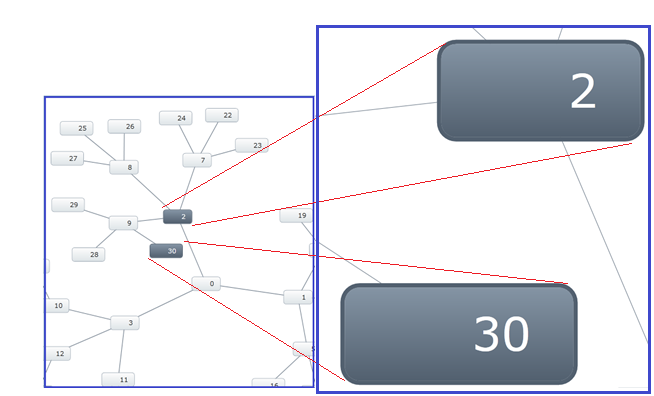

////
|metadata|
{
    "name": "xamnetworknode-zoom-in-on-selection",
    "controlName": ["xamNetworkNode"],
    "tags": ["How Do I","Navigation","Selection"],
    "guid": "a0d99004-fe51-452b-a4d2-ac681fe1a8d7",
    "buildFlags": [],
    "createdOn": "2016-05-25T18:21:57.5062494Z"
}
|metadata|
////

= Zoom in on Selection

This topic demonstrates how to zoom in on selected nodes of the link:{ApiPlatform}controls.maps.xamnetworknode{ApiVersion}~infragistics.controls.maps.xamnetworknode.html[xamNetworkNode™] control.

* <<Introduction,Introduction>>
* <<Requirements,Requirements>>
* <<Zooming in on Selection,Zooming in on Selection>>

** Code Examples: <<Zooming_in_on_Selected_Nodes,Zooming in on Selected Nodes>>

*** Code Example: <<Single_Node_Zooming,Single Node Zooming>>
*** Code Example: <<Multiple_Node_Zooming,Multiple Nodes Zooming>>
*** Code Example: <<Zooming_in_on_Searched_Node,Zooming in on Searched Node>>

**** <<Purpose,Purpose>>
**** <<Given_Scenarios,Given Scenarios>>

[[Introduction]]
== Introduction

The xamNetworkNode control now includes an enhanced feature which allows you to zoom in on a one or more selected nodes. The control also includes the ability to zoom in on user-searched nodes.

.Note:
[NOTE]
====
When zooming in on selected nodes, other nodes may also be in the view because the nodes are in Zoom-To-Fit state with the selected nodes, for example:
====

To illustrate, consider a series of nodes labeled with the numbers 1-100. While interacting with the control the user decides to zoom in on the nodes that start with 1. The search results will include the numbers 1, 11, 12, 13, 14, 15, 16, 17, 18, 19 and 100. Keep in mind that many nodes may have other nodes connected to them. If the connected nodes fit in the view of the layout, they are not hidden.

* Data Source
+
Any object that implements IEnumerable (e.g. List, Collection etc.).

[[Requirements]]
== Requirements

To begin, please read the link:xamnetworknode-getting-started-with-xamnetworknode.html[Getting Started with xamNetworkNode] topic as this tutorial uses the code from the ‘Getting Started’ topic as a starting point.

In addition, a few properties and methods must be set and implemented in order to achieve the desired functionality.

* Properties to set on xamNetworkNode:

** SelectionType

* Methods to call on xamNetworkNode:

** ZoomSelectedNodes
** ZoomNodes

[[Zooming-in-on-Selection]]
== Zooming in on Selection

This section explains the three different ways to zooming in on the nodes in xamNetworkNode control with code examples to demonstrate the use case scenarios and the screenshots of their final results.

[[Zooming_in_on_Selected_Nodes]]
== Code Examples: Zooming in on Selected Nodes

== Examples Overview

[options="header", cols="a,a"]
|====
|Example|Description

|Single Node Zooming
|With SelectionType property set to “Single”, allows to zoom one node into view.

|Multiple Nodes Zooming
|With SelectionType property set to “Multiple”, allows to zoom more than one nodes into view.

|Zooming in on Selected Nodes by searching
|You may locate selected nodes using various approaches and then instruct the xamNetworkNode to zoom in on the selection. The ZoomNodes method accepts a list of nodes (IEnumerable) as a Predicate object that passes the parameter from the search procedure back to the method.

|====

[[Single_Node_Zooming]]
== Code Example: Single Node Zooming

Single node zooming requires you to set the SelectionType property to ‘Single’ in XAML or in code behind, and then call the method (in code behind) to zoom the selected node.

. Set the SelectionType property.
+
*In XAML:*
+
[source,xaml]
----
<ig:XamNetworkNode SelectionType="Single"/>
----
+
*In C#:*
+
[source,csharp]
----
xnn.SelectionType = Infragistics.Controls.Maps.NetworkNodeSelectionType.Single;
----
+
*In Visual Basic:*
+
[source,vb]
----
xnn.SelectionType = Infragistics.Controls.Maps.NetworkNodeSelectionType.Single
----

. Call the ZoomSelectedNodes method on the xamNetworkNode control.
+
*In C#:*
+
[source,csharp]
----
xnn.ZoomSelectedNodes();
----
+
*In Visual Basic:*
+
[source,vb]
----
xnn.ZoomSelectedNodes()
----
+
The following screenshot depicts the zooming in on a single node into view by clicking on a node.
+

[[Multiple_Node_Zooming]]
== Code Example: Multiple Nodes Zooming

Multiple nodes zooming requires to set the SelectionStyle property to ‘Multiple’ in XAML or in code behind, and then call the method (in code behind) to zoom the selected nodes.

Keep in mind that other nodes may also be in view because the selected nodes are in a Zoom-To-Fit state with the selected nodes. “Zoom-To-Fit” refers to a state where if the selected nodes have other connected nodes (which may fit in the viewable area of the NetworkNode layout) they may also be visible.

*In XAML:*
[source,xaml]
----
<ig:XamNetworkNode SelectionType="Multiple"/>
----

*In C#:*
[source,csharp]
----
xnn.SelectionType = Infragistics.Controls.Maps.NetworkNodeSelectionType.Multiple;
----

*In Visual Basic:*
[source,vb]
----
xnn.SelectionType = Infragistics.Controls.Maps.NetworkNodeSelectionType.Multiple
----

Call the ZoomSelectedNodes method on the xamNetworkNode control.

*In C#:*
[source,csharp]
----
xnn.ZoomSelectedNodes();
----

*In Visual Basic:*
[source,vb]
----
xnn.ZoomSelectedNodes()
----

The following screenshot depicts the zooming in on multiple nodes into view by clicking on multiple nodes with [Ctrl] key combination on the keyboard.

The next screenshot displays multiple nodes zooming with other nodes in view. Notice that the selected nodes for zooming are 9 and 3; however; the selected nodes have other connected nodes (2, 28 and 30), which fit in the view of the xamNetworkNode control layout, and therefore they are visible even when they are not selected for zooming.

[[Zooming_in_on_Searched_Node]]
== Code Example: Zooming in on Searched Node

[[Purpose]]
=== Purpose

The purpose of zooming in on searched nodes is to retrieve a specific node that may not be visible in view, or to bring a group of nodes into view. Zooming in on searched nodes requires you to gather a collection of only the desired nodes you want to show in the view port. Once you have the filtered collection of nodes, then you can tell the xamNetworkNode control to zoom to those nodes.

The xamNetworkNode control’s Search method allows you to pass in search criteria in order to narrow down to only the nodes you want to see in the view. You build the search criteria by that passing in a Predicate object into the Search method.

Once you have the list of nodes you want to zoom to, then you call the ZoomNodes method, which accepts one argument of type IEnumerable.

The following code listing demonstrates how to add nodes that match the search criteria into the SelectedNodes collection.

. *Step1*
+
*In C#:*
+
[source,csharp]
----
foreach (var node in xnn.Search((NodeModel item) => item.Label.StartsWith("1")))
{
     xnn.SelectedNodes.Add(node);
}
----
+
*In Visual Basic:*
+
[source,vb]
----
For Each node As var In xnn.Search(Function(item As NodeModel) item.Label.StartsWith("1"))
    xnn.SelectedNodes.Add(node)
Next
----
+
Once the appropriate nodes are selected then call the ZoomNodes method and pass in the collection of selected nodes.

. *Step2*
+
*In C#:*
+
[source,csahrp]
----
xnn.ZoomNodes(xnn.SelectedNodes);
----
+
*In Visual Basic:*
+
[source,vb]
----
xnn.ZoomNodes(xnn.SelectedNodes)
----
+
Alternatively, the examples in the given scenarios bellow demonstrate how to call the Search method directly in the ZoomNodes method as a passing argument.

[[Given_Scenarios]]
=== Given Scenarios

[start=1]
. Using *StartWith* method
+
The following code example calls the Search method of the xamNetworkNode control, and passes the search result directly using lambda expression. The search criterion does not restrict other nodes to be in view.
+
Example:
+
If the entered characters are “12”, the node “1234” and “1200” will at least be zoomed in to view, but the nodes “2312” or “3124” may or may not be in view.
+
*In C#:*
+
[source,csharp]
----
this.xnn.ZoomNodes(xnn.Search((NodeModel n) => n.Label.StartsWith("12")));
----
+
*In Visual Basic:*
+
[source,vb]
----
Me.xnn.ZoomNodes(xnn.Search(Function(n As NodeModel) n.Label.StartsWith(“12”)))
----

[start=2]
. Using *EndWith* method.
+
Example:
+
If the entered character is “4”, the node “1234” and “1004” will at least be zoomed in to view, but the nodes “4000” or “1040” may or may not be in view.
+
*In C#:*
+
[source,csharp]
----
this.xnn.ZoomNodes(xnn.Search((NodeModel n) => n.Label.EndsWith("4")));
----
+
*In Visual Basic:*
+
[source,vb]
----
Me.xnn.ZoomNodes(xnn.Search(Function(n As NodeModel) n.Label.EndsWith(“4”)))
----

[start=3]
. Using *Contains* method.
+
Example:
+
If the entered character is “2”, any node that contains “2” in any position will be zoomed in to view, for example “2341”, “1234”, or “1002”.
+
*In C#:*
+
[source,csharp]
----
this.xnn.ZoomNodes(xnn.Search((NodeModel n) => n.Label.Contains("2")));
----
+
*In Visual Basic:*
+
[source,vb]
----
Me.xnn.ZoomNodes(xnn.Search(Function(n As NodeModel) n.Label.Contains(“2“)))
----

== Related Topics

* link:xamnetworknode-getting-started-with-xamnetworknode.html[Getting Started with xamNetworkNode]
* link:xamnetworknode-using-xamnetworknode.html[Using xamNetworkNode]