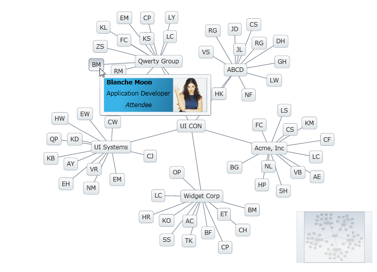

////

|metadata|
{
    "name": "xamnetworknode",
    "controlName": ["xamNetworkNode"],
    "tags": [],
    "guid": "ef2c17c6-62d9-404e-b235-ca924f621d10",  
    "buildFlags": [],
    "createdOn": "2016-05-25T18:21:57.5302512Z"
}
|metadata|
////

= xamNetworkNode

The Network Node control is a ready-to-use, data-bound control for rendering undirected graphs. An example graph, as rendered by the link:{ApiPlatform}controls.maps.xamnetworknode.v{ProductVersion}~infragistics.controls.maps.xamnetworknode.html[xamNetworkNode]™ control, is given in Figure 1.

Figure 1: A graph rendered by the Network Node control

== Terms Used

In this documentation, the vertices comprising the graph are called “nodes” and the branches between them are called “connections”.

== Features

The Network Node control supports the following functionalities:

* themes
* tooltips
* node templates
* conditional formatting
* events
* multiple selection
* repositioning of elements

== Getting Started

To get started with the Network Node control, see link:xamnetworknode-getting-started-with-xamnetworknode.html[Getting Started with xamNetworkNode].

== Related Topics

* link:xamnetworknode-conditional-formatting.html[Conditional Formatting]
* link:xamnetworknode-node-relocation.html[Node Relocation]
* link:xamnetworknode-selection.html[Selection]
* link:xamnetworknode-templates.html[Templates]
* link:xamnetworknode-tooltips.html[Tooltips]