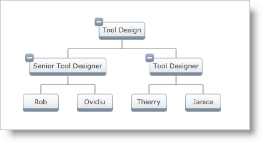

////

|metadata|
{
    "name": "xamorgchart-adding-xamorgchart-to-your-application",
    "controlName": ["xamOrgChart"],
    "tags": ["Getting Started"],
    "guid": "e49e46bc-f65f-44e3-a93f-f5d27745866f",  
    "buildFlags": [],
    "createdOn": "2016-05-25T18:21:57.6392953Z"
}
|metadata|
////

= Adding xamOrgChart to Your Application

This topic explains the requirements for adding link:{ApiPlatform}controls.maps.xamorgchart{ApiVersion}~infragistics.controls.maps.xamorgchart.html[xamOrgChart]™ control and provides an overview of the adding procedure. At the end, links to detailed instructions are provided (covering both XAML and procedural C#/ VB code).

== Preview

Following is a preview of the end result generated by the sample code (provided in the topics listed in the Detailed Instructions section below):

Figure 1: Example implementation of the xamOrgChart control

== Requirements

To add the control, you need:

* A Microsoft® {PlatformName}™ application.
* The following references added to your project (in the Solution Explorer):

.. {ApiPlatform}{DllVersion}dll

ifdef::wpf[]
.. {ApiPlatform}DataManager.{DllVersion}dll

endif::wpf[]

.. {ApiPlatform}DataVisualization.{DllVersion}dll
.. {ApiPlatform}Controls.Maps.XamOrgChart.{DllVersion}dll

* An object data model

The topics providing the Detailed Instructions (see below) use a simple sample data object model, but you can create your own and use it instead. (The sample data model can be downloaded here – link:resources-departmentviewmodel.html[Department View Model].)

== Overview

Conceptual overview of the procedure for Adding xamOrgChart to Your Application:

[start=1]
. Adding the xamOrgChart control to your application and binding it to the data model.
[start=2]
. Adding Node Layouts to the Org Chart.

== Detailed Instructions

For detailed instructions about adding xamOrgChart, together with full code samples, see the following topics:

* link:xamorgchart-adding-xamorgchart-using-xaml-code.html[Adding xamOrgChart Using XAML Code]
* link:xamorgchart-adding-xamorgchart-using-procedural-code.html[Adding xamOrgChart Using Procedural Code] (C#, VB)

== *Related Topics*

link:xamorgchart-understanding-xamorgchart.html[Understanding xamOrgChart]

link:xamorgchart-using-xamorgchart.html[Using xamOrgChart]

link:xamorgchart-api-overview.html[API Overview]