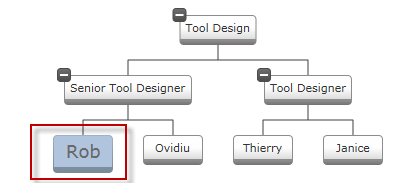

////

|metadata|
{
    "name": "xamorgchart-applying-conditional-formatting",
    "controlName": ["xamOrgChart"],
    "tags": ["Formatting"],
    "guid": "30c44027-7437-4f09-9d39-fac17064eeb2",  
    "buildFlags": [],
    "createdOn": "2016-05-25T18:21:57.7812655Z"
}
|metadata|
////

= Applying Conditional Formatting

== Topic Overview

=== Purpose

Provides detailed instructions, complete with code examples, on how to apply conditional formatting to  _xamOrgChart_  _™_  nodes

=== Required background

Prerequisite topics required to understand this material.

[options="header", cols="a,a"]
|====
| *Topic* | *Purpose* 

| link:xamorgchart-understanding-xamorgchart.html[Understanding xamOrgChart]
|An introduction to the elements and features of the _xamOrgChart_ control.

| link:xamorgchart-adding-xamorgchart-to-your-application.html[Adding xamOrgChart to Your Application]
|Introduces the requirements and procedure for adding the _xamOrgChart_ control. Additionally, contains links to detailed XAML and procedural C#/ VB code instructions.

| link:xamorgchart-styling.html[Styling]
|Introduces the _xamOrgChart_ control’s element styling feature and demonstrates how to configure node styles.

|====

=== In this topic

This topic contains the following sections:

* <<_Ref321318623,Applying Conditional Formatting – Conceptual Overview>>

** <<_Ref321318632,Introduction>>
** <<_Ref321318639,Requirements>>
** <<_Ref321318646,Overview>>

* <<_Ref321318653,Applying Conditional Formatting – Code Example>>

* <<_Ref321318659,Introduction>>
* <<_Ref321318666,Preview>>
* <<OLE_LINK41,Prerequisites>>
* <<_Ref321318680,Overview>>
* <<_Ref321318687,Steps>>

[[_Ref321318623]]
== Applying Conditional Formatting – Conceptual Overview

[[_Ref321318632]]

=== Introduction

Conditional formatting is a method of customizing the appearance of individual or groups of nodes within a node layout. The appearance of the node may include the style, color, font family and size, the foreground or background of the node.

For example, say you have defined conditional formatting in your application based on a data value. If the data value meets the specified condition, say “Account Balance” below zero display the node’s text in  _Red Italics_ . Whenever Account Balance falls below zero  _xamOrgChart_  renders the node in accordance with the conditional formatting, in this case  _Red Italics_ .

Since conditional formatting is an optional feature, if no conditions are specified then the applied format and style is applied to all nodes of the control. When working with conditional formatting, it is important to note that while the style can be created in XAML and referenced as a resource the underlying conditional logic can only be implemented in code using C# or Visual Basic. This is because the nodes in the link:{ApiPlatform}controls.maps.xamorgchart.v{ProductVersion}~infragistics.controls.maps.xamorgchart.html[xamOrgChart] control are represented by link:{ApiPlatform}controls.maps.xamorgchart.v{ProductVersion}~infragistics.controls.maps.orgchartnode_members.html[OrgChartNode] objects, which can be referenced in code (C# or Visual Basic), but not in XAML. Consequently, conditional formatting can only be achieved in code.

[[_Ref321318639]]

=== Requirements

Because the  _xamOrgChart_  control does not expose the node objects in XAML, all conditional formatting must be implemented in either C# or Visual Basic code.

[[_Ref321318646]]

=== Overview

Following is a conceptual overview of the process: 

*1. Defining a style for the conditional formatting* 

*2. Verifying the condition and applying the formatting by handling the `NodeControlAttachedEvent`*

[[_Ref321318653]]
== Applying Conditional Formatting – Code Example

[[_Ref321318659]]

=== Introduction

The following example illustrates how conditional formatting can be applied to a particular employee in an employee database; causing him or her to stand out in the  _xamOrgChart_   layout.

This example employed XAML to create the underlying style with a specific formatting of foreground, background, and font size properties. The conditional logic, in this case, was set up to identify an individual employee (by first name) out of an employee database and apply the style that was defined in XAML. This can only be implemented in code using either C# or Visual Basic.

[[_Ref321318666]]

=== Preview

Here, we can see how the conditional formatting is applied to a sub node in the tree, in this case Rob.

=== Prerequisites

To complete this procedure, you will need the following:

* A WPF or Silverlight project with a  _Window_   (WPF) or  _UserControl_   (Silverlight) added to it
* A xamOrgChart control added to the page. See link:xamorgchart-adding-xamorgchart-to-your-application.html[Adding xamOrgChart to Your Application] for information on adding and binding a control to data.

[[_Ref321318680]]

=== Overview

This topic takes you step-by-step through the process of conditional formatting. The following is a conceptual overview of the process: 

*1. Defining a style for the conditional formatting* 

*2. Verifying the condition and applying the formatting by handling the `NodeControlAttachedEvent`*

[[_Ref321318687]]

=== Steps

To see how easy it is to apply conditional formatting to your application, follow these steps in order.

=== 1. Defining a style for the conditional formatting.

a. Define the style for condition formatting In XAML as follows:

*In XAML:*

[source,xaml]
----

----

=== 2. Verifying the condition and applying the formatting by handling the NodeControlAttachedEvent.

a. In code behind, add the following code for conditional formatting.

The code performs the following steps:

[start=1]
. It retrieves and validates the data.
[start=2]
. It verifies that the object type is the correct type.
[start=3]
. It applies the XAML formatted style created earlier.

*In C#:*

[source,csharp]
----
private void XamOrgChart_NodeControlAttachedEvent(object sender, Infragistics.Controls. Maps.OrgChartNodeEventArgs e)
        {
            var nodeModel = e.Node.DataContext;
            if (nodeModel == null)
                return;
            if (nodeModel.GetType() == typeof(Employee))
            {
                Employee emp = nodeModel as Employee;
                if (emp == null)
                    return;
                if ((string)emp.FirstName == "Rob")
                {
                    e.Node.Style = this.Resources["EmployeeNodeStyle"] as Style;
                }
            }
        }
----

*In Visual Basic:*

[source,vb]
----
Private Sub XamOrgChart_NodeControlAttachedEvent(sender As Object, e As Infragistics.Controls.Maps.OrgChartNodeEventArgs)
      Dim nodeModel = e.Node.DataContext
      If nodeModel Is Nothing Then
            Return
      End If
      If nodeModel.[GetType]() = GetType(Employee) Then
            Dim emp As Employee = TryCast(nodeModel, Employee)
            If emp Is Nothing Then
                  Return
            End If
            If DirectCast(emp.FirstName, String) = "Rob" Then
                  e.Node.Style = TryCast(Me.Resources("EmployeeNodeStyle"), Style)
            End If
      End If
End Sub
----