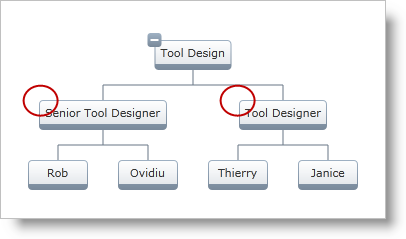

////

|metadata|
{
    "name": "xamorgchart-expansion-indicators-visibility",
    "controlName": ["xamOrgChart"],
    "tags": ["How Do I","Templating"],
    "guid": "37aa49e0-30bc-4122-9871-e4d4ddb1b5e7",  
    "buildFlags": [],
    "createdOn": "2016-05-25T18:21:57.6892697Z"
}
|metadata|
////

= Configuring the Visibility of Expansion Indicators

This topic demonstrates how to configure the visibility of the Expansion Indicators for a Node, Node Layout, and the xamOrgChart control.

The topic is organized as follows:

* <<priorities,Priorities in Configuring the Expansion Indicator>>
* <<node,Configuring the Visibility of the Expansion Indicator for a Node>>
* <<node_layout,Configuring the Visibility of the Expansion Indicator for a Node Layout>>
* <<orgchart,Configuring the Visibility of the Expansion Indicator for the xamOrgChart>>

[[priorities]]
== Priorities in Configuring the Expansion Indicator

The visibility of the Expansion Indicator can be configured on the following objects (ordered by priority from highest to lowest):

[start=1]
. link:{ApiPlatform}controls.maps.xamorgchart.v{ProductVersion}~infragistics.controls.maps.orgchartnode.html[Node] – each node can have its Expansion Indicator visibility set separately
[start=2]
. link:{ApiPlatform}controls.maps.xamorgchart.v{ProductVersion}~infragistics.controls.maps.orgchartnodelayout.html[Node Layout] –the nodes recognized by the Node Layout
[start=3]
. link:{ApiPlatform}controls.maps.xamorgchart.v{ProductVersion}~infragistics.controls.maps.xamorgchart.html[XamOrgChart] – affects all nodes

Figure 1: The circled nodes are with hidden Expansion Indicators

.Note:
[NOTE]
====
The illustration and the code samples use the Org Chart created in link:xamorgchart-adding-xamorgchart-to-your-application.html[Adding xamOrgChart to Your Application].
====

[[node]]
== Configuring the Visibility of the Expansion Indicator for a Node

The following sample demonstrates how to set the Expansion Indicator visibility on a specific OrgChartNode object, e.g. a clicked node.

*In XAML:*

[source,xaml]
----
<ig:XamOrgChart
    NodeMouseLeftButtonDown="XamOrgChart_NodeMouseLeftButtonDown">
</ig:XamOrgChart>
----

*In Visual Basic:*

----
Private Sub XamOrgChart_NodeMouseLeftButtonDown(sender As Object, e As OrgChartNodeClickEventArgs)
    e.Node.Node.ExpansionIndicatorVisibility = Visibility.Collapsed
End Sub
----

*In C#:*

----
private void XamOrgChart_NodeMouseLeftButtonDown(object sender, OrgChartNodeClickEventArgs e)
{
    e.Node.Node.ExpansionIndicatorVisibility = Visibility.Collapsed;
}
----

[[node_layout]]
== Configuring the Visibility of the Expansion Indicator for a Node Layout

Each Node Layout will apply the Expansion Indicator visibility to the nodes it recognizes.

*In XAML:*

[source,xaml]
----
<ig:OrgChartNodeLayout
    TargetTypeName="EmployeePosition"
    DisplayMemberPath="JobTitle"
    Key="Employees"
    ExpansionIndicatorVisibility="Collapsed" />
----

[[orgchart]]
== Configuring the Visibility of the Expansion Indicator for the xamOrgChart

*In XAML:*

[source,xaml]
----
<ig:XamOrgChart
    ExpansionIndicatorVisibility="Collapsed" />
</ig:XamOrgChart>
----

== *Related Topics*

link:xamorgchart-using-xamorgchart.html[Using xamOrgChart]