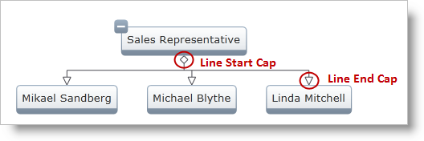
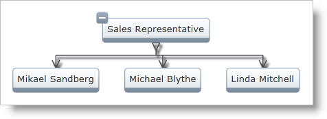

////

|metadata|
{
    "name": "xamorgchart-line-connector-settings",
    "controlName": ["xamOrgChart"],
    "tags": ["How Do I","Styling"],
    "guid": "6f713223-f643-46be-b7d5-d26ea9931db9",  
    "buildFlags": [],
    "createdOn": "2016-05-25T18:21:57.7192706Z"
}
|metadata|
////

= Line Connector Settings

The xamOrgChart™ control enables customization of the line connector (that is, the line connecting the nodes). The following properties can be can be configured:

* link:{ApiPlatform}controls.maps.xamorgchart.v{ProductVersion}~infragistics.controls.maps.xamorgchart~line.html[Line]
* link:{ApiPlatform}controls.maps.xamorgchart.v{ProductVersion}~infragistics.controls.maps.xamorgchart~lineeffect.html[LineEffect]
* link:{ApiPlatform}controls.maps.xamorgchart.v{ProductVersion}~infragistics.controls.maps.xamorgchart~linestartcap.html[LineStartCap]
* link:{ApiPlatform}controls.maps.xamorgchart.v{ProductVersion}~infragistics.controls.maps.xamorgchart~lineendcap.html[LineEndCap]
* link:{ApiPlatform}controls.maps.xamorgchart.v{ProductVersion}~infragistics.controls.maps.xamorgchart~linethickness.html[LineThickness]
* link:{ApiPlatform}controls.maps.xamorgchart.v{ProductVersion}~infragistics.controls.maps.xamorgchart~linecapsize.html[LineCapSize]

Figure 1: Line Caps

== Setting the Properties

Figure 2: Customized Line Connectors

Following is the code used to customize the Line Connectors in Figure 2.

*In XAML:*

[source,xaml]
----
<ig:XamOrgChart
        LineStartCap="SolidArrow"
        LineEndCap="Arrow"
        LineThickness="1.5"
        LineCapSize="9">
    <ig:XamOrgChart.Line>
        <LinearGradientBrush EndPoint="0.5,1" StartPoint="0.5,0">
            <GradientStop Color="#FF252525" Offset="0.8" />
            <GradientStop Color="#FF464646" Offset="1"/>
        </LinearGradientBrush>
    </ig:XamOrgChart.Line>
    <ig:XamOrgChart.LineEffect>
        <DropShadowEffect />
    </ig:XamOrgChart.LineEffect>
</ig:XamOrgChart>
----

*In Visual Basic:*

----
Dim stop1 As New GradientStop()
stop1.Color = ColorConverter.FromString("#FF252525")
stop1.Offset = 0.8
Dim stop2 As New GradientStop()
stop2.Color = ColorConverter.FromString("#FF464646")
stop2.Offset = 1
Dim brush As New LinearGradientBrush()
brush.StartPoint = New Point(0.5, 0)
brush.EndPoint = New Point(0.5, 1)
brush.GradientStops.Add(stop1)
brush.GradientStops.Add(stop2)
Dim orgChart As New XamOrgChart()
orgChart.LineStartCap = LineCap.SolidArrow
orgChart.LineEndCap = LineCap.Arrow
orgChart.LineThickness = 1.5
orgChart.LineCapSize = 9
orgChart.Line = brush
orgChart.LineEffect = New DropShadowEffect()
----

*In C#:*

----
GradientStop stop1 = new GradientStop();
stop1.Color = ColorConverter.FromString("#FF252525");
stop1.Offset = 0.8;
GradientStop stop2 = new GradientStop();
stop2.Color = ColorConverter.FromString("#FF464646");
stop2.Offset = 1;
LinearGradientBrush brush = new LinearGradientBrush();
brush.StartPoint = new Point(0.5, 0);
brush.EndPoint = new Point(0.5, 1);
brush.GradientStops.Add(stop1);
brush.GradientStops.Add(stop2);
XamOrgChart orgChart = new XamOrgChart();
orgChart.LineStartCap = LineCap.SolidArrow;
orgChart.LineEndCap = LineCap.Arrow;
orgChart.LineThickness = 1.5;
orgChart.LineCapSize = 9;
orgChart.Line = brush;
orgChart.LineEffect = new DropShadowEffect();
----

== *Related Topics*

link:xamorgchart-using-xamorgchart.html[Using xamOrgChart]