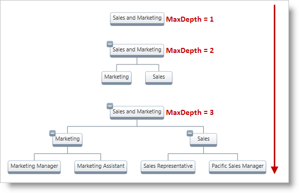

////

|metadata|
{
    "name": "xamorgchart-maximum-node-depth",
    "controlName": ["xamOrgChart"],
    "tags": ["How Do I"],
    "guid": "b1726951-13d2-4969-a2b6-de6101b84fac",  
    "buildFlags": [],
    "createdOn": "2016-05-25T18:21:57.7262709Z"
}
|metadata|
////

= Maximum Node Depth

You can manage the maximum number of levels displayed in the xamOrgChart™ through its link:{ApiPlatform}controls.maps.xamorgchart{ApiVersion}~infragistics.controls.maps.xamorgchart~maxdepth.html[MaxDepth] property; the number of actually displayed levels is stored in the link:{ApiPlatform}controls.maps.xamorgchart{ApiVersion}~infragistics.controls.maps.xamorgchart~actualdepth.html[ActualDepth] property (This property is read-only.). Figure 1 illustrates the effect of the different values of the MaxDepth property.

Figure 1: Different depth levels displayed by the xamOrgChart control based on different settings of its MaxDepth property

This code below uses the Org Chart implementation created in the link:xamorgchart-adding-xamorgchart-to-your-application.html[Adding xamOrgChart to Your Application] topic.

*In XAML:*

----
<ig:XamOrgChart MaxDepth="4">
</ig:XamOrgChart>
----

*In Visual Basic:*

----
Dim orgChart As New XamOrgChart()
orgChart.MaxDepth = 4
Dim acturalDepth As Integer = orgChart.ActualDepth
----

*In C#:*

----
XamOrgChart orgChart = new XamOrgChart();
orgChart.MaxDepth = 4;
int acturalDepth = orgChart.ActualDepth;
----

== *Related Topics*

link:xamorgchart-using-xamorgchart.html[Using xamOrgChart]