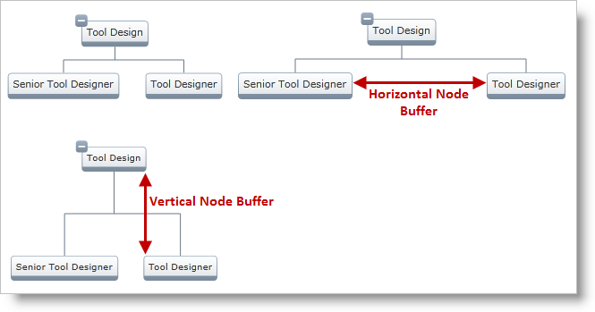

////
|metadata|
{
    "name": "xamorgchart-node-arrangement-settings",
    "controlName": ["xamOrgChart"],
    "tags": ["How Do I"],
    "guid": "8f7e0fc5-11a2-4ad5-ad17-87c5243873b1",
    "buildFlags": [],
    "createdOn": "2016-05-25T18:21:57.7752648Z"
}
|metadata|
////

= Node Arrangement Settings

The xamOrgChart™ control has settings, which affect the arrangement of its nodes. They are:

* link:{ApiPlatform}controls.maps.xamorgchart.v{ProductVersion}~infragistics.controls.maps.xamorgchart~nodearrangementstrategy.html[Node Arrangement Strategy]
* link:{ApiPlatform}controls.maps.xamorgchart.v{ProductVersion}~infragistics.controls.maps.xamorgchart~nodeflowdirection.html[Node Flow Direction]
* link:{ApiPlatform}controls.maps.xamorgchart.v{ProductVersion}~infragistics.controls.maps.xamorgchart~horizontalnodebuffer.html[Horizontal] and link:{ApiPlatform}controls.maps.xamorgchart.v{ProductVersion}~infragistics.controls.maps.xamorgchart~verticalnodebuffer.html[Vertical] Node Buffers

== Node Arrangement Strategy

The Node Arrangement Strategy determines the way that the xamOrgChart nodes are going to be arranged.

* link:{ApiPlatform}controls.maps.xamorgchart.v{ProductVersion}~infragistics.controls.maps.nodearrangementstrategy.html[Stagger] – produces the most compact arrangement of the nodes. It is suitable for large sets of data.
+

* link:{ApiPlatform}controls.maps.xamorgchart.v{ProductVersion}~infragistics.controls.maps.nodearrangementstrategy.html[Orthogonal] – produces a well-arranged org chart. It is suitable for small sets of data.
+

== Node Flow Direction

The node flow direction determines the position of the child nodes relative to their parent. The directions can be:

* link:{ApiPlatform}controls.maps.xamorgchart.v{ProductVersion}~infragistics.controls.maps.nodeflowdirection.html[Above] (child above the parent, bottom-to-top flow direction)
+

* link:{ApiPlatform}controls.maps.xamorgchart.v{ProductVersion}~infragistics.controls.maps.nodeflowdirection.html[Bellow] (child underneath the parent, top-to-bottom flow direction)
+

* link:{ApiPlatform}controls.maps.xamorgchart.v{ProductVersion}~infragistics.controls.maps.nodeflowdirection.html[Left] (child on the left of the parent, right-to-left flow direction)
+

* link:{ApiPlatform}controls.maps.xamorgchart.v{ProductVersion}~infragistics.controls.maps.nodeflowdirection.html[Right] (child on the right of the parent, left-to-right flow direction)
+

== Horizontal and Vertical Node Buffers

The Horizontal and Vertical Node Buffers control the minimum spacing between the nodes. The following screenshot shows a schematic representation of horizontal and vertical node buffers:

.Note:
[NOTE]
====
Horizontal and Vertical Node Buffers can be also set on an link:{ApiPlatform}controls.maps.xamorgchart.v{ProductVersion}~infragistics.controls.maps.orgchartnodelayout.html[OrgChartNodeLayout] object – this will override the global node buffers.
====

*In XAML:*
[source,xaml]
----
<ig:OrgChartNodeLayout
    HorizontalNodeBuffer="50"
    VerticalNodeBuffer="50">                
</ig:OrgChartNodeLayout>
----

== Code Examples

*In XAML:*
[source,xaml]
----
<ig:XamOrgChart
    NodeArrangementStrategy="Orthogonal" 
    NodeFlowDirection="Above"
    HorizontalNodeBuffer="50"
    VerticalNodeBuffer="50">
</ig:XamOrgChart>
----

*In Visual Basic:*
[source,vb]
----
Dim orgChart As  XamOrgChart = New XamOrgChart()
orgChart.NodeArrangementStrategy = NodeArrangementStrategy.Orthogonal
orgChart.NodeFlowDirection = NodeFlowDirection.Above
orgChart.HorizontalNodeBuffer = 50
orgChart.VerticalNodeBuffer = 50
----

*In C#:*
[source,csharp]
----
XamOrgChart orgChart = new XamOrgChart();
orgChart.NodeArrangementStrategy = NodeArrangementStrategy.Orthogonal;
orgChart.NodeFlowDirection = NodeFlowDirection.Above;
orgChart.HorizontalNodeBuffer = 50;
orgChart.VerticalNodeBuffer = 50;
----

== Related Topics

link:xamorgchart-using-xamorgchart.html[Using xamOrgChart]