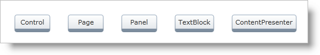
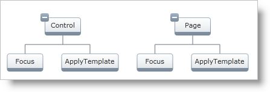
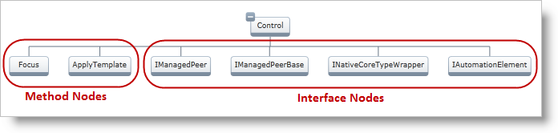
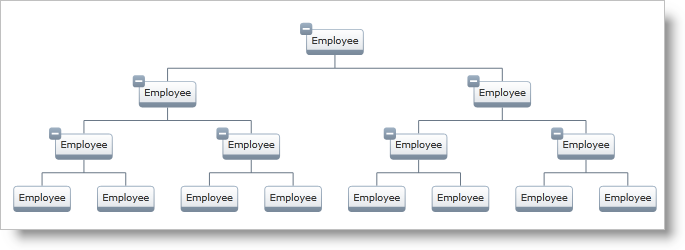
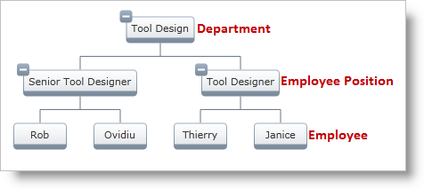

////

|metadata|
{
    "name": "xamorgchart-node-layouts-and-data",
    "controlName": ["xamOrgChart"],
    "tags": ["Data Binding","How Do I"],
    "guid": "201fc5a7-6d47-4b66-8110-604d8e360db7",  
    "buildFlags": [],
    "createdOn": "2016-05-25T18:21:57.7382719Z"
}
|metadata|
////

= Node Layouts and Binding to Data

This topic demonstrates how to bind the Org Chart to data.

The topic is organized as follows:

* <<introduction,Introduction>>
* <<using_layouts,Using Node Layouts>>

** <<hierarchical,Hierarchical Node Layouts>>
** <<global,Global Node Layouts>>
** <<manually,Manually Selecting Node Layouts>>

[[introduction]]
== Introduction

When passing data to a xamOrgChart™ control, the control needs to know how to bind to it. This is done with link:{ApiPlatform}controls.maps.xamorgchart{ApiVersion}~infragistics.controls.maps.orgchartnodelayout.html[Node Layouts]. Following are the properties used to bind to data:

* link:{ApiPlatform}controls.maps.xamorgchart{ApiVersion}~infragistics.controls.maps.orgchartnodelayout~displaymemberpath.html[DisplayMemberPath] – the path to the value serving as a visual representation of the source object
* link:{ApiPlatform}controls.maps.xamorgchart{ApiVersion}~infragistics.controls.maps.orgchartnodelayout~key.html[Key] – a property exposing an enumerable object
* link:{ApiPlatform}controls.maps.xamorgchart{ApiVersion}~infragistics.controls.maps.orgchartnodelayout~targettypename.html[TargetTypeName] – the type of the object that the Node Layout tries to match
* link:{ApiPlatform}controls.maps.xamorgchart{ApiVersion}~infragistics.controls.maps.orgchartnodelayout.html[NodeLayouts] – a collection of child OrgChartNodeLayout items

.Note:
[NOTE]
====
If an Org Chart control has defined Hierarchical and Global Node Layouts, the Global Node Layouts will be ignored.
====

.Note
[NOTE]
====
Hierarchical Node Layouts depend on the Key property and Global Node Layouts depend on the TargetTypeName property to build the organization.
====

.Note:
[NOTE]
====
If an object from the data source contains a reference to itself in its hierarchical branch, an exception will be thrown as such data is not supported.
====

[[using_layouts]]
== Using Node Layouts

[[hierarchical]]
== Hierarchical Node Layouts

When working with Hierarchical Node Layouts, the xamOrgChart control is the root Node Layout. Assuming that the data source is a list of objects, the following code snippet shown below will display a flat, non-expandable list. (Figure 1)

Figure 1: Displaying a flat, non-expandable list

*In XAML:*

[source,xaml]
----
<ig:XamOrgChart DisplayMemberPath="ClassName">
</ig:XamOrgChart>
----

In order to achieve a hierarchical organization (Figure 2), nested Node Layouts can be defined in the link:{ApiPlatform}controls.maps.xamorgchart{ApiVersion}~infragistics.controls.maps.xamorgchart~nodelayouts.html[Node Layouts] collection. In this case, the value of the Key property refers to a collection on the parent node. The TargetTypeName property is not used.

Figure 2: Displaying a hierarchy using Hierarchical Node Layouts

*In XAML:*

[source,xaml]
----
<ig:XamOrgChart DisplayMemberPath="ClassName">
    <ig:XamOrgChart.NodeLayouts>
        <ig:OrgChartNodeLayout
                Key="Methods"
                DisplayMemberPath="MethodName" />
    </ig:XamOrgChart.NodeLayouts>
</ig:XamOrgChart>
----

Figure 3 shows an example of multiple Hierarchical Node Layouts.

Figure 3: Displaying a hierarchy using several Hierarchical Node Layouts

*In XAML:*

[source,xaml]
----
<ig:XamOrgChart DisplayMemberPath="ClassName">
    <ig:XamOrgChart.NodeLayouts>
        <ig:OrgChartNodeLayout
                Key="Methods"
                DisplayMemberPath="MethodName">
            <ig:OrgChartNodeLayout.NodeLayouts>
                <!--Define child Node Layouts here-->
            </ig:OrgChartNodeLayout.NodeLayouts>
        </ig:OrgChartNodeLayout>
        <ig:OrgChartNodeLayout
                Key="Interfaces"
                DisplayMemberPath="InterfaceName">
            <ig:OrgChartNodeLayout.NodeLayouts>
                <!--Define child Node Layouts here-->
            </ig:OrgChartNodeLayout.NodeLayouts>
        </ig:OrgChartNodeLayout>
    </ig:XamOrgChart.NodeLayouts>
</ig:XamOrgChart>
----

[[global]]
== Global Node Layouts

Assuming that the data source is a hierarchical set of nested employees, a single Node Layout added to the link:{ApiPlatform}controls.maps.xamorgchart{ApiVersion}~infragistics.controls.maps.xamorgchart~globalnodelayouts.html[Global Node Layouts] collection will recursively match all nested items. (Figure 4)

Figure 4: Displaying a hierarchy using Global Node Layouts

*In XAML:*

[source,xaml]
----
<ig:XamOrgChart>
    <ig:XamOrgChart.GlobalNodeLayouts>
        <ig:OrgChartNodeLayout
                TargetTypeName="Employee"
                DisplayMemberPath="Name"
                Key="Subordinates" />
    </ig:XamOrgChart.GlobalNodeLayouts>
</ig:XamOrgChart>
----

.Note:
[NOTE]
====
The display of this data source can be also achieved by using several nested Hierarchical Node Layouts – then the number of Node Layouts has to be equal to the depth of the levels of the hierarchy.
====

.Note:
[NOTE]
====
The xamOrgChart control will ignore nested Node Layouts in the Global Node Layouts collection.
====

When working with Global Node Layouts, the TargetTypeName property is used to match the items from the data source according to their type. The Key property is not used.

.Note:
[NOTE]
====
If there are several Node Layouts with the same TargetTypeName, only the first one is used.
====

Figure 5 shows an example of multiple Global Node Layouts.

Figure 5: Displaying a hierarchy using several Global Node Layouts

*In XAML:*

[source,xaml]
----
<ig:XamOrgChart>
    <ig:XamOrgChart.GlobalNodeLayouts>
        <ig:OrgChartNodeLayout 
            TargetTypeName="Department"
            DisplayMemberPath="DepartmentName"
            Key="EmployeePositions" />
        <ig:OrgChartNodeLayout 
            TargetTypeName="EmployeePosition"
            DisplayMemberPath="PositionName"
            Key="Employees" />
        <ig:OrgChartNodeLayout 
            TargetTypeName="Employee"
            DisplayMemberPath="FullName" />
    </ig:XamOrgChart.GlobalNodeLayouts>
</ig:XamOrgChart>
----

[[manually]]
== Manually Selecting Node Layouts

Whenever an item from the data source is matched with a Node Layout object, the link:{ApiPlatform}controls.maps.xamorgchart{ApiVersion}~infragistics.controls.maps.xamorgchart~nodelayoutassigned_ev.html[NodeLayoutAssigned] event is raised. This allows for an evaluation of the type of the item and assigning a different Node Layout object.

*In XAML:*

[source,xaml]
----
<ig:XamOrgChart NodeLayoutAssigned="OrgChart_NodeLayoutAssigned">
</ig:XamOrgChart>
----

*In C#:*

----
private void OrgChart_NodeLayoutAssigned(object sender, NodeLayoutAssignedEventArgs e)
{
    if (e.DataType.Name == "Employee")
    {
        //Assign a different node layout.
        e.NodeLayout = differentNodeLayout;
    }
}
----

*In Visual Basic:*

[source,vb]
----
Private Sub OrgChart_NodeLayoutAssigned(sender As Object, e As NodeLayoutAssignedEventArgs)
    If e.DataType.Name = "Employee" Then
        'Assign a different node layout.
        e.NodeLayout = differentNodeLayout
    End If
End Sub
----

== *Related Topics*

link:xamorgchart-using-xamorgchart.html[Using xamOrgChart]