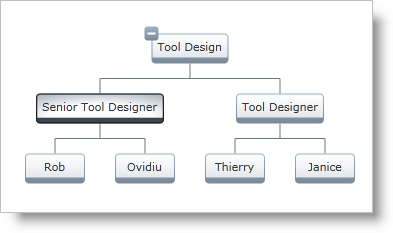

////

|metadata|
{
    "name": "xamorgchart-node-selection-behaviors",
    "controlName": ["xamOrgChart"],
    "tags": ["Events","Getting Started","Selection"],
    "guid": "d1b6d49a-7e56-460f-908a-9e68ce581a3a",  
    "buildFlags": [],
    "createdOn": "2016-05-25T18:21:57.7502726Z"
}
|metadata|
////

= Node Selection Behaviors

This topic introduces the node selection behaviors supported by the xamOrgChart™ and demonstrates how to configure them in code.

.Note:
[NOTE]
====
This topic uses the Org Chart created in link:xamorgchart-adding-xamorgchart-to-your-application.html[Adding xamOrgChart to Your Application].
====

== Selection Behaviors

The xamOrgChart control supports the following selection behaviors:

* none – the nodes cannot selectable
* single – only one node can be selected at a time
* multiple – several nodes can be selected at a time by holding down the Ctrl or Shift keys
* extended – selects a node and all its child nodes. Clicking with the left mouse button toggles the selection of a branch.

.Note:
[NOTE]
====
Selection can be performed also with the Space key.
====

A selected node can be unselected by clicking on it while holding down the Ctrl key.

Figure 1: A selected node

== Configuring the Selection Behavior

The selection behavior is configured through the link:{ApiPlatform}controls.maps.xamorgchart{ApiVersion}~infragistics.controls.maps.xamorgchart~selectiontype.html[SelectionType] property of the xamOrgChart control. The valid values are link:{ApiPlatform}controls.maps.xamorgchart{ApiVersion}~infragistics.controls.maps.orgchartselectiontype.html[None], link:{ApiPlatform}controls.maps.xamorgchart{ApiVersion}~infragistics.controls.maps.orgchartselectiontype.html[Single], link:{ApiPlatform}controls.maps.xamorgchart{ApiVersion}~infragistics.controls.maps.orgchartselectiontype.html[Multiple] and link:{ApiPlatform}controls.maps.xamorgchart{ApiVersion}~infragistics.controls.maps.orgchartselectiontype.html[Extended]. Each of them configures the respective behavior described above.

*In XAML:*

----
<ig:XamOrgChart SelectionType="None|Single|Multiple|Extended">
----

== Working with Selected Nodes

The xamOrgChart control’s link:{ApiPlatform}controls.maps.xamorgchart{ApiVersion}~infragistics.controls.maps.xamorgchart~selectednodes.html[SelectedNodes] property returns a collection with the currently selected nodes.

Whenever the selection changes, the link:{ApiPlatform}controls.maps.xamorgchart{ApiVersion}~infragistics.controls.maps.xamorgchart~selectednodescollectionchanged_ev.html[SelectedNodesCollectionChanged] event is raised. This event passes an link:{ApiPlatform}controls.maps.xamorgchart{ApiVersion}~infragistics.controls.maps.orgchartnodeselectioneventargs.html[OrgChartNodeSelectionEventArgs] object that contains the following information:

* link:{ApiPlatform}controls.maps.xamorgchart{ApiVersion}~infragistics.controls.maps.orgchartnodeselectioneventargs~originalselectednodes.html[OriginalSelectedNodes] – a collection with the previously selected nodes;
* link:{ApiPlatform}controls.maps.xamorgchart{ApiVersion}~infragistics.controls.maps.orgchartnodeselectioneventargs~currentselectednodes.html[CurrentSelectedNodes] – a collection containing the currently selected nodes.

Attaching an event handler to the SelectedNodesCollectionChanged event:

*In XAML:*

----
<ig:XamOrgChart     NodeSelection="Multiple"    SelectedNodesCollectionChanged="SelectedNodesChanged">
----

*In Visual Basic:*

----
Private Sub SelectedNodesChanged (sender As Object, e As OrgChartNodeSelectionEventArgs)
    Dim originalSelectedNodes = e.OriginalSelectedNodes
    Dim currentSelectedNodes = e.CurrentSelectedNodes
End Sub
----

*In C#:*

----
private void SelectedNodesChanged(object sender, OrgChartNodeSelectionEventArgs e)
{
    var originalSelectedNodes = e.OriginalSelectedNodes;
    var currentSelectedNodes = e.CurrentSelectedNodes; 
}
----

== *Related Topics*

link:xamorgchart-using-xamorgchart.html[Using xamOrgChart]