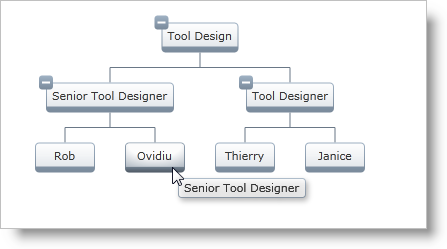
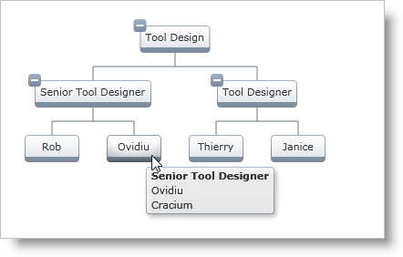

////

|metadata|
{
    "name": "xamorgchart-node-tooltips",
    "controlName": ["xamOrgChart"],
    "tags": ["How Do I"],
    "guid": "b17b95d0-ac15-45d9-8077-f71ff0b92b6b",  
    "buildFlags": [],
    "createdOn": "2016-05-25T18:21:57.7442715Z"
}
|metadata|
////

= Node Tooltips

This topic demonstrates how to add tooltips to the nodes of xamOrgChart™ and how to customize their content.

The topic is organized as follows:

* <<introduction,Introduction>>
* <<basic_tooltips,Basic Tooltips>>
* <<custom_tooltips,Custom Tooltips>>

[[introduction]]
== Introduction

The xamOrgChart and the link:{ApiPlatform}controls.maps.xamorgchart.v{ProductVersion}~infragistics.controls.maps.orgchartnodelayout.html[OrgChartNodeLayout] class have properties related to the usage of tooltips:

* link:{ApiPlatform}controls.maps.xamorgchart.v{ProductVersion}~infragistics.controls.maps.orgchartnodelayout~allowtooltips.html[AllowToolTips] – determines whether to display a tooltip or not.
* link:{ApiPlatform}controls.maps.xamorgchart.v{ProductVersion}~infragistics.controls.maps.orgchartnodelayout~tooltippath.html[ToolTipPath] – the path to the value that will serve as a visual representation of the source object.
* link:{ApiPlatform}controls.maps.xamorgchart.v{ProductVersion}~infragistics.controls.maps.orgchartnodelayout~tooltipcontenttemplate.html[ToolTipContentTemplate] – a custom tooltip template.

.Note:
[NOTE]
====
If the Org Chart displays data using Hierarchical Node Layouts, since the control acts as the root Node Layout, the tooltip properties can be set on the xamOrgChart control.
====

.Note:
[NOTE]
====
The code snippets and illustrations in this topic use the Org Chart created in link:xamorgchart-adding-xamorgchart-to-your-application.html[Adding xamOrgChart to Your Application].
====

[[basic_tooltips]]
== Basic Tooltips

The field to be used as a tooltip is specified in the ToolTipPath property.

Adding ToolTipPath="JobTitle" will create a simple tooltip displaying the Job Title for all Employee nodes.

*In XAML:*

[source,xaml]
----
<ig:OrgChartNodeLayout
    TargetTypeName="Employee"
    DisplayMemberPath="FirstName"
    ToolTipPath="JobTitle" />
----

Figure 1: A simple tooltip

Adding a tooltip to the xamOrgChart:

*In XAML:*

[source,xaml]
----
<ig:XamOrgChart
    ToolTipPath="JobTitle">
</ig:XamOrgChart>
----

[[custom_tooltips]]
== Custom Tooltips

Use the TooltipContentTemplate property to specify a custom template for the tooltip.

Creating a DataTemplate object:

*In XAML:*

[source,xaml]
----
<DataTemplate x:Key="EmployeeTooltipTemplate">
    <StackPanel>
        <TextBlock Text="{Binding JobTitle}" FontWeight="Bold" />
        <TextBlock Text="{Binding FirstName}" />
        <TextBlock Text="{Binding LastName}" />
    </StackPanel>
</DataTemplate>
----

*In XAML:*

[source,xaml]
----
<ig:OrgChartNodeLayout
    TargetTypeName="Employee"
    DisplayMemberPath="FirstName"
    ToolTipContentTemplate="{StaticResource EmployeeTooltipTemplate}" />
----

Figure 2: A custom tooltip using a Data Template

Adding a custom tooltip to the xamOrgChart:

*In XAML:*

[source,xaml]
----
<ig:XamOrgChart
    ToolTipContentTemplate ="{StaticResource EmployeeTooltipTemplate}">
</ig:XamOrgChart>
----

== *Related Topics*

link:xamorgchart-using-xamorgchart.html[Using xamOrgChart]