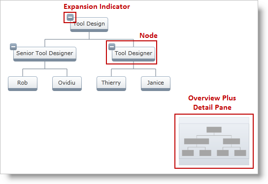

////

|metadata|
{
    "name": "xamorgchart-styling",
    "controlName": ["xamOrgChart"],
    "tags": ["Styling"],
    "guid": "e41752ce-ce55-4351-a650-158a568b7560",  
    "buildFlags": [],
    "createdOn": "2016-05-25T18:21:57.7632645Z"
}
|metadata|
////

= Styling

This topic guides you through the styleable elements of the xamOrgChart™ and demonstrates how to set node styles.

The topic is organized as follows:

* <<introduction,Introduction>>
* <<styleable_elements,Styleable Elements>>
* <<setting_styles,Setting Node Styles>>

** <<orgchart,Setting Styles Through the OrgChart>>
** <<nodelayout,Setting Styles Through a Node Layout>>
** <<orgchartnode,Setting Styles Through an OrgChartNode Object>>

[[introduction]]
== Introduction

The nodes of the xamOrgChart are visualized using the link:{ApiPlatform}controls.maps.xamorgchart.v{ProductVersion}~infragistics.controls.maps.orgchartnodecontrol.html[OrgChartNodeControl]. When a node is moved outside of the visible area of the Org Chart, the OrgChartNodeControl related to it is disposed. When a node is moved inside the visible area, a new OrgChartNodeControl is created.

The data for the nodes is stored in link:{ApiPlatform}controls.maps.xamorgchart.v{ProductVersion}~infragistics.controls.maps.orgchartnode.html[OrgChartNode] objects. When a new OrgChartNodeControl is created, it is linked to an OrgChartNode object. The visual styles of the nodes are stored in the OrgChartNode items and can be assigned directly or through link:{ApiPlatform}controls.maps.xamorgchart.v{ProductVersion}~infragistics.controls.maps.orgchartnodelayout.html[Node Layouts].

[[styleable_elements]]
== Styleable Elements

Figure 1: The styleable elements of the xamOrgChart control

[options="header", cols="a,a,a"]
|====
|Target|Property|Target Type

|Overview Plus Detail Pane
| link:{ApiPlatform}datavisualization.v{ProductVersion}~infragistics.controls.surfaceviewer~overviewplusdetailpanestyle.html[OverviewPlusDetailPaneStyle]
| link:{ApiPlatform}datavisualization.v{ProductVersion}~infragistics.controls.xamoverviewplusdetailpane.html[XamOverviewPlusDetailPane]

|Node
| link:{ApiPlatform}controls.maps.xamorgchart.v{ProductVersion}~infragistics.controls.maps.xamorgchart~nodestyle.html[NodeStyle] (when set from the OrgChart) 

link:{ApiPlatform}controls.maps.xamorgchart.v{ProductVersion}~infragistics.controls.maps.orgchartnodelayout~nodestyle.html[NodeStyle] (when set from a Node Layout) 

link:{ApiPlatform}controls.maps.xamorgchart.v{ProductVersion}~infragistics.controls.maps.orgchartnode~style.html[Style] (when set from an OrgChartNode)
| link:{ApiPlatform}controls.maps.xamorgchart.v{ProductVersion}~infragistics.controls.maps.orgchartnodecontrol.html[OrgChartNodeControl]

|Expansion Indicator
| link:{ApiPlatform}controls.maps.xamorgchart.v{ProductVersion}~infragistics.controls.maps.xamorgchart~expansionindicatorstyle.html[ExpansionIndicatorStyle] (when set from the OrgChart) 

link:{ApiPlatform}controls.maps.xamorgchart.v{ProductVersion}~infragistics.controls.maps.orgchartnodelayout~expansionindicatorstyle.html[ExpansionIndicatorStyle] (when set from a Node Layout) 

link:{ApiPlatform}controls.maps.xamorgchart.v{ProductVersion}~infragistics.controls.maps.orgchartnode~expansionindicatorstyle.html[ExpansionIndicatorStyle] (when set from an OrgChartNode)
|ToggleButton

|====

Table 1: Styleable elements and their types

.Note:
[NOTE]
====
When using Hierarchical Node Layouts, the xamOrgChart acts as the root Node Layout: it can apply a Node Style and an Expansion Indicator Style to the nodes.
====

[[setting_styles]]
== Setting Node Styles

[[orgchart]]
== Setting Styles Through the OrgChart

*In XAML:*

[source,xaml]
----
<ig:XamOrgChart
    OverviewPlusDetailPaneStyle="..."
    NodeStyle="..."
    ExpansionIndicatorStyle="...">
</ig:XamOrgChart>
----

[[nodelayout]]
== Setting Styles Through a Node Layout

*In XAML:*

[source,xaml]
----
<ig:OrgChartNodeLayout
    NodeStyle="..."
    ExpansionIndicatorStyle="...">
</ig:OrgChartNodeLayout>
----

[[orgchartnode]]
== Setting Styles Through an OrgChartNode Object

In the example, the OrgChartNode object is acquired when a node is clicked.

*In XAML:*

[source,xaml]
----
<ig:XamOrgChart
    NodeMouseLeftButtonDown="XamOrgChart_NodeMouseLeftButtonDown">
</ig:XamOrgChart>
----

*In C#:*

----
private void XamOrgChart_NodeMouseLeftButtonDown(object sender, OrgChartNodeClickEventArgs e)
{
    e.Node.Node.Style = anOrgChartNodeControlStyle;
    e.Node.Node.ExpansionIndicatorStyle= aToggleButtonStyle;
}
----

*In Visual Basic:*

----
Private Sub XamOrgChart_NodeMouseLeftButtonDown(sender As Object, e As OrgChartNodeClickEventArgs)
    e.Node.Node.Style = anOrgChartNodeControlStyle
    e.Node.Node.ExpansionIndicatorStyle= aToggleButtonStyle
End Sub
----

== *Related Topics*

link:xamorgchart-using-xamorgchart.html[Using xamOrgChart]