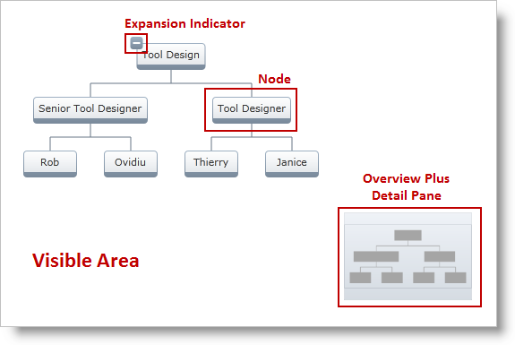

////

|metadata|
{
    "name": "xamorgchart-understanding-xamorgchart",
    "controlName": ["xamOrgChart"],
    "tags": ["Getting Started","Navigation","Selection"],
    "guid": "8d948f4b-7f6a-44c9-b245-1cd1326dffe8",  
    "buildFlags": [],
    "createdOn": "2016-05-25T18:21:57.6692985Z"
}
|metadata|
////

= Understanding xamOrgChart

This topic introduces the link:{ApiPlatform}controls.maps.xamorgchart.v{ProductVersion}~infragistics.controls.maps.xamorgchart.html[xamOrgChart]™ control and explains its elements and features.

== Introduction

The xamOrgChart is a data-bound control for rendering organization charts. It supports expanding and collapsing of nodes, panning and zooming, keyboard navigation, custom styles and templates, and various selection types including selection of multiple nodes.

== Elements of the OrgChart

The xamOrgChart control consists of the following elements (Figure 1):

* Visible Area
* Nodes

** Expansion Indicator – each node has an Expansion Indicator

* Overview Plus Detail Pane

Figure 1: Elements of the OrgChart

== User Interaction and Usability

== Panning and Zooming

The user can perform panning and zooming with either the mouse or by using the link:xamoverviewplusdetailpane.html[xamOverviewPlusDetailPane™] control:

* panning: click and drag anywhere on the chart’s surface
* zooming:

** use the mouse scroll button
** click and drag while holding the Ctrl key

Figure 2: Zooming with dragging while holding the Ctrl key

== Keyboard Navigation

The user can traverse and focus nodes of the xamOrgChart with the arrow keys on the keyboard.

Figure 3: The xamOrgChart with the focus on the Senior Tool Designer node

With the keyboard, the user can:

* select the node with the Space key (For details about selecting nodes, see the Selection topic).
* expand children nodes with the plus (+) and minus (-) keys
* toggle the state of children nodes with the Enter key
* zoom in and out with the plus (+) and minus (-) keys while holding down the Ctrl key

== Expanding and Collapsing Children

The nodes of the xamOrgChart control have the ability to expand and collapse their children nodes. This is done with the Expansion Indicators of the nodes.

Figure 4: The Expansion Indicators of the nodes expand and collapse their children

== *Related Topics*

link:xamorgchart-adding-xamorgchart-to-your-application.html[Adding xamOrgChart to Your Application]

link:xamorgchart-using-xamorgchart.html[Using xamOrgChart]

link:xamorgchart-api-overview.html[API Overview]