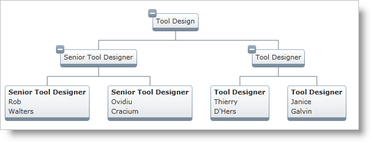

////

|metadata|
{
    "name": "xamorgchart-using-custom-node-item-templates",
    "controlName": ["xamOrgChart"],
    "tags": ["Extending","Styling","Templating"],
    "guid": "6551c1a8-0f2c-4a9d-af81-aafcf05d0b98",  
    "buildFlags": [],
    "createdOn": "2016-05-25T18:21:57.6762691Z"
}
|metadata|
////

= Using Custom Node Item Templates

This topic explains how to customize the data displayed in the Org Chart nodes using a custom Node Item Template. This is done through configuring the link:{ApiPlatform}controls.maps.xamorgchart.v{ProductVersion}~infragistics.controls.maps.orgchartnodelayout~itemtemplate.html[ItemTemplate] property of the link:{ApiPlatform}controls.maps.xamorgchart.v{ProductVersion}~infragistics.controls.maps.orgchartnodelayout.html[OrgChartNodeLayout] class. This property specifies a custom template for the content of the nodes mapped by the Node Layouts.

.Note:
[NOTE]
====
The code in the Steps section uses the Org Chart created in the link:xamorgchart-adding-xamorgchart-to-your-application.html[Adding xamOrgChart to Your Application] topic.
====

== Preview

Following is a preview of the final result, generated through the custom Node Item Template created and configured in the Steps section below:

Figure 1: Org Chart generated by the custom Note Item Template used in this topic

== Steps

[start=1]
. Create a Data Template:

*In XAML:*

[source,xaml]
----
<DataTemplate x:Key="EmployeeTemplate">
    <StackPanel>
        <TextBlock Text="{Binding JobTitle}" FontWeight="Bold" />
        <TextBlock Text="{Binding FirstName}" />
        <TextBlock Text="{Binding LastName}" />
    </StackPanel>
</DataTemplate>
----

[start=2]
. Configure the ItemTemplate.

Set the ItemTemplate of the desired Node Layout object to be the Data Template:

*In XAML:*

[source,xaml]
----
<ig:OrgChartNodeLayout
    TargetTypeName="Employee"
    ItemTemplate="{StaticResource EmployeeTemplate}" />
----

*Related Topics*

link:xamorgchart-using-xamorgchart.html[Using xamOrgChart]