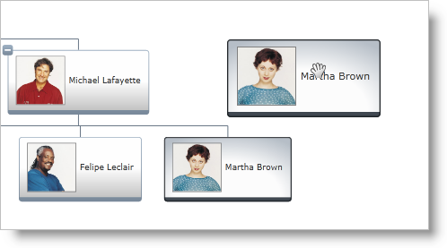

////
|metadata|
{
    "name": "xamorgchart-working-with-drag-and-drop-framework",
    "controlName": ["xamOrgChart"],
    "tags": ["How Do I","Tips and Tricks"],
    "guid": "b2ea5edc-411e-444c-8e4c-0d04a3fa0ffc",
    "buildFlags": [],
    "createdOn": "2016-05-25T18:21:57.7682645Z"
}
|metadata|
////

= Working with Drag and Drop Framework

This topic demonstrates how to implement dragging and dropping with Org Chart and Drag and Drop Framework™.

The topic is organized as follows:

* <<introduction,Introduction>>
* <<preview,Preview>>
* <<requirements,Requirements>>
* <<overview,Overview>>
* <<steps,Steps>>

[[introduction]]
== Introduction

When implementing Drag and Drop the underlying data in the hierarchy must be updated manually. This is a requirement of the xamOrgChart™ control so it could reflect the changes.

[[preview]]
== Preview

Following is a preview of a node being dragged in order to reorganize the hierarchy:

Figure 1: Dragging a node

[[requirements]]
== Requirements

Required references:

* {ApiPlatform}v{ProductVersion}.dll
* {ApiPlatform}DataVisualization.v{ProductVersion}.dll
* {ApiPlatform}Controls.Maps.XamOrgChart.v{ProductVersion}.dll

[[overview]]
== Overview

Conceptual overview of the procedure:

[start=1]
. <<step1,Adding namespace declarations>>
.. <<step1a,Adding XML namespace declarations to your XAML file>>
.. <<step1b,Placing using/Imports in your code behind>>

[start=2]
. <<step2,Configure the xamOrgChart as a Drop Target>>

[start=3]
. <<step3,Creating the Nodes Drag Sources and Drop Targets>>
.. <<step3a,Assigning an event handler to the NodeControlAttachedEvent>>
.. <<step3b,Configure the new OrgChartNodeControl as a Drag Source and Drop Target>>
.. <<step3c,Handling the Drop event of the Drag Source>>

[[steps]]
== Steps

[[step1]]
[start=1]
. Add namespace declarations.
[[step1a]]
.. Add the XML namespace declaration to your XAML file:
+
*In XAML:*
+
[source,xaml]
----
xmlns:ig= http://schemas.infragistics.com/xaml
----
[[step1b]]
.. Place using/Imports in your code behind:
+
*In Visual Basic:*
+
[source,vb]
----
Imports Infragistics.Controls.Maps
Imports Infragistics.DragDrop
----
+
*In C#:*
+
[source,csharp]
----
using Infragistics.Controls.Maps;
using Infragistics.DragDrop;
----
[[step2]]
[start=2]
. Configure the xamOrgChart as a Drop Target.
+
*In XAML:*
+
[source,xaml]
----
<ig:XamOrgChart>
    <ig:DragDropManager.DropTarget>
        <ig:DropTarget IsDropTarget="True" />
    </ig:DragDropManager.DropTarget>
</ig:XamOrgChart>
----
+
*In Visual Basic:*
+
[source,vb]
----
Dim orgChart As New XamOrgChart()

'Create a new DropTarget object.
Dim dropTarget As New DropTarget()
dropTarget.IsDropTarget = True

'Make the Org Chart a Drop Target.
DragDropManager.SetDropTarget(orgChart, dropTarget)
----
+
*In C#:*
+
[source,csharp]
----
XamOrgChart orgChart = new XamOrgChart();

//Create a new DropTarget object.
DropTarget dropTarget = new DropTarget();
dropTarget.IsDropTarget = true;

//Make the Org Chart a Drop Target.
DragDropManager.SetDropTarget(orgChart, dropTarget);
----

[[step3]]
[start=3]
. Create the Nodes link:{ApiPlatform}dragdrop{ApiVersion}~infragistics.dragdrop.dragsource.html[Drag Sources] and link:{ApiPlatform}dragdrop{ApiVersion}~infragistics.dragdrop.droptarget.html[Drop Targets].
+
--
To work with nodes, the xamOrgChart control uses two key classes:

** link:{ApiPlatform}controls.maps.xamorgchart{ApiVersion}~infragistics.controls.maps.orgchartnode.html[OrgChartNode] – its objects are the actual Org Chart nodes. This class carries information about the parent and children nodes, the data displayed by the node, and a reference to the link:{ApiPlatform}controls.maps.xamorgchart{ApiVersion}~infragistics.controls.maps.orgchartnodelayout.html[OrgChartNodeLayout] object used to create the node.
** link:{ApiPlatform}controls.maps.xamorgchart{ApiVersion}~infragistics.controls.maps.orgchartnodecontrol.html[OrgChartNodeControl] – its objects serve as visual representations of the OrgChartNode objects
--
+
Therefore, the Drag Sources and Drop Targets are link:{ApiPlatform}controls.maps.xamorgchart{ApiVersion}~infragistics.controls.maps.orgchartnodecontrol.html[OrgChartNodeControl] objects.
+
Whenever a node is moved out of the visible area of the Org Chart due to panning, the OrgChartNodeControl related to the node is disposed. Also, when the children of a node are collapsed, their OrgChartNodeControls are disposed.
+
If a node has to be shown, a new OrgChartNodeControl associated to the node is created and the link:{ApiPlatform}controls.maps.xamorgchart{ApiVersion}~infragistics.controls.maps.xamorgchart~nodecontrolattachedevent_ev.html[NodeControlAttachedEvent] is raised.
+
If working with Drag and Drop Framework, the link:{ApiPlatform}dragdrop{ApiVersion}~infragistics.dragdrop.dragdropmanager~dragsourceproperty.html[DragSource] and link:{ApiPlatform}dragdrop{ApiVersion}~infragistics.dragdrop.dragdropmanager~droptargetproperty.html[DropTarget] properties must be attached to the OrgChartNodeControl objects when they are created.
+
.Note:
[NOTE]
====
In some scenarios, there might be restrictions about the drop targets of the dragged node (an Employee can only be dropped on a Department). This behavior can be achieved by using Drag and Drop Framework’s Drag and Drop Channels.
====
[[step3a]]
.. Assign an event handler to the NodeControlAttachedEvent.
+
*In XAML:*
+
[source,xaml]
----
<ig:XamOrgChart
    NodeControlAttachedEvent="OrgChart_NodeControlAttachedEvent">
</ig:XamOrgChart>
----
[[step3b]]
.. Configure the new OrgChartNodeControl as a Drag Source and Drop Target.
+
*In Visual Basic:*
+
[source,vb]
----
Private Sub OrgChart_NodeControlAttachedEvent(sender As Object, e As OrgChartNodeEventArgs)
    'Create a new DragSource object.
    Dim dragSource As New DragSource()
    dragSource.IsDraggable = True
    
    'dragSource.DragChannels = assign drag channels
    AddHandler dragSource.Drop, AddressOf Node_Drop
    
    'Make the Node a Drag Source.
    DragDropManager.SetDragSource(e.Node, dragSource)
    
    'Create a new DropTarget object.
    Dim dropTarget As New DropTarget()
    dropTarget.IsDropTarget = True
    
    'dropTarget.DropChannels = assign drop channels
    'Make the Node a Drop Target.
    DragDropManager.SetDropTarget(e.Node, dropTarget)
End Sub
----
+
*In C#:*
+
[source,csharp]
----
private void OrgChart_NodeControlAttachedEvent(object sender, OrgChartNodeEventArgs e)
{
    //Create a new DragSource object.
    DragSource dragSource = new DragSource();
    dragSource.IsDraggable = true;
    
    //dragSource.DragChannels = assign drag channels
    dragSource.Drop += Node_Drop;
    
    //Make the Node a Drag Source.
    DragDropManager.SetDragSource(e.Node, dragSource);
    
    //Create a new DropTarget object.
    DropTarget dropTarget = new DropTarget();
    dropTarget.IsDropTarget = true;
    
    //dropTarget.DropChannels = assign drop channels
    //Make the Node a Drop Target.
    DragDropManager.SetDropTarget(e.Node, dropTarget);
}
----
[[step3c]]
.. Handle the link:{ApiPlatform}dragdrop{ApiVersion}~infragistics.dragdrop.dragsource~drop_ev.html[Drop] event of the Drag Source.
+
*In Visual Basic:*
+
[source,vb]
----
Private Sub Node_Drop(sender As Object, e As DropEventArgs)
    'Get the dragged OrgChartNodeControl object.
    Dim draggedNodeControl As OrgChartNodeControl = _
        TryCast(e.DragSource, OrgChartNodeControl)
        
    'Get the dragged OrgChartNode object.
    Dim draggedNode As OrgChartNode = draggedNodeControl.Node
    
    'Get the underlying data.
    Dim data As Object = draggedNode.Data
    
    'TODO: Modify the underlying data.
End Sub
----
+
*In C#:*
+
[source,csharp]
----
private void Node_Drop(object sender, DropEventArgs e)
{
    //Get the dragged OrgChartNodeControl object.
    OrgChartNodeControl draggedNodeControl = _
        e.DragSource as OrgChartNodeControl;
    
    //Get the dragged OrgChartNode object.
    OrgChartNode draggedNode = draggedNodeControl.Node;
    
    //Get the underlying data.
    object data = draggedNode.Data;
    
    //TODO: Modify the underlying data.
}
----

== *Related Topics*

link:xamorgchart-adding-xamorgchart-to-your-application.html[Adding xamOrgChart to Your Application]

link:xamorgchart-using-xamorgchart.html[Using xamOrgChart]