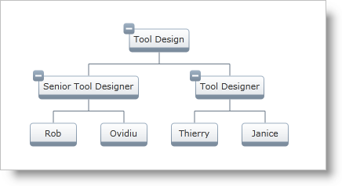

////

|metadata|
{
    "name": "xamorgchart",
    "controlName": ["xamOrgChart"],
    "tags": ["Getting Started","Summaries"],
    "guid": "661728ef-1c3c-49f4-ab83-b1c84982df29",  
    "buildFlags": [],
    "createdOn": "2016-05-25T18:21:57.7872654Z"
}
|metadata|
////

= xamOrgChart

The link:{ApiPlatform}controls.maps.xamorgchart{ApiVersion}~infragistics.controls.maps.xamorgchart.html[xamOrgChart]™ is a data-bound control for rendering organization charts. (Figure 1)

Figure 1: Sample organization chart created with the xamOrgChart control

It supports expanding and collapsing of nodes, panning and zooming, keyboard navigation, custom styles and templates, and various selection types including selection of multiple nodes.

== Getting Started

To get started with the xamOrgChart, see the link:xamorgchart-adding-xamorgchart-to-your-application.html[Adding xamOrgChart to Your Application] topic.

== link:xamorgchart-using-xamorgchart.html[Using xamOrgChart]

For information about how to use the xamOrgChart control and its elements and key features, see the following topics:

* link:xamorgchart-node-layouts-and-data.html[Node Layouts and Binding to Data]
* link:xamorgchart-node-selection-behaviors.html[Node Selection Behaviors]
* link:xamorgchart-node-tooltips.html[Node Tooltips]
* link:xamorgchart-search-nodes.html[Searching in Nodes]
* link:xamorgchart-customizing-individual-nodes.html[Customizing Individual Nodes]
* link:xamorgchart-using-custom-node-item-templates.html[Using Custom Node Item Templates]
* link:xamorgchart-expansion-indicators-visibility.html[Configuring the Visibility of Expansion Indicators]
* link:xamorgchart-maximum-node-depth.html[Maximum Node Depth]
* link:xamorgchart-node-arrangement-settings.html[Node Arrangement Settings]
* link:xamorgchart-line-connector-settings.html[Line Connector Settings]
* link:xamorgchart-configuring-panning-and-zooming.html[Configuring Panning and Zooming]
* link:xamorgchart-events-overview.html[Events Overview]
* link:xamorgchart-highlight-methods.html[Highlight Methods]
* link:xamorgchart-working-with-drag-and-drop-framework.html[Working with Drag and Drop Framework]
* link:xamorgchart-styling.html[Styling]

== *Related Topics*

link:xamorgchart-understanding-xamorgchart.html[Understanding xamOrgChart]

link:xamorgchart-api-overview.html[API Overview]