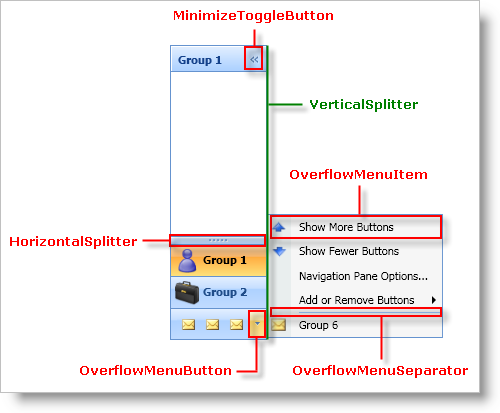
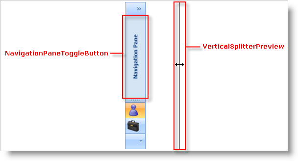
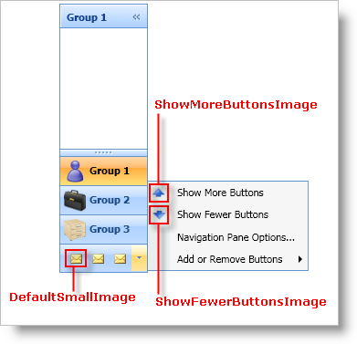

////

|metadata|
{
    "name": "xamoutlookbar-about-styling-xamoutlookbar",
    "controlName": ["xamOutlookBar"],
    "tags": ["Styling"],
    "guid": "{17C7A585-7523-450A-88DE-AB4069C779B2}",  
    "buildFlags": [],
    "createdOn": "2012-01-30T19:39:54.0271585Z"
}
|metadata|
////

= About Styling xamOutlookBar

You can restyle xamOutlookBar™ using Styles and ControlTemplates just like any control in Microsoft® Windows® Presentation Foundation. However, the various classes that make up xamOutlookBar make styling easier by exposing a static property that you can use as the Key property of a Style or ControlTemplate. If the xamOutlookBar finds a Style or ControlTemplate that is using a predefined key, the xamOutlookBar control will automatically use the Style or ControlTemplate you created.

The tables below list the static properties that you can use as keys when creating your Styles and ControlTemplates. The heading for each section is the class that exposes the property. If the property name ends with "TemplateKey", you have to create a ControlTemplate to style that element. If the property name ends with "StyleKey", you have to create a Style in order to style that element. For example, if you want to style the Button control that minimizes xamOutlookBar, you will first find the class and property name using the tables below. Once you find the property, create a ControlTemplate or a Style based on the name of the property. Set the Key property of the ControlTemplate or Style to the property using a markup extension.

*In XAML:*

----
<!--
Create a style since the property name ends with "StyleKey".
Set the Key property of the control template to the static property exposed by the XamOutlookBar class.
Set the TargetType property of the control template to ToggleButton.
-->

----

== link:{ApiPlatform}outlookbar.v{ProductVersion}~infragistics.windows.outlookbar.xamoutlookbar.html[XamOutlookBar] Class (Style and ControTemplate Keys)

[options="header", cols="a,a"]
|====
|Property Name|Target Type

| link:{ApiPlatform}outlookbar.v{ProductVersion}~infragistics.windows.outlookbar.xamoutlookbar~horizontalsplitterstylekey.html[HorizontalSplitterStyleKey]
|Thumb

| link:{ApiPlatform}outlookbar.v{ProductVersion}~infragistics.windows.outlookbar.xamoutlookbar~minimizetogglebuttonstylekey.html[MinimizeToggleButtonStyleKey]
|ToggleButton

| link:{ApiPlatform}outlookbar.v{ProductVersion}~infragistics.windows.outlookbar.xamoutlookbar~navigationpanetogglebuttonstylekey.html[NavigationPaneToggleButtonStyleKey]
|ToggleButton

| link:{ApiPlatform}outlookbar.v{ProductVersion}~infragistics.windows.outlookbar.xamoutlookbar~overflowmenuseparatorstylekey.html[OverflowMenuSeparatorStyleKey]
|Separator

| link:{ApiPlatform}outlookbar.v{ProductVersion}~infragistics.windows.outlookbar.xamoutlookbar~overflowmenuitemstylekey.html[OverflowMenuItemStyleKey]
|MenuItem

| link:{ApiPlatform}outlookbar.v{ProductVersion}~infragistics.windows.outlookbar.xamoutlookbar~overflowmenubuttonstylekey.html[OverflowMenuButtonStyleKey]
|MenuItem

| link:{ApiPlatform}outlookbar.v{ProductVersion}~infragistics.windows.outlookbar.xamoutlookbar~verticalsplitterpreviewstylekey.html[VerticalSplitterPreviewStyleKey]
|None

| link:{ApiPlatform}outlookbar.v{ProductVersion}~infragistics.windows.outlookbar.xamoutlookbar~verticalsplitterstylekey.html[VerticalSplitterStyleKey]
|Thumb

|====

== XamOutlookBar Class (Image Keys)

The XamOutlookBar class exposes several keys that you can use to modify the images found in the xamOutlookBar control. You do not need to create a Style or a ControlTemplate to modify the images, instead, you can add a BitmapImage object to your resource dictionary and set its Key property to the static key properties exposed by the XamOutlookBar class.

[options="header", cols="a,a"]
|====
|Property Name|Object Type

| link:{ApiPlatform}outlookbar.v{ProductVersion}~infragistics.windows.outlookbar.xamoutlookbar~showfewerbuttonsimagekey.html[ShowFewerButtonsImageKey]
|BitmapImage

| link:{ApiPlatform}outlookbar.v{ProductVersion}~infragistics.windows.outlookbar.xamoutlookbar~showmorebuttonsimagekey.html[ShowMoreButtonsImageKey]
|BitmapImage

| link:{ApiPlatform}outlookbar.v{ProductVersion}~infragistics.windows.outlookbar.xamoutlookbar~defaultsmallimagekey.html[DefaultSmallImageKey]
|BitmapImage

|====

