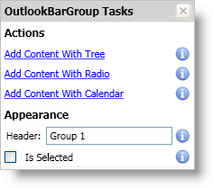

////

|metadata|
{
    "name": "xamoutlookbar-about-xamoutlookbar",
    "controlName": ["xamOutlookBar"],
    "tags": ["Getting Started"],
    "guid": "{0E8FC032-A48B-432B-A077-B528AB69C964}",  
    "buildFlags": [],
    "createdOn": "2012-01-30T19:39:54.0291589Z"
}
|metadata|
////

= About xamOutlookBar

The xamOutlookBar™ control emulates the navigation bar found in Microsoft® Outlook®. Just as Outlook separates email-related functionality from calendar-related functionality, you can organize your own application tasks into subsets of related tasks. The xamOutlookBar control has the following features:

* *Groups* - Each group is a headered content control that can host a diverse set of controls.
* *Collapsible* - Your end users can collapse xamOutlookBar to maximize screen real estate.

== xamOutlookBar Smart Tag

The xamOutlookBar™ control is equipped with a Smart Tag. By simply selecting xamOutlookBar, a Smart Tag anchor appears. When you click this anchor, a pop-up panel appears, providing you with quick and easy access to the most common properties and settings of xamOutlookBar. See the table below for a description of each item (e.g., field, drop-down list, link) in the smart tag, as well as the item's corresponding property in the properties window.

[options="header", cols="a,a,a"]
|====
|Item|Description|Corresponding Property

|Add Group With Grid
|Clicking this link will add an link:{ApiPlatform}outlookbar{ApiVersion}~infragistics.windows.outlookbar.outlookbargroup.html[OutlookBarGroup] object to xamOutlookBar. The group's content will be set to a Grid panel.
|None

|Add Group With Tree
|Clicking this link will add an OutlookBarGroup object to xamOutlookBar. The groups content will be set to a TreeView control.
|None

|Add Group With Radio
|Clicking this link will add an OutlookBarGroup object to xamOutlookBar. The group's content will be set to two ListBox controls. The first ListBox control contains three TextBlock controls and the second ListBox control contains three RadioButton controls.
|None

|Add Group With Calendar
|Clicking this link will add an OutlookBarGroup object to xamOutlookBar. The group's content will be set to a xamMonthCalendar™ control. You have to add a reference to {ApiPlatform}Controls.Editors.v{ProductVersion}.dll to your project if you did not add it already.
|None

|Show More Buttons
|Clicking this link will show more groups in the groups presenter.
|None

|Show Fewer Buttons
|Clicking this link will show fewer groups in the groups presenter.
|None

|Show Max # of Buttons
|Clicking this link will show the maximum number of groups in the groups presenter based on the height of the xamOutlookBar control.
|None

|====

== OutlookBarGroup Smart Tag

The OutlookBarGroup object is equipped with a Smart Tag. By simply selecting a group in xamOutlookBar, a Smart Tag anchor appears. When you click this anchor, a pop-up panel appears, providing you with quick and easy access to the most common properties and settings of an OutlookBarGroup object. See the table below for a description of each item (e.g., field, drop-down list, checkbox, link) in the smart tag, as well as the item's corresponding property in the properties window.

[options="header", cols="a,a,a"]
|====
|Item|Description|Corresponding Property

|Add Content With Tree
|Clicking this link will add an link:{ApiPlatform}outlookbar{ApiVersion}~infragistics.windows.outlookbar.outlookbargroup.html[OutlookBarGroup] object to xamOutlookBar. The groups content will be set to a TreeView control.
| link:https://msdn.microsoft.com/en-us/library/system.windows.controls.contentcontrol.content(v=vs.110).aspx[Content]

|Add Content With Radio
|Clicking this link will add an OutlookBarGroup object to xamOutlookBar. The group's content will be set to two ListBox controls. The first ListBox control contains three TextBlock controls and the second ListBox control contains three RadioButton controls.
|Content

|Add Content With Calendar
|Clicking this link will add an OutlookBarGroup object to xamOutlookBar. The group's content will be set to a xamMonthCalendar™ control. You have to add a reference to {ApiPlatform}Controls.Editors.v{ProductVersion}.dll to your project if you did not add it already.
|Content

|Header
|This is the text that appears in a group's header.
| link:https://msdn.microsoft.com/en-us/library/system.windows.controls.headeredcontentcontrol.header(v=vs.110).aspx[Header]

|Is Selected
|Clicking this link will select the group.
| link:{ApiPlatform}outlookbar{ApiVersion}~infragistics.windows.outlookbar.outlookbargroup~isselected.html[IsSelected]

|====

== Related Topics

link:xamoutlookbar-adding-xamoutlookbar-to-your-page.html[Adding xamOutlookBar to Your Application]

link:xamoutlookbar-using-xamoutlookbar.html[Using xamOutlookBar]