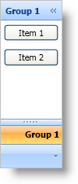

////

|metadata|
{
    "name": "xamoutlookbar-add-content-to-a-group",
    "controlName": ["xamOutlookBar"],
    "tags": ["Editing","Grouping"],
    "guid": "{A43EA43C-8A18-43DE-A28E-BF1E4CB03CC9}",  
    "buildFlags": [],
    "createdOn": "2012-01-30T19:39:54.0321595Z"
}
|metadata|
////

= Add Content to a Group

The link:{ApiPlatform}outlookbar{ApiVersion}~infragistics.windows.outlookbar.outlookbargroup.html[OutlookBarGroup] object derives from HeaderedContentControl; therefore, using it will be similar to any headered content control found in Microsoft® Windows® Presentation Foundation. Just like any content control in Windows Presentation Foundation, you can set the link:{ApiPlatform}outlookbar{ApiVersion}~infragistics.windows.outlookbar.outlookbargroup.html[Content] property of a group to an instance of an object. In many cases, you will use a layout container, such as a Grid panel, as the root element -- adding additional elements to the layout container.

The following example code demonstrates how to add items to a group. The procedural code assumes that you have already added an OutlookBarGroup object with the key "group1" to xamOutlookBar™.

*In XAML:*

----
<igOutlookBar:OutlookBarGroup Header="Group 1" Key="group1">
    <StackPanel>
        <Button Content="Item 1" Margin="5" />
        <Button Content="Item 2" Margin="5" />
    </StackPanel>
</igOutlookBar:OutlookBarGroup>
----

*In Visual Basic:*

----
Dim stackPanel1 As New StackPanel()
Me.xamOutlookBar1.Groups("group1").Content = stackPanel1
Dim button1 As New Button() With { .Content = "Item 1", .Margin = New Thickness(5) }
Dim button2 As New Button() With { .Content = "Item 2", .Margin = New Thickness(5) }
stackPanel1.Children.Add(button1)
stackPanel1.Children.Add(button2)
----

*In C#:*

----
StackPanel stackPanel1 = new StackPanel();
this.xamOutlookBar1.Groups["group1"].Content = stackPanel1;
Button button1 = new Button()
{ 
    Content = "Item 1",
    Margin = new Thickness(5)
};
Button button2 = new Button()
{ 
    Content = "Item 2",
    Margin = new Thickness(5)
};
stackPanel1.Children.Add(button1);
stackPanel1.Children.Add(button2);
----

== Related Topics

link:xamoutlookbar-about-styling-xamoutlookbar.html[About Styling xamOutlookBar]

link:xamoutlookbar-add-groups-to-xamoutlookbar.html[Add Groups to xamOutlookBar]

link:xamoutlookbar-collapse-xamoutlookbar.html[Collapse xamOutlookBar]

link:xamoutlookbar-select-a-group.html[Select a Group]