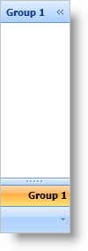

////

|metadata|
{
    "name": "xamoutlookbar-add-groups-to-xamoutlookbar",
    "controlName": ["xamOutlookBar"],
    "tags": ["Editing","Grouping"],
    "guid": "{6E02B83C-CB86-43E7-A29C-B012E01F0F75}",  
    "buildFlags": [],
    "createdOn": "2012-01-30T19:39:54.0341599Z"
}
|metadata|
////

= Add Groups to xamOutlookBar

Groups in xamOutlookBar™ are headered content controls that act as containers for content. You can display text and an image in an link:{ApiPlatform}outlookbar{ApiVersion}~infragistics.windows.outlookbar.outlookbargroup.html[OutlookBarGroup] object's header by setting its link:{ApiPlatform}outlookbar{ApiVersion}~infragistics.windows.outlookbar.outlookbargroup.html[Header] property and link:{ApiPlatform}outlookbar{ApiVersion}~infragistics.windows.outlookbar.outlookbargroup~largeimage.html[LargeImage] property, respectively. You can also set the OutlookBarGroup object's link:{ApiPlatform}outlookbar{ApiVersion}~infragistics.windows.outlookbar.outlookbargroup~smallimage.html[SmallImage] property to display an image when a group ends up in the overflow area. The xamOutlookBar control automatically uses a default envelope image in the overflow area if you do not set the SmallImage property.

In addition to the properties mentioned above, other commonly used properties are:

* link:{ApiPlatform}outlookbar{ApiVersion}~infragistics.windows.outlookbar.outlookbargroup~key.html[Key] - An optional property that you can set to help you index into xamOutlookBar's link:{ApiPlatform}outlookbar{ApiVersion}~infragistics.windows.outlookbar.xamoutlookbar~groups.html[Groups collection]. If you set the Key property, you must supply a unique value for each group.
* link:{ApiPlatform}outlookbar{ApiVersion}~infragistics.windows.outlookbar.outlookbargroup~isselected.html[IsSelected] - You can set this property in XAML or in code to select a particular group. Only a single group can be selected at a time.
* link:{ApiPlatform}outlookbar{ApiVersion}~infragistics.windows.outlookbar.outlookbargroup~location.html[Location] - At run time, your end users can move groups to different locations. You can query the Location property of a group to determine where it is located.

The following example code demonstrates how to add groups to xamOutlookBar. You will need to replace the sample URI for the LargeImage property and the SmallImage property with a URI that points to an actual image in your application.

*In XAML:*

----
<igOutlookBar:XamOutlookBar Name="xamOutlookBar1"               HorizontalAlignment="Left">
    <igOutlookBar:XamOutlookBar.Groups>
        <igOutlookBar:OutlookBarGroup 
            Header="Group 1" 
            LargeImage="ReplaceWithYourLargeImage.png" 
            SmallImage="ReplaceWithYourSmallImage.png" 
            Key="group1">
            <!-- TODO: Add a panel here -->
        </igOutlookBar:OutlookBarGroup>
    </igOutlookBar:XamOutlookBar.Groups>
</igOutlookBar:XamOutlookBar>
----

*In Visual Basic:*

----
Imports Infragistics.Windows.OutlookBar
...
Dim group1 As New OutlookBarGroup()
group1.Header = "Group 1"
group1.LargeImage = New BitmapImage(New Uri("pack://application:,,,/ReplaceWithYourLargeImage.png"))
group1.SmallImage = New BitmapImage(New Uri("pack://application:,,,/ReplaceWithYourSmallImage.png"))
group1.Key = "group1"
Me.xamOutlookBar1.Groups.Add(group1)
----

*In C#:*

----
using Infragistics.Windows.OutlookBar;
...
OutlookBarGroup group1 = new OutlookBarGroup();
group1.Header = "Group 1";
group1.LargeImage = new BitmapImage(new Uri("pack://application:,,,/ReplaceWithYourLargeImage.png"));
group1.SmallImage = new BitmapImage(new Uri("pack://application:,,,/ReplaceWithYourSmallImage.png"));
group1.Key = "group1";
this.xamOutlookBar1.Groups.Add(group1);
----

== Related Topics

link:xamoutlookbar-about-styling-xamoutlookbar.html[About Styling xamOutlookBar]

link:xamoutlookbar-add-content-to-a-group.html[Add Content to a Group]

link:xamoutlookbar-collapse-xamoutlookbar.html[Collapse xamOutlookBar]

link:xamoutlookbar-select-a-group.html[Select a Group]