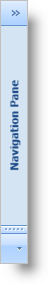

////

|metadata|
{
    "name": "xamoutlookbar-collapse-xamoutlookbar",
    "controlName": ["xamOutlookBar"],
    "tags": ["Editing","How Do I"],
    "guid": "{95349E6F-23B4-46B9-9FC8-3EAB9AC76BAA}",  
    "buildFlags": [],
    "createdOn": "2012-01-30T19:39:54.0391609Z"
}
|metadata|
////

= Collapse xamOutlookBar

Just like the navigation pane in Microsoft® Outlook®, end users can collapse xamOutlookBar™ at run time to maximize their screen real estate. In addition to your end users collapsing xamOutlookBar, you can also collapse xamOutlookBar programmatically by setting its link:{ApiPlatform}outlookbar.v{ProductVersion}~infragistics.windows.outlookbar.xamoutlookbar~isminimized.html[IsMinimized] property to True.

The following example code demonstrates how to collapse xamOutlookBar.

*In XAML:*

----
<igOutlookBar:XamOutlookBar Name="xamOutlookBar1" 
              HorizontalAlignment="Left"
			  IsMinimized="True" />
----

*In Visual Basic:*

----
Me.xamOutlookBar1.IsMinimized = True
----

*In C#:*

----
this.xamOutlookBar1.IsMinimized = true;
----

== Related Topics

link:xamoutlookbar-about-styling-xamoutlookbar.html[About Styling xamOutlookBar]

link:xamoutlookbar-add-groups-to-xamoutlookbar.html[Add Groups to xamOutlookBar]

link:xamoutlookbar-add-content-to-a-group.html[Add Content to a Group]

link:xamoutlookbar-collapse-xamoutlookbar.html[Collapse xamOutlookBar]

link:xamoutlookbar-select-a-group.html[Select a Group]