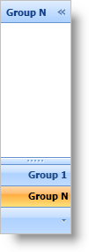

////

|metadata|
{
    "name": "xamoutlookbar-select-a-group",
    "controlName": ["xamOutlookBar"],
    "tags": ["Events","Grouping"],
    "guid": "{9959EAF1-D731-47AB-AC93-1B5FB273A65E}",  
    "buildFlags": [],
    "createdOn": "2012-01-30T19:39:54.0461623Z"
}
|metadata|
////

= Select a Group

An end user can select a group by clicking on its header in the xamOutlookBar™ control's navigation area, or overflow area. When an end user selects a group, the main content area will display the selected group's content. It is also possible to define a selected group in XAML, or dynamically select a group in the code-behind by setting an link:{ApiPlatform}outlookbar{ApiVersion}~infragistics.windows.outlookbar.outlookbargroup.html[OutlookBarGroup] object's link:{ApiPlatform}outlookbar{ApiVersion}~infragistics.windows.outlookbar.outlookbargroup~isselected.html[IsSelected] property to True.

The following example code demonstrates how to select a group.

*In XAML:*

----
<igOutlookBar:XamOutlookBar Name="xamOutlookBar1" HorizontalAlignment="Left">
    <igOutlookBar:XamOutlookBar.Groups>
        <igOutlookBar:OutlookBarGroup 
            Header="Group 1"
            Key="group1">
        </igOutlookBar:OutlookBarGroup>
        <!--
        group 2
        ...
        group n-1
        -->
        <igOutlookBar:OutlookBarGroup 
            Header="Group N"
            Key="groupN"
            IsSelected="True">
        </igOutlookBar:OutlookBarGroup>
    </igOutlookBar:XamOutlookBar.Groups>
</igOutlookBar:XamOutlookBar>
----

*In Visual Basic:*

----
Me.xamOutlookBar1.Groups("groupN").IsSelected = True
----

*In C#:*

----
this.xamOutlookBar1.Groups["groupN"].IsSelected = true;
----

== Related Topics

link:xamoutlookbar-about-styling-xamoutlookbar.html[About Styling xamOutlookBar]

link:xamoutlookbar-add-groups-to-xamoutlookbar.html[Add Groups to xamOutlookBar]

link:xamoutlookbar-add-content-to-a-group.html[Add Content to a Group]

link:xamoutlookbar-collapse-xamoutlookbar.html[Collapse xamOutlookBar]

link:xamoutlookbar-select-a-group.html[Select a Group]