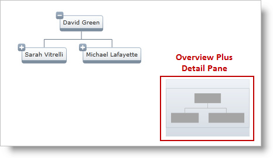

////

|metadata|
{
    "name": "xamoverviewplusdetailpane",
    "controlName": [],
    "tags": ["Getting Started","Navigation","Summaries"],
    "guid": "17c1342a-f82e-443e-a20e-f2195171cd77",  
    "buildFlags": [],
    "createdOn": "2016-05-25T18:21:57.7942661Z"
}
|metadata|
////

= xamOverviewPlusDetailPane

The link:{ApiPlatform}datavisualization.v{ProductVersion}~infragistics.controls.xamoverviewplusdetailpane.html[xamOverviewPlusDetailPane]™ is a navigation control used in the link:{ApiPlatform}datavisualization.v{ProductVersion}~infragistics.controls.surfaceviewer.html[SurfaceViewer] controls like link:xamorgchart.html[xamOrgChart]™ and link:xamnetworknode.html[xamNetworkNode]™. The control provides panning and zooming functionality and an overview of the contents of the Surface Viewer controls.

The following image displays the  _OverviewPlusDetailPane_   control with  _xamOrgChart_   _™_   for panning and zooming in on the network node layout.

Figure 1: Overview Plus Detail Pane with xamOrgChart

The following image displays the  _OverviewPlusDetailPane_   control with  _xamNetworkNode_   _™_   for panning and zooming in on the network node layout.

Figure 2: Overview Plus Detail Pane with xamNetworkNode

== User Interaction and Usability of the xamOverviewPlusDetailPane

With the xamOverviewPlusDetailPane, users can:

* Zoom in and out
* Perform panning
* Scale the contents of the Surface Viewer to fit the viewable are or to 100%

Figure 3: Graphical representation of the main features of the xamOverviewPlusDetailPane

Figure 4: Hovering the mouse pointer over the control brings it into full view

Figure 5: Clicking on the visible area and dragging it performs panning

== Positioning the xamOverviewPlusDetailPane

To position the Overview Plus Detail Pane control, use the following properties of the Surface Viewer controls:

* link:{ApiPlatform}datavisualization.v{ProductVersion}~infragistics.controls.surfaceviewer~horizontaloverviewplusdetailpanealignment.html[HorizontalOverviewPlusDetailPaneAlignment]
* link:{ApiPlatform}datavisualization.v{ProductVersion}~infragistics.controls.surfaceviewer~verticaloverviewplusdetailpanealignment.html[VerticalOverviewPlusDetailPaneAlignment]
* link:{ApiPlatform}datavisualization.v{ProductVersion}~infragistics.controls.surfaceviewer~overviewplusdetailpanevisibility.html[OverviewPlusDetailPaneVisibility]

To style the Overview Plus Detail Pane, use the link:{ApiPlatform}datavisualization.v{ProductVersion}~infragistics.controls.surfaceviewer~overviewplusdetailpanestyle.html[OverviewPlusDetailPaneStyle] property.

The following code snippets show how to work with the Surface Viewer’s properties related to the Overview Plus Detail Pane control:

== Code Example: xamOrgChart

=== Description

Code example below illustrates the surface viewer properties specified in  _xamOrgChart_   control.

=== Code

*In XAML:*

[source,xaml]
----
Code
<ig:XamNetworkNode          
              OverviewPlusDetailPaneVisibility="Visible"
              OverviewPlusDetailPaneStyle="{StaticResource OPDPStyle }"
              HorizontalOverviewPlusDetailPaneAlignment="Center"
              VerticalOverviewPlusDetailPaneAlignment="Bottom">
</ig:XamNetworkNode>
----

== Code Example: xamNetworkNode

=== Description

Code example below illustrates the surface viewer properties specified in  _xamNetworkNode_   control.

=== Code

*In XAML:*

[source,xaml]
----
Code
<ig:XamNetworkNode          
              OverviewPlusDetailPaneVisibility="Visible"
              OverviewPlusDetailPaneStyle="{StaticResource OPDPStyle }"
              HorizontalOverviewPlusDetailPaneAlignment="Center"
              VerticalOverviewPlusDetailPaneAlignment="Bottom">
</ig:XamNetworkNode>
----

== Related Content

=== Topics

The following topics provide additional information related to this topic.

[options="header", cols="a,a"]
|====
| *Topic* | *Purpose* 

|Getting Started with _xamNetworkNode_
|This topic demonstrates how to add the link:{ApiPlatform}controls.maps.xamnetworknode.v{ProductVersion}~infragistics.controls.maps.xamnetworknode_members.html[XamNetworkNode]™ control to an application.

|Understanding _xamOrgChart_
|This topic introduces the link:{ApiPlatform}controls.maps.xamorgchart.v{ProductVersion}~infragistics.controls.maps.xamorgchart_members.html[XamOrgChart]™ control and explains its elements and features.

|====