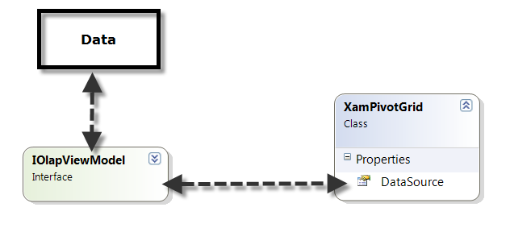

////

|metadata|
{
    "name": "xampivotgrid-binding-data-to-the-xampivotgrid",
    "controlName": ["xamPivotGrid"],
    "tags": ["Data Binding","Getting Started","Grids","How Do I"],
    "guid": "0e9330de-493d-4643-8c56-a37bf7db5ac6",  
    "buildFlags": [],
    "createdOn": "2016-05-25T18:21:58.053281Z"
}
|metadata|
////

= Binding xamPivotGrid to Data

== Topic Overview

=== Purpose

This topic serves as an overview of the data sources supported by the xamPivotGrid™ control.

=== Required background

[options="header", cols="a,a"]
|====
|Topic|Purpose

| link:xampivotgrid-understanding-xampivotgrid.html[xamPivotGrid Overview]
|This section serves as an introduction to the xamPivotGrid control's key features and functionalities. The topics listed here will give you a better idea of why you would want to use xamPivotGrid in your applications.

| link:xampivotgrid-getting-started-with-xampivotgrid.html[Getting Started with xamPivotGrid]
|This topic demonstrates how to get started with the xamPivotGrid™ control by providing step-by-step procedure for adding this control to a {PlatformName} application.

|====

=== In this topic

This topic contains the following sections:

* <<_Ref319429744, Binding to Data Sources >>

** <<_Ref319429756,Supported data sources summary>>
** <<_Ref319429760,Data sources summary>>
** <<_Ref320018793,Binding class diagram>>
** <<_Ref320018798,Components for the Data Binding>>

* <<_Ref319429767, Related Content >>

** <<_Ref319429769,Topics>>
** <<_Ref319429771,Samples>>

[[_Ref319429744]]
== Binding to Data Sources

[[_Ref319429756]]

=== Supported data sources summary

Data sources provide access to and manipulation of data and they instruct xamPivotGrid and xamPivotDataSelector™ controls how to use the data that you want to analyze.

The xamPivotGrid control supports the following data sources:

[options="header", cols="a,a,a"]
|====
|Data source|Data Source ViewModel|Binding

|SQL Server Analysis Server
| link:xampivotgrid-databinding-using-xmladatasource.html[XmlaDataSource]
|Represents a controller for connecting and executing queries against SQL Server Analysis Services (SSAS) through XML for Analysis (XMLA) model provider.

ifdef::wpf[]
|SQL Server Analysis Server
| link:xampivotgrid-us-connecting-to-an-adomd-net-datasource.html[AdomdDataSource]
|Represents a controller for connecting and executing queries directly against SQL Server Analysis Services.
endif::wpf[]

|SAP NetWeaver Business Warehouse
| link:xampivotgrid-databinding-using-sap-xmla-datasource.html[XmlaSapDataSource]
|Represents a controller that provides a way to connect and execute queries against SAS through XMLA.

|Oracle Essbase
| link:xampivotgrid-connecting-to-an-oracle-xmla-datasource.html[XmlaOracleDataSource]
|Represents a controller that provides a way to connect and execute queries against Essbase for Oracle through XMLA.

|IEnumerable data collection
| link:xampivotgrid-databinding-using-flatdatasource.html[FlatDataSource]
|Represents a controller that provides a way to use `System.Collections.IEnumerable` as data source to display data in the xamPivotGrid control.

|====

[[_Ref319429760]]

=== Data sources summary

All data sources listed above inherit from the link:{ApiPlatform}olap.v{ProductVersion}~infragistics.olap.datasourcebase_members.html[DataSourceBase] class which implements the link:{ApiPlatform}olap.v{ProductVersion}~infragistics.olap.iolapviewmodel_members.html[IOlapViewModel] interface. These classes serve as a link between the actual data source (for example the server where the olap cube is stored) on one side and the xamPivotGrid on the other side. In order to use the xamPivotGrid control with your existing data you will need to use one of these ViewModels. However, if these data sources are insufficient, advanced users can create a custom view model with a data provider by implementing the `IOlapViewModel` interface or inheriting from the `DataSourceBase` class.

[[_Ref320018793]]

=== Binding class diagram

The following class diagram is a simplified model of how data binding works for the xamPivotGrid control.

[[_Ref319429762]]

=== Components for the Data Binding

There are several components that are most commonly used when binding data to the xamPivotGrid. For more details, refer to the table below.

[options="header", cols="a,a,a"]
|====
|Component|Required?|Description

| link:xampivotgrid-understanding-xampivotgrid.html[xamPivotGrid]
|Yes
|The control that displays the data.

| link:xampivotgrid-dataselector.html[xamPivotDataSelector]
|No
|Represents the xamPivotDataSelector control for selecting and manipulating data displayed in the xamPivotGrid control.

|DataSource
|Yes
|Represents a view model that implements `IOlapViewModel` interface and controls the data through the xamPivotGrid control’s link:{ApiPlatform}controls.grids.xampivotgrid.v{ProductVersion}~infragistics.controls.grids.xampivotgrid~datasource.html[DataSource] and the xamPivotDataSelector control’s link:{ApiPlatform}controls.grids.xampivotgrid.v{ProductVersion}~infragistics.controls.grids.xampivotdataselector~datasource.html[DataSource] properties.

|====

.Note:
[NOTE]
====
As stated above this is the most common usage scenario. However there also some other cases. For example, a xamPivotDataSelector can be used together with a data source without using the xamPivotGrid to display the data.
====

[[_Ref319429767]]
== Related Content

[[_Ref319429769]]

=== Topics

The following topics provide additional information related to this topic.

[options="header", cols="a,a"]
|====
|Topic|Purpose

| link:xampivotgrid-databinding-using-xmladatasource.html[Binding xamPivotGrid to XmlaDataSource]
|This topic explains how to use link:{ApiPlatform}olap.xmla.v{ProductVersion}~infragistics.olap.xmla.xmladatasource_members.html[XmlaDataSource] in the xamPivotGrid.

| link:xampivotgrid-databinding-using-flatdatasource.html[Binding xamPivotGrid to FlatDataSource]
|This topic explains how to use link:{ApiPlatform}olap.flatdata.v{ProductVersion}~infragistics.olap.flatdata.flatdatasource_members.html[FlatDataSource] in the xamPivotGrid.

| link:xampivotgrid-us-excel-spreadsheet-as-a-datasource.html[Binding xamPivotGrid to an Excel Spreadsheet]
|This topic explains how to use data from an Excel spreadsheet in the xamPivotGrid.

| link:xampivotgrid-us-connecting-to-an-adomd-net-datasource.html[Connecting to an ADOMD.NET DataSource]
|This topic explains how to use link:{ApiPlatform}olap.adomd.v{ProductVersion}~infragistics.olap.adomd.adomddatasource_members.html[AdomdDataSource] in the xamPivotGrid.

| link:xampivotgrid-connecting-to-an-oracle-xmla-datasource.html[Binding xamPivotGrid to an Oracle XMLA DataSource]
|This topic explains how to use link:{ApiPlatform}olap.xmla.oracle.v{ProductVersion}~infragistics.olap.xmla.oracle.xmlaoracledatasource_members.html[XmlaOracleDataSource] in the xamPivotGrid.

| link:xampivotgrid-databinding-using-sap-xmla-datasource.html[Using Sap Xmla Datasource]
|This topic explains how to use link:{ApiPlatform}olap.xmla.sap.v{ProductVersion}~infragistics.olap.xmla.sap.xmlasapdatasource_members.html[XmlaSapDataSource] in the xamPivotGrid.

|====

[[_Ref319429771]]

=== Samples

The following samples provide additional information related to this topic.

[options="header", cols="a,a"]
|====
|Sample|Purpose

|
ifdef::sl[] 

link:{SamplesURL}/pivot-grid/#/flatdatasource-xaml[FlatDataSource (XAML)] 

endif::sl[] 

ifdef::wpf[] 

link:{SamplesURL}/pivot-grid/flatdatasource-xaml[FlatDataSource (XAML)] 

endif::wpf[] 

|This sample shows how to use the FlatData source and create it in XAML

|
ifdef::sl[] 

link:{SamplesURL}/pivot-grid/#/flatdatasource-code-behind[FlatDataSource (Code Behind)] 

endif::sl[] 

ifdef::wpf[] 

link:{SamplesURL}/pivot-grid/flatdatasource-code-behind[FlatDataSource (Code Behind)] 

endif::wpf[] 

|This sample shows how to use the FlatData source and create it in code behind.

|
ifdef::sl[] 

link:{SamplesURL}/pivot-grid/#/flatdatasource-excel-file[FlatDataSource (Excel file)] 

endif::sl[] 

ifdef::wpf[] 

link:{SamplesURL}/pivot-grid/flatdatasource-excel-file[FlatDataSource (Excel file)] 

endif::wpf[] 

|This sample shows how to use an Excel file as a data source with FlatData.

|
ifdef::sl[] 

link:{SamplesURL}/pivot-grid/#/xmladatasource[XmlaDataSource] 

endif::sl[] 

ifdef::wpf[] 

link:{SamplesURL}/pivot-grid/xmladatasource[XmlaDataSource] 

endif::wpf[] 

|This sample shows how to use the XMLA data source. XamPivotGrid is also introducing a new property called "IsBusy". When the control is loading data the IsBusy property is evaluated against the duration of processing the data. This allows the user to display some progress indicator while in progress of processing data. This is how it is done in this sample. See the code (.cs or .vb) from the Code View drop-down.

|====