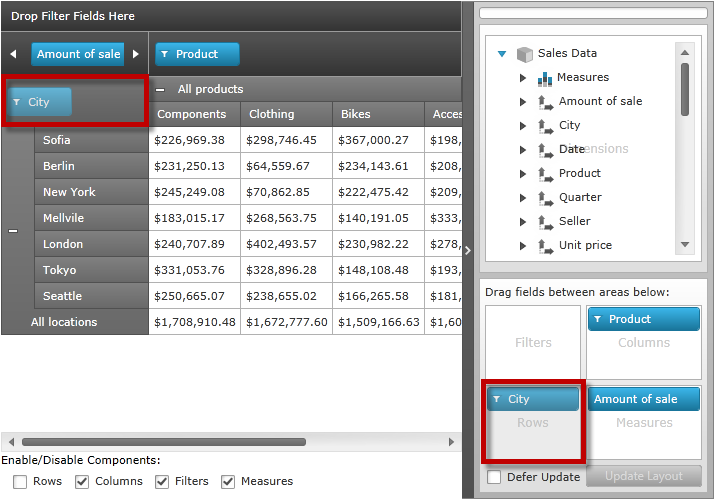
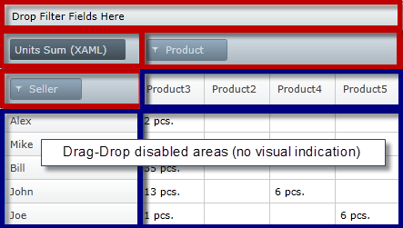

////

|metadata|
{
    "name": "xampivotgrid-component-locking",
    "controlName": ["xamPivotGrid"],
    "tags": ["Grids","How Do I","Layouts","Tips and Tricks","Validation"],
    "guid": "771fa45c-8ccc-48a1-a455-2a81a35d0dae",  
    "buildFlags": [],
    "createdOn": "2016-05-25T18:21:58.2273273Z"
}
|metadata|
////

= Component Locking (xamPivotGrid)

=== Purpose

This topic introduces the locking components feature of the  _xamPivotGrid_™ and the end-user functionality it provides.

=== Required background

The following table lists the materials required as a prerequisite to understanding this topic.

[options="header", cols="a,a"]
|====
|Type|Content

|Topics
|
* link:xampivotgrid-understanding-xampivotgrid.html[xamPivotGrid Overview] 

* link:xampivotgrid-getting-started-with-xampivotgrid.html[Getting Started with xamPivotGrid] 

* link:xampivotgrid-us-assigning-hierarchies-and-measures.html[Assigning Hierarchies and Measures] 

|====

== Introduction

=== Components Locking summary

The  _xamPivotGrid_   allows the disabling of rows, columns, filters or measure areas from editing. This capability is called “Component Locking”. This feature is useful when a droppable area of the  _xamPivotGrid_   or  _xamPivotDataSelector_™ should remain disabled for editing by a user. The locked area takes on a dimmed (greyed out) appearance when using the default styling. In the following picture, the rows area has been disabled to prevent editing. The red surrounding boxes highlight those areas.

By default, the components are enabled in the control to allow editing.

When editing is disabled for rows, columns, or measures, there is no visual indication for the row headers panel, columns header panel, and the data cell panel in  _xamPivotGrid_  , but drag-drop is still disabled for these panels. In the following illustration, the filters, measures, rows, and column areas (highlighted in red) are locked (and visually indicated as locked), but drag-and-drop is disabled also for the corresponding areas in data portion of the  _xamPivotGrid_   and there is no visual indication for this.

Component locking is managed by dedicated properties (one for each supported area) inside the link:{ApiPlatform}olap.v{ProductVersion}~infragistics.olap.datasourcebase~areafieldsettings.html[AreaFieldSettings] class object. For details, refer to link:xampivotgrid-componentlocking-lockingunlocking-component-areas.html[Locking/Unlocking Component Areas].

[[_Styling_of_locked]]
== Related Content

=== Topics

The following topics provide additional information related to this topic.

[options="header", cols="a,a"]
|====
|Topic|Purpose

| link:xampivotgrid-componentlocking-lockingunlocking-component-areas.html[Locking/Unlocking Component Areas]
|This topic explains, with code examples, how to lock/unlock component areas of the _xamPivotGrid_ .

|====