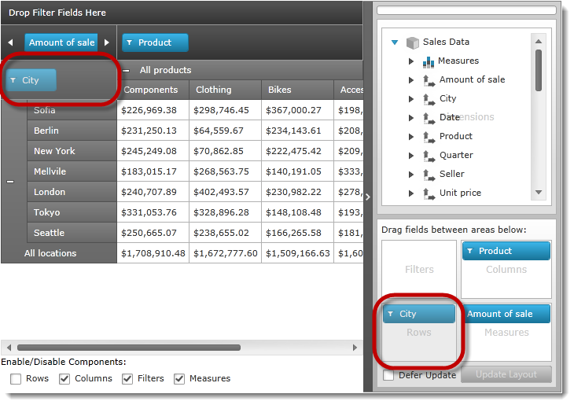

////
|metadata|
{
    "name": "xampivotgrid-componentlocking-lockingunlocking-component-areas",
    "controlName": ["xamPivotGrid"],
    "tags": ["Grids","How Do I","Tips and Tricks"],
    "guid": "6af83be2-7f8d-44cc-93f9-2c8b8b3e82fd",
    "buildFlags": [],
    "createdOn": "2016-05-25T18:21:58.2333295Z"
}
|metadata|
////

= Locking/Unlocking Component Areas (xamPivotGrid)

=== Purpose

This topic explains, with code examples, how to lock/unlock component areas of the _xamPivotGrid_™.

=== Required Background

The following table lists the materials required as a prerequisite to understanding this topic.

[options="header", cols="a,a"]
|====
|Type|Content

|Topics
|
* link:xampivotgrid-understanding-xampivotgrid.html[xamPivotGrid Overview] 

* link:xampivotgrid-getting-started-with-xampivotgrid.html[Getting Started with xamPivotGrid] 

* link:xampivotgrid-us-assigning-hierarchies-and-measures.html[Assigning Hierarchies and Measures] 

* link:xampivotgrid-component-locking.html[Component Locking] 

|====

=== In This Topic

This topic contains the following sections:

* <<_Ref320191869,Locking/Unlocking Component Areas – Conceptual Overview>>

** <<_Ref320215463,Locking/Unlocking component areas summary>>
** <<_Ref317163245,Property settings>>
** <<_Ref317163255,Example>>
** <<_Ref320215478,Code>>

* <<_Ref320015379,Code Example: Locking/Unlocking Component Areas>>

** <<_Ref320195473,Introduction>>
** <<_Ref320195478,Preview>>
** <<_Ref320195482,Prerequisites>>
** <<_Ref320195488,Overview>>
** <<_Ref320195492,Steps>>

* <<_Ref316548990,Related Content>>

[[_Ref320015379]]
[[_Ref320191869]]
== Locking/Unlocking Component Areas – Conceptual Overview

[[_Ref320215463]]
=== Locking/Unlocking component areas summary

Setting areas as locked or unlocked, is managed by the following link:{ApiPlatform}olap.v{ProductVersion}~infragistics.olap.datasourcebase~areafieldsettings.html[AreaFieldSettings] class object contains the Boolean properties:

* link:{ApiPlatform}olap.v{ProductVersion}~infragistics.olap.areafieldsettings~allowrowsediting.html[AllowRowsEditing]
* link:{ApiPlatform}olap.v{ProductVersion}~infragistics.olap.areafieldsettings~allowcolumnsediting.html[AllowColumnsEditing]
* link:{ApiPlatform}olap.v{ProductVersion}~infragistics.olap.areafieldsettings~allowfiltersediting.html[AllowFiltersEditing]
* link:{ApiPlatform}olap.v{ProductVersion}~infragistics.olap.areafieldsettings~allowmeasuresediting.html[AllowMeasuresEditing]

By default, all these areas are unlocked. (The properties are set to  _true_  .)

[[_Ref317163245]]

=== Property settings

The following table maps the tasks related to locking and unlocking components to the property settings that configure them.

[options="header", cols="a,a,a"]
|====
|In order to:|Use this property:|And set it to:

|Lock rows area
| link:{ApiPlatform}olap.v{ProductVersion}~infragistics.olap.areafieldsettings~allowrowsediting.html[AllowRowsEditing]
| _false_ 

|Lock columns area
| link:{ApiPlatform}olap.v{ProductVersion}~infragistics.olap.areafieldsettings~allowcolumnsediting.html[AllowColumnsEditing]
| _false_ 

|Lock filters area
| link:{ApiPlatform}olap.v{ProductVersion}~infragistics.olap.areafieldsettings~allowfiltersediting.html[AllowFiltersEditing]
| _false_ 

|Lock measures area
| link:{ApiPlatform}olap.v{ProductVersion}~infragistics.olap.areafieldsettings~allowmeasuresediting.html[AllowMeasuresEditing]
| _false_ 

|Unlock rows area
| link:{ApiPlatform}olap.v{ProductVersion}~infragistics.olap.areafieldsettings~allowrowsediting.html[AllowRowsEditing]
| _true_ 

|Unlock columns area
| link:{ApiPlatform}olap.v{ProductVersion}~infragistics.olap.areafieldsettings~allowcolumnsediting.html[AllowColumnsEditing]
| _true_ 

|Unlock filters area
| link:{ApiPlatform}olap.v{ProductVersion}~infragistics.olap.areafieldsettings~allowfiltersediting.html[AllowFiltersEditing]
| _true_ 

|Unlock measures area
| link:{ApiPlatform}olap.v{ProductVersion}~infragistics.olap.areafieldsettings~allowmeasuresediting.html[AllowMeasuresEditing]
| _true_ 

|====

[[_Ref317163255]]

=== Example

The following settings lock column editing and the ability to drag-drop onto this area. The remaining areas are not locked.

[options="header", cols="a,a"]
|====
|Property|Value

| _AllowRowsEditing_ 
|_true_

| _AllowColumnsEditing_ 
|_false_

| _AllowFiltersEditing_ 
|_true_

| _AllowMeasuresEditing_ 
|_true_

|====

.Note:
[NOTE]
====
The default value of each of these properties is `true`, the setting of the value `true` isn’t necessary and only shown for demonstration purposes.
====

[[_Ref320215478]]

=== Code

The following code implements the settings in the <<_Ref317163255,Example>>.

*In C#:*

[source,csharp]
----
((DataSourceBase)pivotGrid.DataSource).AreaFieldSettings.AllowRowsEditing = true;
((DataSourceBase)pivotGrid.DataSource).AreaFieldSettings.AllowColumnsEditing = false;
((DataSourceBase)pivotGrid.DataSource).AreaFieldSettings.AllowFiltersEditing = true;
((DataSourceBase)pivotGrid.DataSource).AreaFieldSettings.AllowMeasuresEditing = true;
----

*In Visual Basic:*

[source,vb]
----
DirectCast(pivotGrid.DataSource, DataSourceBase).AreaFieldSettings.AllowRowsEditing = True
DirectCast(pivotGrid.DataSource, DataSourceBase).AreaFieldSettings.AllowColumnsEditing = False
DirectCast(pivotGrid.DataSource, DataSourceBase).AreaFieldSettings.AllowFiltersEditing = True
DirectCast(pivotGrid.DataSource, DataSourceBase).AreaFieldSettings.AllowMeasuresEditing = True
----

[[_Ref320215493]]
[[_Ref316548990]]
== Locking/Unlocking Component Areas – Code Example

[[_Ref320195473]]

=== Introduction

This code example loads a  _xamPivotGrid_   with sample data, and uses check boxes to programmatically enable and disable the locking and unlocking of the rows, columns, filters, and measure areas of the grid and also on the  _xamPivotDataSelector_™.

[[_Ref320195478]]

=== Preview

The following screenshot is a preview of the final result. Overlaid boxes in red highlight the locked components.

[[_Ref320195482]]

=== Prerequisites

To complete the procedure, you need the following:

* A copy the of the SampleFlatDataSourceForLiveUpdate class in your application.
* Assembly references:

** {ApiPlatform}Controls.Grids.XamPivotGrid.v{ProductVersion}.dll
** {ApiPlatform}Controls.Menus.XamTree.v{ProductVersion}.dll
** {ApiPlatform}DragDrop.v{ProductVersion}.dll
** {ApiPlatform}Olap.FlatData.v{ProductVersion}.dll
** {ApiPlatform}Olap.Xmla.v{ProductVersion}.dll
** {ApiPlatform}Olap.v{ProductVersion}.dll
** {ApiPlatform}v{ProductVersion}.dll

.Note:
[NOTE]
====
The data source type of the _xamPivotGrid_ control determines what OLAP assembly references are required. Refer to the link:developers-guide-deploying-your-application.html[Deploying Your Application] topic for the complete list of required assemblies used by components of the _xamPivotGrid_ control and its data sources.
====

[[_Ref320195488]]
=== Overview

This topic takes you step-by-step toward implementing lockable components. The following is a conceptual overview of the process:

. Adding the namespace declarations
. Referencing the data source
. Adding the xamPivotGrid and xamPivotDataSelector controls
. Binding the data source
. Handling the user action

[[_Ref320195492]]
=== Steps

The following steps demonstrate how to create row groups.

=== Add the namespace declarations.

. *Add the namespace attributes to your XAML source file’s root tag.*
+
*In XAML:*
+
[source,xaml]
----
xmlns:ig="http://schemas.infragistics.com/xaml"
xmlns:local="clr-namespace:IGPivotGrid.Controls"
----

. *Declare namespace references to your code behind.*
+
*In C#:*
+
[source,csharp]
----
using IGPivotGrid.Controls;
using Infragistics.Olap;
using Infragistics.Olap.Xmla;
----
+
*In Visual Basic:*
+
[source,vb]
----
Imports IGPivotGrid.Controls
Imports Infragistics.Olap
Imports Infragistics.Olap.Xmla
----
+
.Note:
[NOTE]
====
`IGPivotGrid.Controls` is the namespace in which the `SampleFlatDataSourceForLiveUpdate` class is defined. This namespace might vary depending on where you added `SampleFlatDataSourceForLiveUpdate` class in your project.
====

. *Reference the data source.*
+
Reference the data source in the Page.Resources element.
+
*In XAML:*
+
[source,xaml]
----
<Page.Resources>
    <ResourceDictionary>
        <local:SampleFlatDataSourceForLiveUpdate x:Key="FlatDataSource" />            
    </ResourceDictionary>
</Page.Resources>
----

. *Add the xamPivotGrid and xamPivotDataSelector controls.*

.. Define the column layout for the LayoutRoot grid.
+
*In XAML:*
+
[source,xaml]
----
<Grid.ColumnDefinitions>
    <ColumnDefinition Width="*" />
    <ColumnDefinition Width="Auto" />
</Grid.ColumnDefinitions>
<Grid.RowDefinitions>
    <RowDefinition Height="*" />
    <RowDefinition Height="Auto" />
</Grid.RowDefinitions>
----

.. Add the xamPivotGrid, option check boxes, and the xamPivotDataSelector.
+
The DataSource attribute references the FlatDataSource that was defined in the Page.Resources.
+
*In XAML:*
+
[source,xaml]
----
<ig:XamPivotGrid
    x:Name="pivotGrid"
    DataSource="{StaticResource FlatDataSource}" 
    AllowCompactLayout="True"
    BorderThickness="0">
</ig:XamPivotGrid>
<TextBlock Grid.Row="1" 
    Text="{Binding Source={StaticResource Strings}, 
        Path=XPG_EnableDisable_Components}" />
<StackPanel x:Name="SelectorPanel" Grid.Row="1" Orientation="Horizontal" 
                  ScrollViewer.HorizontalScrollBarVisibility="Auto"
                  Margin="5, 15, 5, 5">
    <CheckBox x:Name="RowEditing" IsChecked="True"
        Margin="5" Click="Feature_Click"
        Content="{Binding Source={StaticResource Strings}, Path=XPG_Rows}" />
    <CheckBox x:Name="ColumnsEditing" IsChecked="True"
        Margin="5" Click="Feature_Click"
        Content="{Binding Source={StaticResource Strings}, Path=XPG_Columns}" />
    <CheckBox x:Name="FiltersEditing" IsChecked="True"
        Margin="5" Click="Feature_Click"
        Content="{Binding Source={StaticResource Strings}, Path=XPG_Filters}" />
    <CheckBox x:Name="MeasuresEditing" IsChecked="True"
    Margin="5" Click="Feature_Click"
    Content="{Binding Source={StaticResource Strings}, Path=XPG_Measures}" />
</StackPanel>
<ig:Expander Grid.Column="1" Grid.RowSpan="2" IsExpanded="True">
    <ig:XamPivotDataSelector x:Name="dataSelector" 
        DataSource="{StaticResource FlatDataSource}" />
</ig:Expander>
----

. *Bind the data source.*

.. In the code behind, add a handler for the Loaded event underneath the called method, InitializeComponent.
+
*In C#:*
+
[source,csharp]
----
public LockableComponents()
{
    InitializeComponent();
    this.Loaded += OnSampleLoaded;
}
----
+
*In Visual Basic:*
+
[source,vb]
----
Public Sub New()
    InitializeComponent()
    Me.Loaded = OnSampleLoaded
End Sub
----

.. Inside the Loaded event handler, reference and load the schema of data source.
+
*In C#:*
+
[source,csharp]
----
void OnSampleLoaded(object sender, RoutedEventArgs e)
{
      SampleFlatDataSourceForLiveUpdate dataSource = this.Resources["FlatDataSource"] as SampleFlatDataSourceForLiveUpdate;
      if (dataSource != null)
            dataSource.LoadSchemaAsync();
}
----
+
*In Visual Basic:*
+
[source,vb]
----
Private Sub OnSampleLoaded(sender As Object, e As RoutedEventArgs)
      Dim dataSource As SampleFlatDataSourceForLiveUpdate = TryCast(Me.Resources("FlatDataSource"), SampleFlatDataSourceForLiveUpdate)
      If dataSource IsNot Nothing Then
            dataSource.LoadSchemaAsync()
      End If
End Sub
----

. *Handling the user action.*
+
In the code behind, add a handler for the Click event of the CheckBox control.
+
*In C#:*
+
[source,csharp]
----
private void Feature_Click(object sender, RoutedEventArgs e)
{
    FrameworkElement element = sender as FrameworkElement;
    CheckBox cb = sender as CheckBox;
    if (element == null || cb == null)
        return;
    switch (element.Name)
    {
        case "RowEditing":
            ((DataSourceBase)pivotGrid.DataSource).AreaFieldSettings.AllowRowsEditing =
                (Boolean)cb.IsChecked;
            break;
        case "ColumnsEditing":
            ((DataSourceBase)pivotGrid.DataSource).AreaFieldSettings.AllowColumnsEditing =
                (Boolean)cb.IsChecked;
            break;
        case "FiltersEditing":
            ((DataSourceBase)pivotGrid.DataSource).AreaFieldSettings.AllowFiltersEditing =
                (Boolean)cb.IsChecked;
            break;
        case "MeasuresEditing":
            ((DataSourceBase)pivotGrid.DataSource).AreaFieldSettings.AllowMeasuresEditing =
                (Boolean)cb.IsChecked;
            break;
      }
}
----
+
*In Visual Basic:*
+
[source,vb]
----
Private Sub Feature_Click(sender As Object, e As RoutedEventArgs)
    Dim element As FrameworkElement = TryCast(sender, FrameworkElement)
    Dim cb As CheckBox = TryCast(sender, CheckBox)
    If element Is Nothing OrElse cb Is Nothing Then
        Return
    End If
    Select Case element.Name
        Case "RowEditing"
            DirectCast(pivotGrid.DataSource, DataSourceBase).AreaFieldSettings.AllowRowsEditing = DirectCast(cb.IsChecked, [Boolean])
            Exit Select
        Case "ColumnsEditing"
            DirectCast(pivotGrid.DataSource, DataSourceBase).AreaFieldSettings.AllowColumnsEditing = DirectCast(cb.IsChecked, [Boolean])
            Exit Select
        Case "FiltersEditing"
            DirectCast(pivotGrid.DataSource, DataSourceBase).AreaFieldSettings.AllowFiltersEditing = DirectCast(cb.IsChecked, [Boolean])
            Exit Select
        Case "MeasuresEditing"
            DirectCast(pivotGrid.DataSource, DataSourceBase).AreaFieldSettings.AllowMeasuresEditing = DirectCast(cb.IsChecked, [Boolean])
            Exit Select
    End Select
End Sub
----

== Related Content

=== Topics

The following topics provide additional information related to this topic.

[options="header", cols="a,a"]
|====
|Topic|Purpose

| link:xampivotgrid-component-locking.html[Component Locking]
|This topic introduces the locking components feature of the _xamPivotGrid_ and the end-user functionality it provides.

|====