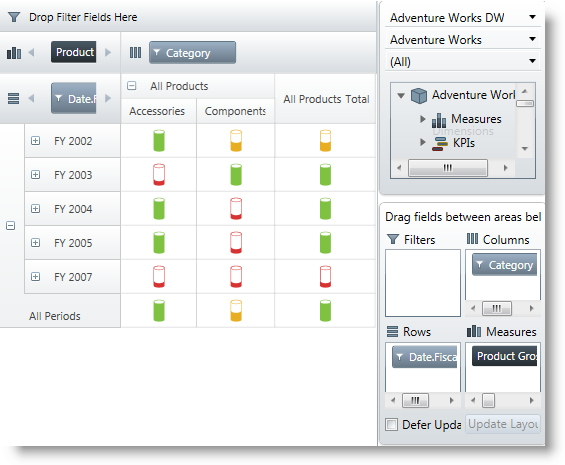
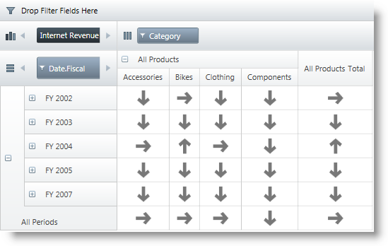
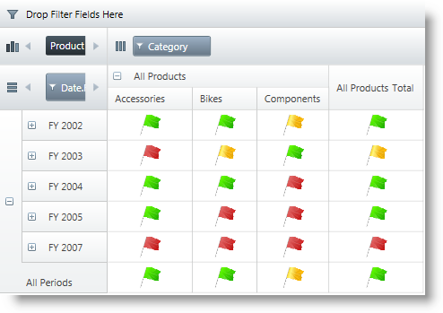

////
|metadata|
{
    "name": "xampivotgrid-configuring-kpis-visualization2",
    "controlName": ["xamPivotGrid"],
    "tags": [],
    "guid": "31b3c30c-4cc8-4cfd-a59e-76d499cdde8f","buildFlags": [],
    "createdOn": "2016-05-25T18:21:58.3603351Z"
}
|metadata|
////

= Configuring Key Performance Indicators (KPIs) Visualization (xamPivotGrid, xamPivotDataSelector)

== Topic Overview

=== Purpose

This topic explains how to customize the way Key Performance Indicators (KPIs) are visualized in the  _xamPivotGrid_™ and  _xamPivotDataSelector_™ controls.

=== Required background

The following topics are prerequisites to understanding this topic:

[options="header", cols="a,a"]
|====
|Topic|Purpose

| link:xampivotgrid-kpis-visualization-overview.html[KPIs Overview]
|This topic explains conceptually how the KPIs data from a multi-dimensional (OLAP) data set is visualized in {ProductName}®.

| link:xampivotgrid-databinding-using-xmladatasource.html[Using XmlaDataSource]
|This topic explains how to bind the _xamPivotGrid_ control to data using the _XmlaDataSource_™ component.

|====

=== In this topic

This topic contains the following sections:

* <<_Ref380418734,Configuring KPI Visualization Overview>>

** <<_Ref380418739,Configuring KPI visualization summary>>
** <<_Ref377459969,Configuring KPI visualization summary chart>>

* <<_Ref380418751,Displaying KPIs in the Pivot Table Programmatically>>

** <<_Ref377459977,Introduction>>
** <<_Ref377459981,Preview>>
** <<_Ref382416579,Prerequisites>>
** <<_Ref377459986,Steps>>

* <<_Ref380411551,Choosing a Pre-Defined KPI Visualization>>

** <<_Ref380418790,Introduction>>
** <<_Preview,Preview>>
** <<_Prerequisites,Prerequisites>>
** <<_Overview,Overview>>
** <<_Ref380418807,Steps>>

* <<_Ref380418811,Configuring a Custom Visualization Using Properties>>

** <<_Ref380418818,Introduction>>
** <<_Ref380418822,Preview>>
** <<_Ref380418826,Prerequisites>>
** <<_Ref380418829,Steps>>

* <<_ConfiguringCustomTemplate,Configuring a Custom Visualization Using a Custom Template>>
* <<_Ref380418833, Related Content >>

[[_Ref377459963]]

[[_Ref377366929]]

[[_Ref380418734]]
== Configuring KPI Visualization Overview

[[_Ref380418739]]

=== Configuring KPI visualization summary

An individual indicator can be visualized in the  _xamPivotGrid_   by drag-and-dropping it from the metadata tree to the Measures area of the pivot grid or by programmatically adding it to its Measures collection.

When applicable (depending on its KPI type), a KPI can be visualized as either a value or a graphical representation (icon).

A pre-defined set of graphical representations (shapes set) is available by default. This setting is controlled by the link:{ApiPlatform}controls.grids.xampivotgrid.v{ProductVersion}~infragistics.controls.grids.kpicelltemplate~graphic.html[Graphic] property of the link:{ApiPlatform}controls.grids.xampivotgrid.v{ProductVersion}~infragistics.controls.grids.kpicelltemplate_members.html[KpiCellTemplate] objects.

Further customization, such as specifying a user choice of images representing the different KPIs values states (-1, 0 and 1), is possible by setting the `Graphic` property to  "_ThreeStateImages_" and then providing the desired image sources (For details, see link:xampivotgrid-configuring-kpis-visualization.html#_Ref377459969[Configuring KPI visualization summary chart]). An alternative approach would be to override the link:{ApiPlatform}controls.grids.xampivotgrid.v{ProductVersion}~infragistics.controls.grids.kpicelltemplate~template.html[Template] property of a link:{ApiPlatform}controls.grids.xampivotgrid.v{ProductVersion}~infragistics.controls.grids.kpicelltemplate_members.html[KpiCellTemplate] instance, providing a custom template.

[[_Ref377459969]]

=== Configuring KPI visualization summary chart

The following table explains briefly the configurable aspects of KPI visualization in the pivot grid (the _xamPivotGrid_ and _xamPivotDataSelector_ controls) and maps them to the properties with which this configuration is achieved. The green-highlighted tasks in the table are further detailed in this help as individual procedures.

[options="header", cols="15a,10a,10a,40a,25a"]
|====
|Configurable aspect
2+|Task
|Details
|Properties / Events

|KPI visualization in the metadata tree
2+|Preventing KPIs from displaying
|KPIs are displayed by default; you need to explicitly disable KPI data from displaying.
|link:{ApiPlatform}olap.xmla.v{ProductVersion}~infragistics.olap.xmla.xmladatasource~metadatatreeitemadding_ev.html[MetadataTreeItemAdding] 

|KPI visualization in the pivot grid
2+|Displaying KPIs in the pivot grid programmatically
|Add a `KpiMeasure` to the `Measures` collection of the `DataSourceBase` instance.
|link:{ApiPlatform}olap.v{ProductVersion}~infragistics.olap.datasourcebase~measures.html[DataSourceBase.Measures] 

.3+|Graphical representation
2+|Choosing a pre-defined visualization
|Set the `Indicator` and the `Graphic` properties of the `KpiCellTemplate`.
|link:{ApiPlatform}controls.grids.xampivotgrid.v{ProductVersion}~infragistics.controls.grids.kpicelltemplate~indicator.html[KpiCellTemplate.Indicator] 
link:{ApiPlatform}controls.grids.xampivotgrid.v{ProductVersion}~infragistics.controls.grids.kpicelltemplate~graphic.html[KpiCellTemplate.Graphic] 

.2+|Configuring a custom visualization
|Using properties
|Set the `Graphic` property of the `KpiCellTemplate` to `ThreeStateImages` and then provide the images corresponding to each state as values of the respective properties.
|link:{ApiPlatform}controls.grids.xampivotgrid.v{ProductVersion}~infragistics.controls.grids.kpicelltemplate~graphic.html[KpiCellTemplate.Graphic] 
link:{ApiPlatform}controls.grids.xampivotgrid.v{ProductVersion}~infragistics.controls.grids.kpicelltemplate~negativeimagesource.html[KpiCellTemplate.NegativeImageSource] 
link:{ApiPlatform}controls.grids.xampivotgrid.v{ProductVersion}~infragistics.controls.grids.kpicelltemplate~zeroimagesource.html[KpiCellTemplate.ZeroImageSource] 
link:{ApiPlatform}controls.grids.xampivotgrid.v{ProductVersion}~infragistics.controls.grids.kpicelltemplate~positiveimagesource.html[KpiCellTemplate.PositiveImageSource] 

|Using a custom template
|Assign a custom template to the `Template` property of a KpiCellTemplate instance.
|link:{ApiPlatform}controls.grids.xampivotgrid.v{ProductVersion}~infragistics.controls.grids.kpicelltemplate~template.html[KpiCellTemplate.Template] 

|====

[[_Ref377459973]]

[[_Displaying_KPIs_in]]
[[_Ref380418751]]
== Displaying KPIs in the Pivot Grid Programmatically

[[_Ref377459977]]
=== Introduction

To display the value of a KPI or visualize its graphical representation in the  _xamPivotGrid_   programmatically, access a link:{ApiPlatform}olap.v{ProductVersion}~infragistics.olap.data.base.kpimeasure_members.html[KpiMeasure] member from the link:{ApiPlatform}olap.v{ProductVersion}~infragistics.olap.data.icube~measures.html[ICube.Measures] collection and add to the link:{ApiPlatform}olap.v{ProductVersion}~infragistics.olap.datasourcebase~measures.html[DataSourceBase.Measures] collection. You need to do this for all KPIs you want to display.

The particular procedure below demonstrates how to add a  _Status_  -based KPI graphical representation to the cells of a  _xamPivotGrid_   using XMLA as data source (the Adventure Works DW 2008 database).

[[_Ref377459981]]
=== Preview

The following screenshot is a preview of the final result.

[[_Ref382416579]]
=== Prerequisites

To complete the procedure, you need the following:

* A {PlatformName} application with a page
* Instances of  _xamPivotGrid_   and  _xamPivotDataSelector_   that use XMLA as data source (the Adventure Works DW 2008 database) added to the page

[[_Ref377459986]]
=== Steps

The following steps demonstrate how to display KPIs in the pivot grid programmatically.

[start=1]
. Obtain the KPI item by its unique name.
+
*Obtain the KPI item from the `ICube.Kpis` collection.*
+
*In C#:*
+
[source,csharp]
----
IKpi kpi = dataSource.Cube.Kpis["Product Gross Profit Margin"];
----
+
*In Visual Basic:*
+
[source,vb]
----
Dim kpi As IKpi = dataSource.Cube.Kpis("Product Gross Profit Margin")
----

[start=2]
. Specify the metadata type of the KPI member.
+
*Select the desired metadata type member from the*  link:{ApiPlatform}olap.v{ProductVersion}~infragistics.olap.data.ikpi.html[IKpi] *object*  created in step 1.
+
In this procedure, select a `Status` member.
+
*In C#:*
+
[source,csharp]
----
KpiMeasure kpiStatusMeasure = (KpiMeasure)dataSource.Cube.Measures[kpi.KpiStatus];
----
+
*In Visual Basic:*
+
[source,vb]
----
Dim kpiStatusMeasure As KpiMeasure = DirectCast(dataSource.Cube.Measures(kpi.KpiStatus), KpiMeasure)
----

[start=3]
. Specify the area in which to display the KPI item.
+
Add the `KpiMeasure` to the `Measures` collection of _xamPivotGrid_’s data source so that it gets displayed in the Measures area.
+
*In C#:*
+
[source,csharp]
----
IMeasureViewModel mvm = dataSource.CreateMeasureViewModel(kpiStatusMeasure);
dataSource.Measures.Add(mvm);
----
+
*In Visual Basic:*
+
[source,vb]
----
Dim mvm As IMeasureViewModel = dataSource.CreateMeasureViewModel(kpiStatusMeasure)
dataSource.Measures.Add(mvm)
----

[[_Ref377459991]]
[[_Specifying_a_Pre-Defined]]
[[_Ref380411551]]
== Specifying a Pre-Defined KPI Visualization

[[_Ref380418790]]
=== Introduction

A graphical representation of a KPI derived from the Analysis Service (graphic type) is visualized using predefined templates corresponding to that type by default when the respective link:{ApiPlatform}olap.v{ProductVersion}~infragistics.olap.data.base.kpimeasure_members.html[KpiMeasure] has been added to the link:{ApiPlatform}olap.xmla.v{ProductVersion}~infragistics.olap.xmla.xmladatasource~measures.html[Measures] collection of the link:{ApiPlatform}olap.v{ProductVersion}~infragistics.olap.datasourcebase.html[DataSourceBase] class.

In this procedure, link:xampivotgrid-kpis-visualization-overview.html#_Ref382419114[a Status-based key performance indicator] is configured to be visualized in the cells of a xamPivotGrid control using arrow-like shapes (There is a set of predefined shapes in the link:{ApiPlatform}controls.grids.xampivotgrid.v{ProductVersion}~infragistics.controls.grids.graphictype.html[GraphicType] enumeration for visually representing KPI member items.).

[[_Preview]]
=== Preview

The following screenshot is a preview of the final result.

[[_Prerequisites]]
=== Prerequisites

To complete the procedure, you need the following:

* A {PlatformName} application with a page
* An instance of _xamPivotGrid_ using XMLA as data source (the Adventure Works DW 2008 database) added to the page.

[[_Overview]]
=== Overview

Following is a conceptual overview of the process:

[start=1]
. *Configuring the data source* 
[start=2]
. *Choosing the KPI member to be used* 
[start=3]
. *Specifying the metadata type of the KPI member* 
[start=4]
. *Changing the default graphics* 
[start=5]
. *Applying the cell template* 

[[_Ref380418807]]

=== Steps

The following steps demonstrate how to visualize a Status-based KPI in the cells of  _xamPivotGrid_ using arrow-like shapes.

[start=1]
. *Configure the data source.*
+
Configure the data source for the xamPivotGrid control. In this procedure, use the following settings:
+
*In XAML:*
+
[source,xaml]
----
<igOlap:XmlaDataSource
    ServerUri="http://sampledata.infragistics.com/olap/msmdpump.dll"
    Database="Adventure Works DW 2008"
    Cube="Adventure Works"
    Columns="[Product].[Category]"
    Rows="[Date].[Fiscal]"
    Measures="[Measures].[Internet Revenue Status]" />
----

[start=2]
. *Choose the KPI member to be used.*
+
To indicate which KPI is going to be used, set the  link:{ApiPlatform}controls.grids.xampivotgrid.v{ProductVersion}~infragistics.controls.grids.kpicelltemplate~membername.html[MemberName] property of a new  link:{ApiPlatform}controls.grids.xampivotgrid.v{ProductVersion}~infragistics.controls.grids.kpicelltemplate_members.html[KpiCellTemplate] instance to the desired value. In this procedure, set the `MemberName` property to `Internet Revenue`.
+
*In XAML:*
+
[source,xaml]
----
<ig:KpiCellTemplate MemberName="Internet Revenue"/>
----

[start=3]
. *Specify the metadata type of the member item.*
+
Set the `Indicator` property of the `KpiCellTemplate` instance to the desired `metadata type`.
+
In this procedure, set the `Indicator` property to `Status`.
+
*In XAML:*
+
[source,xaml]
----
<ig:KpiCellTemplate MemberName="Internet Revenue" Indicator="Status" />
----

[start=4]
. *Change the default graphics.*
+
From the set of predefined shapes corresponding to the values of the `GraphicType` enumeration, select a shape to use and set the desired shape as a value for the  link:{ApiPlatform}controls.grids.xampivotgrid.v{ProductVersion}~infragistics.controls.grids.kpicelltemplate~graphic.html[Graphic] property of the `KpiCellTemplate` object.
+
In this procedure, set the `Graphic` property to `StandardArrow`.
+
*In XAML:*
+
[source,xaml]
----
<ig:KpiCellTemplate
    MemberName="Internet Revenue"
    Indicator="Status"
    Graphic="StandardArrow" />
----
+
For a list of pre-defined shapes, please refer to the API documentation.

[start=5]
. *Apply the cell template.*
+
Add the link:{ApiPlatform}controls.grids.xampivotgrid.v{ProductVersion}~infragistics.controls.grids.kpicelltemplate_members.html[KpiCellTemplate] object to the `KpiCellTemplates`  collection of the _xamPivotGrid_.
+
*In XAML:*
+
[source,xaml]
----
<ig:XamPivotGrid.KpiCellTemplates>
    <ig:KpiCellTemplate
        MemberName="Internet Revenue"
        Indicator="Status"
        Graphic="StandardArrow" />
</ig:XamPivotGrid.KpiCellTemplates>
----

[[_Ref377460012]]
[[_Configuring_a_Custom]]
[[_Ref380418811]]
[[_Ref382424437]]
== Configuring a Custom Visualization Using Properties

[[_Ref380418818]]
=== Introduction

To provide a custom visualization, you need a set of custom images to represent each KPI state. You set the link:{ApiPlatform}controls.grids.xampivotgrid.v{ProductVersion}~infragistics.controls.grids.kpicelltemplate~graphic.html[Graphic] property of the link:{ApiPlatform}controls.grids.xampivotgrid.v{ProductVersion}~infragistics.controls.grids.kpicelltemplate_members.html[KpiCellTemplate] object to `ThreeStateImages` and then provide the images corresponding to each state as values of the respective properties. To apply the template to the cells of the _xamPivotGrid_ the KpiCellTemplate object must be added to _xamPivotGrid_{empty}'s `KpiCellTemplates` collection.

[[_Ref380418822]]
=== Preview

The following screenshot is a preview of the final result.

[[_Ref380418826]]
=== Prerequisites

To complete the procedure, you need the following:

* A {PlatformName} application with a page
* An instance of _xamPivotGrid_ using XMLA as data source (the Adventure Works DW 2008 database) added to the page.

[[_Ref380418829]]
=== Steps

The following steps demonstrate how to configure a custom KPI member item visualization using properties.

[start=1]
. *Configure the data source.*
+
Configure the data source for the _xamPivotGrid_ control. In this procedure, use the following settings:
+
*In XAML:*
+
[source,xaml]
----
<igOlap:XmlaDataSource
    ServerUri="http://sampledata.infragistics.com/olap/msmdpump.dll"
    Database="Adventure Works DW 2008"
    Cube="Adventure Works"
    Columns="[Product].[Category]"
    Rows="[Date].[Fiscal]"
    Measures="[Measures].[Product Gross Profit Margin Status]" />
----

[start=2]
. *Configure the use of custom images.*
+
Indicate that three images are going to be explicitly provided to visualize the different KPI values. To do this, set the  link:{ApiPlatform}controls.grids.xampivotgrid.v{ProductVersion}~infragistics.controls.grids.kpicelltemplate~graphic.html[Graphic] property of the `KPICellTemplate` object to `ThreeStateImages`.
+
*In XAML:*
+
[source,xaml]
----
<ig:XamPivotGrid.KpiCellTemplates>
    <ig:KpiCellTemplate 
        MemberName="Product Gross Profit Margin"
        Indicator="Status"
        Graphic="ThreeStateImages" />
</ig:XamPivotGrid.KpiCellTemplates>
----

[start=3]
. *Specify the images.*
+
Use the following snippet to provide the sources of the three images to be displayed as indicators of the three possible KPI member item values: 0, -1 and 1:
+
*In XAML:*
+
[source,xaml]
----
<ig:XamPivotGrid.KpiCellTemplates>
    <ig:KpiCellTemplate
        MemberName="Product Gross Profit Margin"
        Indicator="Status"
        Graphic="ThreeStateImages"
        NegativeImageSource="..\..\StatusFlagRed256.png"
        ZeroImageSource="..\..\StatusFlagYellow256.png"
        PositiveImageSource="..\..\StatusFlagGreen256.png" />
</ig:XamPivotGrid.KpiCellTemplates>
----

[[_Ref377460028]]
[[_ConfiguringCustomTemplate]]
== Configuring a Custom Visualization Using a Custom Template

=== Configuring a custom template summary

It is possible to apply a custom template for the graphical representation of a KPI by overriding `Template` property of an instance of. The `KpiCellTemplate` object is then added to _xamPivotGrid_'s `KpiCellTemplates` collection. Such an overriding takes precedence over setting the link:{ApiPlatform}controls.grids.xampivotgrid.v{ProductVersion}~infragistics.controls.grids.kpicelltemplate~graphic.html[Graphic] type to `ThreeStateImages` and providing the image sources (the approach described in link:xampivotgrid-configuring-kpis-visualization.html#_Ref382424437[Configuring a Custom Visualization Using Properties]).

The `DataContext` of the template depends on the value for the respective cell. This allows for direct binding to display/get this value and for using an `IValueConverter` to translate the value into the required 3-state custom representation in the custom template.

[[_Ref380418833]]
== Related Content

[[_Ref377366968]]
=== Sample

The following samples provide additional information related to this topic.

[options="header", cols="a,a"]
|====
|Sample|Purpose

|link:{SamplesURL}/pivot-grid/kpi-cells[KPI Cells] 

|This sample demonstrates displaying KPIs in _xamPivotDataSelector_ and _xamPivotGrid_ with both default and custom KPIs data templates.

|====