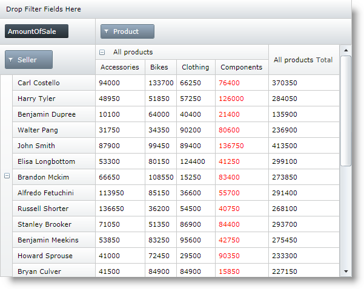
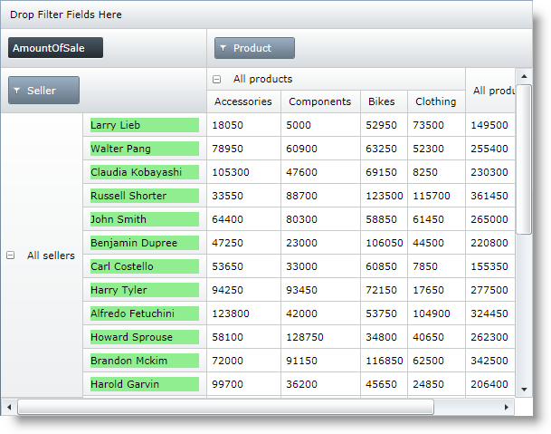
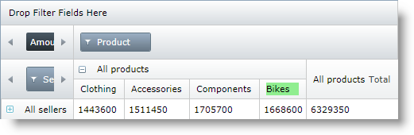

////
|metadata|
{
    "name": "xampivotgrid-customizing-cells-with-templates-overview",
    "controlName": ["xamPivotGrid"],
    "tags": [],
    "guid": "a5fdf5b9-ec36-4155-8623-839126c31111","buildFlags": [],
    "createdOn": "2016-05-25T18:21:58.2093267Z"
}
|metadata|
////

= Customizing Cells with Templates Overview (xamPivotGrid)

== Topic Overview

=== Purpose

The xamPivotGrid™ control enables you to specify custom data templates for data cells and for header column and row cells. This topic is an overview of this feature.

=== Required background

The following table lists the topics required as a prerequisite to understanding this topic.

[options="header", cols="a,a"]
|====
|Topic|Purpose

| link:xampivotgrid-understanding-xampivotgrid.html[xamPivotGrid Overview]
|This section serves as an introduction to the xamPivotGrid control's key features and functionalities. The topics listed here will give you a better idea of why you would want to use xamPivotGrid in your applications.

| link:xampivotgrid-getting-started-with-xampivotgrid.html[Getting Started with xamPivotGrid]
|This topic demonstrates how to get started with the xamPivotGrid control by providing step-by-step procedure for adding this control to a {PlatformName} application.

|====

=== In this topic

This topic contains the following sections:

* <<_Ref319950266, Control Configuration Summary >>

** <<_Ref319950270,Control configuration overview>>

* <<_Ref319950274, Specifying Custom Templates for Data >>

** <<_Ref319950276,Overview>>
** <<_Ref319950279,Property settings>>
** <<_Ref319950282,Example>>

* <<_Ref319950285, Specifying Custom Templates for Column and/or Row Header >>

** <<_Ref319950288,Overview>>
** <<_Ref319950295,Property settings>>
** <<_Ref319950297,RowHeader Template Example>>
** <<_Ref319950304,ColumnHeader Template Example>>

* <<_Ref319950307, Related Content >>

** <<_Ref319950310,Topics>>
** <<_Ref319950313,Samples>>

[[_Ref319950266]]
== Control Configuration Summary

[[_Ref319950270]]
=== Control configuration overview

The following table lists the configurable aspects of applying custom templates to xamPivotGrid cells.

[options="header", cols="a,a,a"]
|====
|Configurable aspects|Details|Properties

|Specifying custom templates for data cells
|The xamPivotGrid control provides the option to specify custom `DataTemplate` for a cell, or a group of cells. For example, all cells in a column, all cells in a row, all cells at some level etc.
| *XamPivotGrid properties* 

* link:{ApiPlatform}controls.grids.xampivotgrid.v{ProductVersion}~infragistics.controls.grids.xampivotgrid~datacelltemplates.html[DataCellTemplates] 

link:{ApiPlatform}controls.grids.xampivotgrid.v{ProductVersion}~infragistics.controls.grids.datacelltemplate_members.html[DataCellTemplate] *properties* 

* link:{ApiPlatform}controls.grids.xampivotgrid.v{ProductVersion}~infragistics.controls.grids.datacelltemplate~columnhierarchy.html[ColumnHierarchy] 

* link:{ApiPlatform}controls.grids.xampivotgrid.v{ProductVersion}~infragistics.controls.grids.datacelltemplate~columnlabel.html[ColumnLabel] 

* link:{ApiPlatform}controls.grids.xampivotgrid.v{ProductVersion}~infragistics.controls.grids.datacelltemplate~columnlevel.html[ColumnLevel] 

* link:{ApiPlatform}controls.grids.xampivotgrid.v{ProductVersion}~infragistics.controls.grids.datacelltemplate~rowhierarchy.html[RowHierarchy] 

* link:{ApiPlatform}controls.grids.xampivotgrid.v{ProductVersion}~infragistics.controls.grids.datacelltemplate~rowlabel.html[RowLabel] 

* link:{ApiPlatform}controls.grids.xampivotgrid.v{ProductVersion}~infragistics.controls.grids.datacelltemplate~rowlevel.html[RowLevel] 

* link:{ApiPlatform}controls.grids.xampivotgrid.v{ProductVersion}~infragistics.controls.grids.datacelltemplate~template.html[Template] 

|Specifying custom templates for column and/or row header cells
|In addition to data cells you can specify custom templates for header cells too.
| *XamPivotGrid* *properties* 

* link:{ApiPlatform}controls.grids.xampivotgrid.v{ProductVersion}~infragistics.controls.grids.xampivotgrid~columnheadertemplates.html[ColumnHeaderTemplates] 

* link:{ApiPlatform}controls.grids.xampivotgrid.v{ProductVersion}~infragistics.controls.grids.xampivotgrid~rowheadertemplates.html[RowHeaderTemplates] 

link:{ApiPlatform}controls.grids.xampivotgrid.v{ProductVersion}~infragistics.controls.grids.headertemplate_members.html[HeaderTemplate] *properties* 

* link:{ApiPlatform}controls.grids.xampivotgrid.v{ProductVersion}~infragistics.controls.grids.headertemplate~hierarchy.html[Hierarchy] 

* link:{ApiPlatform}controls.grids.xampivotgrid.v{ProductVersion}~infragistics.controls.grids.headertemplate~label.html[Label] 

* link:{ApiPlatform}controls.grids.xampivotgrid.v{ProductVersion}~infragistics.controls.grids.headertemplate~level.html[Level] 

* link:{ApiPlatform}controls.grids.xampivotgrid.v{ProductVersion}~infragistics.controls.grids.headertemplate~template.html[Template] 

|====

[[_Ref319950274]]
== Specifying Custom Templates for Data Cells

[[_Ref319950276]]
=== Overview

The xamPivotGrid exposes the `DataCellTemplates` property. The type of this property is a collection of `DataCellTemplate` objects. The `DataCellTemplate` class serves as a container for a `DataTemplate` applied to the content of data cells of the xamPivotGrid. Additionally it has some properties used to determine which data cells the `DataTemplate` will be applied to.

[[_Ref319950279]]
=== Property settings

The following table maps the desired configuration to property settings.

[options="header", cols="a,a,a"]
|====
|In order to:
|Use this property:
|And set it to:

|Apply custom data templates to data cells of the xamPivotGrid
|`DataCellTemplates`
|A collection of `DataCellTemplate` objects

|====

[[_Ref319950282]]
=== Example

The screenshot below demonstrates how the xamPivotGrid looks when a DataCellTemplate with the following properties is added to its DataCellTemplates collection. The data source used is the SalesDataSample resource.

[options="header", cols="a,a"]
|====
|Property|Value

|`Template`
|A `DataTemplate` containing a `Textblock` with red foreground.

|`ColumnHierarchy`
| _Product_ 

|`ColumnLabel`
| _Components_ 

|====

[[_Ref319950285]]
== Specifying Custom Templates for Column and/or Row Header Cells

[[_Ref319950288]]
=== Overview

The xamPivotGrid exposes the link:{ApiPlatform}controls.grids.xampivotgrid.v{ProductVersion}~infragistics.controls.grids.xampivotgrid~rowheadertemplates.html[RowHeaderTemplates] and link:{ApiPlatform}controls.grids.xampivotgrid.v{ProductVersion}~infragistics.controls.grids.xampivotgrid~columnheadertemplates.html[ColumnHeaderTemplates] properties. The type of these properties is a collection of link:{ApiPlatform}controls.grids.xampivotgrid.v{ProductVersion}~infragistics.controls.grids.headertemplate_members.html[HeaderTemplate] objects. The `HeaderTemplate` class is similar to the `DataCellTemplate`, but the properties that determine where the `DataTemplate` is applied, are applicable to header cells rather than data cells.

[[_Ref319950295]]
=== Property settings

The following table maps the desired configuration to property settings.

[options="header", cols="a,a,a"]
|====
|In order to:
|Use this property:
|And set it to:

|Apply custom data templates to column header cells of the xamPivotGrid
|`ColumnHeaderTemplates`
|A collection of `HeaderTemplate` objects

|Apply custom data templates to row header cells of the xamPivotGrid
|`RowHeaderTemplates`
|A collection of `HeaderTemplate` objects

|====

[[_Ref319950297]]
=== RowHeader Template Example

The screenshot below demonstrates how the xamPivotGrid looks when a HeaderTemplate with the following properties is added to its RowHeaderTemplates collection.

[options="header", cols="a,a"]
|====
|Property|Value

|Template
|A `DataTemplate` containing a grid with light green background and a text block in it.

|Hierarchy
| _Seller_ 

|Level
| _1_ 

|====

[[_Ref319950304]]
=== ColumnHeader Template Example

The screenshot below demonstrates how the xamPivotGrid looks when a `HeaderTemplate` with the following properties is added to its `ColumnHeaderTemplates` collection.

[options="header", cols="a,a"]
|====
|Property|Value

|Template
|A `DataTemplate` containing a grid with light green background and a text block in it.

|Label
| _Bikes_ 

|====

[[_Ref319950307]]
== Related Content

[[_Ref319950310]]
=== Topics

The following topics provide additional information related to this topic.

[options="header", cols="a,a"]
|====
|Topic|Purpose

| link:xampivotgrid-customizing-cells-with-templates-procedure-and-code-example.html[Customizing Cells with Templates - Procedure and Code Example]
|This topic is a step-by-step walkthrough on how to customize xamPivotGrid™ cells by applying custom DataTemplates for their content.

| link:xampivotgrid-customizing-cells-with-templates-property-reference.html[Customizing Cells with Templates Property Reference]
|This is a list of the most notable properties related to the Cell customization feature of the xamPivotGrid.

| link:xampivotgrid-us-conditional-formating.html[Conditional Formating]
|Explanation on how to use the CellControlAttached event to apply custom styles to data cells based on the cell’s value.

|====

[[_Ref319950313]]
=== Samples

The following samples provide additional information related to this topic.

[options="header", cols="a,a"]
|====
|Sample|Purpose

|link:{SamplesURL}/pivot-grid/custom-header-and-cell-templates[Custom Header and Cell Templates] 

|This sample demonstrates how to apply custom DataTemplates for data and header cells of the pivot grid based on a cell’s hierarchy, level and label.

|====