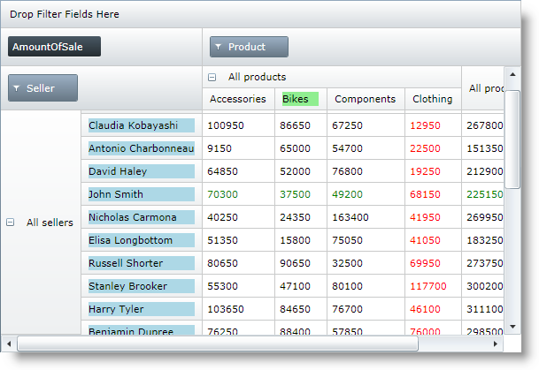

////
|metadata|
{
    "name": "xampivotgrid-customizing-cells-with-templates-procedure-and-code-example",
    "controlName": ["xamPivotGrid"],
    "tags": ["Grids","How Do I","Layouts","Templating"],
    "guid": "485ba493-d81f-4701-8fe4-d7f1b3f0d212",
    "buildFlags": [],
    "createdOn": "2016-05-25T18:21:58.2153285Z"
}
|metadata|
////

= Customizing Cells with Templates – Procedure and Code Example (xamPivotGrid)

== Topic Overview

=== Purpose

This topic is a step-by-step walkthrough on how to customize xamPivotGrid™ cells by applying custom `DataTemplates` for their content.

=== Required background

The following table lists the topics required as a prerequisite to understanding this topic.

[options="header", cols="a,a"]
|====
|Topic|Purpose

| link:xampivotgrid-understanding-xampivotgrid.html[xamPivotGrid Overview]
|This section serves as an introduction to the xamPivotGrid control's key features and functionalities. The topics listed here will give you a better idea of why you would want to use xamPivotGrid in your applications.

| link:xampivotgrid-getting-started-with-xampivotgrid.html[Getting Started with xamPivotGrid]
|This topic demonstrates how to get started with the xamPivotGrid control by providing step-by-step procedure for adding this control to a {PlatformName} application.

| link:xampivotgrid-customizing-cells-with-templates-overview.html[Customizing Cells with Templates Overview]
|The xamPivotGrid control enables you to specify custom data templates for data cells and for header column and row cells. This topic is an overview of this feature.

|====

=== In this topic

This topic contains the following sections:

* <<_Ref319953034, Customizing Cells with Templates >>

** <<_Ref319953039,Introduction>>
** <<_Ref319953041,Preview>>
** <<_Ref319953044,Requirements>>
** <<_Ref319953046,Overview>>
** <<_Ref319953049,Steps>>

* <<_Ref319953052, Code Example: Customizing Cells with Templates >>

** <<_Ref319953058,Description>>
** <<_Ref319953064,Code>>

* <<_Ref319953066, Related Content >>

** <<_Ref319953069,Topics>>
** <<_Ref319953071,Samples>>

[[_Ref319953034]]
== Customizing Cells with Templates

[[_Ref319953039]]

=== Introduction

The procedure below will help you understand how to use the cell customization feature of the xamPivotGrid.

[[_Ref319953041]]

=== Preview

The following screenshot is a preview of the final result.

[[_Ref319953044]]

=== Requirements

To complete the procedure, you need a {PlatformName} application where the xamPivotGrid control is used. In this example the link:salesdatasample.html[Sales Data Sample] data source is used, but you can modify the code examples to work with other data.

[[_Ref319953046]]

=== Overview

This topic takes you step-by-step toward creating and applying custom templates for xamPivotGrid data and header cells. The following is a conceptual overview of the process:

<<step_1, 1. Creating a set of  `DataTemplates` . >>

<<step_2, 2. Applying templates for data cells. >>

<<step_3, 3. Applying templates for row and column headers. >>

[[_Ref319953049]]
=== Steps

[[step_1]]
[start=1]
. *Create a set of DataTemplates.*
+
First you need to create `DataTemplates` that you will later assign to the cell content. When these templates are used in the xamPivotGrid, the  *DataContext for data cells is a string* containing the value that should be displayed in the cell. For *header cells the data context is the Tuple for the respective row/column*.
+
Therefore to get the value of the cell in the `DataTemplate` you need to do a simple data context binding: `{Binding}`
+
Add the data templates to the Resources section of your page or to another `ResourceDictionary` that is accessible from your page.

[[step_2]]
[start=2]
. *Apply templates for data cells.*

.. Create a link:{ApiPlatform}controls.grids.xampivotgrid{ApiVersion}~infragistics.controls.grids.datacelltemplate_members.html[DataCellTemplate] and add it to the xamPivotGrid’s link:{ApiPlatform}controls.grids.xampivotgrid{ApiVersion}~infragistics.controls.grids.xampivotgrid~datacelltemplates.html[DataCellTemplates] collection.
+
In order to use a template from the ones created in step 1, you need add a `DataCellTemplate` object to the `DataCellTemplates` collection and set its link:{ApiPlatform}controls.grids.xampivotgrid{ApiVersion}~infragistics.controls.grids.datacelltemplate~template.html[Template] property to the `DataTemplate` you want to apply.
+
You can specify as many `DataCellTemplates` as you wish.

.. Specify which cells the template should apply to.
+
This is achieved by setting values to the remaining properties of the `DataCellTemplates`.
+
--
... Specify column and row hierarchy.
+
When you set the link:{ApiPlatform}controls.grids.xampivotgrid{ApiVersion}~infragistics.controls.grids.datacelltemplate~columnhierarchy.html[ColumnHierarchy] property, the data template will be applied to all data cells that are in the specified column hierarchy. The value should be the same as the link:{ApiPlatform}olap{ApiVersion}~infragistics.olap.data.base.hierarchy~caption.html[Caption] property of the link:{ApiPlatform}olap{ApiVersion}~infragistics.olap.data.base.hierarchy_members.html[Hierarchy] that you want to target. Analogically you can specify a value for the link:{ApiPlatform}controls.grids.xampivotgrid{ApiVersion}~infragistics.controls.grids.datacelltemplate~rowhierarchy.html[RowHierarchy] property. This will apply the template to the cells that are in both the column and row hierarchies.

... Specify column and row level.
+
Setting values to these properties enables you to create even more precise criteria defining where the data template will be applied. Setting the `Level` to an integer number will cause the template to be applied only to cells at that level. Level numbering starts at 1 (not at 0).

... Specify column and row label.
+
Setting these properties will apply the template only to cells whose column/row header has the specified label. This enables you to apply custom `DataTemplate` to a specific cell.
--
+
.Note:
[NOTE]
====
All of these properties are optional, although at least one of them should be set so that the template is applied. If some/all of them are set, the template will be applied to cells that match the intersection of the properties’ values. If there is a conflict between two or more templates, the most specific one will be applied. If there is no matched cell, the template will not be applied at all.
====

[[step_3]]
[start=3]
. *Apply templates for row and column headers.*

.. Create a link:{ApiPlatform}controls.grids.xampivotgrid{ApiVersion}~infragistics.controls.grids.headertemplate_members.html[HeaderTemplate] and add it to the link:{ApiPlatform}controls.grids.xampivotgrid{ApiVersion}~infragistics.controls.grids.xampivotgrid~columnheadertemplates.html[ColumnHeaderTemplates]/ link:{ApiPlatform}controls.grids.xampivotgrid{ApiVersion}~infragistics.controls.grids.xampivotgrid~rowheadertemplates.html[RowHeaderTemplates] collection.
+
This is done analogically to the way the `DataCellTemplates` are added to the `DataCellTemplates` collection of the xamPivotGrid.

.. Specify the column/row header cells which the template will be applied to.

... Specify the hierarchy.
+
Use the `Hierarchy` property to assign the template to all column/row header cells.

... Specify the level.
+
Setting the `Level` property applies the template to cells at the specified level. As with `DataCellTemplate`, level numbering starts at 1.

... Specify the label.
+
This way the template is applied only to header cells whose column/row `Caption` is the same as the one you specified.

[[_Ref319953052]]
== Code Example: Customizing Cells with Templates

[[_Ref319953058]]
=== Description

The example below shows you how to create and apply custom `DataTemplates` to xamPivotGrid data and header cells.

[[_Ref319953064]]
=== Code

Add DataTemplates to the Resources of the page.

*In XAML:*
[source,xaml]
----
<UserControl.Resources>
    <DataTemplate x:Key="DataTemplate1">
        <TextBlock Foreground="Red" Text="{Binding}" />
    </DataTemplate>
    <DataTemplate x:Key="DataTemplate2">
        <TextBlock Foreground="Green" Text="{Binding}" />
    </DataTemplate>
    <DataTemplate x:Key="DataTemplate3">
        <Grid Background="LightGreen">
            <TextBlock Text="{Binding}" />
        </Grid>
    </DataTemplate>
    <DataTemplate x:Key="DataTemplate4">
        <Grid Background="LightBlue">
            <TextBlock Text="{Binding}" />
        </Grid>
    </DataTemplate>
</UserControl.Resources>
----

Apply the DataTemplates.

*In XAML:*
[source,xaml]
----
<ig:XamPivotGrid
    x:Name="pivotGrid"
    DataSource="{StaticResource FlatDataSource}">
    <ig:XamPivotGrid.DataCellTemplates>
        <ig:DataCellTemplate
            Template="{StaticResource DataTemplate1}"
            ColumnHierarchy="Product"
            ColumnLabel="Clothing" />
        <ig:DataCellTemplate
            Template="{StaticResource DataTemplate2}"
            RowHierarchy="Seller"
            RowLevel="2"
            RowLabel="John Smith" />
    </ig:XamPivotGrid.DataCellTemplates>
    <ig:XamPivotGrid.ColumnHeaderTemplates>
        <ig:HeaderTemplate
            Template="{StaticResource DataTemplate3}"
            Label="Bikes" />
    </ig:XamPivotGrid.ColumnHeaderTemplates>
    <ig:XamPivotGrid.RowHeaderTemplates>
        <ig:HeaderTemplate
            Template="{StaticResource DataTemplate4}"
            Hierarchy="Seller"
            Level="2" />
    </ig:XamPivotGrid.RowHeaderTemplates>
</ig:XamPivotGrid>
----

*In C#:*
[source,csharp]
----
…
pivotGrid.DataCellTemplates.Add((DataCellTemplate)this.Resources["DataTemplate1"]);
pivotGrid.DataCellTemplates.Add((DataCellTemplate)this.Resources["DataTemplate2"]);
pivotGrid.ColumnHeaderTemplates.Add((HeaderTemplate)this.Resources["DataTemplate3"]);
pivotGrid.RowHeaderTemplates.Add((HeaderTemplate)this.Resources["DataTemplate4"]);
…
----

*In Visual Basic:*
[source,vb]
----
…
pivotGrid.DataCellTemplates.Add(DirectCast(Me.Resources("DataTemplate1"), DataCellTemplate))
pivotGrid.DataCellTemplates.Add(DirectCast(Me.Resources("DataTemplate2"), DataCellTemplate))
pivotGrid.ColumnHeaderTemplates.Add(DirectCast(Me.Resources("DataTemplate3"), HeaderTemplate))
pivotGrid.RowHeaderTemplates.Add(DirectCast(Me.Resources("DataTemplate4"), HeaderTemplate))
…
----

[[_Ref319953066]]
== Related Content

[[_Ref319953069]]
=== Topics

The following topics provide additional information related to this topic.

[options="header", cols="a,a"]
|====
|Topic|Purpose

| link:xampivotgrid-customizing-cells-with-templates-property-reference.html[Customizing Cells with Templates Property Reference]
|This is a list of the most notable properties related to the Cell customization feature of the xamPivotGrid.

| link:xampivotgrid-us-conditional-formating.html[Conditional Formating]
|Explanation on how to use the CellControlAttached event to apply custom styles to data cells based on the cell’s value.

|====

[[_Ref319953071]]
=== Samples

The following samples provide additional information related to this topic.

[options="header", cols="a,a"]
|====
|Sample|Purpose

| link:{SamplesURL}/pivot-grid/custom-header-and-cell-templates[Custom Header and Cell Templates] 

|This sample demonstrates how to apply custom DataTemplates for data and header cells of the pivot grid based on a cell’s hierarchy, level and label.

|====