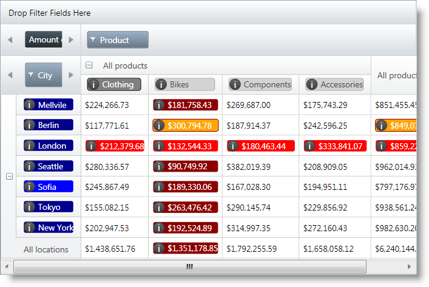

////

|metadata|
{
    "name": "xampivotgrid-customizing-cells-with-templates",
    "controlName": ["xamPivotGrid"],
    "tags": ["Getting Started","Grids","Layouts","Templating"],
    "guid": "bc8e0e82-d985-402d-a861-af3423fe1a57",  
    "buildFlags": [],
    "createdOn": "2016-05-25T18:21:58.2033282Z"
}
|metadata|
////

= Customizing Cells with Templates (xamPivotGrid)

=== Introduction

The xamPivotGrid™ control provides the ability to specify custom `DataTemplates` for data and header cells. You can specify different templates for different cells based on what hierarchy, level, etc. the cell is in.

=== Topics

Detailed information regarding customization of xamPivotGrid cells with applying custom `DataTemplates` is covered in the following topics:

[options="header", cols="a,a"]
|====
|Topic|Purpose

| link:xampivotgrid-customizing-cells-with-templates-overview.html[Customizing Cells with Templates Overview]
|The xamPivotGrid control enables you to specify custom data templates for data cells and for header column and row cells. This topic is an overview of this feature.

| link:xampivotgrid-customizing-cells-with-templates-procedure-and-code-example.html[Customizing Cells with Templates - Procedure and Code Example]
|This topic is a step-by-step walkthrough on how to customize xamPivotGrid cells by applying custom `DataTemplates` for their content.

| link:xampivotgrid-customizing-cells-with-templates-property-reference.html[Customizing Cells with Templates Property Reference]
|This is a list of the most notable properties related to the Cell customization feature of the xamPivotGrid.

|====