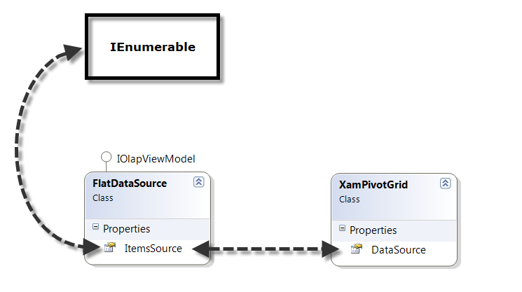
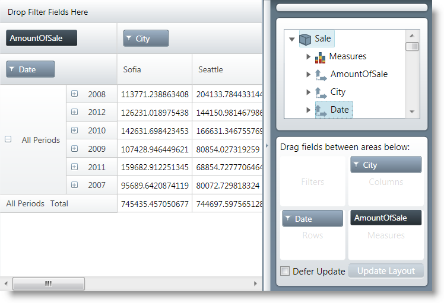

////
|metadata|
{
    "name": "xampivotgrid-databinding-using-flatdatasource",
    "controlName": ["xamPivotGrid"],
    "tags": [],
    "guid": "d14db6d8-4857-4698-8357-4d2871549968","buildFlags": [],
    "createdOn": "2016-05-25T18:21:58.0592805Z"
}
|metadata|
////

= Binding xamPivotGrid to FlatDataSource

== Topic Overview

=== Purpose

This topic explains how to use the link:{ApiPlatform}olap.flatdata{ApiVersion}~infragistics.olap.flatdata.flatdatasource_members.html[FlatDataSource] class for displaying `IEnumerable` data in the xamPivotGrid™.

=== Required background

The following table lists the topics required as a prerequisite to understanding this topic.

[options="header", cols="a,a"]
|====
|Topic|Purpose

| link:xampivotgrid-understanding-xampivotgrid.html[xamPivotGrid Overview]
|This section serves as an introduction to the xamPivotGrid control's key features and functionalities. The topics listed here will give you a better idea of why you would want to use xamPivotGrid in your applications.

| link:xampivotgrid-getting-started-with-xampivotgrid.html[Getting Started with xamPivotGrid]
|This topic demonstrates how to get started with the xamPivotGrid control by providing step-by-step procedure for adding this control to a {PlatformName} application.

| link:xampivotgrid-binding-data-to-the-xampivotgrid.html[Binding xamPivotGrid to Data]
|This topic serves as an overview of the data sources supported by the xamPivotGrid control.

|====

=== In this topic

This topic contains the following sections:

* <<_Ref319499861, Using   FlatDataSource >>

** <<_Ref319499862,Introduction>>
** <<_Ref319499871,Class Diagram>>
** <<_Ref319499876,Preview>>
** <<_Ref319499880,Requirements>>
** <<_Ref319499882,Overview>>
** <<_Ref319499885,Steps>>

* <<_Ref319499893, Code Example: Using   FlatDataSource   with the xamPivotGrid >>

** <<_Ref319499897,Description>>
** <<_Ref319499900,Code>>

* <<_Ref319499909, Related Content >>

** <<_Ref319499929,Topics>>
** <<_Ref319499932,Samples>>

[[_Ref319499861]]
== Using FlatDataSource

[[_Ref319499862]]

=== Introduction

Use the link:{ApiPlatform}olap.flatdata{ApiVersion}~infragistics.olap.flatdata.flatdatasource_members.html[FlatDataSource] to connect to data that uses the Online Transaction Processing (OLTP) model. In this case, the source can be a relational database, a Microsoft® Excel™ file, or an arbitrary two-dimensional data collection. The link:{ApiPlatform}olap.flatdata{ApiVersion}~infragistics.olap.flatdata.flatdatasource~itemssource.html[ItemsSource] for the `FlatDataSource` can be any object that implements the `IEnumerable` interface (e.g. `List`, `Collection`, `Queue`, `Stack` etc.) An example of an object that meets the above criteria is the SalesDataSample object which you can download from the link:salesdatasample.html[SalesDataSample resource] and use in your project.

.Note:
[NOTE]
====
The `FlatDataSource` is not suitable for Online Analytical Processing (OLAP) cubes. For these, use link:{ApiPlatform}olap.xmla{ApiVersion}~infragistics.olap.xmla.xmladatasource_members.html[XmlaDataSource] or data sources that derive from it.
====

[[_Ref319499871]]

=== Class Diagram

The following is a simplified diagram of how the xamPivotGrid works with flat data.

[[_Ref319499876]]

=== Preview

The following screenshot is a preview of the final result.

[[_Ref319499880]]

=== Requirements

To complete the procedure, you need the following:

* A {PlatformName} application
* The SalesDataSample class added to your application
* References to the following assemblies:

** {ApiPlatform}{ApiVersion}dll
** {ApiPlatform}DataVisualization{ApiVersion}.dll
** {ApiPlatform}Controls.Grids.XamPivotGrid{ApiVersion}.dll
** {ApiPlatform}Controls.Menus.XamDataTree{ApiVersion}.dll
** {ApiPlatform}DragDrop{ApiVersion}.dll
** {ApiPlatform}Olap{ApiVersion}.dll
** {ApiPlatform}Olap.FlatData{ApiVersion}.dll

[[_Ref319499882]]

=== Overview

This topic takes you step-by-step toward configuring the xamPivotGrid to work with a flat data source. The following is a conceptual overview of the process:

1. Creating a FlatDataSource object.

2. Setting the ItemsSource property of the FlatDataSource to an IEnumerable collection.

3. Adding a xamPivotGrid and xamPivotDataSelector controls to your page.

4. Setting the DataSource property of the grid and the data selector to the FlatDataSource.

[[_Ref319499885]]

=== Steps

The following steps conceptually explain how to set up a flat data source for the xamPivotGrid. You can find the complete code listing in the code example below.
[start=1]
. Create a FlatDataSource

Create an instance of the `FlatDataSource` class.
[start=2]
. Set the ItemsSource of the FlatDataSource property to an IEnumerable collection.

Create an instance of the `SalesDataSample` class and set it as the `ItemsSource` of the `FlatDataSource`. The `SalesDataSample` is basically an observable collection of Sale objects.
[start=3]
. Add a xamPivotGrid and xamPivotDataSelector controls to your page.

In order to display data in the xamPivotGrid you will need to choose hierarchies for the columns and rows and also to select at least one measure. The easiest way to do this is to add a xamPivotDataSelector control to your page.
[start=4]
. Set the DataSource property of the grid and the data selector to the FlatDataSource.

The last step is to set the `FlatDataSource` that you created as the `DataSource` of the xamPivotGrid and the xamPivotDataSelector.

[[_Ref319499893]]
== Code Example: Using FlatDataSource with the xamPivotGrid

[[_Ref319499897]]

=== Description

The code below shows how to use an `ObservableCollection` (SalesDataSample) as a data source for the xamPivotGrid.

[[_Ref319499900]]

=== Code

*In XAML:*

[source,xaml]
----
xmlns:olap="http://schemas.infragistics.com/olap"
xmlns:ig="http://schemas.infragistics.com/xaml"
xmlns:models="clr-namespace:Infragistics.Samples.Data.Models"
...
<models:SalesDataSample x:Key="DataSample"/>
<olap:FlatDataSource x:Key="DataSource" ItemsSource="{StaticResource DataSample}" />
<!-- alternatively, -->
<olap:FlatDataSource>
    <olap:FlatDataSource.ConnectionSettings>
        <olap:FlatDataConnectionSettings ItemsSource="{StaticResource DataSample}" />
    </olap:FlatDataSource.ConnectionSettings>
</olap:FlatDataSource>
...
<ig:XamPivotGrid x:Name="PivotGrid" DataSource="{StaticResource DataSource}" />
----

*In C#:*

[source,csharp]
----
using Infragistics.Controls.Grids;       // xamPivotGrid control
using Infragistics.Olap.FlatData;        // FlatDataSource
using Infragistics.Samples.Data.Models;  // SalesDataSample
...
FlatDataSource DataSource = new FlatDataSource();
DataSource.ItemsSource = DataSample;
// alternatively,
SalesDataSample DataSample = new SalesDataSample();
FlatDataSource DataSource = new FlatDataSource();
FlatDataConnectionSettings DataConnectionSettings = new FlatDataConnectionSettings();
DataConnectionSettings.ItemsSource = DataSample;
DataSource.ConnectionSettings = DataConnectionSettings;
this.PivotGrid.DataSource = DataSource;
----

*In Visual Basic:*

[source,vb]
----
Imports Infragistics.Controls.Grids       ' xamPivotGrid control
Imports Infragistics.Olap.FlatData        ' FlatDataSource 
Imports Infragistics.Samples.Data.Models  ' SalesDataSample
...
Dim DataSource As New FlatDataSource()
DataSource.ItemsSource = DataSample
'alternatively,
Dim DataSample As New SalesDataSample()
Dim DataSource As New FlatDataSource()
Dim DataConnectionSettings As New FlatDataConnectionSettings()
DataConnectionSettings.ItemsSource = DataSample
DataSource.ConnectionSettings = DataConnectionSettings
Me.PivotGrid.DataSource = DataSource
----

[[_Ref319499909]]
== Related Content

[[_Ref319499929]]

=== Topics

The following topics provide additional information related to this topic.

[options="header", cols="a,a"]
|====
|Topic|Purpose

| link:xampivotgrid-binding-data-to-the-xampivotgrid.html[Binding xamPivotGrid to Data]
|This topic serves as an overview of the data sources supported by the xamPivotGrid™ control.

| link:xampivotgrid-us-excel-spreadsheet-as-a-datasource.html[Binding xamPivotGrid to an Excel Spreadsheet]
|This topic explains how to use an Excel file as a data source for the xamPivotGrid.

| link:xampivotgrid-databinding-using-xmladatasource.html[Binding xamPivotGrid to XmlaDataSource]
|This topic explains how to use the link:{ApiPlatform}olap.xmla{ApiVersion}~infragistics.olap.xmla.xmladatasource_members.html[XmlaDataSource] class for displaying olap data from Microsoft Analysis Services in the xamPivotGrid™.

|====

[[_Ref319499932]]

=== Samples

The following samples provide additional information related to this topic.

[options="header", cols="a,a"]
|====
|Sample|Purpose

|
ifdef::sl[] 

link:{SamplesURL}/pivot-grid/#/flatdatasource-xaml[FlatDataSource (XAML)] 

endif::sl[] 

ifdef::wpf[] 

link:{SamplesURL}/pivot-grid/flatdatasource-xaml[FlatDataSource (XAML)] 

endif::wpf[] 

|This sample shows how to use the FlatData source and create it in XAML

|
ifdef::sl[] 

link:{SamplesURL}/pivot-grid/#/flatdatasource-code-behind[FlatDataSource (Code Behind)] 

endif::sl[] 

ifdef::wpf[] 

link:{SamplesURL}/pivot-grid/flatdatasource-code-behind[FlatDataSource (Code Behind)] 

endif::wpf[] 

|This sample shows how to use the FlatData source and create it in code behind.

|====