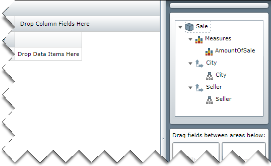

////
|metadata|
{
    "name": "xampivotgrid-dataselector-including-excluding-items-from-the-metadatatree",
    "controlName": ["xamPivotGrid"],
    "tags": ["Data Presentation","Grids","How Do I"],
    "guid": "75d85a4f-fb7d-46b2-a36f-d226782545be",
    "buildFlags": [],
    "createdOn": "2016-05-25T18:21:58.1542921Z"
}
|metadata|
////

= Including/Excluding Metadata Tree Items (xamPivotGrid, xamPivotDataSelector)

== Topic Overview

=== Purpose

When you assign a data source to the xamPivotDataSelector™ it will automatically add all items (Measures, Dimensions, Hierarchies, etc.) in the data source to the metadata tree. This topic explains how you can choose which items are included in the metadata tree and which are not.

=== Required background

The following table lists the topics required as a prerequisite to understanding this topic.

[options="header", cols="a,a"]
|====
|Topic|Purpose

| link:xampivotgrid-understanding-xampivotgrid.html[xamPivotGrid Overview]
|This section serves as an introduction to the xamPivotGrid control's key features and functionalities. The topics listed here will give you a better idea of why you would want to use xamPivotGrid in your applications.

| link:xampivotgrid-getting-started-with-xampivotgrid.html[Getting Started with xamPivotGrid]
|This topic demonstrates how to get started with the xamPivotGrid™ control by providing step-by-step procedure for adding this control to a {PlatformName} application.

| link:xampivotgrid-dataselector.html[Data Selector (xamPivotGrid, xamPivotDataSelector)]
|This topic is an introduction to the xamPivotDataSelector control.

|====

=== In this topic

This topic contains the following sections:

* <<_Ref319602030, Including/Excluding items from the   xamPivotDataSelector’s   Metadata Tree >>

** <<_Ref319602036,Introduction>>
** <<_Ref319602038,Preview>>
** <<_Ref319602040,Requirements>>
** <<_Ref319602043,Overview>>
** <<_Ref319602045,Steps>>

* <<_Ref319602047, Code Example: Including/Excluding items from the   xamPivotDataSelector’s   Metadata Tree >>

** <<_Ref319602051,Description>>
** <<_Ref319602054,Code>>

* <<_Ref319602056, Related Content >>

** <<_Ref319602067,Samples>>

[[_Ref319602030]]
== Including/Excluding items from the xamPivotDataSelector’s Metadata Tree

[[_Ref319602036]]

=== Introduction

Controlling which items are added to the metadata tree in the xamPivotDataSelector happens through the data source that is assigned to its link:{ApiPlatform}controls.grids.xampivotgrid.v{ProductVersion}~infragistics.controls.grids.xampivotdataselector~datasource.html[DataSource] property. This is achieved by subscribing for the link:{ApiPlatform}olap.v{ProductVersion}~infragistics.olap.datasourcebase~metadatatreeitemadding_ev.html[MetadataTreeItemAdding] event. Additionally the link:{ApiPlatform}olap.v{ProductVersion}~infragistics.olap.datasourcebase~resetmetadatatree.html[ResetMetadataTree] method may be used.

When the data selector is being initialized, the `MetadataTreeItemAdding` event is raised every time before an item is added to the metadata tree of the data selector. The link:{ApiPlatform}olap.v{ProductVersion}~infragistics.olap.metadatatreeeventargs_members.html[MetadataTreeEventArgs] instance that is provided with the event contains a reference to the item being added and a Cancel property through which adding of the item can be suspended. Apart from expecting the link:{ApiPlatform}olap.v{ProductVersion}~infragistics.olap.metadatatreeeventargs~item.html[Item] that is being added and deciding whether you want to include it in the metadata tree or not, in the event handler for the `MetadataTreeItemAdding` event, you can also specify if an item should be expanded after it is initialized.

If you want to modify the items in the xamPivotDataSelector’s metadata tree after it has been initialized you can call the `ResetMetadataTree` method. This will cause all items in the data source to be re-added to the metadata tree, raising the `MetadataTreeItemAdding` event for each of them again.

[[_Ref319602038]]

=== Preview

The following screenshot is a preview of a xamPivotDataSelector where the only items added in the metadata tree are the  _AmountOfSale_   measure and the  _Seller_   and  _City_   hierarchies. The data source used is from the link:salesdatasample.html[SalesDataSample class].

[[_Ref319602040]]

=== Requirements

To complete the procedure, you need the {PlatformName} application where the xamPivotGrid and the xamPivotDataSelector controls have been configured with the `SalesDataSample` class as data source.

[[_Ref319602043]]

=== Overview

This topic takes you step-by-step toward creating an event handler for the `MetadataTreeItemAdding` event where only items that meet some predefined criteria are added to the metadata tree. The following is a conceptual overview of the process: *1*  *.*   Adding an event handler for the *MetadataTreeItemAdding* event. 

Inspecting the item that is being added and deciding whether it should be included or not.

[[_Ref319602045]]

=== Steps

The following steps demonstrate how to use the `MetadataTreeItemAdding` event in order to add only a list of predefined items to the metadata tree.
[start=1]
. Add an event handler for the MetadataTreeItemAdding event.

Normally you would subscribe to this event before the page is loaded e.g. in its constructor. In this way you will ensure that the event will be raised when the xamPivotDataSelector is initializing.

Alternatively you can subscribe to this event at any time later before calling the `ResetMetadataTree` method.
[start=2]
. Inspect the item that is being added and decide whether you want to include it or not.

As mentioned earlier the event arguments supplied with the occurrence of the `MetadataTreeItemAdding` event contain a reference to the actual item being added. You can expect the values of its link:{ApiPlatform}olap.v{ProductVersion}~infragistics.olap.hierarchicalitem~itemtype.html[ItemType] and link:{ApiPlatform}olap.v{ProductVersion}~infragistics.olap.hierarchicalitem~caption.html[Caption] properties, but if this is not enough to decide whether it should be included, you can expect the underlying link:{ApiPlatform}olap.v{ProductVersion}~infragistics.olap.hierarchicalitem~dataobject.html[DataObject] which could be a Hierarchy, Dimension, Level, etc.

[[_Ref319602047]]
== Code Example: Including/Excluding Items from the xamPivotDataSelector’s Metadata Tree

[[_Ref319602051]]

=== Description

The code below is an example of how only specific items can be added to the data selector’s metadata tree.

[[_Ref319602054]]

=== Code

*In C#:*

[source,csharp]
----
Code
using System.Windows.Controls;
using Infragistics.Olap;
using Infragistics.Olap.FlatData;
using Infragistics.Olap.Data;
using Infragistics.Samples.Data.Models;
using System.Linq;
…
// Place this in the constructor of the page.
            ((FlatDataSource)dataSelector.DataSource).MetadataTreeItemAdding += DataSelector_MetadataTreeItemAdding;
…
private static string[] allowedMeasureNames = { "Measures", "AmountOfSale" };
private static string[] allowedDimensionNames = { "[Seller]", "[City]" };
private static string[] allowedHierarchyNames = { "[Seller].[Seller]", "[City].[City]" };
void DataSelector_MetadataTreeItemAdding(object sender, Infragistics.Olap.MetadataTreeEventArgs e)
{
    if (e.Item.ItemType == ItemTypes.Measure &&
        allowedMeasureNames.Contains(e.Item.Caption))
        return;
    if (e.Item.ItemType == ItemTypes.Dimension
        && allowedDimensionNames.Contains(((IDimension)e.Item.DataObject).UniqueName))
    {
        e.Item.ExpandWhenInitialized = true;
        return;
    }
    if (e.Item.ItemType == ItemTypes.UserDefinedHierarchy
        && allowedHierarchyNames.Contains(((IHierarchy)e.Item.DataObject).UniqueName))
        return;
    e.Cancel = true;
}
// If you want to reset the metadata tree and call the following method:
// ((DataSourceBase)this.pivotGrid.DataSource).ResetMetadataTree();
----

*In Visual Basic:*

[source,csharp]
----
Imports System.Windows.Controls
Imports Infragistics.Olap
Imports Infragistics.Olap.FlatData
Imports Infragistics.Olap.Data
Imports Infragistics.Samples.Data.Models
Imports System.Linq
…
' Place this in the constructor of the page.
AddHandler DirectCast(dataSelector.DataSource, FlatDataSource).MetadataTreeItemAdding, AddressOf DataSelector_MetadataTreeItemAdding
…
Private Shared allowedMeasureNames As String() = {"Measures", "AmountOfSale"}
Private Shared allowedDimensionNames As String() = {"[Seller]", "[City]"}
Private Shared allowedHierarchyNames As String() = {"[Seller].[Seller]", "[City].[City]"}
Private Sub DataSelector_MetadataTreeItemAdding(sender As Object, e As Infragistics.Olap.MetadataTreeEventArgs)
      If e.Item.ItemType = ItemTypes.Measure AndAlso allowedMeasureNames.Contains(e.Item.Caption) Then
            Return
      End If
      If e.Item.ItemType = ItemTypes.Dimension AndAlso allowedDimensionNames.Contains(DirectCast(e.Item.DataObject, IDimension).UniqueName) Then
            e.Item.ExpandWhenInitialized = True
            Return
      End If
      If e.Item.ItemType = ItemTypes.UserDefinedHierarchy AndAlso allowedHierarchyNames.Contains(DirectCast(e.Item.DataObject, IHierarchy).UniqueName) Then
            Return
      End If
      e.Cancel = True
End Sub
' If you want to reset the metadata tree and call the following method:
' DirectCast(dataSelector.DataSource, DataSourceBase).ResetMetadataTree()
----

[[_Ref319602056]]
== Related Content

[[_Ref319602067]]

=== Samples

The following samples provide additional information related to this topic.

[options="header", cols="a,a"]
|====
|Sample|Purpose

|
ifdef::sl[] 

link:{SamplesURL}/pivot-grid/#/dynamic-metadata-tree[Dynamic Metadata Tree] 

endif::sl[] 

ifdef::wpf[] 

link:{SamplesURL}/pivot-grid/dynamic-metadata-tree[Dynamic Metadata Tree] 

endif::wpf[] 

|This sample shows how you can use the MetadataTreeItemAdding event and the ResetMetadataTree method of the DataSourceBase class to control which metadata items are added to the metadata tree in the DataSelector. 

When you press the _Load checked items_ button below the data tree on the left, all the checked items with their respective expanded/collapsed state will be included in the metadata tree. To see how this is done, refer to the code-behind.

|====