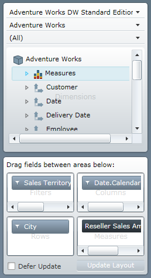

////
|metadata|
{
    "name": "xampivotgrid-dataselector",
    "controlName": ["xamPivotGrid"],
    "tags": ["Getting Started","Grids","How Do I"],
    "guid": "84ad0c36-dcdc-4331-bb6c-ca48b0acfea6",
    "buildFlags": [],
    "createdOn": "2016-05-25T18:21:58.1482918Z"
}
|metadata|
////

= Data Selector (xamPivotGrid, xamPivotDataSelector)

== *About xamPivotDataSelector*

The xamPivotGrid control comes with another control – xamPivotDataSelector™ – that can greatly aid in the manipulation of your data at runtime in your application. Its main purpose as suggested by the control’s name is to allow your end users to select data. An image of this control is provided below. Given a DataSource (Discussed in the link:xampivotgrid-getting-started-with-xampivotgrid.html[Getting started with xamPivotGrid] topic), the xamPivotDataSelector will give you an interactive UI component to select a database to connect to (if you are using database data), cube to extract data from, and a set of measures. When you have selected those a tree will be loaded with all the available dimensions with their respective hierarchies along with a list with all the available measures.

This tree and its items are very useful as you can select and drag any dimension to one of the possible areas in the xamPivotGrid control (Rows, Row headers, Columns, Column headers or Filters areas). You can drag one of the measures to the Measures area too or just drop it in the data cells area. This is the easiest way to provide slice interaction to a xamPivotGrid control. Apart from dragging the hierarchies or measures to the respective areas on xamPivotGrid, special areas within xamPivotDataSelector are provided (shown in the above image).

Related Topics

link:xampivotgrid-dataselector-including-excluding-items-from-the-metadatatree.html[Including Excluding Items from the xamPivotDataSelector's MetaDataTree]