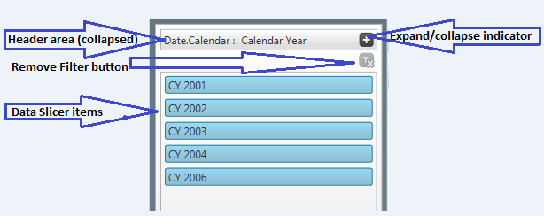
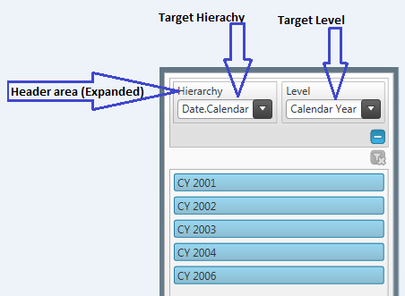

////

|metadata|
{
    "name": "xampivotgrid-dataslicer",
    "controlName": ["xamPivotGrid"],
    "tags": ["Charting","Data Presentation","Getting Started","Grids","How Do I"],
    "guid": "aba1dd96-0078-47f2-bdf3-dcaf28afde1c",  
    "buildFlags": [],
    "createdOn": "2016-05-25T18:21:58.1112837Z"
}
|metadata|
////

= Data Slicer (xamPivotGrid)

== Purpose

The purpose of this topic is to introduce the DataSlicer feature in the pivot grid with an enhanced filtering capability. The Data Slicer allows filtering the hierarchies selected in columns, rows and filter areas in conjunction with the measures of the pivot grid.

== In this topic

This topic contains the following sections:

* <<Configuring,Configuring the DataSlicer>>
* <<DataBinding,Data Binding>>
* <<AddingDataSlicer,Adding DataSlicer>>
* <<VisualElementsofDataSlicer,Visual Elements of DataSlicer>>

== Required background

You need to first read the following topics:

* link:xampivotgrid-getting-started-with-xampivotgrid.html[Getting Started with xamPivotGrid]

== Configuring DataSlicer

== Data Binding

For data binding please refer to the link:xampivotgrid-binding-data-to-the-xampivotgrid.html[Binding Data] (existing) topic for more details.

== Adding DataSlicer

The data displayed on the pivot grid is related to both the selected slicer items and the filter applied to the hierarchies of the pivot grid.

Each slicer displays and operates over the level of given hierarchy. The information about the available hierarchies and their levels is obtained from the instance set to XamPivotDataSlicer.SlicerProvider. The data slicer provider supports both instances of XmlaDataSource and FlatDataSource.

*In XAML:*

----
<igPivot:XamPivotGrid 
            x:Name="pivotGrid" 
            Grid.Column="1" 
            DataSource="{StaticResource DataSource}" 
            AllowCompactLayout="True">
</igPivot:XamPivotGrid>
<igSlicer:XamPivotDataSlicer
            Grid.Column="0"
            SlicerProvider="{StaticResource DataSource}" 
            TargetHierarchyName="[Date].[Calendar]" 
            TargetLevelIndex="1" 
            SlicerItemsColorScheme="Green" 
            IsHeaderAreaExpanded=">
</igSlicer:XamPivotDataSlicer>
----

== Visual Elements of DataSlicer

== Visual elements chart

The following table describes the different visual elements of the data slicer:

[options="header", cols="a,a"]
|====
|Elements|Description

|Header area
|Displays the list of the hierarchy names.

|Expanded Header area 

* Hierarchy 

* Level 

|Target name of the hierarchy 

Defines the level of the target name hierarchy. 

For example: If the Target hierarchy is a Date field, which consists of Years, Quarters, Months or Days the level may be “All periods” or selective such as “Year” as a data slice item.

|Remove Filters toggle button
|Used for clearing the filtered selections. The filtering is set automatically upon item selection. Clicking on the Remove Filter button clears the filter.

|Items
|Displays the list of items within the selected hierarchy.

|====

The following screenshots display the DataSlicer using IGTheme. Different colors can also be applied to each slicer for better user experience.

.Note:
[NOTE]
====
Press *Ctrl + Click* to select adjacent or non-adjacent multiple items. All applied filters can be removed using “Remove Filters” toggle button.
====

Figure SEQ Figure 1: DataSlicer with the header area collapsed.

Figure SEQ Figure 2: DataSlicer with the header area Expanded.

Related Topics

link:xampivotgrid-getting-started-with-xampivotgrid.html[Getting Started with xamPivotGrid]