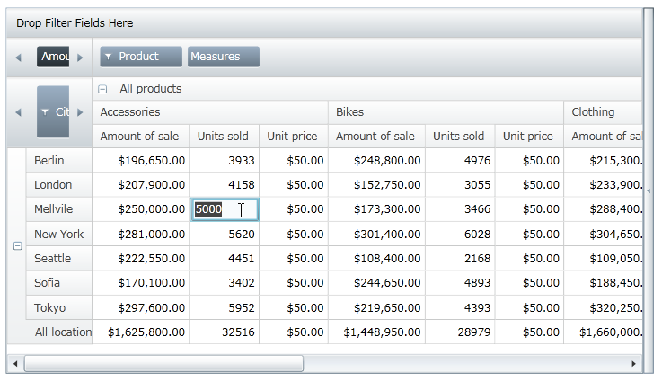
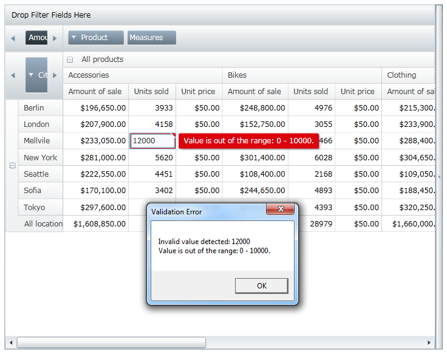

////

|metadata|
{
    "name": "xampivotgrid-editingdatacells",
    "controlName": ["xamPivotGrid"],
    "tags": ["Data Presentation","Drilldown","Getting Started","Grids","How Do I"],
    "guid": "cb575d97-e5d2-4e88-994f-7ac26234e35e",  
    "buildFlags": [],
    "createdOn": "2016-05-25T18:21:58.1042835Z"
}
|metadata|
////

= Editing Data in the Cells (xamPivotGrid)

This topic describes how to enable editing of data cells in the link:{ApiPlatform}controls.grids.xampivotgrid{ApiVersion}~infragistics.controls.grids.xampivotgrid.html[xamPivotGrid]™ control and catch events related to editing in order to modify the source of the data.

This topic is organized as follows:

* <<Introduction,Introduction>>
* <<Instructions,Instructions>>
* <<ValueValidation,Value Validation>>

== Introduction

The cell editing feature allows the user to edit values in particular data cell of the xamPivotGrid control. To enable cell editing, the developer must perform the following steps:

* Enable cell editing in the xamPivotGrid control by enabling the AllowCellEdit property.
* Specify measures for which editing is allowed in the EditableMeasures collection.
* Update the source of the data in handler for the CellEdited event so that underlying data source reflects changes made in data cells of the xamPivotGrid control.

.Note:
[NOTE]
====
After a data cell is edited, its value is stored in the Cells array or the xamPivotGrid control’s DataSource.Result property. You are responsible for distributing value back to underlying data source that creates cell value when the CellEdited event is raised (refer to the last step of the Instruction section).
====

When cell editing feature is enabled, the user must go in the cell editing mode by clicking on a data cell of the xamPivotGrid control and then enter a new value for the particular data cell in order to perform cell editing.

Figure 1 – xamPivotGrid control in editing mode of data cells.

Table 1 - A list of modules used in cell editing feature of the xamPivotGrid control.

[options="header", cols="a,a"]
|====
|Components|Description

|xamPivotGrid.EditorStyle
|Gets or sets the `System.Windows.Style` that is applied to the `System.Windows.Controls.TextBox` that displays data in an Infragistics.Controls.Grids.PivotCell when in editing mode.

|xamPivotGrid.EditSettings
|Gets or sets a reference to the Infragistics.Controls.Grids.EditSettings object that controls all the properties concerning organizing editing cell value.

|EditSettings
|Represents an object that contains settings for editing feature of the xamPivotGrid control.

|EditSettings.AllowCellEdit
|Gets or sets a value indicating whether editing is allowed in the xamPivotGrid control.

|EditSettings.EditableMeasures
|Gets or sets a collection of Infragistics.Olap.Data.IMeasure objects within a cube for which editing is allowed in the xamPivotGrid control.

|EditSettings.EditFormatedValue
|Gets or sets a value indicating whether the formatted value of cell will be used for text editor or the underlying cell data will be use.

|CellEdited
|Event that fires after an Infragistics.Controls.Grids.PivotCell has exited edit mode indicating that the user has finished editing a particular cell in the xamPivotGrid control.

|CellEditing
|Event that fires before an Infragistics.Controls.Grids.PivotCell has exited edit mode indicating that the end user has started editing a particular cell in the xamPivotGrid control.

|PivotCellEditingEventArgs
|Represents a class listing the information needed when the Infragistics.Controls.Grids.PivotCell is about to edit.

|PivotCellEditedEventArgs
|Represents a class listing the information needed when the Infragistics.Controls.Grids.PivotCell has finished editing.

|====

== Instructions

This section provides step-by-step instructions on how to enable editing of data cells in the xamPivotGrid control and catch events related to editing in order to modify the source of the data.

.Note:
[NOTE]
====
The following example uses the SalesDataSample as item source and the FlatDataSource as DataSource of the xamPivotGrid control. Binding the xamPivotGrid control to this data source is described in detail in the Getting Started with xamPivotGrid topic.
====

[start=1]
. Enable cell editing in the xamPivotGrid control using the AllowCellEdit property.

*In XAML:*

----
<ig:XamPivotGrid x:Name="PivotGrid" >
    <ig:XamPivotGrid.EditSettings>
        <ig:EditSettings AllowCellEdit="True" EditableMeasures=""/>
    </ig:XamPivotGrid.EditSettings>
</ig:XamPivotGrid>
----

*In Visual Basic:*

----
Imports Infragistics.Controls.Grids
Imports Infragistics.Olap
...
Me.PivotGrid.EditSettings = New EditSettings()
Me.PivotGrid.EditSettings.AllowCellEdit = True
----

*In C#:*

----
using Infragistics.Controls.Grids;
using Infragistics.Olap;
...
this.PivotGrid.EditSettings = new EditSettings();
this.PivotGrid.EditSettings.AllowCellEdit = true;
----

[start=2]
. Specify measures for which editing is allowed in the EditableMeasures collection. This configuration is only available code behind.

.Note:
[NOTE]
====
The names of measures will differ in data sources and you must update the following logic according to match your data source in order to add editable measures.
====

*In Visual Basic:*

----
Imports System.Collections.Specialized
Imports Infragistics.Olap
Imports Infragistics.Controls.Grids
...
' add editable measures when measures are created in data source
AddHandler Me.PivotGrid.DataSource.Measures.CollectionChanged, AddressOf OnMeasuresCollectionChanged
...
Private Sub OnMeasuresCollectionChanged(sender As Object, e As NotifyCollectionChangedEventArgs)
  Select Case e.Action
    Case NotifyCollectionChangedAction.Add
        For Each mvm As IMeasureViewModel In e.NewItems
            If mvm.Caption <> "Amount of sale" Then
                 Me.pivotGrid.EditSettings.EditableMeasures.Add(mvm.Measure)
            End If
            If mvm.Caption = "Unit price" Then
                 Me.pivotGrid.DataSource.SetMeasureAggregator(DirectCast(mvm, IMeasureViewModel), AggregationHelper.GetDefaultAverageAggregator(GetType(Double)))
            End If
        Next
        Exit Select
    Case NotifyCollectionChangedAction.Remove
        For Each mvm As IMeasureViewModel In e.OldItems
            Me.pivotGrid.EditSettings.EditableMeasures.Remove(mvm.Measure)
        Next
    Exit Select
  End Select
End Sub
----

*In C#:*

----
using System.Collections.Specialized;
using Infragistics.Olap;
using Infragistics.Controls.Grids;
...
// add editable measures when measures are created in data source
this.PivotGrid.DataSource.Measures.CollectionChanged += OnMeasuresCollectionChanged;
...
void OnMeasuresCollectionChanged(object sender, NotifyCollectionChangedEventArgs e)
{
    switch (e.Action)
    {
        case NotifyCollectionChangedAction.Add:
            foreach (IMeasureViewModel mvm in e.NewItems)
            {
                if (mvm.Caption != "Amount of sale")
                    this.pivotGrid.EditSettings.EditableMeasures.Add(mvm.Measure);
                if (mvm.Caption == "Unit price")
                {
                    this.pivotGrid.DataSource.SetMeasureAggregator(
                        (IMeasureViewModel)mvm,
                        AggregationHelper.GetDefaultAverageAggregator(typeof(double))
                    );
                }
            }
            break;
        case NotifyCollectionChangedAction.Remove:
            foreach (IMeasureViewModel mvm in e.OldItems)
            {
                this.pivotGrid.EditSettings.EditableMeasures.Remove(mvm.Measure);
            }
            break;
    }
}
----

[start=3]
. Update the source of the data in handler for CellEdited event so that underlying data source reflects changes made in data cells of the xamPivotGrid control.

*In Visual Basic:*

----
Imports Infragistics.Samples.Data.Models  ' SalesDataSamples  
Imports Infragistics.Olap.Data
Imports Infragistics.Olap.FlatData
...
AddHandler Me.PivotGrid.CellEdited, AddressOf OnPivotGridCellEdited
...
Private Sub OnPivotGridCellEdited(sender As Object, e As PivotCellEditedEventArgs)
   Dim newValue As Double = [Double].Parse(e.EditedValue.ToString())
   Dim indexes As List(Of Integer) = DirectCast(Me.PivotGrid.DataSource, FlatDataSource).GetCellItemsIndexes(TryCast(e.Cell.Data, ICell))
   If e.Measure.Caption = "Units sold" Then
      Dim sale As Sale
      For Each index As Integer In indexes
         sale = TryCast(DirectCast(Me.PivotGrid.DataSource, FlatDataSource).GetRecord(index), Sale)
         If sale IsNot Nothing Then
            sale.NumberOfUnits = 0
         End If
      Next
      sale = TryCast(DirectCast(Me.PivotGrid.DataSource, FlatDataSource).GetRecord(indexes(0)), Sale)
      If sale IsNot Nothing Then
         sale.NumberOfUnits = CInt(Math.Truncate(newValue))
      End If
   Else
      For Each index As Integer In indexes
         Dim sale As Sale = TryCast(DirectCast(Me.PivotGrid.DataSource, FlatDataSource).GetRecord(index), Sale)
         If sale IsNot Nothing Then
            sale.UnitPrice = newValue
         End If
      Next
   End If
   Me.PivotGrid.DataSource.RefreshGrid()
End Sub
----

*In C#:*

----
using Infragistics.Samples.Data.Models;  // SalesDataSample  
using Infragistics.Olap.Data;
using Infragistics.Olap.FlatData;
...
this.PivotGrid.CellEdited += OnPivotGridCellEdited;
...
void OnPivotGridCellEdited(object sender, PivotCellEditedEventArgs e)
{
    double newValue = Double.Parse(e.EditedValue.ToString());
    List<int> indexes = ((FlatDataSource)this.PivotGrid.DataSource)
        .GetCellItemsIndexes(e.Cell.Data as ICell);
    if (e.Measure.Caption == "Units sold")
    {
        Sale sale;
        foreach (int index in indexes)
        {
            sale = ((FlatDataSource)this.PivotGrid.DataSource).GetRecord(index) as Sale;
            if (sale != null) sale.NumberOfUnits = 0;
        }
        sale = ((FlatDataSource)this.PivotGrid.DataSource).GetRecord(indexes[0]) as Sale;
        if (sale != null) sale.NumberOfUnits = (int)newValue;
    }
    else
    {
        foreach (int index in indexes)
        {
            Sale sale = ((FlatDataSource)this.PivotGrid.DataSource).GetRecord(index) as Sale;
            if (sale != null) sale.UnitPrice = newValue;
        }
    }
    this.PivotGrid.DataSource.RefreshGrid();
}
----

== Value Validation

In some scenarios, you might want to restrict what values the end user can enter in data cells of the xamPivotGrid control. This is accomplished by proving value validation when CellEditing event occurs.

Figure 2 – xamPivotGrid control with validation of user input.

The following example restricts editing of data cells to values between 0 and 10000. However you can add your own data validation rules and implement them the same way as it is shown below.

[start=1]
. Add ValueValidation class that will handle validation of a user’s input.

.Note:
[NOTE]
====
The following code snippet assumes that the end user will change data cells that display values of integer type. However you can change this and implement validation of user input for different data types.
====

*In Visual Basic:*

----
Imports System.Windows.Controls
Imports System.Globalization
...
''' 

''' Represents an object that overrides validation rule for checking if the Value property has a valid value
''' 

Public Class ValueValidation
    Inherits ValidationRule
    Public Property Value() As Object
        Get
            Return _value
        End Get
        Set
            _value = Value
        End Set
    End Property
    Private _value As Object
    Public Property Min() As Integer
        Get
            Return _min
        End Get
        Set
            _min = Value
        End Set
    End Property
    Private _min As Integer
    Public Property Max() As Integer
        Get
            Return _max
        End Get
        Set
            _max = Value
        End Set
    End Property
    Private _max As Integer
    Public Overrides Function Validate(value As Object, cultureInfo As CultureInfo) As ValidationResult
        Dim result As String = ValidateValue(value)
        Return New ValidationResult(result Is Nothing, result)
    End Function
    Public Function ValidateValue(value As Object) As String
        If String.IsNullOrEmpty(DirectCast(value, [String])) Then
            Return "Value cannot be null!"
        End If
        Try
            Dim newValue As Integer = Int32.Parse(DirectCast(value, [String]))
            If (newValue < Me.Min) OrElse (newValue > Me.Max) Then
                Return "Value is out of the range: " & Me.Min & " - " & Me.Max & "."
            End If
        Catch e As Exception
            Return "Value has illegal characters or " + e.Message
        End Try
        Return Nothing
    End Function
End Class
----

*In C#:*

----
using System.Windows.Controls;
using System.Globalization;
...
/// 

/// Represents an object that overrides validation rule for checking if the Value property has a valid value
/// 

public class ValueValidation : ValidationRule 
{
    public object Value { get; set; }
    public int Min { get; set; }
    public int Max { get; set; }
    public override ValidationResult Validate(object value, CultureInfo cultureInfo)
    {
        string result = ValidateValue(value);
        return new ValidationResult(result == null, result);
    }
    public string ValidateValue(object value)
    {
        if (string.IsNullOrEmpty((String)value))
        {
            return "Value cannot be null!";
        }
        try
        {
            int newValue = Int32.Parse((String)value);
            if ((newValue < this.Min) || (newValue > this.Max))
            {
                return "Value is out of the range: " + this.Min + " - " + this.Max + ".";
            }
        }
        catch (Exception e)
        {
            return "Value has illegal characters or " + e.Message;
        }
        return null;
    }
}
----

[start=2]
. Implement handling of validation errors on the xamPivotGrid control’s CellEditing event.

.Note:
[NOTE]
====
This code example adds validation of user input only in data cells of a measure or data column that displays number of units sold for a given product which is reflected by the SalesDataSamples source. However your source of data may have different names and values types so you should update the following logic accordingly to your needs.
====

*In Visual Basic:*

----
Imports System.Windows.Controls
Imports Infragistics.Controls.Grids
...
AddHandler Me.PivotGrid.CellEditing, AddressOf OnPivotGridCellEditing
...
Private Sub OnPivotGridCellEditing(sender As Object, e As PivotCellEditingEventArgs)
    If e.Measure.Name = "NumberOfUnits" Then
        Dim evh As EventHandler(Of ValidationErrorEventArgs) = AddressOf OnValueValidationError
        Validation.AddErrorHandler(Me, evh)
        Dim obj As New ValueValidation() With { _
            Key .Value = e.EditedValue _
        }
        Dim b As New Binding("Value")
        b.Source = obj
        b.ValidationRules.Add(New ValueValidation() With { _
            Key .Min = 0, _
            Key .Max = 10000 _
        })
        b.ValidatesOnDataErrors = InlineAssignHelper(b.ValidatesOnExceptions, InlineAssignHelper(b.NotifyOnValidationError, True))
        e.Editor.SetBinding(TextBox.TextProperty, b)
        e.Editor.GetBindingExpression(TextBox.TextProperty).UpdateSource()
        ' handle validation errors here or in OnValueValidationError event handler
        If Validation.GetHasError(e.Editor) Then
            e.Cancel = True
            Dim errors As ReadOnlyObservableCollection(Of ValidationError) = Validation.GetErrors(e.Editor)
            For Each [error] As var In errors
                ' notify the user about each validation error
                Dim message As String = "Invalid value detected: " & Convert.ToString(e.Editor.Text)
                message += Environment.NewLine + [error].ErrorContent
                MessageBox.Show(message, "Validation Error", MessageBoxButton.OK)
            Next
        End If
        Validation.RemoveErrorHandler(Me, evh)
    End If
End Sub
Private Sub OnValueValidationError(sender As Object, e As ValidationErrorEventArgs)
    If e.Action = ValidationErrorEventAction.Added Then
        ' notify the user about validation error
        Dim message As String = e.[Error].ErrorContent.ToString()
        MessageBox.Show(message, "Validation Error", MessageBoxButton.OK)
    End If
End Sub
----

*In C#:*

----
using System.Windows.Controls;
using Infragistics.Controls.Grids;
...
this.PivotGrid.CellEditing += OnPivotGridCellEditing;
...
private void OnPivotGridCellEditing(object sender, PivotCellEditingEventArgs e)
{
    if (e.Measure.Name == "NumberOfUnits")  
    {
        EventHandler<ValidationErrorEventArgs> evh = OnValueValidationError;
        Validation.AddErrorHandler(this, evh);
        ValueValidation obj = new ValueValidation { Value = e.EditedValue };
        Binding b = new Binding("Value");
        b.Source = obj;
        b.ValidationRules.Add(new ValueValidation { Min = 0, Max = 10000 });   
        b.ValidatesOnDataErrors = b.ValidatesOnExceptions = b.NotifyOnValidationError = true;
        e.Editor.SetBinding(TextBox.TextProperty, b);
        e.Editor.GetBindingExpression(TextBox.TextProperty).UpdateSource();
        // handle validation errors here or in OnValueValidationError event handler
        if (Validation.GetHasError(e.Editor))
        {
            e.Cancel = true;
            ReadOnlyObservableCollection<ValidationError> errors = Validation.GetErrors(e.Editor);
            foreach (var error in errors)
            {
                // notify the user about each validation error
                string message = "Invalid value detected: " + e.Editor.Text;
                message += Environment.NewLine + error.ErrorContent;
                MessageBox.Show(message, "Validation Error", MessageBoxButton.OK);
            }
        }
        Validation.RemoveErrorHandler(this, evh);
    }
}
private void OnValueValidationError(object sender, ValidationErrorEventArgs e)
{
    if (e.Action == ValidationErrorEventAction.Added)
    {
        // notify the user about validation error
        string message = e.Error.ErrorContent.ToString();
        MessageBox.Show(message, "Validation Error", MessageBoxButton.OK);
    }
}
----

Related Topics

link:xampivotgrid-getting-started-with-xampivotgrid.html[Getting Started with xamPivotGrid]

link:xampivotgrid-binding-data-to-the-xampivotgrid.html[Binding xamPivotGrid to Data]

link:xampivotgrid-us-selection-and-cell-interaction.html[Cell Selection and Interactions (xamPivotGrid)]