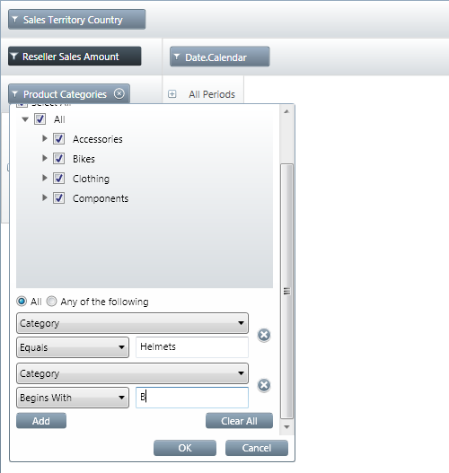
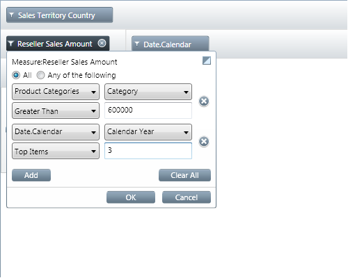

////
|metadata|
{
    "name": "xampivotgrid-excel-style-filtering-overview-and-user-functionality",
    "controlName": ["xamPivotGrid"],
    "tags": ["Drilldown","Filtering","Grids","How Do I"],
    "guid": "d7ee9ed5-cf33-4119-85d6-c01fac49be79",
    "buildFlags": [],
    "createdOn": "2016-05-25T18:21:58.2643296Z"
}
|metadata|
////

= Excel-Style Filtering Overview (xamPivotGrid, xamPivotDataSelector)

== Topic Overview

=== Purpose

This topic explains the Microsoft®-Excel®-Style Filtering feature of the  _xamPivotGrid_™/ _xamPivotDataSelector_™ controls and its user functionality and interactions.

=== Required background

The following topics are prerequisites to understanding this topic:

[options="header", cols="a,a"]
|====
|Topic|Purpose

| link:xampivotgrid-understanding-xampivotgrid.html[xamPivotGrid Overview]
|This topic introduces the _xamPivotGrid_ control and its key features and functionalities.

| link:xampivotgrid-getting-started-with-xampivotgrid.html[Getting Started with xamPivotGrid]
|This topic demonstrates how to get started with the _xamPivotGrid_ control by providing step-by-step procedure for adding this control to a Silverlight application.

| link:xampivotgrid-dataselector.html[DataSelector]
|This topic is an introduction to the _xamPivotDataSelector_ control.

|====

=== In this topic

This topic contains the following sections:

* <<_Ref332113295, Excel-Style Filtering Functionalities Overview >>

** <<_Ref333605487,Excel-Style Filtering functionalities summary>>
** <<_Ref333605491,Excel-Style functionalities capabilities chart>>

* <<_Ref332113308, Using the Excel-Style Filtering User Interface >>

** <<_Ref333605544,Searching>>
** <<_Ref333605551,Label Filtering>>
** <<_Ref333605575,Value Filtering>>

* <<_Ref333605609, Filtering Clauses Reference >>

** <<_Ref333604852,Label Filtering clauses reference chart>>
** <<_Ref333604853,Value Filtering clauses reference chart>>

* <<_Ref332113339, Related Content >>

** <<_Ref332113344,Topics>>
** <<_Ref332113347,Samples>>

[[_Ref332113295]]
== Excel-Style Filtering Functionalities Overview

[[_Ref333605487]]
=== Excel-Style Filtering functionalities summary

Excel-Style filtering (introduced in the 12.2 release) enables users to add value and label filters in _xamPivotGrid_ similar to those in MS Excel PivotTables. (Of course, this can also be performed by manually (or in code) selecting/de-selecting filter members from the filter member trees for the hierarchies in rows, columns, and filters.)

Excel-Style Filtering can be applied to the data from an link:{ApiPlatform}olap.xmla.v{ProductVersion}~infragistics.olap.xmla.xmladatasource_members.html[XmlaDataSource] or any class derived from it as long as there is either a link:{ApiPlatform}controls.grids.xampivotgrid.v{ProductVersion}~infragistics.controls.grids.xampivotgrid_members.html[XamPivotGrid] or link:{ApiPlatform}controls.grids.xampivotgrid.v{ProductVersion}~infragistics.controls.grids.xampivotdataselector_members.html[XamPivotDataSelector] control present in your application.

[[_Ref333605491]]
=== Excel-Style functionalities capabilities chart

The following table lists the specific capabilities of the Excel-Style Filtering feature and provides a brief explanation of each of them.

[options="header", cols="a,a"]
|====
|Capability|Description

|Search
|The Excel-Style Filtering’s Search enables users to search all the members of a hierarchy. When a user enters text in the search text box, all members whose captions contain the entered text are selected and all the remaining ones are unselected. The search is not case-sensitive.

|Label Filters
|Label filters are similar to label filters in MS Excel PivotTables. They allow the user to filter members of a given level by adding filter conditions for the captions of the members. Users can add multiple conditions and specify whether, in order to be selected, a member caption must satisfy all conditions or at least one of them. Label filters are not case-sensitive.

|Value Filters
|Value filters are analogous to value filters in MS Excel PivotTables. For each measure, users can apply multiple filtering conditions for the values of the totals on any level of a hierarchy.

|====

[[_Ref332113308]]
== Using the Excel-Style Filtering User Interface

[[_Ref332113323]]
=== Searching

The Excel-style filter dialog is displayed by clicking the filter icon (image:Images/xamPivotGrid_FilterIcon.png[]) for any of the added hierarchies or measures. For hierarchies, in the upper part of the dialog, above the member tree, there is a search text box. When users enter text in this field, the whole member tree will be searched and the members whose captions (labels) contain the user-entered string will be selected. Members that have children matching the search condition will be expanded. All remaining members will be collapsed and unselected.

The following picture shows a hierarchy being filtered according to a user search string.

image::images/xamPivotGrid_Advanced_Filtering_Overview_and_User_Functionality_01.png[]

[[_Ref332113326]]
=== Label Filtering

Label filters are similar to the Search functionality in terms that the filtering conditions are, too, applied to the captions of members in a hierarchy. However, while search is performed against the entire member tree, these label filter conditions are defined for the members in a single level of the hierarchy. For example, in the illustration below, the first label filter will be applied only to members of the Category level in the Product Categories hierarchy.

When the advanced filter dialog for a hierarchy is displayed, there is an Add button at the bottom. This button applies multiple label filters to a hierarchy. When more than one condition is defined, the user has the option to specify whether, in order to be selected, a member caption must satisfy all conditions or at least one of them. (By default, the logical operation between the conditions is _AND,_ meaning that all conditions must be satisfied.)

Unlike searching, which is performed as the user types in the search text box, label filter conditions are applied upon pressing the OK button of the filter dialog.

.Note
[NOTE]
====
Filter conditions are applied only to the members that have been selected in the member tree (and their selected children) prior to pressing the OK button.
====

A label filter consists of one or more conditions that are applied to the labels (displayed captions) of the members of the specified hierarchy. Members that do not satisfy these conditions are not included in the resulting slice. For creating a label filter, there are various clauses that can be applied individually or in combinations (thus forming expressions). For a listing of the available clauses, refer to <<_Ref333604852,Label Filter clauses reference chart>>.

[[_Ref332113332]]
=== Value Filtering

When the advanced filter dialog for a measure is displayed, users can enter filter conditions for the values of the measure. Each condition applies to the total values of the selected measure on the respective level of the hierarchy added as rows or columns. For example, in the picture below, there are two filters defined for the Reseller Sales Amount measure. The first one is applied to the totals of the Category level in the  _Product Categories_   hierarchy. In the same way, the second one is applied to the total values in the Calendar Year level of the Date.Calendar hierarchy.

.Note
[NOTE]
====
In order to be able to add value filters for a measure all hierarchies that are added to the rows and columns must contain grand totals.
====

.Note
[NOTE]
====
Only one top/bottom filter can be added for a specific level in a hierarchy.
====

A label value filter consists of one or more conditions that are applied to the total values of a measure in a specified level of hierarchy. Values that do not satisfy these conditions are not included in the resulting slice. For creating a value filter, there are various clauses that can be applied individually or in combinations. For a listing of the available clauses, refer to <<_Ref333604853,Value Filtering clauses reference chart>>.

[[_Ref333605609]]
== Filtering Clauses Reference

[[_Ref333604852]]

=== Label Filtering clauses reference chart

The following table briefly explains the available Label Filtering expression clauses.

.Note
[NOTE]
====
The conditions are not case-sensitive.
====

[options="header", cols="a,a"]
|====
|Filter Clause|Description 

|Equals
|Returns the members that have the same caption as specified in the filtering string.

|Does Not Equal
|Returns the members whose captions are not equal to the specified filtering string.

|Begins With
|Returns the members whose captions begin with the specified filtering string.

|Does Not Begin With
|Returns the members whose captions do not begin with the specified filtering string.

|Ends With
|Returns the members whose captions end with the specified filtering string.

|Does Not End With
|Returns the members whose captions do not end with the specified filtering string.

|Contains
|Returns the members whose captions contain the specified filtering string.

|Does Not Contain
|Returns the members whose captions do not contain the specified filtering string.

|Greater Than
|Lexicographically compares the specified string to the members’ captions and returns the members whose captions are strictly greater than the specified filtering string.

|Greater Than Or Equal To
|Lexicographically compares the specified string to the members’ captions and returns the members whose captions are greater than or equal to the specified filtering string.

|Less Than
|Lexicographically compares the specified string to the members’ captions and returns the members whose captions are strictly less than the specified filtering string.

|Less Than Or Equal To
|Lexicographically compares the specified string to the members’ captions and returns the members whose captions are less than or equal to the specified filtering string.

|====

[[_Ref333604853]]

=== Value Filtering clauses reference chart

The following table briefly explains the available Value Filtering expression clauses.

.Note
[NOTE]
====
In the descriptions,  _n_   stands for the actual number entered by the user.
====

[options="header", cols="a,a"]
|====
|Filter Clause|Description

|Top Items
|Returns the highest _n_ values at the specified level.

|Top Percent
|Returns the highest values that make up at least _n%_ of the grand total for the selected level.

|Top Sum
|Returns the highest values from the selected level that have a sum equal to or greater than _n_ .

|Bottom Items
|Returns to the lowest _n_ values from the specified level.

|Bottom Percent
|Returns the lowest values that make up at least _n%_ of the grand total for the selected level.

|Bottom Sum
|Returns the lowest values at the selected level that have a sum equal to or greater than _n_ .

|Equals
|Returns the items that have a value for the selected level equal to _n_ .

|Greater Than
|Returns all items whose value at the selected level is strictly greater than _n_ .

|Greater Than Or Equal To
|Returns all items whose value at the selected level is equal to or greater than _n_ .

|Less Than
|Returns all items whose value at the selected level is strictly less than _n_ .

|Less Than Or Equal To
|Returns all items whose value at the selected level is equal to or less than _n_ .

|====

[[_Ref332113339]]
== Related Content

[[_Ref332113344]]
=== Topics

The following topics provide additional information related to this topic.

[options="header", cols="a,a"]
|====
|Topic|Purpose

| link:xampivotgrid-us-filtering.html[Filtering]
|This topic explains how to use filtering in the _xamPivotGrid_ control.

| link:xampivotgrid-enabling-advanced-filtering.html[Enabling Excel-Style Filtering (xamPivotGrid, xamPivotDataSelector)]
|This topic explains how to enable the Excel-Style Filtering feature of the _xamPivotGrid_ / _xamPivotDataSelector_ controls.

|====

[[_Ref332113347]]
=== Samples

The following samples provide additional information related to this topic.

[options="header", cols="a,a"]
|====
|Sample|Purpose

|link:{SamplesURL}/pivot-grid/excel-style-filtering[Excel-Style Filtering]
|The Excel-Style filtering feature allows filtering the pivot grid values and labels by applying custom filter conditions e.g. top / bottom items, equals, less / greater than etc.

|====