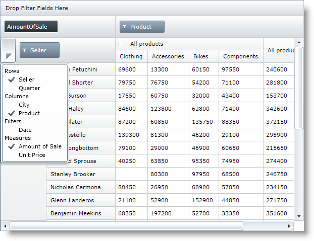

////
|metadata|
{
    "name": "xampivotgrid-field-chooser-implementing",
    "controlName": ["xamPivotGrid"],
    "tags": ["Drilldown","Grids","How Do I"],
    "guid": "971ff354-189a-4588-be9e-3773215cf267",
    "buildFlags": [],
    "createdOn": "2016-05-25T18:21:58.1903276Z"
}
|metadata|
////

= Implementing the Field Chooser (xamPivotGrid)

== Topic Overview

=== Purpose

This topic is a step-by-step walkthrough on using the field chooser control in the xamPivotGrid™.

=== Required background

The following table lists the topics required as a prerequisite to understanding this topic.

[options="header", cols="a,a"]
|====
|Topic|Purpose

| link:xampivotgrid-field-chooser-overview.html[Field Chooser Overview]
|This topic provides an overview of the field chooser control that is part of the xamPivotGrid™.

|====

=== In this topic

This topic contains the following sections:

* <<_Ref320179850, Implementing the Field Chooser >>

** <<_Ref320179855,Introduction>>
** <<_Ref320179858,Preview>>
** <<_Ref320179861,Requirements>>
** <<_Ref320179864,Overview>>
** <<_Ref320179867,Steps>>

* <<_Ref320179873, Code Example: Implementing the Field Chooser >>

** <<_Ref320179878,Description>>
** <<_Ref320179881,Code>>

* <<_Ref320179884, Related Content >>

** <<_Ref320179887,Topics>>
** <<_Ref320133177,Samples>>

[[_Ref320179850]]
== Implementing the Field Chooser

[[_Ref320179855]]

=== Introduction

The procedure below explains how to create `ObservableCollections` of `FieldChooserItems` and use them in the field chooser.

.Note:
[NOTE]
====
There is difference in the behavior of the field chooser when its groups’ `ItemsSources` are set to collections implementing `I``Notify``CollectionChanged` and when bound to collections that do not implement this interface. In the first case, if a hierarchy is added to a group (for example, columns) and checked, when a user moves the hierarchy to some of the other groups (for example, by drag-and-dropping it to the rows), this hierarchy is moved to the respective group (in the example here – rows).In the other case, instead of being moved to the new collection, the item is disabled.
====

[[_Ref320179858]]

=== Preview

The following screenshot is a preview of the final result.

[[_Ref320179861]]

=== Requirements

To complete the procedure, you need a {PlatformName} application where xamPivotGrid control is used. In this example the link:salesdatasample.html[SalesDataSample] is used as data source, but you can apply the logic to your own application.

[[_Ref320179864]]

=== Overview

This topic takes you step-by-step toward implementing the field chooser control in the xamPivotGrid. The following is a conceptual overview of the process:

*<<step_1,1. Initializing the FieldChooser.>>*

*<<step_2,2. Creating the necessary collections.>>*

*<<step_3,3. Populating the collections with FieldChooserItems.>>*

*<<step_4,4. Assign the collections as items sources of the field chooser groups.>>*

*<<step_5,5. Setting the group headers.>>*

[[_Ref320179867]]

=== Steps
[start=1]
. Initialize the FieldChooser.

The link:{ApiPlatform}controls.grids.xampivotgrid{ApiVersion}~infragistics.controls.grids.fieldchooser_members.html[FieldChooser] has to be initialized  *before the pivot grid is loaded* . One way to do this is to declare it inline in XAML. If you prefer to do this in code, a good place for initializing it is in the event handler for the Loaded event of the page. The code for the rest of the steps below could also be placed in this event handler, but it could also be executed at some later point.

[start=2]
. Create the necessary collections.

Create four `ObservableCollection``s` of link:{ApiPlatform}controls.grids.xampivotgrid{ApiVersion}~infragistics.controls.grids.fieldchooseritem_members.html[FieldChooserItem].

[start=3]
. Populate the collections with FieldChooserItems.
[start=4]
. Create `FieldChooserItems` and set the required properties.

For each of the collections create and add `FieldChooserItem` instances according to the hierarchies/measures that you want to be present in the respective group. For every `FieldChooserItem` you need to do the following:

Set the link:{ApiPlatform}controls.grids.xampivotgrid{ApiVersion}~infragistics.controls.grids.fieldchooseritem~fielduniquename.html[FieldUniqueName] property.

Set this property to the unique name of the hierarchy that you want to be represented by the item. This means that for the Seller hierarchy in the `SalesDataSample` data source you need to set the `FieldUniqeName` property of the `FieldChooserItem` to `[Seller]``.[``Seller]` which is the unique name of the hierarchy.

* For items in the measures group, unique names have to match the unique name of the respective measure from the data source. Refer to the <<_Code,code example below>> for more details.

* Set the Content property.

* The value of the `Content` property is what is actually rendered for a field chooser item. Its type is object so this gives you the freedom to display any type of content. The simplest way to proceed here is to set it to a string containing the name of the hierarchy/measure.

* Set the link:{ApiPlatform}controls.grids.xampivotgrid{ApiVersion}~infragistics.controls.grids.fieldchooseritem~fieldordinal.html[FieldOrdinal] property.

* When you check multiple items in the field chooser to be added to a single area (for example, columns), by default they are added in the sequence they were checked. However if these items have their `FieldOrdinal` property set, the last element in the target area is not the last one that is checked. The last one that is added is the one with the greatest `FieldOrdinal` value.

* Add the created items to the respective `ObservableCollections`.

[start=4]
. Assign the collections as items sources of the field chooser groups.

Set the collections created in the previous steps as values of the following properties:

* link:{ApiPlatform}controls.grids.xampivotgrid{ApiVersion}~infragistics.controls.grids.fieldchooser~columnsitemssource.html[ColumnsItemsSource]
* link:{ApiPlatform}controls.grids.xampivotgrid{ApiVersion}~infragistics.controls.grids.fieldchooser~rowsitemssource.html[RowsItemsSource]
* link:{ApiPlatform}controls.grids.xampivotgrid{ApiVersion}~infragistics.controls.grids.fieldchooser~filtersitemssource.html[FiltersItemsSource]
* link:{ApiPlatform}controls.grids.xampivotgrid{ApiVersion}~infragistics.controls.grids.fieldchooser~measuresitemssource.html[MeasuresItemsSource]

[start=5]
. Set the group headers.

Specify group headers by setting the following properties:

* link:{ApiPlatform}controls.grids.xampivotgrid{ApiVersion}~infragistics.controls.grids.fieldchooser~columnsgroupheader.html[ColumnsGroupHeader]
* link:{ApiPlatform}controls.grids.xampivotgrid{ApiVersion}~infragistics.controls.grids.fieldchooser~rowsgroupheader.html[RowsGroupHeader]
* link:{ApiPlatform}controls.grids.xampivotgrid{ApiVersion}~infragistics.controls.grids.fieldchooser~filtersgroupheader.html[FiltersGroupHeader]
* link:{ApiPlatform}controls.grids.xampivotgrid{ApiVersion}~infragistics.controls.grids.fieldchooser~measuresgroupheader.html[MeasuresGroupHeader]

Similarly to the `Content` property of a `FieldChooserItem`, the type of these properties is `object`, so you can set them to almost anything you want.

[[_Ref320179873]]
== Code Example: Implementing the Field Chooser

[[_Ref320179878]]

=== Description

Below is the code for the procedure above. As stated above you need to place it in the event handler for the Loaded event of the page.

[[_Code]]

=== Code

*In C#:*

[source,csharp]
----
// Step 1
pivotGrid.FieldChooser = new FieldChooser();
// Step 2
var columnsItems = new ObservableCollection<FieldChooserItem>();
var rowsItems = new ObservableCollection<FieldChooserItem>();
var filtersItems = new ObservableCollection<FieldChooserItem>();
var measuresItems = new ObservableCollection<FieldChooserItem>();
// Step 3
columnsItems.Add(new FieldChooserItem() { FieldUniqueName = "[City].[City]", Content = "City", FieldOrdinal = 0 });
columnsItems.Add(new FieldChooserItem() { FieldUniqueName = "[Product].[Product]", Content = "Product", FieldOrdinal = 1 });
rowsItems.Add(new FieldChooserItem() { FieldUniqueName = "[Seller].[Seller]", Content = "Seller", FieldOrdinal = 0 });
rowsItems.Add(new FieldChooserItem() { FieldUniqueName = "[Quarter].[Quarter]", Content = "Quarter", FieldOrdinal = 1 });
filtersItems.Add(new FieldChooserItem() { FieldUniqueName = "[Date].[Date]", Content = "Date" });
measuresItems.Add(new FieldChooserItem() { FieldUniqueName = "AmountOfSale", Content = "Amount of Sale", FieldOrdinal = 0 });
measuresItems.Add(new FieldChooserItem() { FieldUniqueName = "UnitPrice", Content = "Unit Price", FieldOrdinal = 1 });
// Step 4
pivotGrid.FieldChooser.ColumnsItemsSource = columnsItems;
pivotGrid.FieldChooser.RowsItemsSource = rowsItems;
pivotGrid.FieldChooser.FiltersItemsSource = filtersItems;
pivotGrid.FieldChooser.MeasuresItemsSource = measuresItems;
// Step 5
pivotGrid.FieldChooser.ColumnsGroupHeader = "Columns";
pivotGrid.FieldChooser.RowsGroupHeader = "Rows";
pivotGrid.FieldChooser.FiltersGroupHeader = "Filters";
pivotGrid.FieldChooser.MeasuresGroupHeader = "Measures";
----

*In Visual Basic:*

[source,vb]
----
' Step 1
pivotGrid.FieldChooser = New FieldChooser()
' Step 2
Dim columnsItems = New ObservableCollection(Of FieldChooserItem)()
Dim rowsItems = New ObservableCollection(Of FieldChooserItem)()
Dim filtersItems = New ObservableCollection(Of FieldChooserItem)()
Dim measuresItems = New ObservableCollection(Of FieldChooserItem)()
' Step 3
columnsItems.Add(New FieldChooserItem() With { .FieldUniqueName = "[City].[City]", _
      .Content = "City", .FieldOrdinal = 0 })
columnsItems.Add(New FieldChooserItem() With { .FieldUniqueName = "[Product].[Product]", _
      .Content = "Product", .FieldOrdinal = 1 })
rowsItems.Add(New FieldChooserItem() With { .FieldUniqueName = "[Seller].[Seller]", _
      .Content = "Seller", .FieldOrdinal = 0 })
rowsItems.Add(New FieldChooserItem() With { .FieldUniqueName = "[Quarter].[Quarter]", _
      .Content = "Quarter", .FieldOrdinal = 1 })
filtersItems.Add(New FieldChooserItem() With { .FieldUniqueName = "[Date].[Date]", _
      .Content = "Date" })
measuresItems.Add(New FieldChooserItem() With { .FieldUniqueName = "AmountOfSale", _
      .Content = "Amount of Sale",       .FieldOrdinal = 0 })
measuresItems.Add(New FieldChooserItem() With { .FieldUniqueName = "UnitPrice", _
      .Content = "Unit Price", .FieldOrdinal = 1 })
' Step 4
pivotGrid.FieldChooser.ColumnsItemsSource = columnsItems
pivotGrid.FieldChooser.RowsItemsSource = rowsItems
pivotGrid.FieldChooser.FiltersItemsSource = filtersItems
pivotGrid.FieldChooser.MeasuresItemsSource = measuresItems
' Step 5
pivotGrid.FieldChooser.ColumnsGroupHeader = "Columns"
pivotGrid.FieldChooser.RowsGroupHeader = "Rows"
pivotGrid.FieldChooser.FiltersGroupHeader = "Filters"
pivotGrid.FieldChooser.MeasuresGroupHeader = "Measures"
----

[[_Ref320179884]]
== Related Content

[[_Ref320179887]]

=== Topics

The following topics provide additional information related to this topic.

[options="header", cols="a,a"]
|====
|Topic|Purpose

| link:xampivotgrid-field-chooser-property-reference.html[Field Chooser Property Reference]
|This is a list of the most notable API members relevant to the field chooser control.

| link:xampivotgrid-us-assigning-hierarchies-and-measures.html[Assigning Hierarchies and Measures]
|After you have loaded a cube with data you need to select hierarchies on which to base the slice of data to be computed.

| link:xampivotgrid-dataselector.html[DataSelector]
|This topic is an introduction to the xamPivotDataSelector™ control.

|====

[[_Ref320133177]]

=== Samples

The following samples provide additional information related to this topic.

[options="header", cols="a,a"]
|====
|Sample|Description

|
ifdef::sl[] 

link:{SamplesURL}/pivot-grid/#/field-chooser-from-xaml[Field Chooser from XAML] 

endif::sl[] 

ifdef::wpf[] 

link:{SamplesURL}/pivot-grid/field-chooser-from-xaml[Field Chooser from XAML] 

endif::wpf[] 

|This sample demonstrates how to specify items for the field chooser in XAML.

|
ifdef::sl[] 

link:{SamplesURL}/pivot-grid/#/field-chooser-bound-to-observablecollection[Field Chooser Bound to ObservableCollection] 

endif::sl[] 

ifdef::wpf[] 

link:{SamplesURL}/pivot-grid/field-chooser-bound-to-observablecollection[Field Chooser Bound to ObservableCollection] 

endif::wpf[] 

|This sample demonstrates the behavior of the Field Chooser when bound to ObservableCollections of hierarchies and measures.

|====