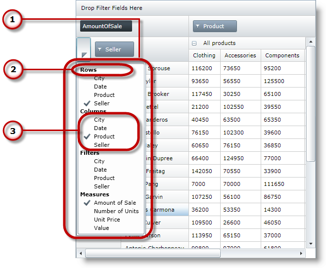

////
|metadata|
{
    "name": "xampivotgrid-field-chooser-overview",
    "controlName": ["xamPivotGrid"],
    "tags": ["Drilldown","Getting Started","Grids"],
    "guid": "9757ebdd-178e-4ac0-9cce-e8ce9815a287",
    "buildFlags": [],
    "createdOn": "2016-05-25T18:21:58.1732942Z"
}
|metadata|
////

= Field Chooser Overview (xamPivotGrid)

== Topic Overview

=== Purpose

This topic provides an overview of the field chooser control that is part of the xamPivotGrid™.

=== Required background

The following table lists the topics required as a prerequisite to understanding this topic.

[options="header", cols="a,a"]
|====
|Topic|Purpose

| link:xampivotgrid-understanding-xampivotgrid.html[xamPivotGrid Overview]
|This section serves as an introduction to the xamPivotGrid control's key features and functionalities. The topics listed here will give you a better idea of why you would want to use xamPivotGrid in your applications.

| link:xampivotgrid-getting-started-with-xampivotgrid.html[Getting Started with xamPivotGrid]
|This topic demonstrates how to get started with the xamPivotGrid control by providing step-by-step procedure for adding this control to a {PlatformName} application.

| link:xampivotgrid-us-assigning-hierarchies-and-measures.html[Assigning Hierarchies and Measures]
|After you have loaded a cube with data you need to select hierarchies on which to base the slice of data to be computed.

|====

=== In this topic

This topic contains the following sections:

* <<_Ref320133128, Visual Elements of the Field Chooser Control and Related Properties >>

** <<_Ref320133132,Visual elements summary>>
** <<_Ref320133134,Visual elements and related properties>>

* <<_Ref320133137, Control Configuration Summary >>
* <<_Ref320195328, Populating the Field Chooser Groups with Instances of the FieldChooserItem Class >><<_Ref320133145,>>

** <<_Ref320133149,Overview>>
** <<_Ref320133153,Property settings>>

* <<_Ref320133158, Populating the Field Chooser Groups Using Objects of a Custom Type >>

** <<_Ref320133162,Overview>>
** <<_Ref320133164,Property settings>>

* <<_Ref320133172, Related Content >>

** <<_Ref320133175,Topics>>
** <<_Ref320133177,Samples>>

[[_Ref320133128]]
== Visual Elements of the Field Chooser Control and Related Properties

[[_Ref320133132]]
=== Visual elements summary

The field chooser is a part of the xamPivotGrid that allows you to specify items which users can pick from to use as rows, columns, filters and measures in the pivot grid. It consists of four `ItemsControls`, where selectable items can be specified for rows, columns, filters and measures. The purpose of the field chooser is somewhat similar to this of the xamPivotDataSelector™.

The following screenshot depicts the visual elements of the field chooser control. Configurable elements are listed after the image.

*Configurable Visual Elements:*

. *Field Chooser drop-down*
+
This is how the field chooser looks, when its drop-down is displayed. To display the drop-down, press the button above it.

. *Rows Group Header*
+
Each of the four groups of items has a header that you can set to an object of your choice. In the screenshot above, the headers are set to `TextBlocks` with the corresponding text for each group - Rows, Columns, Filters and Measures.

. *Columns field chooser group*
+
All of the field chooser groups are optional and if no items are added to a group it will not be displayed.

[[_Ref320133134]]
=== Visual elements and related properties

The following table maps the visual elements of the field chooser control and the properties that configure them.

[options="header", cols="a,a"]
|====
|Visual Elements|Property

|Field Chooser
| link:{ApiPlatform}controls.grids.xampivotgrid{ApiVersion}~infragistics.controls.grids.fieldchooser_members.html[XamPivotGrid.FieldChooser]

|Group headers
|
* link:{ApiPlatform}controls.grids.xampivotgrid{ApiVersion}~infragistics.controls.grids.fieldchooser~columnsgroupheader.html[ColumnsGroupHeader] 

* link:{ApiPlatform}controls.grids.xampivotgrid{ApiVersion}~infragistics.controls.grids.fieldchooser~rowsgroupheader.html[RowsGroupHeader] 

* link:{ApiPlatform}controls.grids.xampivotgrid{ApiVersion}~infragistics.controls.grids.fieldchooser~filtersgroupheader.html[FiltersGroupHeader] 

* link:{ApiPlatform}controls.grids.xampivotgrid{ApiVersion}~infragistics.controls.grids.fieldchooser~measuresgroupheader.html[MeasuresGroupHeader] 

|Item groups
|
* link:{ApiPlatform}controls.grids.xampivotgrid{ApiVersion}~infragistics.controls.grids.fieldchooser~columns.html[Columns] 

* link:{ApiPlatform}controls.grids.xampivotgrid{ApiVersion}~infragistics.controls.grids.fieldchooser~rows.html[Rows] 

* link:{ApiPlatform}controls.grids.xampivotgrid{ApiVersion}~infragistics.controls.grids.fieldchooser~filters.html[Filters] 

* link:{ApiPlatform}controls.grids.xampivotgrid{ApiVersion}~infragistics.controls.grids.fieldchooser~measures.html[Measures] 

|====

[[_Ref320133137]]
== Control Configuration Summary

[[_Ref320133139]]
=== Control configuration overview

The following table lists the main ways to configure the field chooser control.

[options="header", cols="a,a,a"]
|====
|Configurable aspects|Details|Properties

|Populating the field chooser groups with instances of the `FieldChooserItem` class.
|Using link:{ApiPlatform}controls.grids.xampivotgrid{ApiVersion}~infragistics.controls.grids.fieldchooseritem_members.html[FieldChooserItems]in the field chooser.
|
* link:{ApiPlatform}controls.grids.xampivotgrid{ApiVersion}~infragistics.controls.grids.fieldchooser~columns.html[Columns] / link:{ApiPlatform}controls.grids.xampivotgrid{ApiVersion}~infragistics.controls.grids.fieldchooser~columnsitemssource.html[ColumnsItemsSource] 

* link:{ApiPlatform}controls.grids.xampivotgrid{ApiVersion}~infragistics.controls.grids.fieldchooser~rows.html[Rows] / link:{ApiPlatform}controls.grids.xampivotgrid{ApiVersion}~infragistics.controls.grids.fieldchooser~rowsitemssource.html[RowsItemsSource] 

* link:{ApiPlatform}controls.grids.xampivotgrid{ApiVersion}~infragistics.controls.grids.fieldchooser~filters.html[Filters] / link:{ApiPlatform}controls.grids.xampivotgrid{ApiVersion}~infragistics.controls.grids.fieldchooser~filtersitemssource.html[FiltersItemsSource] 

* link:{ApiPlatform}controls.grids.xampivotgrid{ApiVersion}~infragistics.controls.grids.fieldchooser~measures.html[Measures] / link:{ApiPlatform}controls.grids.xampivotgrid{ApiVersion}~infragistics.controls.grids.fieldchooser~measuresitemssource.html[MeasuresItemsSource] 

|Populating the field chooser groups using objects of a custom type.
|Using custom type for items in the field chooser.
|
* link:{ApiPlatform}controls.grids.xampivotgrid{ApiVersion}~infragistics.controls.grids.fieldchooser~columns.html[Columns] / link:{ApiPlatform}controls.grids.xampivotgrid{ApiVersion}~infragistics.controls.grids.fieldchooser~columnsitemssource.html[ColumnsItemsSource] 

* link:{ApiPlatform}controls.grids.xampivotgrid{ApiVersion}~infragistics.controls.grids.fieldchooser~rows.html[Rows] / link:{ApiPlatform}controls.grids.xampivotgrid{ApiVersion}~infragistics.controls.grids.fieldchooser~rowsitemssource.html[RowsItemsSource] 

* link:{ApiPlatform}controls.grids.xampivotgrid{ApiVersion}~infragistics.controls.grids.fieldchooser~filters.html[Filters] / link:{ApiPlatform}controls.grids.xampivotgrid{ApiVersion}~infragistics.controls.grids.fieldchooser~filtersitemssource.html[FiltersItemsSource] 

* link:{ApiPlatform}controls.grids.xampivotgrid{ApiVersion}~infragistics.controls.grids.fieldchooser~measures.html[Measures] / link:{ApiPlatform}controls.grids.xampivotgrid{ApiVersion}~infragistics.controls.grids.fieldchooser~measuresitemssource.html[MeasuresItemsSource] 

* link:{ApiPlatform}controls.grids.xampivotgrid{ApiVersion}~infragistics.controls.grids.fieldchooser~fieldordinalmemberpath.html[FieldOrdinalMemberPath] 

* link:{ApiPlatform}controls.grids.xampivotgrid{ApiVersion}~infragistics.controls.grids.fieldchooser~fielduniquenamememberpath.html[FieldUniqueNameMemberPath] 

|====

[[_Ref320195328]]
== Populating the Field Chooser Groups with Instances of the FieldChooserItem Class

[[_Ref320133149]]
=== Overview

link:{ApiPlatform}controls.grids.xampivotgrid{ApiVersion}~infragistics.controls.grids.fieldchooseritem_members.html[FieldChooserItem] is a `ContentControl` and it is the default type for items of the link:{ApiPlatform}controls.grids.xampivotgrid{ApiVersion}~infragistics.controls.grids.fieldchoosergroup_members.html[FieldChooserGroups]. The relation between `FieldChooserItem` and `FieldChooserGroup` is similar to `ComboBoxItem` and `ComboBox` – if you add items from a custom type to a field chooser group each of them will be implicitly wrapped inside a `FieldChooserItem`.

The `FieldChooserItem` class exposes the link:{ApiPlatform}controls.grids.xampivotgrid{ApiVersion}~infragistics.controls.grids.fieldchooseritem~fielduniquename.html[FieldUniqueName] property which determines what hierarchy/measure the item corresponds to. For all groups except Measures, this property needs to be set to the `UniqueName` of the `Hierarchy` that you want to target. For measures, the `FieldUniqueName` should match the corresponding `UniqueName` property of the `Measure` you want to target.

[[_Ref320133153]]
=== Property settings

The following table maps the desired configuration to property settings.

[options="header", cols="a,a,a"]
|====
|In order to:
|Use this property:
|What to do:

.2+|Add items to the columns collection.
| link:{ApiPlatform}controls.grids.xampivotgrid{ApiVersion}~infragistics.controls.grids.fieldchooser~columns.html[Columns]
|Use its `Add` method to add `FieldChooserItems`. +
*OR* +
Specify the items in XAML inside the `Columns` property of the `FieldChooser`.

| link:{ApiPlatform}controls.grids.xampivotgrid{ApiVersion}~infragistics.controls.grids.fieldchooser~columnsitemssource.html[ColumnsItemsSource]
|Set this property to a collection of `FieldChooserItems`.

.2+|Add items to the filters collection.
| link:{ApiPlatform}controls.grids.xampivotgrid{ApiVersion}~infragistics.controls.grids.fieldchooser~filters.html[Filters]
|Use its `Add` method to add `FieldChooserItems`. +
*OR* +
Specify the items in XAML inside the `Filters` property of the `FieldChooser`.

| link:{ApiPlatform}controls.grids.xampivotgrid{ApiVersion}~infragistics.controls.grids.fieldchooser~filtersitemssource.html[FiltersItemsSource]
|Set this property to a collection of `FieldChooserItems`.

.2+|Add items to the rows collection.
| link:{ApiPlatform}controls.grids.xampivotgrid{ApiVersion}~infragistics.controls.grids.fieldchooser~rows.html[Rows]
|Use its `Add` method to add `FieldChooserItems`. +
*OR* +
Specify the items in XAML inside the `Rows` property of the `FieldChooser`.

| link:{ApiPlatform}controls.grids.xampivotgrid{ApiVersion}~infragistics.controls.grids.fieldchooser~rowsitemssource.html[RowsItemsSource]
|Set this property to a collection of `FieldChooserItems`.

.2|Add items to the measures collection.
| link:{ApiPlatform}controls.grids.xampivotgrid{ApiVersion}~infragistics.controls.grids.fieldchooser~measures.html[Measures]
|Use its `Add` method to add `FieldChooserItems`. +
*OR* +
Specify the items in XAML inside the `Measures` property of the `FieldChooser`.

| link:{ApiPlatform}controls.grids.xampivotgrid{ApiVersion}~infragistics.controls.grids.fieldchooser~measuresitemssource.html[MeasuresItemsSource]
|Set this property to a collection of `FieldChooserItems`.

|====

[[_Ref320133158]]
== Populating the Field Chooser Groups Using Objects of a Custom Type

[[_Ref320133162]]
=== Overview

When you want to use some custom class for the items in field chooser groups there are the following important requirements:

* The class must have a string property where the unique name string will be stored.
* You need to create mapping for the unique name property. To do so, you need to set the link:{ApiPlatform}controls.grids.xampivotgrid{ApiVersion}~infragistics.controls.grids.fieldchooser~fielduniquenamememberpath.html[FieldUniqueNameMemberPath] property of the `FieldChooser` to the name of the property in your class that holds the unique name string. For example, you have a `TestItem` class which has a string property called `HierarchyName`. Also assume that you have a `Hierarchy` with `UniqueName` `"[Seller].[Seller]"`. If you want to enable users to add/remove this hierarchy from the Columns area of the xamPivotGrid through the field chooser, you need to set the `FieldUniqueNameMemberPath` property of the field chooser to `HierarchyName`. Then you have to create a `TestItem` instance with its `HierarchyName` set to `[Seller].[Seller]` and add it to the column field group.

[[_Ref320133164]]
=== Property settings

The following table maps the desired configuration to property settings.

[options="header", cols="a,a,a"]
|====
|In order to:
|Use this property:
|What to do:

.2+|Add items to the columns collection.
| link:{ApiPlatform}controls.grids.xampivotgrid{ApiVersion}~infragistics.controls.grids.fieldchooser~columns.html[Columns]
|Use its `Add` method to add `FieldChooserItems`. +
*OR* +
Specify the items in XAML inside the `Columns` property of the `FieldChooser`.

| link:{ApiPlatform}controls.grids.xampivotgrid{ApiVersion}~infragistics.controls.grids.fieldchooser~columnsitemssource.html[ColumnsItemsSource]
|Set this property to a collection of `FieldChooserItems`.

.2+|Add items to the filters collection.
| link:{ApiPlatform}controls.grids.xampivotgrid{ApiVersion}~infragistics.controls.grids.fieldchooser~filters.html[Filters]
|Use its `Add` method to add `FieldChooserItems`. +
*OR* +
Specify the items in XAML inside the `Filters` property of the `FieldChooser`.

| link:{ApiPlatform}controls.grids.xampivotgrid{ApiVersion}~infragistics.controls.grids.fieldchooser~filtersitemssource.html[FiltersItemsSource]
|Set this property to a collection of `FieldChooserItems`.

.2+|Add items to the rows collection.
| link:{ApiPlatform}controls.grids.xampivotgrid{ApiVersion}~infragistics.controls.grids.fieldchooser~rows.html[Rows]
|Use its `Add` method to add `FieldChooserItems`. +
*OR* +
Specify the items in XAML inside the `Rows` property of the `FieldChooser`.

| link:{ApiPlatform}controls.grids.xampivotgrid{ApiVersion}~infragistics.controls.grids.fieldchooser~rowsitemssource.html[RowsItemsSource]
|Set this property to a collection of `FieldChooserItems`.

.2+|Add items to the measures collection.
| link:{ApiPlatform}controls.grids.xampivotgrid{ApiVersion}~infragistics.controls.grids.fieldchooser~measures.html[Measures]
|Use its `Add` method to add `FieldChooserItems`. +
*OR* +
Specify the items in XAML inside the `Measures` property of the `FieldChooser`.

| link:{ApiPlatform}controls.grids.xampivotgrid{ApiVersion}~infragistics.controls.grids.fieldchooser~measuresitemssource.html[MeasuresItemsSource]
|Set this property to a collection of `FieldChooserItems`.

|Instruct the field chooser which property of your class holds the unique name string.
| link:{ApiPlatform}controls.grids.xampivotgrid{ApiVersion}~infragistics.controls.grids.fieldchooser~fielduniquenamememberpath.html[FieldUniqueNameMemberPath]
|Set it to the name of the property of your class.

|Instruct the field chooser which property of your class holds a display name for the item.
| link:{ApiPlatform}controls.grids.xampivotgrid{ApiVersion}~infragistics.controls.grids.fieldchooser~displaymemberpath.html[DisplayMemberPath]
|Set it to the name of the property of your class.

|Instruct the field chooser which property of your class holds an integer value used for determining at what position the item is added to the target collection.
| link:{ApiPlatform}controls.grids.xampivotgrid{ApiVersion}~infragistics.controls.grids.fieldchooser~fieldordinalmemberpath.html[FieldOrdinalMemberPath]
|Set it to the name of the property of your class.

|====

[[_Ref320133172]]
== Related Content

[[_Ref320133175]]
=== Topics

The following topics provide additional information related to this topic.

[options="header", cols="a,a"]
|====
|Topic|Purpose

| link:xampivotgrid-field-chooser-implementing.html[Implementing the Field Chooser]
|This topic is a step-by-step walkthrough on using the field chooser control in the xamPivotGrid.

| link:xampivotgrid-field-chooser-property-reference.html[Field Chooser Property Reference]
|This is a list of the most notable API members relevant to the field chooser control.

| link:xampivotgrid-dataselector.html[DataSelector]
|This topic is an introduction to the xamPivotDataSelector™ control.

|====

[[_Ref320133177]]
=== Samples

The following samples provide additional information related to this topic.

[options="header", cols="a,a"]
|====
|Sample|Description

| link:{SamplesURL}/pivot-grid/field-chooser-from-xaml[Field Chooser from XAML] 

|This sample demonstrates how to specify items for the field chooser in XAML.

| link:{SamplesURL}/pivot-grid/field-chooser-bound-to-observablecollection[Field Chooser Bound to ObservableCollection] 

|This sample demonstrates the behavior of the Field Chooser when bound to ObservableCollections of hierarchies and measures.

|====