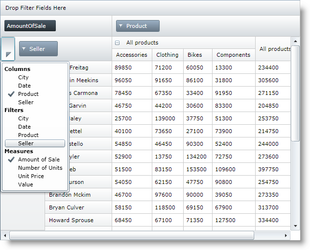

////

|metadata|
{
    "name": "xampivotgrid-field-chooser",
    "controlName": ["xamPivotGrid"],
    "tags": ["Getting Started","Grids"],
    "guid": "c4a64cce-25a8-48b4-9125-5f5f105ba6ca",  
    "buildFlags": [],
    "createdOn": "2016-05-25T18:21:58.1672927Z"
}
|metadata|
////

= Field Chooser (xamPivotGrid)

=== Introduction

The xamPivotGrid™ control includes the Field Chooser control, which can be used by users to quickly select hierarchies to add to the rows, columns, filters and measures. The topics in this section provide detailed information about the field chooser.

=== Topics

Detailed information regarding the field chooser is covered in the following topics:

[options="header", cols="a,a"]
|====
|Topic|Purpose

| link:xampivotgrid-field-chooser-overview.html[Field Chooser Overview]
|This topic provides an overview of the field chooser control that is part of the xamPivotGrid™.

| link:xampivotgrid-field-chooser-implementing.html[Implementing the Field Chooser]
|This topic is a step-by-step walkthrough on using the field chooser control in the xamPivotGrid™.

| link:xampivotgrid-field-chooser-property-reference.html[Field Chooser Property Reference]
|This is a list of the most notable API members relevant to the field chooser control.

|====