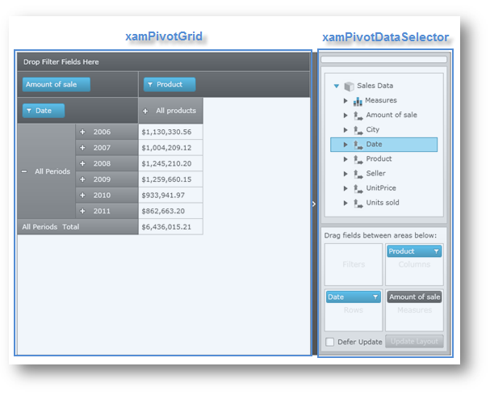

////

|metadata|
{
    "name": "xampivotgrid-getting-started-with-xampivotgrid",
    "controlName": ["xamPivotGrid"],
    "tags": ["Data Binding","Getting Started","How Do I"],
    "guid": "{F6A7249A-7274-4C95-B1A1-1235350651F6}",  
    "buildFlags": [],
    "createdOn": "2016-05-25T18:21:57.9433119Z"
}
|metadata|
////

= Getting Started with xamPivotGrid

This topic demonstrates how to get started with the link:{ApiPlatform}controls.grids.xampivotgrid{ApiVersion}~infragistics.controls.grids.xampivotgrid.html[xamPivotGrid]™ control by providing step-by-step procedure for adding this control to a {PlatformName} application. Code examples include listings in XAML as well as procedural code.

The topic is organized as follows:

* <<Introduction,Introduction>>
* <<Preview,Preview>>
* <<Requirements,Requirements>>
* <<Instructions,Instructions>>

** Using XAML Code
** Using Procedural Code

* <<RelatedTopics,Related Topics>>

** link:xampivotgrid-understanding-xampivotgrid.html[xamPivotGrid Overview]
** link:xampivotgrid-us-excel-spreadsheet-as-a-datasource.html[Excel Spreadsheet as a DataSource]
** link:xampivotgrid-binding-data-to-the-xampivotgrid.html[Binding Data to the xamPivotGrid]

== Introduction

The procedures below demonstrate how to add the xamPivotGrid control with link:{ApiPlatform}controls.grids.xampivotgrid{ApiVersion}~infragistics.controls.grids.xampivotdataselector.html[xamPivotDataSelector]™ to an application, and then bind these controls to FlatDataSource with a data model. For more information on binding data and using different data source for the xamPivotGrid control refer to the link:xampivotgrid-binding-data-to-the-xampivotgrid.html[Binding Data to the xamPivotGrid] topic.

== Preview

Following is a preview of the final result:

Figure 1: A sample of the xamPivotGrid control with xamPivotDataSelector.

== Requirements

[start=1]
. Download the SalesDataSample class from the link:salesdatasample.html[Sales Data Sample resource] and add it to your application. This class is responsible to act as an item source for the FlatDataSource of the xamPivotGrid control however you can create your own data model by implementing the link:http://msdn.microsoft.com/en-us/library/system.collections.ienumerable.aspx[IEnumerable] interface (e.g. `List`, `Collection`, `Queue`, `Stack` etc.). Refer to the Binding Data topic in order to provide different data source for the xamPivotGrid control.
[start=2]
. Add required assembly references:

** {ApiPlatform}Controls.Grids.XamPivotGrid.v{ProductVersion}.dll
** {ApiPlatform}Controls.Menus.XamDataTree.v{ProductVersion}.dll
** {ApiPlatform}DragDrop.v{ProductVersion}.dll
** {ApiPlatform}Olap.FlatData.v{ProductVersion}.dll
** {ApiPlatform}Olap.v{ProductVersion}.dll
** {ApiPlatform}v{ProductVersion}.dll

.Note:
[NOTE]
====
The type of data source of the xamPivotGrid control determines what OLAP assembly references are required. Refer to the link:developers-guide-deploying-your-application.html[Deploying Your Application topic] for the complete list of required assemblies used by components of the xamPivotGrid control and its data sources.
====

[start=3]
. Add required namespace declarations:

*In XAML:*

----
xmlns:olap="http://schemas.infragistics.com/olap"
xmlns:ig="http://schemas.infragistics.com/xaml"
xmlns:models="clr-namespace:Infragistics.Samples.Data.Models"
----

*In Visual Basic:*

----
Imports Infragistics.Olap                 ' common OLAP objects
Imports Infragistics.Olap.FlatData        ' FlatDataSource
Imports Infragistics.Controls.Grids       ' xamPivotGrid
Imports Infragistics.Samples.Data.Models  ' SalesDataSample
----

*In C#:*

----
using Infragistics.Olap;                 // common OLAP objects
using Infragistics.Olap.FlatData;        // FlatDataSource
using Infragistics.Controls.Grids;       // xamPivotGrid
using Infragistics.Samples.Data.Models;  // SalesDataSample
----

.Note:
[NOTE]
====
The Infragistics.Sample.Data.Models is the namespace in which the link:salesdatasample.html[SalesDataSample] class is defined. This namespace might vary depending on where you added SalesDataSample class in your project.
====

== Instructions

This section provides step-by-step instructions for adding the xamPivotGrid control to your application and binding it to the link:salesdatasample.html[SalesDataSample] data through FlatDataSource view model.

== Using XAML Code

Add the SalesDataSample data as a resource.

*In XAML:*

----
xmlns:models="clr-namespace:Infragistics.Samples.Data.Models"
...
<models:SalesDataSample x:Key="dataSample"/>
----

Add the FlatDataSource view model as a resource and bind it to the SalesDataSample data.

*In XAML:*

----
<olap:FlatDataSource x:Key="dataSource" ItemsSource="{StaticResource dataSample}" />
----

Add the xamPivotGrid control to the layout root and bind it to the FlatDataSource view model.

*In XAML:*

----
<Grid x:Name="LayoutRoot" >
    <Grid.ColumnDefinitions>
            <ColumnDefinition Width="*" />
            <ColumnDefinition Width="Auto" />
    </Grid.ColumnDefinitions>
    <ig:XamPivotGrid x:Name="pivotGrid" DataSource="{StaticResource dataSource}" />
    <!-- TODO Add xamPivotDataSelector control -->
</Grid>
----

Add the xamPivotDataSelector control to the layout root and bind it to the FlatDataSource view model.

*In XAML:*

----
    <ig:Expander Grid.Column="1">
        <ig:XamPivotDataSelector x:Name="pivotDataSelector" 
                                 DataSource="{StaticResource dataSource}"  />
    </ig:Expander>
----

== Using Procedural Code

Create an instance of the SalesDataSample class.

*In Visual Basic:*

----
Imports Infragistics.Samples.Data.Models  ' SalesDataSamples  
...
Dim dataSample As New SalesDataSamples()
----

*In C#:*

----
using Infragistics.Samples.Data.Models;  // SalesDataSample  
...
SalesDataSamples dataSample = new SalesDataSamples();
----

Create an instance of the FlatDataSource view model and bind it to the SalesDataSample data.

*In Visual Basic:*

----
Dim dataSource As New FlatDataSource()
dataSource.ItemsSource = dataSample
----

*In C#:*

----
FlatDataSource dataSource = new FlatDataSource();
dataSource.ItemsSource = dataSample;
----

Add the xamPivotGrid control to the layout root and bind it to the FlatDataSource view model.

*In Visual Basic:*

----
Dim pivotGrid As New XamPivotGrid()
pivotGrid.DataSource = dataSource
Me.LayoutRoot.Children.Add(pivotGrid)
----

*In C#:*

----
XamPivotGrid pivotGrid = new XamPivotGrid();
pivotGrid.DataSource = dataSource;
this.LayoutRoot.Children.Add(pivotGrid);
----

Add the xamPivotDataSelector control to the layout root and bind it to the FlatDataSource view model.

*In Visual Basic:*

----
Dim pivotDataSelector As New XamPivotDataSelector ()
pivotDataSelector.DataSource = dataSource
Me.LayoutRoot.Children.Add(pivotDataSelector)
----

*In C#:*

----
XamPivotGrid pivotDataSelector = new XamPivotDataSelector ();
pivotDataSelector.DataSource = dataSource;
this.LayoutRoot.Children.Add(pivotDataSelector);
----

[[RelatedTopics]]
== Related Topics

* link:xampivotgrid-understanding-xampivotgrid.html[xamPivotGrid Overview]
* link:xampivotgrid-us-excel-spreadsheet-as-a-datasource.html[Excel Spreadsheet as a DataSource]
* link:xampivotgrid-binding-data-to-the-xampivotgrid.html[Binding Data to the xamPivotGrid]