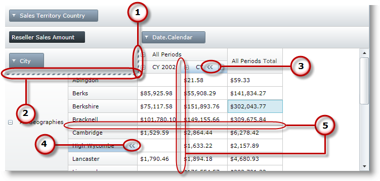
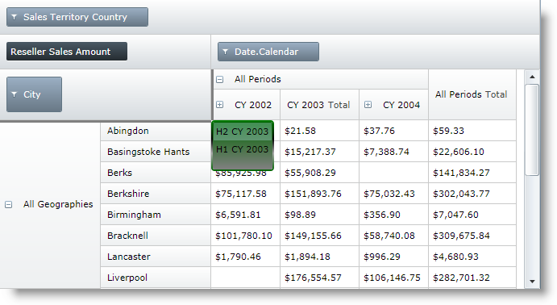

////
|metadata|
{
    "name": "xampivotgrid-hiding-columns-and-rows",
    "controlName": ["xamPivotGrid"],
    "tags": ["Grids","How Do I","Layouts"],
    "guid": "26a94940-9a36-4ae1-9386-83366578b23c",
    "buildFlags": [],
    "createdOn": "2016-05-25T18:21:58.1612924Z"
}
|metadata|
////

= Hiding Columns and Rows

== Topic Overview

=== Purpose

This topic explains how you can enable end users to hide columns and rows of the xamPivotGrid™ and how to hide columns and rows from code.

=== Required background

The following table lists the topics required as a prerequisite to understanding this topic.

[options="header", cols="a,a"]
|====
|Topic|Purpose

| link:xampivotgrid-understanding-xampivotgrid.html[xamPivotGrid Overview]
|This section serves as an introduction to the xamPivotGrid control's key features and functionalities. The topics listed here will give you a better idea of why you would want to use xamPivotGrid in your applications.

| link:xampivotgrid-getting-started-with-xampivotgrid.html[Getting Started with xamPivotGrid]
|This topic demonstrates how to get started with the xamPivotGrid™ control by providing step-by-step procedure for adding this control to a {PlatformName} application.

|====

=== In this topic

This topic contains the following sections:

* <<_Ref319586981, Hiding Columns and Rows - Visual Elements in the xamPivotGrid Control >>

** <<_Ref319586985,Visual elements summary>>
** <<_Ref319586988,Visual elements and related properties>>

* <<_Ref319586990, Enable Hiding of Columns and Rows from the UI >>

** <<_Ref319586992,Overview>>
** <<_Ref319586995,Property settings>>
** <<_Ref319586997,Example>>

* <<_Ref319587000, Setting Columns and Rows Visibility from Code >>

** <<_Ref319587005,Overview>>
** <<_Ref319587008,Property settings>>

* <<_Ref319587012, Code Example: Setting Columns and Rows Visibility from Code >>

** <<_Ref319587015,Description>>
** <<_Ref319587018,Code>>

* <<_Ref319587020, Related Content >>

** <<_Ref319587026,Topics>>
** <<_Ref319587029,Samples>>

[[_Ref319586981]]
== Hiding Columns and Rows - Visual Elements in the xamPivotGrid Control

[[_Ref319586985]]

=== Visual elements summary

The following screenshot depicts the visual elements of the xamPivotGrid control that are relevant to hiding columns and rows. Configurable elements are listed after the image.

Configurable Visual Elements:
[start=1]
. Hidden columns chooser

When there is at least one column that is hidden, by default, the hidden columns chooser is displayed. When clicked, a drop-down containing the captions of all hidden columns will be displayed. Selecting a column from the drop-down will restore the column’s visibility.
[start=2]
. Hidden rows chooser

Similarly to the columns chooser, when there are hidden rows, the hidden rows chooser will be displayed. 

[start=3]
. Hide column button 

If column hiding is enabled, when users hover over a column header this button will appear. To hide the column, click the button.

[start=4]
. Hide row button

Analogically to the hide column button, if row hiding is enabled, hovering over a row header will display a button for hiding the particular row.

.Note:
[NOTE]
====
By default column and row hiding is  *disabled* .
====
[start=5]
. Hidden axes indicators (Clues)

When a row or column (axis) is hidden, by default the line between the two neighboring axes will become thicker in order to indicate the hidden row(s) or column(s).

[[_Ref319586988]]

=== Visual elements and related properties

The following table maps the visual elements of the xamPivotGrid control that regard hiding of columns and rows and the properties that configure them.

[options="header", cols="a,a"]
|====
|Visual Element|Property

|Hidden columns chooser
| link:{ApiPlatform}controls.grids.xampivotgrid.v{ProductVersion}~infragistics.controls.grids.hiddenaxissettings~allowcolumnchooser.html[HiddenAxisSettings.AllowColumnChooser]

|Hide rows button
| link:{ApiPlatform}controls.grids.xampivotgrid.v{ProductVersion}~infragistics.controls.grids.hiddenaxissettings~allowrowchooser.html[HiddenAxisSettings.AllowRowChooser]

|Hide column button
| link:{ApiPlatform}controls.grids.xampivotgrid.v{ProductVersion}~infragistics.controls.grids.xampivotgrid~allowhidingcolumns.html[AllowHidingColumns]

|Hide row button
| link:{ApiPlatform}controls.grids.xampivotgrid.v{ProductVersion}~infragistics.controls.grids.xampivotgrid~allowhidingrows.html[AllowHidingRows]

|Hidden axes indicators (Clues)
| link:{ApiPlatform}controls.grids.xampivotgrid.v{ProductVersion}~infragistics.controls.grids.hiddenaxissettings~hiddenaxis.html[HiddenAxisSettings.HiddenAxis]

|====

[[_Ref319586990]]
== Enable Hiding of Columns and Rows from the UI

[[_Ref319586992]]

=== Overview

In order to enable hiding of columns and rows you need to set the properties responsible for this behavior.

[[_Ref319586995]]

=== Property settings

The following table maps the desired configuration to property settings.

[options="header", cols="a,a,a"]
|====
|In order to:|Use this property:|And set it to:

|Enable hiding of columns
| link:{ApiPlatform}controls.grids.xampivotgrid.v{ProductVersion}~infragistics.controls.grids.xampivotgrid~allowhidingcolumns.html[AllowHidingColumns]
|`True`

|Enable hiding of rows
| link:{ApiPlatform}controls.grids.xampivotgrid.v{ProductVersion}~infragistics.controls.grids.xampivotgrid~allowhidingrows.html[AllowHidingRows]
|`True`

|====

[[_Ref319586997]]

=== Example

The screenshot below demonstrates how the xamPivotGrid looks when a column and a row are hidden and custom styles have been set to the hidden rows and columns choosers. The property settings are the following:

[options="header", cols="a,a"]
|====
|Property|Value

| link:{ApiPlatform}controls.grids.xampivotgrid.v{ProductVersion}~infragistics.controls.grids.xampivotgrid~allowhidingcolumns.html[AllowHidingColumns]
|`True`

| link:{ApiPlatform}controls.grids.xampivotgrid.v{ProductVersion}~infragistics.controls.grids.xampivotgrid~allowhidingcolumns.html[AllowHidingRows]
|`True`

| link:{ApiPlatform}controls.grids.xampivotgrid.v{ProductVersion}~infragistics.controls.grids.hiddenaxissettings~hiddenaxis.html[HiddenAxisSettings.HiddenAxis]
|`None`

| link:{ApiPlatform}controls.grids.xampivotgrid.v{ProductVersion}~infragistics.controls.grids.hiddenaxissettings~allowcolumnchooser.html[HiddenAxisSettings.AllowColumnChooser]
|`True`

| link:{ApiPlatform}controls.grids.xampivotgrid.v{ProductVersion}~infragistics.controls.grids.hiddenaxissettings~allowrowchooser.html[HiddenAxisSettings.AllowRowChooser]
|`True`

| link:{ApiPlatform}controls.grids.xampivotgrid.v{ProductVersion}~infragistics.controls.grids.hiddenaxissettings~hiddencolumnchooserstyle.html[HiddenAxisSettings.HiddenColumnChooserStyle]
|A custom `Style` with `TargetType` link:{ApiPlatform}controls.grids.xampivotgrid.v{ProductVersion}~infragistics.controls.grids.hiddenaxischooser_members.html[HiddenAxisChooser]

| link:{ApiPlatform}controls.grids.xampivotgrid.v{ProductVersion}~infragistics.controls.grids.hiddenaxissettings~hiddenrowchooserstyle.html[HiddenAxisSettings.HiddenRowChooserStyle]
|A custom `Style` with `TargetType` link:{ApiPlatform}controls.grids.xampivotgrid.v{ProductVersion}~infragistics.controls.grids.hiddenaxischooser_members.html[HiddenAxisChooser]

|====

[[_Ref319587000]]
== Setting Columns and Rows Visibility from Procedural Code

[[_Ref319587005]]

=== Overview

Apart from enabling hiding of columns and rows from the UI, you can also hide columns and rows by setting the respective properties in the procedural code. In order to do this you need to find the columns/rows that you want to hide in the xamPivotGrid’s link:{ApiPlatform}controls.grids.xampivotgrid.v{ProductVersion}~infragistics.controls.grids.xampivotgrid~gridlayout.html[GridLayout] and then set their `IsVisible` property to false.

[[_Ref319587008]]

=== Property settings

The following table maps the desired configuration to property settings.

[options="header", cols="a,a,a"]
|====
|In order to:|Use this property:|And set it to:

|Hide a column
| link:{ApiPlatform}controls.grids.xampivotgrid.v{ProductVersion}~infragistics.controls.grids.pivotdatacolumn~isvisible.html[IsVisible]
|`False`

|Hide a row
| link:{ApiPlatform}controls.grids.xampivotgrid.v{ProductVersion}~infragistics.controls.grids.pivotdatarow~isvisible.html[IsVisible]
|`False`

|====

[[_Ref319587012]]
== Code Example: Setting Columns and Rows Visibility from Procedural Code

[[_Ref319587015]]

=== Description

The following code snippet will iterate through all the columns and rows of the xamPivotGrid and hide the column and row that have a specific `HeaderText` value.

[[_Ref319587018]]

=== Code

*In C#:*

[source,csharp]
----
Code
foreach (PivotDataColumn column in pivotGrid.GridLayout.Columns)
{
    if (column.HeaderText == "CY 2002")
        column.IsVisible = false;
}
foreach (PivotDataRow row in pivotGrid.GridLayout.Rows)
{
    if (row.HeaderText == "Berks")
        row.IsVisible = false;
}
For Each column As PivotDataColumn In pivotGrid.GridLayout.Columns
      If column.HeaderText = "CY 2002" Then
            column.IsVisible = False
      End If
Next
For Each row As PivotDataRow In pivotGrid.GridLayout.Rows
      If row.HeaderText = "Berks" Then
            row.IsVisible = False
      End If
Next
----

[[_Ref319587020]]
== Related Content

[[_Ref319587026]]

=== Topics

The following topics provide additional information related to this topic.

[options="header", cols="a,a"]
|====
|Topic|Purpose

| link:xampivotgrid-us-sorting-data.html[Sorting Data]
|This topic explains sorting of data in the xamPivotGrid.

| link:xampivotgrid-us-column-resizing.html[Column Resizing]
|The xamPivotGrid™ control allows the user to change the width of the columns. This resizing behavior can be easily customized through a number of properties and a couple of events.

| link:{ApiPlatform}controls.grids.xampivotgrid.v{ProductVersion}~infragistics.controls.grids.hiddenaxissettings.html[HiddenAxisSettings]
|API documentation for the HiddenAxisSettings class, which is the type of the HiddenAxisSettings property of the xamPivotGrid.

|====

[[_Ref319587029]]

=== Samples

The following samples provide additional information related to this topic.

[options="header", cols="a,a"]
|====
|Sample|Purpose

|
ifdef::sl[] 

link:{SamplesURL}/pivot-grid/#/hiding-columns-and-rows[Hiding columns and rows] 

endif::sl[] 

ifdef::wpf[] 

link:{SamplesURL}/pivot-grid/hiding-columns-and-rows[Hiding columns and rows] 

endif::wpf[] 

|This sample shows how to enable hiding of columns and rows of the xamPivotGrid. Additionally it demonstrates how to hide/show columns and rows from code.

|====