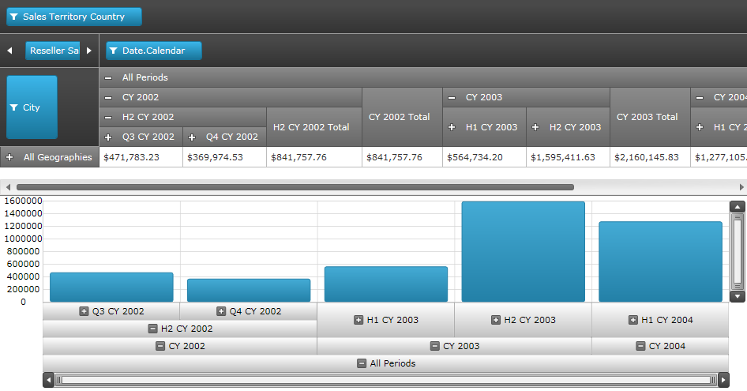

////
|metadata|
{
    "name": "xampivotgrid-integration-with-chart",
    "controlName": ["xamPivotGrid"],
    "tags": ["Charting","Grids","How Do I"],
    "guid": "34cda802-ee78-40a7-9e25-5f448e2a94e6",
    "buildFlags": [],
    "createdOn": "2016-05-25T18:21:58.118284Z"
}
|metadata|
////

= Integration with Data Chart

== Purpose

The topic demonstrates how to build interaction between the link:{ApiPlatform}controls.grids.xampivotgrid{ApiVersion}~infragistics.controls.grids.xampivotgrid.html[xamPivotGrid™] and the link:{ApiPlatform}controls.charts.xamdatachart{ApiVersion}~infragistics.controls.charts.xamdatachart.html[xamDataChart™] controls.

== Preview

The following is the preview of the final result. The source of OlapAxis can be columns or rows. This screenshot displays the hierarchical view of the columns. If you notice the highest level in the column hierarchy is the “All Periods”, which contains Years followed by Half-years, quarters within each half-year and so on. Both PivotGrid and OlapAxis are bound to the same data source and they are synchronized. If you expand the levels in OlapAxis, the column hierarchies of the PivotGrid will expand and vice versa.

Figure: Preview of the final result.

== In this topic

This topic consists of the following sections:

* Required Background
* Control Configuration Overview

** Set up the DataSource of OlapAxis
** Define OlapAxisSource Types
** Define the YAxis
** Define the Series

== Required Background

You need to first read the following topics:

* link:xampivotgrid-binding-data-to-the-xampivotgrid.html[Binding Data to the xamPivotGrid]
* link:xampivotgrid-getting-started-with-xampivotgrid.html[Getting Started with xamPivotGrid]

== Control Configuration Overview

The xamDataChart control exposes a new axis type called OlapAxis. This new axis exposes a DataSource property, which is the key element of the integration feature. The DataSource property can be bound to the same data source as the pivot grid (XMLADataSource or FlatDataSource).

.Note:
[NOTE]
====
It is recommended to use the `Zoomable` property to enable the zoombars on the DataChart, because the data may be too large to be displayed in the view, so the zoombars will allow scrolling and zooming on the desired section of the data. The property is:
====

The table below lists the configurable elements of OlapAxis property that is required for integration with pivot grid.

[options="header", cols="a,a,a"]
|====
|Configurable elements|Configuration details|Configuration properties

|*Set up the DataSource of OlapAxis*
|Property of OlapAxis class set to the same data source that the pivot grid is bound.
| link:{ApiPlatform}controls.grids.xampivotgrid{ApiVersion}~infragistics.controls.grids.xampivotgrid~datasource.html[DataSource]

|*Define OlapAxisSource Types*
|The axis source type can be either Columns or Rows of data.
| link:{ApiPlatform}controls.charts.olap{ApiVersion}~infragistics.controls.charts.olapaxis~olapaxissource.html[OlapAxisSource]

|*Define the Y Axis*
|The Y axis of OlapAxis class requires value type of data (numeric)
| link:{ApiPlatform}controls.charts.xamdatachart{ApiVersion}~infragistics.controls.charts.verticalstackedseriesbase~yaxis.html[YAxis]

|*Define the Series*
|There are 2 ways to define the series: 

* Automatically generated 

* Read from the user defined Series of type OlapColumnSeries 

| link:{ApiPlatform}controls.charts.xamdatachart{ApiVersion}~infragistics.controls.charts.stackedseriesbase~autogenerateseries.html[AutoGenerateSeries]

|====

== Set up the DataSource of OlapAxis

=== Property settings

The table below maps the settings on DataSource property of OlapAxis. For more information on pivot grid data binding please refer to XamPivotGrid Binding Data.

[options="header", cols="a,a"]
|====
|Property|Setting

| link:{ApiPlatform}controls.grids.xampivotgrid{ApiVersion}~infragistics.controls.grids.xampivotgrid~datasource.html[DataSource]
|Bound to the same data source as the pivot grid.

|====

=== Code example

*In XAML:*
[source,xaml]
----
<ig:XamPivotGrid x:Name="pivotGrid" 
    DataSource="{StaticResource DataSource}" />

<ig:XamDataChart x:Name="xmOlapDataChart1" >
    <ig:XamDataChart.Axes>
        <igOlapAxis:OlapXAxis DataSource="{StaticResource DataSource}" />
    </ig:XamDataChart.Axes>
</ig:XamDataChart>
----

== Define OlapAxisSource types

=== Property settings

The table below maps the settings of the source type for OlapAxisSource.

[options="header", cols="a,a"]
|====
|Property|Setting

| link:{ApiPlatform}controls.charts.olap{ApiVersion}~infragistics.controls.charts.olapaxis~olapaxissource.html[OlapAxisSource]
|Columns 

Rows

|====

=== Code example

*In XAML:*
[source,xaml]
----
<ig:XamPivotGrid x:Name="pivotGrid" 
    DataSource="{StaticResource DataSource}" />

<ig:XamDataChart x:Name="xmOlapDataChart1">
    <ig:XamDataChart.Axes>
        <igOlapAxis:OlapXAxis 
            DataSource="{StaticResource DataSource}"
            OlapAxisSource="Rows" />
    </ig:XamDataChart.Axes>
</ig:XamDataChart>
----

== Define the YAxis

=== Property settings

The table below maps the settings of YAxis.

[options="header", cols="a,a"]
|====
|Property|Setting

| link:{ApiPlatform}controls.charts.xamdatachart{ApiVersion}~infragistics.controls.charts.verticalstackedseriesbase~yaxis.html[YAxis]
|Bound to NumericYAxis object

|====

=== Code example

*In XAML:*
[source,xaml]
----
<ig:XamPivotGrid x:Name="pivotGrid" 
    DataSource="{StaticResource DataSource}" />
    
<ig:XamDataChart x:Name="xmOlapDataChart1">
    <ig:XamDataChart.Axes>
        <igOlapAxis:OlapXAxis 
            DataSource="{StaticResource DataSource}"
            OlapAxisSource="Rows"
            YAxis="{Binding ElementName=yAxis}" />
        <ig:NumericYAxis Name="yAxis" />
    </ig:XamDataChart.Axes>
</ig:XamDataChart>
----

== Define the Series

=== Property settings

The table below maps the settings for AutoGenerateSeries property for both values (True / False).

[options="header", cols="a,a"]
|====
|Property|Setting

| link:{ApiPlatform}controls.charts.xamdatachart{ApiVersion}~infragistics.controls.charts.stackedseriesbase~autogenerateseries.html[AutoGenerateSeries]
|True / False

|====

=== Code examples:

[start=1]
. The following example uses the mode to automatically generate the series. The data is generated based on the Rows or Columns indicated by OlapAxisSource property.
+
*In XAML:*
+
[source,xaml]
----
<ig:XamPivotGrid x:Name="pivotGrid" 
    DataSource="{StaticResource DataSource}" />

<ig:XamDataChart x:Name="xmOlapDataChart1">
    <ig:XamDataChart.Axes>
        <igOlapAxis:OlapXAxis 
            DataSource="{StaticResource DataSource}"
            OlapAxisSource="Rows"
            YAxis="{Binding ElementName=yAxis}"
            AutoGenerateSeries="True" />
        <ig:NumericYAxis Name="yAxis" />
    </ig:XamDataChart.Axes>
</ig:XamDataChart>
----

[start=2]
. The following example uses the user defined series of special type OlapColumnSeries, while AutoGenerateSeries is set to False.
+
.Note:
[NOTE]
====
The ValueMemberPath of the series must match the caption of the member in the OLAP data source.
====
+
*In XAML:*
+
[source,xaml]
----
<ig:XamPivotGrid x:Name="pivotGrid" 
      DataSource="{StaticResource DataSource}" />
      
<ig:XamDataChart x:Name="xmOlapDataChart1">
    <ig:XamDataChart.Axes>
        <igOlapAxis:OlapXAxis 
            DataSource="{StaticResource DataSource}"
            OlapAxisSource="Rows"
            YAxis="{Binding ElementName=yAxis}"
            AutoGenerateSeries=" />
        <ig:NumericYAxis Name="yAxis" />
    </ig:XamDataChart.Axes>
    <ig:XamDataChart.Series>
        <ig:OlapColumnSeries 
            Title="Customized Title" 
            YAxis="{Binding ElementName=yAxis}" 
            OlapXAxis="{Binding ElementName=olapXAxis}"
            ValueMemberPath="Europe" />
    </ig:XamDataChart.Series>
</ig:XamDataChart>
----

Related Topics

link:xampivotgrid-getting-started-with-xampivotgrid.html[Getting Started with xamPivotGrid]