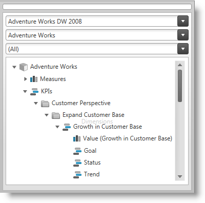
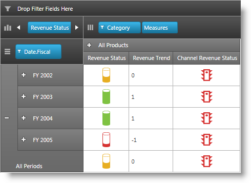
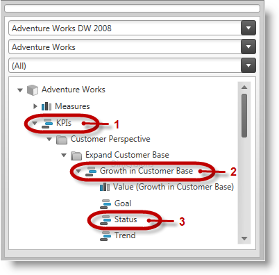
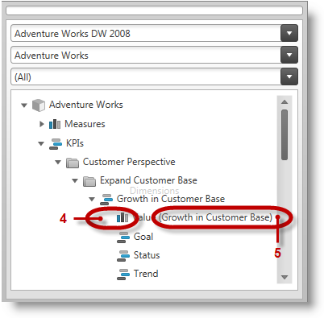

////
|metadata|
{
    "name": "xampivotgrid-kpis-visualization-overview",
    "tags": ["Application Scenarios","Data Binding","Grids","How Do I"],
    "controlName": ["xamPivotGrid"],
    "guid": "4e832a52-08c8-43dc-a71f-a4361766ca1f",
    "buildFlags": [],
    "createdOn": "2016-05-25T18:21:58.2943332Z"
}
|metadata|
////

= Key Performance Indicators (KPIs) Visualization Overview (xamPivotGrid, xamPivotDataSelector)

== Topic Overview

=== Purpose

This topic explains conceptually how the Key Performance Indicators’ (KPIs) data from a multi-dimensional (OLAP) data set is visualized in {ProductName}®. The {ProductName} controls that visualize KPIs are  _xamPivotDataSelector_™ and in the  _xamPivotGrid_™.

=== Required background

The following table lists articles required as a prerequisite to understanding this topic.

[options="header", cols="a,a"]
|====

|Article|Purpose 

| link:http://en.wikipedia.org/wiki/Key_performance_indicators[Key Performance Indicators] 

| A wikipedia article explaining key performance indicators.

| link:http://technet.microsoft.com/en-us/library/ms174875.aspx[Key Performance Indicators (KPIs) in Multidimensional Models] 

|An MSDN article providing an overview of KPIs in multi-dimensional models. 

|====

=== In this topic

This topic contains the following sections:

* <<_Ref382419064,Introduction>>

** <<_Ref382419078,KPIs visualization summary>>
** <<_Ref382419114,KPIs technical implementation summary>>
** <<_Ref382419128,KPIs key terms>>

* <<_Ref382419152,Configuring KPI Visualization Overview>>

** <<_Ref380418739,Configuring KPI visualization summary>>
** <<_Ref377459969,Configuring KPI visualization summary chart>>

* <<_Ref382419231,KPI Visualization Default Settings>>
* <<_Ref380419142,Related Content>>

** <<_Ref377366935,Topics>>
** <<_Ref382419265,Samples>>

[[_Ref377142075]]

[[_Ref380419077]]

[[_Ref382419064]]
== Introduction

[[_Ref382419078]]

=== KPIs visualization summary

Key Performance Indicator (KPI) is a term used to denote a certain type of performance management. The indicators vary depending on the specific needs (fields of application) and provide information over metrics important for the organization, such as progress towards goals, over-time trends, etc..

In OLAP services, the KPIs carry data calculated over a specific measure group. They are defined on the OLAP server which hosts the analysis services data. This data is displayed in the  _xamPivotDataSelector_   and can be visualized graphically through the use of the  _xamPivotGrid_   control.

The  _xamPivotDataSelector_   control displays a separate folder, containing the KPI members calculated on the server.

The  _xamPivotGrid_   control displays a graphical representation of a KPI or its actual value.

An individual indicator can be visualized in the  _xamPivotGrid_   by drag-and-dropping it from the metadata tree to the Measures area of the pivot grid or by programmatically adding it to its Measures collection.

[[_Ref382419114]]

=== KPIs technical implementation summary

The capability to render graphical – and non-graphical (as a value) – representations of KPIs in  _xamPivotDataSelector/_   _xamPivotGrid_   is provided by the underlying  _XmlaDataSource_™ component. (A KPI item can render either a graphical representation or display the value at the same time, but not both. This could be achieved by applying a custom template to the cells of  _xamPivotGrid_  .)

The graphical representation is an icon-like picture representing symbolically the KPI the item or the state of its metadata items. The graphical representation groups are defined on the server. For the KPIs being visualized you can use the default graphical representation (set on the server), choose another graphical representation, or opt for using a custom template with your own custom graphical representations. For details, refer to the link:xampivotgrid-configuring-kpis-visualization.html[Configuring KPIs] topic.

Upon feeding that data to the components, the indicators are displayed in  _xamPivotDataSelector_   by default in a folder named KPIs. The KPI subfolders’ hierarchy visible in the data selector’s tree is built upon the metadata information provided by the server.

Each KPI item contains the following metadata items:

* Value
* Goal
* Status
* Trend
* Weight

Such metadata information is stored in the link:{ApiPlatform}olap.v{ProductVersion}~infragistics.olap.data.base.kpi.html[Kpi] class which has been designed for this purpose in a variety of properties such as link:{ApiPlatform}olap.v{ProductVersion}~infragistics.olap.data.base.kpi~kpigoal.html[KpiGoal], link:{ApiPlatform}olap.v{ProductVersion}~infragistics.olap.data.base.kpi~kpitrend.html[KpiTrend], link:{ApiPlatform}olap.v{ProductVersion}~infragistics.olap.data.base.kpi~kpitrendgraphic.html[KpiTrendGraphic] etc. (for a full list of the properties, please refer to the link:{ApiPlatform}olap.v{ProductVersion}~infragistics.olap.data.base.kpi.html[API documentation for the class]). A specific indicator is identified for displaying by setting the link:{ApiPlatform}controls.grids.xampivotgrid.v{ProductVersion}~infragistics.controls.grids.kpicelltemplate~indicator.html[Indicator] property.

In order to allow for graphical visualization, a predefined set of thirteen different shapes (controlled by the link:{ApiPlatform}controls.grids.xampivotgrid.v{ProductVersion}~infragistics.controls.grids.kpicelltemplate~graphic.html[Graphic] property) is available as well as an option to customize them explicitly in  _xamPivotGrid_  ’s link:{ApiPlatform}controls.grids.xampivotgrid.v{ProductVersion}~infragistics.controls.grids.kpicelltemplate.html[KpiDataCellTemplate] objects. By overriding the link:{ApiPlatform}controls.grids.xampivotgrid.v{ProductVersion}~infragistics.controls.grids.kpicelltemplate~template.html[Template] property of a link:{ApiPlatform}controls.grids.xampivotgrid.v{ProductVersion}~infragistics.controls.grids.kpicelltemplate.html[KPICellTemplate] object, custom templates depending on the user scenario can be defined in order to visualize the KPI indicator.

Adjusting the visualization’s specifics can be achieved via configuring different properties of a `KpiCellTemplate` object which should then be added to  _xamPivotGrid_  ’s link:{ApiPlatform}controls.grids.xampivotgrid.v{ProductVersion}~infragistics.controls.grids.xampivotgrid~kpicelltemplates.html[KpiCellTemplates] collection.

For details, see the link:xampivotgrid-configuring-kpis-visualization.html[Configuring Key Performance Indicators (KPIs) Visualization] topic.

[[_Ref382419128]]

=== KPIs key terms

KPIs are displayed in  _xamPivotGrid_  ’s data selector in a root item folder named  *KPIs*  (1 in the picture below) and the individual  *KPI items*  (2) are listed under that basic directory. The different  *KPI member items*  (3) are placed under their respective parent KPI items.

A  *measure icon*  (4 in the picture below) is used to indicate a KPI member for Value or Goal (if the member is being evaluated solely by a measure). The  *name of the measure*  (5) is displayed in brackets after the label indicating the type of the item.

[[_Ref377366929]]

[[_Ref380418734]]
[[_Ref382419152]]
== Configuring KPI Visualization Overview

[[_Ref380418739]]

=== Configuring KPI visualization summary

An individual indicator can be visualized in the  _xamPivotGrid_  by drag-and-drop-ing it from the metadata tree to the Measures area of the pivot grid or by programmatically adding it to its Measures collection.

When applicable (depending on its KPI type), a KPI can be visualized as a value or a graphical representation can be chosen.

A pre-defined set of graphical representations (shapes) is available by default. This setting is controlled by the `Graphic` property of the `KpiCellTemplate` objects.

Further customization, such as specifying a user choice of images representing the different KPIs values states (-1, 0 and 1) is possible by setting the Graphic property to  _“_  _ThreeStateImages_ ” and then providing the desired image sources (For details, see link:xampivotgrid-configuring-kpis-visualization.html#_Ref377459969[Configuring KPI visualization summary chart]). An alternative approach would be to override the `Template` property of a `KpiCellTemplate` instance, providing a custom template.

[[_Ref377459969]]

=== Configuring KPI visualization summary chart

The following table explains briefly the configurable aspects of KPI visualization in the pivot grid (the  _xamPivotGrid_  and  _xamPivotDataSelector_  controls) and maps them to the properties with which this configuration is achieved. The green-highlighted tasks in the table are further detailed in this help as individual procedures.

[options="header", cols="a,a,a,a"]
|====
|Configurable aspect|Task|Details|Properties / Events

|KPI visualization in the metadata tree
|Preventing KPIs from displaying
|KPIs are displayed by default; you need to explicitly disable KPI data from displaying.
|
* link:{ApiPlatform}olap.xmla.v{ProductVersion}~infragistics.olap.xmla.xmladatasource~metadatatreeitemadding_ev.html[MetadataTreeItemAdding] 

|[[_Hlk356484826]] 

KPI visualization in the pivot grid
|Displaying KPIs in the pivot grid programmatically
|Add a `KpiMeasure` to the `Measures` collection of the `DataSourceBase` instance.
|
* link:{ApiPlatform}olap.v{ProductVersion}~infragistics.olap.datasourcebase~measures.html[DataSourceBase.Measures] 

|Graphical representation
|Choosing a pre-defined visualization
|Set the `Indicator` and the `Graphic` properties of the `KpiCellTemplate`.
|
* link:{ApiPlatform}controls.grids.xampivotgrid.v{ProductVersion}~infragistics.controls.grids.kpicelltemplate~indicator.html[KpiCellTemplate.Indicator] 

* link:{ApiPlatform}controls.grids.xampivotgrid.v{ProductVersion}~infragistics.controls.grids.kpicelltemplate~graphic.html[KpiCellTemplate.Graphic] 

|Configuring a custom visualization
|Using properties
|Set the `Graphic` property of the `KpiCellTemplate` to _“_ _ThreeState_ _Images”_ and then provide the images corresponding to each state as values of the respective properties.
|
* link:{ApiPlatform}controls.grids.xampivotgrid.v{ProductVersion}~infragistics.controls.grids.kpicelltemplate~graphic.html[KpiCellTemplate.Graphic] 

* link:{ApiPlatform}controls.grids.xampivotgrid.v{ProductVersion}~infragistics.controls.grids.kpicelltemplate~negativeimagesource.html[KpiCellTemplate.NegativeImageSource] 

* link:{ApiPlatform}controls.grids.xampivotgrid.v{ProductVersion}~infragistics.controls.grids.kpicelltemplate~zeroimagesource.html[KpiCellTemplate.ZeroImageSource] 

* link:{ApiPlatform}controls.grids.xampivotgrid.v{ProductVersion}~infragistics.controls.grids.kpicelltemplate~positiveimagesource.html[KpiCellTemplate.PositiveImageSource] 

|Using a custom template
|Assign a custom template to the `Template` property of a KpiCellTemplate instance.
|
* link:{ApiPlatform}controls.grids.xampivotgrid.v{ProductVersion}~infragistics.controls.grids.kpicelltemplate~template.html[KpiCellTemplate.Template] 

|====

[[_Ref382419231]]
== KPI Visualization Default Settings

=== KPI visualization default settings summary

By default, KPIs are put in the KPIs folder of the  _xamPivotDataSelector_   control. The default visualization of the KPIs in the  _xamPivotGrid_   by default depends on the graphic type defined on the server.

[[_Ref380419142]]
== Related Content

[[_Ref377366935]]

=== Topics

The following topics provide additional information related to this topic.

[options="header", cols="a,a"]
|====
|Topic|Purpose

| link:xampivotgrid-configuring-kpis-visualization.html[Configuring KPIs Visualization ( _xamPivotGrid_, _xamPivotDataSelector_ )]
|This topic explains how to customize the way KPIs are visualized in the _xamPivotGrid_ and _xamPivotDataSelector_ controls.

|====

[[_Ref377366968]]

=== Samples

The following samples provide additional information related to this topic.

[options="header", cols="a,a"]
|====
|Sample|Purpose

|
ifdef::sl[] 

link:{SamplesURL}/pivot-grid/#/kpi-cells[KPI Cells] 

endif::sl[] 

ifdef::wpf[] 

link:{SamplesURL}/pivot-grid/kpi-cells[KPI Cells] 

endif::wpf[] 

|This sample demonstrates displaying KPIs in _xamPivotDataSelector_ and _xamPivotGrid_ with both default and custom KPIs data templates.

|====